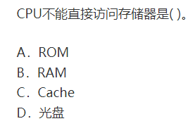

### 1  Mov 指令

`mov r1 ,r2  //寄存器r2的内容复制到r1中`

https://www.cnblogs.com/suozhang/p/6109021.html

### 2 机械设计

- 凸轮

- 死点

  四杆机构的死点发生在从动件与连杆共线时

- 电机轴的扭矩

  $T = 9550*P/n$

  T是扭矩，单位Nm；
   P是输出功率，单位KW；
   n是电机转速，单位 r/min

  

- 螺栓连接螺纹牙间载荷分布不均

  轴向载荷在旋合螺纹各圈间的分布是不均匀的

- 反接制动和能耗制动 

### 3 cpu

CPU可以直接访问的是内存，而内存包括ROM、RAM和Cache。而光盘则不能被CPU直接访问。

[ROM、RAM、CACHE的区别](https://www.cnblogs.com/dongjunru/p/7122204.html)

计算机的存储器分为内存储器和外存储器

1.内存储器：容量小、价格高、断电以后数据丢失，但读取速度快。ROM和RAM

 外存储器：容量大、价格低，断电以后数据不会丢失,如：硬盘、光盘、U盘、闪存卡、网盘

 cpu可以直接访问内存 ，外存的数据要先存入内存才能被cpu读取

2.内存储器分为 随机存取存储器（RAM）和只读存储器（ROM）

 **RAM和ROM和Cache的区别**

 RAM就是通常说的内存条，插在主板上；ROM通常固化在主板上的某些基础功能芯片上

**随机存储器（Random Access Memory）**表示既可以从中读取数据，也可以写入数据。当机器电源关闭时，存于其中的数据就会丢失。我们通常购买或升级的内存条就是用作电脑的内存，内存条（SIMM）就是将RAM集成块集中在一起的一小块电路板，它插在计算机中的内存插槽上，以减少RAM集成块占用的空间。目前市场上常见的内存条有4M／条、8M／条、16M／条等。

**ROM表示只读存储器（Read Only Memory），**表示只可以读取数据，一般不能写入，，在制造ROM的时候，信息（程序或数据）就被存入并永久保存，即使断电，信息也不会丢失ROM一般用于存放计算机的基本程序和数据，如BIOS ROM。其物理外形一般是双列直插式（DIP）的集成块。

**高速缓冲存储器（Cache**）是位于cpu和内存之间的存储器，是一个读写速度比内存更快的存储器，当cpu向内存中读取或写入数据的时候买这些数据也会存入Cache中，当cup再需要这些数据的时候，就会直接去Cache中读取，而不是内存中，当然，若需要的数据在Cache中没有，cpu会再去内存中读取

**内存和硬盘的区别**：CPU可以直接访问内存，不能直接访问硬盘，硬盘里的数据需要存储到内存中才能被CPU读取。

内存与cpu的运算速度有关，硬盘是存储数据的，只是读写速度快

### 机电

### ji'di'a

**熔断器**

- 短路和过电流保护

- 熔断器的熔断时间与电流的平方**成反比**$t=Q/0.24 I^2*R$

**变压器**

- 变压器是一种能**变换交流电压**，而**频率不变**你的静止电气设备

- 高压传输时，电压恒定，

**星形连接和三角连接**

### 结合键

- 一次键就指的是化学键，强键，包括离子键，金属键，共价键；

- 二次键指的是弱键，包括范德华力，氢键等

### 晶体管

数字电路中，晶体管工作在**饱和状态**和**截止状态**

### 图像直方图

多对一

###  传统非金属无机材料

