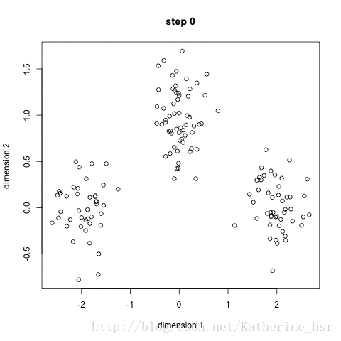

### **题目**

#### **1、请设计一个去除数字图像中大颗粒噪音的算法，可以用文字描述，或者辅以流程图描述。请突出去除大颗粒噪音，以及保留更多细节的思路**

答题要点：

a)    构建图像金字塔，通过控制金字塔不同层的去噪强度来去除相应尺度的噪音；

b)    每一层里面的去噪，可以使用小波去噪，non-local去噪，双边去噪等；

c)    分离亮度和色度通道，对亮度和色度通道采用不同强度来去噪；

#### 2、在合成高动态域图像（HDR）时，需要将多张不同曝光的图像合成，实现中需要对不同曝光图像进行对齐和融合，请用文字或者流程图描述这两个步骤的思路。

答题要点：

a)  首先是对齐，由于亮度不同，所以先要转化到一个亮度无关的空间上去进行对齐；

b)  需要定义出合成的规则：比如根据亮度来选择不同图中的区域；

c)  为了无缝的进行融合，可以采用金字塔分解合成的方式；

d)  需要防止ghost的产生；


#### **3、有两张由双摄相机拍摄同一个场景的RGB图，请设计一个系统计算出这个场景的深度图。请用文字或者流程图来描述所需的步骤和每个步骤的思路**

答题要点：

a)  需要先进行双摄的标定，或者矫正，或者同时使用；

b)  根据标定，或者矫正的数据把左右图矫正到相同特征点位于同一水平线上；

c)  计算稀疏的视差图；

d)  计算稠密的视差图；

e)  根据视察图计算深度图；


#### **4、给定0-1矩阵，求连通域**

算法步骤如下

1，逐行扫描图像，我们把每一行中连续的白色像素组成一个序列称为一个团(run)，并记下它的起点start、它的终点end以及它所在的行号。

2，对于除了第一行外的所有行里的团，如果它与前一行中的所有团都没有重合区域，则给它一个新的标号；

如果它仅与上一行中一个团有重合区域，则将上一行的那个团的标号赋给它；

如果它与上一行的2个以上的团有重叠区域，则给当前团赋一个相连团的最小标号，并将上一行的这几个团的标记写入等价对，说明它们属于一类。

3，将等价对转换为等价序列，每一个序列需要给一相同的标号，因为它们都是等价的。从1开始，给每个等价序列一个标号。

4，遍历开始团的标记，查找等价序列，给予它们新的标记。

5，将每个团的标号填入标记图像中。

6，结束。


#### **5、常用的图像空间**

- lab的l为亮度，ab为两种不同的色度,前者是明度通道，后者是色彩通道，可以**分离色度和亮度**。

- RGB基于**颜色的加法混色原理**，从黑色不断叠加Red，Green，Blue的颜色，最终可以得到白色光。

- CMY颜色空间是基于光反射定义的（CMY对应了绘画中的三原色：Cyan，Magenta，Yellow），是一种**基于颜色减法混色原理**的颜色模型。

- HSV、HSL（HSI）两个颜色空间都是从人视觉的直观反映而提出来的（**H是色调，S是饱和度，I是强度**）。

  

**6、简述你熟悉的聚类算法并说明其优缺点。**

-  **K-Means(K均值)聚类**

  算法步骤：

  (1) 首先我们选择一些类/组，并随机初始化它们各自的中心点。中心点是与每个数据点向量长度相同的位置。这需要我们提前预知类的数量(即中心点的数量)。

  (2) 计算每个数据点到中心点的距离，数据点距离哪个中心点最近就划分到哪一类中。

  (3) 计算每一类中中心点作为新的中心点。（损失函数为：最小化平方误差）

  (4) 重复以上步骤，直到每一类中心在每次迭代后变化不大为止。也可以多次随机初始化中心点，然后选择运行结果最好的一个。

  

  优点：

  1）原理简单，容易实现

  2）可解释度较强

  缺点：

  1）K值很难确定

  2）局部最优

  3）对噪音和异常点敏感

  4）需样本存在均值（限定数据种类）

  5）聚类效果依赖于聚类中心的初始化

  6）对于非凸数据集或类别规模差异太大的数据效果不好

-  **均值漂移聚类**

  均值漂移聚类是基于滑动窗口的算法，来找到数据点的密集区域。这是一个基于质心的算法，通过将中心点的候选点更新为滑动窗口内点的均值来完成，来定位每个组/类的中心点。然后对这些候选窗口进行相似窗口进行去除，最终形成中心点集及相应的分组。

  具体步骤：

  1. 确定滑动窗口半径r，以随机选取的中心点C半径为r的圆形滑动窗口开始滑动。均值漂移类似一种爬山算法，在每一次迭代中向密度更高的区域移动，直到收敛。
  2. 每一次滑动到新的区域，计算滑动窗口内的均值来作为中心点，滑动窗口内的点的数量为窗口内的密度。在每一次移动中，窗口会想密度更高的区域移动。
  3. 移动窗口，计算窗口内的中心点以及窗口内的密度，知道没有方向在窗口内可以容纳更多的点，即一直移动到圆内密度不再增加为止。
  4. 步骤一到三会产生很多个滑动窗口，当多个滑动窗口重叠时，保留包含最多点的窗口，然后根据数据点所在的滑动窗口进行聚类。

  优点：

  （1）不同于K-Means算法，均值漂移聚类算法不需要我们知道有多少类/组。

  （2）基于密度的算法相比于K-Means受均值影响较小。

  缺点：

  （1）窗口半径r的选择可能是不重要的。

#### 7、**请简单介绍开运算和闭运算及其分别在图像处理与分析中的作用？**

**开运算**：先对图像腐蚀后膨胀。

作用：用来消除小的物体，平滑形状边界，并且不改变其面积。**可以去除小颗粒噪声**，断开物体之间的粘连。

**闭运算**：先对图像膨胀后腐蚀。

作用：用来**填充物体内的小空洞**，连接邻近的物体，连接断开的轮廓线，平滑其边界的同时不改变面积。

#### **8、请简述直方图均衡化的原理和特点。**

直方图均衡化(Histogram Equalization) 又称直方图平坦化,实质上是对图像进行**非线性拉伸**,重新分配图像象元值,使一定灰度范围内象元值的数量大致相等。这样,原来直方图中间的峰顶部分对比度得到增强,而两侧的谷底部分对比度降低,输出图像的直方图是一个**较平的分段直方图**:如果输出数据分段值较小的话,会产生粗略分类的视觉效果。

基本思想是对原始图像的像素灰度做某种映射变换, 使变换后图像灰度的概率密度呈均匀分布。这就意味着图像灰度的动态范围得到了增加, 提高了图像的对比度。

**算法步骤**

- 对于有G 个灰度级〈一般是256）大小为M×N 的阁像，创建一个长为G 的数组H 并初始化为o 。

- 计算图像直方图：遍历每一个像素，用map[gk]++（哈希表）的方式统计每一个亮度gk出现的次数。然后除以（M*N）得到每一个像素的概率值；
- 计算累积直方图H,`H[0] = 0,H[i] = H[i-1]+H[i] i>=1`
- 构建映射表，`Sk = int((G-1)*H[i]+0.5)`   G为灰度级数，一般为256
- 遍历每一个像素，从在映射表中查找并更改。

#### **9、彩色图像灰度处理**

- **平均法**

  将同一个像素位置3个通道RGB的值进行平均。

  $I(x,y) = 1/3 * I_{R(x,y)} +1/3 * I_{G(x,y)}+ 1/3 * I_{B(x,y)}$

- **加权平均法**

  $I(x,y) = 0.3 * I_{R(x,y)} +0.59 * I_{G(x,y)}+ 0.11 * I_{B(x,y)}$

  这是最流行的方法。几个加权系数0.3,0.59,0.11是根据人的亮度感知系统调节出来的参数，是个广泛使用的标准化参数。

  ```python
  for r in range(row):
      for l in range(col):
          lenna_gray[r, l] = 0.11 * lenna[r, l, 0] + 0.59 * lenna[r, l, 1] + 0.3 * lenna[r, l, 2]
  
  cv2.imshow("lenna_weighted", lenna_gray.astype("uint8"))
  cv2.waitKey()
  ```

#### 10、霍夫变换检测直线和圆

霍夫变换是一种用于检测线、圆或者图像中其他简单形状的方法。

**霍夫线原理**

> 在笛卡尔坐标系中，直线可有两个参数表示：斜率k，截距b;
>
> 在霍夫空间（极坐标系）中，直线也可由两个参数来表示，距离d，角度$\theta$


在霍夫变换中可将直线表示为：$r = xcos\theta+ ysin\theta$

- 所以对于点$(x_0,y_0)$，过该点的所有直线可以表示为

$$
r_{\theta} = x_{0}cos\theta+y_{0}sin\theta
$$

- 每一对$(r_{\theta},\theta)$就表示一条通过$(x_0,y_0)$的直线。所以所有通过该店的直线可以表示为以$\theta$为横坐标，$r_{\theta}$为纵坐标的曲线

  

- 对图像中所有的点进行上诉操作，如果不同点得到的曲线相交，这说明这两个点在同一直线上。如下图所示，三个点例如$(x_0,y_0), (x_1,y_1), (x_2,y_2)$，在$\theta-r$图像中交于一点，说明这三个点满足同一对$(r_\theta,\theta)$，即同一条直线。

  

- 所以，一条直线可以通过在$\theta-r$图像中寻找交点，交点数目的多少决定了这条直线上点的多少，设置阈值，确定满足一定数目的交点才是一条直线。
- 这就是 霍夫线变换要做的 。 它追踪图像中每个点对应曲线间的交点，如果交于 一 点的曲线的数量超过了阈值，那么可以认为这个交点所代表的参数对
  $(r_\theta,\theta)$在原图像中为一条直线。  

<strong style="color:red;">opencv中，`HoughLines()和HoughLinesP()`​函数的输入图像为**二值图像**</strong>**

### 常见的有监督学习和无监督学习

训练集有输入有输出是有监督，包括所有的回归算法分类算法，比如线性回归、决策树、神经网络、KNN、SVM等；

训练集只有输入没有输出是无监督，包括所有的聚类算法，比如k-means 、PCA、 GMM等

### 彩色变换

- lab的l为亮度，ab为两种不同的色度,前者是明度通道，后者是色彩通道，可以**分离色度和亮度**。
- RGB基于**颜色的加法混色原理**，从黑色不断叠加Red，Green，Blue的颜色，最终可以得到白色光。
- CMY颜色空间是基于光反射定义的（CMY对应了绘画中的三原色：Cyan，Magenta，Yellow），是一种**基于颜色减法混色原理**的颜色模型。
- HSV、HSL两个颜色空间都是从人视觉的直观反映而提出来的（**H是色调，S是饱和度，I是强度**）。

### **图像变换**

- **刚性变换**：平移+旋转发生改变，而形状不变。
- **投影变换**：等距变换（旋转+平移）+缩放+切片+射影，射影变换保持重合关系和交比不变，但不会保持平行性。
- **相似变换**：等距变换（旋转+平移）+缩放，仍会保持平行性。
- **仿射变换**：等距变换（旋转+平移）+缩放+切片+缩放，仿射变换保持二维图形的“平直性”和“平行性”，但是角度会改变

### canny

