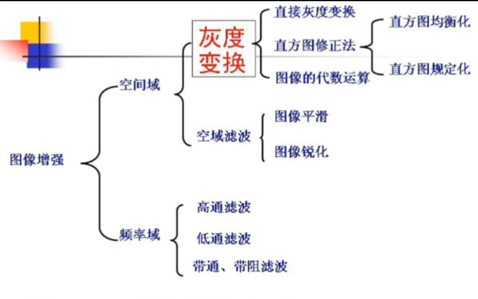
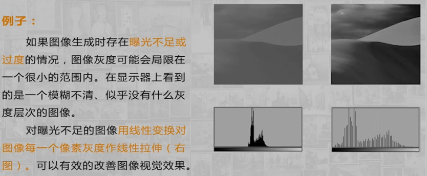
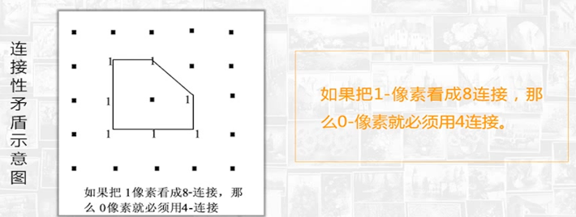
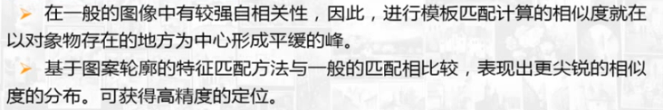
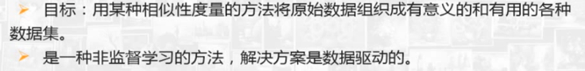

## 图像数字化

### **数字图像的获取**

### 图像灰度直方图

- **概念**

  **灰度直方图**是反映一幅图像中各**灰度级像素出现的频率与灰度级**的关系。以灰度级为横坐标，频率为纵坐标，绘制频率同灰度级的关系图就是一幅灰度图像的直方图。它是图像的一个重要特征，反映了图像灰度分布的状况，如下图所示。

- 性质

  - 灰度直方图只能反映图像的灰度分布情况，而**不能反映图像像素的位置**，即丢失了像素的位置信息。

  - 一幅图像对应唯一的灰度直方图，反之不成立。**不同的图像可对应相同的直方图**

    例如下面两个不同的图像就有相同的直方图。

    

  - 一幅图像分成多个区域，多个区域的直方图之和即为原图像的直方图。

- 直方图的应用

  - 用于判断图像的**量化是否恰当**，

    

  - 用于确定推想**二值化的阈值**，通过观察直方图的分布对图像进行二值分割

$$
g(x,y) = \cases{{0， f(x,y)\leq T}\\
{1 ，f(x,y)>T}}
$$

## 图像变换

**图像的空间域:**是指图像平面所在的二维平面，<strong style="color:red;">对于空间域的图像处理主要是对像元灰度值的改变</strong>，其位置不变。

**图像的频率域:**是图像像元的灰度值随位置变化的空间频率，以频谱表示信息分布特征，傅立叶变换能把图像从空间域变换到只包含不同频率信息的频率域，<strong style="color:red;">原图像上的灰度突变部位、图像结构复杂的区域、图像细节及干扰噪声等信息集中在高频区</strong>，而<strong style="color:red;">原图像上灰度变化平缓部位的信息集中在低频区</strong>。

### 离散函数的傅里叶变换

二维傅里叶正变换

二维傅里叶逆变换

### 二维离散傅里叶变换性质

- **可分离性**

  

  例如

  

  计算过程如图所示

- **周期性和共轭性**

  - 周期性

  

  - 共轭性

    

  

  

  

- **平移性**

  

  例如

  

- **旋转性质**

  

  

- **卷积与相关定理**

  - 卷积定理

  

  根据空间域卷积定理，在空间域对应的是原始信号与滤波器的冲击响应的卷积，卷积定义式为信号翻折平移求和的过程，步骤复杂，运算量大。如果转换到频率域进行处理，则对在将二者的频谱直接相乘就可以得到滤波结果，然后对滤波结果进行**傅里叶逆変换**就可以得到滤波后的空间域图像。如下图所示，对信号进行低通和高通滤波处理的过程和效果（低通滤波得到的是模糊图像，高通滤波得到的是边缘图像）

  

  - 相关定理

    

    

## 图像增强

### 图像增强概述

- **概念**

  **图像增强：**
  采用一系列技术改善图像的视觉效果，或将图像转换成一种更适合于人或机器进行分析和处理的形式。

  图像增强主要方法：（按照图像的作用域）

  - 空间域增强：直接对图像各像素进行处理
  - 频率域增强：对图像经傅立叶变换后的频谱成分进行处理，然后
    逆傅立叶变换得到需要的图像。

- **目的**

  - 改善图像的视觉效果；

    在图像拍摄时经常会受到场景条件的影响，使拍摄的视觉效果不好，通过图像增强可以改善视觉效果，比如増加对比度，有利于识别、跟踪和理解图像中的目标。

  - 突出图像中感兴趣的信息，抑制不需要的信息，来提高图像的使用价值；

    应用图像时通常我们只会对图像中的部分信息感兴趣，所以通过图像增强可以使有用的信息得到加强，得到更为实用的图像。

  - 转换为更适合于人或机器分析处理的形式；

  - 增强后的图像并不一定保真

  - 在图像增强过程中，不分析图像降质的原因，处理后的图像不一定逼近原始图像。

- **应用**

  

### **对比度增强（点运算）**

#### **灰度变换法**

灰度变换是图像增强的重要手段之ー,通过调整图像的灰度动态范围或调整图像的对比度对图像进行增强（通俗的将，就是明暗的对比度程度），可以通过调整图像的灰度范围对图像进行增强

- 线性变换

  

  例子

  

- 分段线性变换

  

- 非线性灰度变换

  - 对数变换

    

  - 指数变换

    

#### **直方图调修正法**

**灰度直方图的概念**
图像的灰度直方图用来反映数字图像中每一灰度级与这个灰度级出现频率之间的关系，能描述图像的概貌。

使用修改图像的直方图对图像进行増强是一种实用、有效的处理技术

直方图修正法包括**直方图均衡化**及**直方图规定化**。

- **直方图均衡化**

  所谓直方图均衡化是将原图像通过某种变换，得到一幅灰度直方图均匀分布的新图像。

  

   先讨论连续变化图像的均衡化问题：然后推广到离散的数字图像上。
  假设用`r`表示归一化的原图像灰度；用`s`表示经过直方图修正后的图像
  灰度。即	
  $$
  0\leq r,s\leq 1
  $$
  在`[0,1]`区间内的任意一个`r`都可以产生一个`s`值，且
  $$
  s=T(r)
  $$
  

  

  

  

  

  

  

### 空间域增强

#### **图像平滑**

图像平滑也称为图像去噪，是为了抑制图像噪声改善图像质量进行的处理。这种噪声可能是在图像获取和传输等过程中造成的，**噪声会使图像恶化，质量下降，图像模糊，特征淹没，对图像分析很不利**。

- **领域平均法**

  直接在空间域上进行平滑处理。

  其思想为

  假设图像由许多灰度恒定的小块组成，相邻的像素之间存在很高的空间相关性性，而噪声则是统计独立的。所以可以用邻域内各像素的灰度平均值代替像素原来的灰度值，实现图像的平滑。

  

  

  如上计算的作用相当于使用如下模板与原图像进行卷积
  $$
  H = \frac {1}{9}  \left[ {\begin{array}{*{20}{c}}
  {1 }&{ 1}&1\\
  {1 }&{1 }&1\\
  1&1&1
  \end{array}} \right]
  $$
  我们假设图像中的噪声是随机不相关的加性噪声，窗口内各点的噪声是独立同分布的，经过上面的平滑后，信号与噪声的方差比可望提高M倍。

  **方法特点**

  算法简单，但这种方法有一个缺点，就是在降低噪声的同时会使图像产生模糊，特别是在边缘和细节处。**而且邻域越大，去噪能力增强的同时模糊程度越严重**。

  

- **超限像素平滑法**

  

  

- **有选择保边缘平滑法**

  

  这种方法用方差来测度区域的灰度均匀性。如果区域含有尖锐的边缘，它的灰度方差就会很大，如果不含边缘或灰度均匀的区域，方差就小，**所以最小方差所对应的区域就是灰度最均匀区域**。**这种平滑方法既能消除噪声，又不会破坏区域边界的细节**。

  另外，五边形和六边形在（x，y）处都有锐角，这样，即使像素（x，y）位
  于ー个复杂形状区域的锐角处，也能找到均匀的区域。从而在平滑时既不会使尖锐边缘模糊，也不会破坏边缘形状。

- **中值滤波法**

  中值滤波法用一个滑动窗口，对窗口内的像素灰度值排序，**用中值代替窗口中像素的灰度值**，是一种非线性的图像平滑法。

  该方法对**脉沖干扰及椒盐噪声**的抑制效果好，在抑制随机噪声的同时能有效保护边缘少受模糊。但它**对点、线等细节较多的图像却不太合适。**

  **最重要的环节**

  选择窗口尺寸的大小。通常很难事先就确定出最佳的窗口尺寸，需通过从小窗口到大窗口的中值滤波试验，再从中选取最合适尺寸的窗口。

  

  

#### 图像锐化

**图像锐化的目的是增强图像的边缘或轮廓**

图像平滑是通过积分过程使图像边缘模糊，而图像锐化是通过微分使图像边缘突出、清晰。

- **梯度法**

  

  

  

- **Laplacian增强算子**

  

- 高通滤波法

  

### 频率域增强

**频率域低通滤波器H(u,v)**

- 理想低通滤波器

  

- **butterworth低通滤波器**

  

- **指数低通滤波器**

  

- **梯形低通滤波器**

  

### 彩色增强计算

#### 伪彩色增强

- **密度分割法**

  

- **灰度级彩色变换**

  

  

#### 假彩色合成技术

#### 彩色变换

- lab的l为亮度，ab为两种不同的色度,前者是明度通道，后者是色彩通道，可以**分离色度和亮度**。
- RGB基于**颜色的加法混色原理**，从黑色不断叠加Red，Green，Blue的颜色，最终可以得到白色光。
- CMY颜色空间是基于光反射定义的（CMY对应了绘画中的三原色：Cyan，Magenta，Yellow），是一种**基于颜色减法混色原理**的颜色模型。
- HSV、HSL两个颜色空间都是从人视觉的直观反映而提出来的（**H是色调，S是饱和度，I是强度**）。

## 图像复原与重建

### 图像退化

					

**图像的退化**是指图像在形成、传输和记录过程中，由于成像系统、传输介质和设备的不完善，使图像的质量变坏。
 典型表现：模糊、失真、有噪声。

**产生原因：**成像系统像差、传感器拍摄姿态和扫描非线性、成像设备与物体运动的相对运动、大气満流、成像和处理过程中引入的噪声等

**图像复原：**指要尽可能恢复退化图像的本来面目，它是沿图像退化的逆过程进行处理。

**图像复原与图像增强的区别**

- 图像增强

  不考虑图像是如何退化的，而是主观上试图采用各种技术来增强图像的视觉效果。因此，图像增强可以不顾增强后的图像是否失真，只要达到想要的目视效果就可以。

- 图像复原
   需知道图像退化的机制和过程等先验知识，客观上找出一种相应的逆处理方法，从而得到复原的图像

- 如如果图像已退化，应先作复原处理，再作增强处理

- 二者的目的都是为了改善图像的质量。

**图像退化的数学模型**

### 图像逆滤波复原

**原理**

**步骤**

### 图像几何校正

**几何畸变的概念**

- 在实际的成像系统中，图像捕捉介质平面和物体平面之间不可避免地存在有定的转角和倾斜角。转角对图像的影响是产生图像旋转，倾斜角的影响表现为图像发生投影变形。

- 另外一种情况是由于摄像机系统本身的原因导致的镜头畸变。

- 此外，还有由于物体本身平面不平整导致的曲面畸变如柱形畸变等

- 光学系统、电子扫描系统失真而引起的斜视畸变、投影畸变、枕形、桶形骑变混合畸变、柱面畸变等，都可能使图像产生几何特性失真，这些系统失真导致的常见的图像几何畸变如图所示

  

几何畸变可分为线性几何畸变和非线性几何畸变

- 线性几何畸变：缩放、平移、旋转等畸变
- 非线性几何畸变：是由成像面和物平面的倾斜、物平面本身的弯曲、光学系统的像差造成的畸变，表现为物体与实际的成像各部分比例失衡。

**几何畸变退化问题的复原**

- 常见几何畸变退化问题的复原大多是**基于成像系统**

  如如模拟鱼眼和针孔系统进行摄像机标定，通过确定摄像机畸变参数对所获取图像进行后续校正和复原处理。

  **优点**

  一旦确立成像模型，便可以快速有效地根据模型参数对图像进行几何变换从而实现复原

  **缺点**

  通常情況下我们面临的图像其成像系统未知且多样化，因此，这种方法不适合于解决一般性无法预知模型的畸变退化。比如由成像面不平整造成的曲面畸变。

- **多项式变换技术**，其实质是利用数值分析的方法求解几何变换方程

  **优点**

  不需要预先知道成像模型，对复杂曲面畸变能够进行校正和复原。

  **缺点**

  运算量大，不适宜实时性较高系统，对多项式次数和控制点的选取要求严格

**基于多项式变换的几何校正方法**

**第一步**

图像空间坐标变换（确定校正后图像中每个像素的空间坐标）：首先建立图像像点坐标（行、列号）和物方（或参考图）对应点坐标间的映射关系，解求映射关系中的未知参数，然后根据映射关系对图像各个像素坐标进行校正。

**第二步**

灰度内插（确定校正影像中每个像素的灰度值）。

**几何校正中的坐标变换**

- 直接法

  

  然后从畸变图像出发，根据上述关系依次计算每个像素的校正坐标，同时把像素灰度值赋予对应像素，这样生成一幅校正图像

  **缺点：**该图像像素分布是不规则的，会出现像素挤压、疏密不均等现象不能满足要求。因此最后还需对不规则图像通过灰度内插生成规则的栅格图像

- **间接法**

**灰度内插方法**

- 最邻近元法

  

  该方法最简单，效果尚佳，但校正后的图像有明显锯齿状，即存在灰度不连续性

- 双线性内插法

  双线性内插法是利用待求点四个邻像素的灰度在两个方向上作线性内插

  

- 三次内插法

## 图像压缩

### 图像压缩保真度原则

图像品质的核心问题是逼真度问题。经过处理的图像（包括经过压缩编码后的图像）与一个标准图像之间的偏差可以作为图像逼真度（保真度）的度量。这一偏差，包括亮度，色度，分辨率以及某些心理物理学参数。（偏差应该在允许的范围之内）

 **图像压缩保真度原则**

- 客观保真度

  

- 主观保真度

  挑选一定的观察者进行评价

 **编码压缩的性能参数**

- 图像信息熵H(d)和平均码长R(d)

  

- 图像冗余

  

### 统计编码概述

**统计编码概述**

根据图像像素灰度值出现的概率的分布特性而进行的压缩编码叫统计编码熵与平均码字长度
 （1)H(d)<R(d）时，一定可以设计出某种平均码字长更短的无失真编
码方法

（2)平均码字长小于H(d）的无失真编码方法不存在
 熵编码
 使编码后的图像的平均码字长度尽可能接近图像的熵H。基本思路是：概率大的灰度级用短码字，概率小的，用长码字。

**统计编码方法**

- 行程编码（RLE编码）

  - 基本原理
    通过改变图像的描述方式，来实现压缩。将一行中颜色值相同的相邻像素用一个计数值和该颜色值来代替
  - 举例说明
    aaaabbbccdeeeeefffffff （t22*8=176 bits)4a3b2c1d5e7f
    (共12*8=96bits)
  - 应用分析
    适合行程较长的图像一般不单独使用。

- 霍夫曼编码（熵编码）

  - 基本原理

    为了达到更大的压缩率，提出了一种方法，就是将在图像中出现频率大的像素值给一个比较短的编码，将出现频率小的像素值给一个比较长的编码。

    

  - 霍夫曼编码

    

    

  [构造过程代码](https://www.zhihu.com/question/350595727/answer/856311312)

## 图像分割

### 边缘检测

边缘处像素灰度变化曲线及相应的一阶导和二阶导

**边缘检测算子**

- 梯度算子

  

  **特点：**

  仅计算相邻像素的灰度差，**对噪声比较敏感**，无法抑止噪声的影响。	

  

- **roberts算子**

  

- **Prewitt算子**

  

- **sobel算子**

  

- 拉普拉斯算子

  利用边缘二阶导的特性

  

  **特点**

  

**曲面拟合法**

- 出发点

  **基于差分检测图像边缘的算子往往对噪声敏感**。因此对一些噪声比较严重的图像就难以取得满意的效果。若用平面或高阶曲面来拟合图像中某一小区域的灰度表面，求这个拟合平面或曲面外法线方向的微分或二阶微分检测边绿，可减少噪声影响。

### Hough变换

Hough 交换的重要性质是，它图像中直线的残缺部分、噪声以及其他共存的非直线结构不敏感。

#### Hough变换检测直线

如下图（a）s所示，对于直角坐标系中的一条直线，原点到该直线的垂直距离为p，垂线与x轴的夹角为θ,可用p、θ来表示该直线，且直线方程为$\rho  = x\cos \theta  + y\sin \theta $,这条直线用极坐标$(\rho,\theta)$来表示则为一点。这种线到点的变换即为**Hough变换**（将空间中的曲线(包括直线)变换到参数空间中）

**Hough变换检测直线过程如下**

- 在直角坐标系中有过任一点$(x_0,y_0)$的直线系，如图(c)所示，这些直线满足下面的公式
- 这些直线在极坐标系中对应的点$(\rho,\theta)$构成如图d的一条正弦曲线。正弦曲线上的一点对应直角坐标系中过$(x_0,y_0)$的一条直线，如图e f .
- 如果图像中有若干个点，过每个点的直线系分别对应于极坐标系中的一条曲线，如果这些正弦曲线有一个共同的交点$(\rho',\theta')$.
   这些点共线，且该直线的方程为$\rho'=xcos\theta'+ysin\theta'$

**Hough变换具体实现**

**Hough变换特点**

#### Hough变换检测曲线

Hough变换进行扩展后可以检测图像中特定形状的物体（圆，椭圆等）

若已知圆的边缘点（当然图中还有其它非圆的边沿点混在一起），而且边缘方向方向已知，则可减少一维处理，把上式对x取导数，有

这表示参数a和b不独立，只需用二个参数（例如a和R或b和R）组成参数空间
 计算量就缩减很多

**hough变换检测任意曲线**

对已知形状建立了R表格后，开辟一个二维存储区，对未知图像各点都来查
 已建立的R表，然后计算$(x_c,y_c)$,若未知图像各点计算出的$(x_c,y_c)$很集中，就表示已找到该形状的边界。集中的程度就是找最大值。

**具体算法步骤**

### 区域分割

#### **最简单图像的区域分割**

**阈值的确定方法**

- 峰谷法

  

- 判断分析法

  

#### **复杂图像多阈值分割**

**复杂图像分割步骤**

- 自动平滑直方图

  一般来说，待分析图像的灰度直方图不是很平滑，这对自动寻找峰与下步确定阈值带来困难，因此，有必要对直方图进行平滑。一般来说，可以采用空间滤波器与直方图做卷积来进行平滑。

- 确定区域类数

  对于灰度层次不多的图像，一个区域类通常对应直方图中的一个峰。但是，平滑后的直方图中的每一个峰不一定都对应一个区域类。因而有必要通过检查认定峰对应的区域类。

- 自动搜索多个阈值

  可以采用前面介绍过的判断分析法，依次计算各峰两两之间的最佳阈值，然后再用这组阈值分割原始图像。

#### 特征空间聚类

利用特征空间聚类进行图像分割，可以看成是对阈值分割概念的推广。它将图像空间中的像素用对应的特征空间点表示，然后根据它们在特征空间的聚集情况对特征空间进行图像分割，最后将它们映射回原图像空间，得到分割的结果。

**K均值聚类方法**

### 区域增长

**基本原理**

先把图像分割成若干个小区域，然后比较相邻小区域特征是否相似，若他们足够相似，则作为同一区域合并，以此将特征相似的小区域不断合并，直到不能合并为止，最后形成特征不同的区域。

区域増长根据所用的邻域方式和相似性准则的不同，产生各种不同的区域扩张法。可分为

- 单一型（像素与像素）

- 质心型（像素与区域）
- 混合型（区域与区域）

#### 简单区域增长法

以像素灰度位特征的简单区域增长法，具体步骤如下

- 对图像进行光栅扫描，求出第一个不属于任何区域的像素。当寻找不到这样的像素时结束操作。

- 把这个像素同其4-邻域或者8邻域中不属于其他区域的**像素**进行比较，若灰度差值小于阈值，则合并位一个区域，并对合并的像素赋予标记。
- 从**新合并的像素**开始，反复进行（2)的操作
- 反复进行（2)、(3)的操作，直至不能再合并
- 返回（1)操作，寻找新区域出发点的像素。

当两个区域之间的灰度相差较小时，可能会导致两个区域合并。

#### 质心型区域生长

质心型区域生长操作步骤类似简单区域扩张法，唯一不同的是在上述（2)的操作中，改为比较已存在区域的**像素灰度平均值**与该区域邻接的像素灰度值。若差值小于阈值，则合并。

缺点是：区域增长的结果与起始像素有关，起始位置不同，则分割结果有差异

#### 混合型区域增长

把图像分割成小区域，比较相邻的小区域的相似性，相似则合并，直到不能合并为止

- **不依赖起始点的方法**

- **假设检验法**

  

 	**难点**

### 分裂合并法

## 二值图像处理与形状分析

### 二值图像的连接性和距离

**领域和邻接**

**连接成份**

在二值图像中，把互相连接的像素的集合汇集为组，于是具有若干个0值的像素（0像素）和具有若干个1值的像素（1像素）的组就产生了。

 

**欧拉数**

**像素的可删除性和连接数**

连接数的计算

**距离**

### 连接成份的变形操作

**连接成份标记**

为了区分二值图像中的连接成分，求得连接成分个数，对属于同一个1像素在接成分的所有像素分配相同的编号，而对不同的连接成分分配不同的编号。

**膨胀和收缩**

膨胀：把连接成分的边界扩大一层处理

收缩：把连接成份的边界点去掉从而缩小一层长度处理

膨胀和腐蚀(收缩)的反复使用可检测或清除二值图像中的小成分和孔

**线图形化的方法**

- **距离变换和骨架**

  把任意图形转换成线划图的最有效方法之一。是求
  二值图像中各1像素到0像素的最短距离的一种处理。在经过距离变換得到的图像中，最大值点的集合就形成了区域P的骨架。

  骨架反映了原图形的形状。给定距离和骨架就能恢复该图形，但恢复的图形不能保证原始图形的连接性。距离变換和骨架化处理常用于图形压缩、提取图形幅宽和形状特征等。

  

- **细化**

  细化是从二值图像中提取线宽为1像素的中心线的操作

  细化从处理方法上分为质序处理和并行处理，从连接性上分有8-邻接细化和4邻接细化。

  我们这里主要介绍8-邻接细化中有代表性的种方法一希尔迪奇（ Hilditch）方法。

## 模板匹配

当对象物的图案以图像的形式表现时，根据该图案与一幅图像的各部分的相似度判断其是否存在，并求得对象物在图像中位置的操作叫做模板匹配。

**基本思想**

设检测对象的模板为`t(x,y)`,令其中心与图像`f(x,y）`中的一点`（i,j）`重合，检测`t(x,y)`和图像重合部分之间的相似度，对图像中所有的点都进行这样的操
作，根据相似度为最大或者超过某一阈值来确定对象物是否存在，并求得对象物所在的位置。

**匹配尺度**

- **非相似度**

  

- **相似度**

  

**模板匹配的改进**

- **高速模板匹配法**

  

  

- **高精度定位的模板匹配**

  

**模式识别方法**

- **概率分类法**

  

- **聚类分析**

  

- **模糊模式识别**

  

- **结构模式识别**

  

- **人工神经网络**

  

**模式识别系统的组成**

