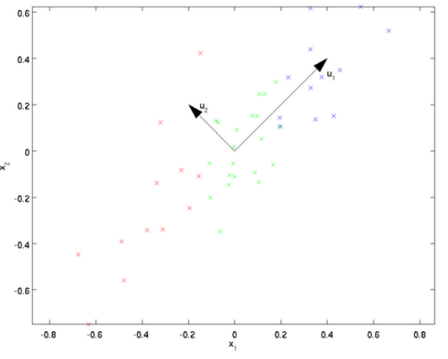
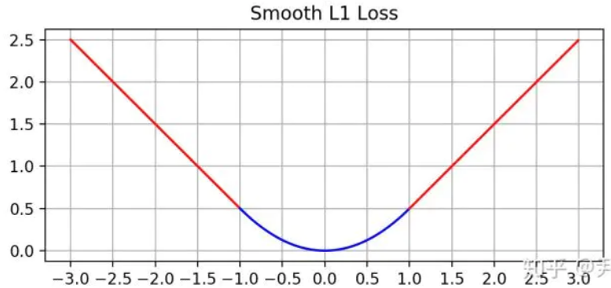
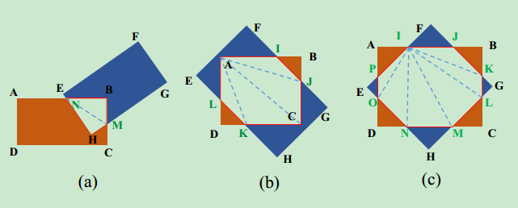
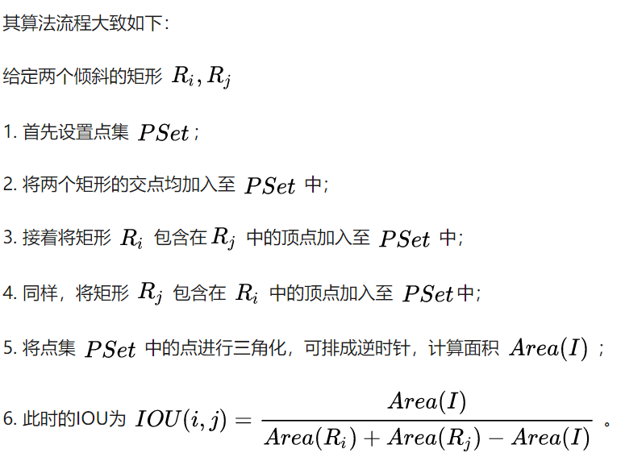

## [计算机视觉面试题汇总](https://www.nowcoder.com/discuss/433047?type=all&order=time&pos=&page=1&channel=1013&source_id=search_all)

### 涉及项目

#### [PCA](https://zhuanlan.zhihu.com/p/32412043)

大概主成分分析（Principal components analysis，以下简称PCA）是最重要的降维方法之一。在数据压缩消除冗余和数据噪音消除等领域都有广泛的应用。

对于正交属性开年中的样本点，如何用一个超平面对所有样本进行恰当的表达？

可以想到，若存在这样的超平面，那么它大概具有这样的性质：

- 最近重构性：样本点到这个超平面的距	离足够近
- 最大可分性：样本点在这个超平面上的投影能尽可能的分开

这里基于最大可分性来讨论PCA算法。

PCA顾名思义就是找到数据中最主要的方面，用数据里主要的方面来代替原始数据。例如，我们有一个N维的数据集，共有m个数据$(x_1,x_2,...x_m)$，我们希望将这m个数据的维度从$N$降到$N'$，使这m个$N'$维数据尽可能的代表原数据集，数据从$N$维降到$N'$维必然会造成损失，所以需要将损失降到最低。如下图所示二维数据，即$N=2$降到$N' = 1$,根据**可分性原则**，$u1$向量方向更能代表原始数据。



**PCA算法流程**

- **输入**：$n$维样本集$X = (x_1,x_2,x_3...x_m)$，将到$n'$
- **输出**：降维后的样本集
- **步骤**
  - 1、对所有样本进行中心化$$x_{i}=x_{i}-\frac{1}{m} \sum_{j=1}^{m} x_{j}$$
  - 2、计算样本协方差矩阵$$C=\frac{1}{m} X X^{\top}$$
  - 3、求解协方差矩阵的特征值及特征向量
  - 4、将特征向量按对应特征值大小从上到下按行排列成矩阵，取前K行组成矩阵P
  - $Y = PX$即为将为到K维后的数据

**PCA算法总结**

PCA作为一个非监督学习的降维方法，他只需要特征值分解就可以对数据进行压缩，去噪。因此在实际场景中应用广泛，为了克服PCA的一些缺点，出现了很多PCA的变种，比如为解决非线性降维的KPCA，还有解决内存限制的增量PCA方法Incremental PCA，以及解决稀疏数据降维的PCA方法Sparse PCA等。

**PCA算法的主要优点：**

- 仅仅需要以方差衡量信息量，不受数据集以外的因素影响。　
- 各主成分之间正交，可消除原始数据成分间的相互影响的因素。
- 计算方法简单，主要运算是特征值分解，易于实现。

**PCA算法的缺点**

- 主成分各个特征维度的含义具有一定的模糊性，不如原始样本特征的解释性强。
- 方差小的非主成分也可能含有对样本差异的重要信息，因降维丢弃可能对后续数据处理有影响。

**PCA算法进行点云主方向计算**

利用pcl库对点云数据进行计算.

- 计算点云数据的中心$P_c(x_c,y_c,z_c)$，例如$x_c = (x_1,x_2,...,x_m)/m$
- 计算协方差矩阵,`pcl::computeCovarianceMatrixNormalized(*cloud,Pc,covarianceMatrix)`
- 对协方差矩阵进行特征值和特征向量的求解
- 特征向量即为以$P_c$维原点的三个坐标方向(特征值由小到大,特征向量与之对应)
- 选择特征值最大的特征向量为X轴方向,最小的为Y轴方向
- 校正三个特征向量,使其相互垂直(采用叉乘)

### 涉及论文

#### 论文中用的LOSS函数

##### smooth L1损失函数

论文中再做anchor boxes回归时，是使用了smooth L1 loss损失函数，相比于L1 loss 和L2 loss具备更好的鲁棒性。

如下为L2 loss 、L1 loss和smooth L1 loss
$$
\begin{array}{c}
L_{2}(x)=x^{2} \\
L_{1}(x)=|x| \\
\operatorname{smooth}_{L_{1}}(x)=\left\{\begin{array}{ll}
0.5 x^{2} & \text { if }|x|<1 \\
|x|-0.5 & \text { otherwise }
\end{array}\right.
\end{array}
$$
对损失函数求导为
$$
\begin{array}{c}
\frac{\mathrm{d} L_{2}(x)}{\mathrm{d} x}=2 x \\
\frac{\mathrm{d} L_{1}(x)}{\mathrm{d} x}=\left\{\begin{array}{cl}
1 & \text { if } x \geq 0 \\
-1 & \text { otherwise }
\end{array}\right. \\
\frac{\mathrm{d} \operatorname{smooth}_{L_{1}}}{\mathrm{d} x}=\left\{\begin{array}{ll}
x & \text { if }|x|<1 \\
\pm 1 & \text { otherwise }
\end{array}\right.
\end{array}
$$
对于L2 loss 损失函数，当 x 增大时 L2 损失对 x 的导数也增大。这就导致训练初期，预测值与 groud truth 差异过于大时（x过大），损失函数对预测值的梯度十分大，训练不稳定。

对于L1 loss损失函数，L1 对 x 的导数为常数。这就导致训练后期，预测值与 ground truth 差异很小时(x很小)， L1 损失对预测值的导数的绝对值仍然为 1，而 learning rate 如果不变，损失函数将在稳定值附近波动，难以继续收敛以达到更高精度。

对于smooth L1 loss函数，在 x 较小时，对 x 的梯度也会变小，而在 x 很大时，对 x 的梯度的绝对值达到上限 1，也不会太大以至于破坏网络参数。 smooth L1 完美地避开了 L1 和 L2 损失的缺陷



由图中可以看出，它在远离坐标原点处，图像和 L1 loss 很接近，而在坐标原点附近，转折十分平滑，不像 L1 loss 有个尖角，因此叫做 smooth L1 loss。

##### 交叉熵损失函数分类

##### 旋转anchor IOU的计算

- 对于常见的水平的IOU的计算

  ```cpp
  import numpy as np
  
  class Bounding_box:
      def __init__(self, x1, y1, x2, y2, score):
          self.x1 = x1
          self.y1 = y1
          self.x2 = x2
          self.y2 = y2
          self.score = score
  
  def get_iou(boxa, boxb):
      max_x = max(boxa.x1, boxb.x1)
      max_y = max(boxa.y1, boxb.y1)
      min_x = min(boxa.x2, boxb.x2)
      min_y = min(boxa.y2, boxb.y2)
      if min_x <= max_x or min_y <= max_y:
          return 0
      area_i = (min_x - max_x) * (min_y - max_y)
      area_a = (boxa.x2 - boxa.x1) * (boxa.y2 - boxa.y1)
      area_b = (boxb.x2 - boxb.x1) * (boxb.y2 - boxb.y1)
      area_u = area_a + area_b - area_i
      return float(area_i) / float(area_u)
  
  def NMS(box_lists, k):
      box_lists = sorted(box_lists, key=lambda x: x.score, reverse=True)
      NMS_lists = [box_lists[0]]
      temp_lists = []
      for i in range(k):
          for j in range(1, len(box_lists)):
              iou = get_iou(NMS_lists[i], box_lists[j])
              if iou < 0.7:
                  temp_lists.append(box_lists[j])
          if len(temp_lists) == 0:
              return NMS_lists
          box_lists = temp_lists
          temp_lists = []
          NMS_lists.append(box_lists[0])
      return NMS_lists
  
  box1 = Bounding_box(13, 22, 268, 367, 0.124648176)
  box2 = Bounding_box(18, 27, 294, 400, 0.35818103)
  box3 = Bounding_box(234, 123, 466, 678, 0.13638769)
  box_lists = [box1, box2, box3]
  NMS_list = NMS(box_lists, 2)
  print NMS_list
  print NMS_list[0].x1
  ```

  

- 对于旋转anchor的iou

  

  

  ​	

  右上可以看出，这是一个多边形求交集的问题：

  对于该问题一般分为以下几步：

  - 求两个多边形的交点
  - 求多边形内部点
  - 对点集合进行排序（顺时针或者逆时针）

  基于opencv中计算旋转情况下的iou

  ```cpp
   
  float calcIOU(cv::RotatedRect rect1, cv::RotatedRect rect2) {
      float areaRect1 = rect1.size.width * rect1.size.height;
      float areaRect2 = rect2.size.width * rect2.size.height;
      vector<cv::Point2f> vertices;
   
      int intersectionType = cv::rotatedRectangleIntersection(rect1, rect2, vertices);
      if (vertices.size()==0)
          return 0.0;
      else{
          vector<cv::Point2f> order_pts;
          // 找到交集（交集的区域），对轮廓的各个点进行排序
  
          cv::convexHull(cv::Mat(vertices), order_pts, true);
          double area = cv::contourArea(order_pts);
          float inner = (float) (area / (areaRect1 + areaRect2 - area + 0.0001));
          return inner;
      }
  }
  ```

##### NMS

对于Bounding Box的列表B及其对应的置信度S,采用下面的计算方式.选择具有最大score的检测框M,将其从B集合中移除并加入到最终的检测结果D中.通常将B中剩余检测框中与M的IoU大于阈值Nt的框从B中移除.重复这个过程,直到B为空.

**重叠率(重叠区域面积比例IOU)阈值**

常用的阈值是 `0.3 ~ 0.5`.
其中用到排序,可以按照右下角的坐标排序或者面积排序,也可以是通过SVM等分类器得到的得分或概率,R-CNN中就是按得分进行的排序.

### 其他

#### 卷积尺寸计算

先定义几个参数

- 输入图片大小 *W×W*
- Filter大小 *F×F*
- 步长 *S*
- padding的像素数 *P*

于是我们可以得出

> N = (*W − F* + 2*P* )/*S*+1

输出图片大小为 **N×N**

#### 准确率(Accuracy), 精确率(Precision), 召回率(Recall)

举个栗子：
 假设我们手上有60个正样本，40个负样本，我们要找出所有的正样本，系统查找出50个，其中只有40个是真正的正样本，计算上述各指标。

- TP: 将正类预测为正类数  40
- FN: 将正类预测为负类数  20
- FP: 将负类预测为正类数  10
- TN: 将负类预测为负类数  30

**准确率(accuracy)** = 预测对的/所有 = (TP+TN)/(TP+FN+FP+TN) = 70%

**精确率(precision)** = TP/(TP+FP) = 80%

**召回率(recall)** = TP/(TP+FN) = 2/3

BTW, precision 和 recall 的抽取样本方式不同：召回率是从数据集的同一标签的样本抽样；而准确率是从已经预测为同一类别的样本抽样。

**例如**

**准确率  Precision = TP / (TP + FP)**
 简单来说，准确率只是表示，对一个物体进行预测（一定能得到 对于错 的反馈之一）。假如你对十个物体进行检测，其中三个反馈的信息是正确的，而七个反馈的信息是错误，那么你的 Precision = 3 / ( 3 + 7 ) = 30 %（即检测出n个正样本，但是这n个样本的检测结果正确的只有m个，则p = m/n）

**召回率 Recall = TP / (TP + FN)**
 简单来说，召回率可以这样理解，就是对某一类物体的预测信息。假设，你有苹果和梨共20个，其中苹果10个，梨有10个，现在有一个预测机器对所有的物体品种进行了预测（假设预测不是苹果就是梨），其中预测出14个梨，6个苹果（6个苹果中，其中1个被预测错了）。
 那么对于苹果的 recall = （6 - 1）/  10 = 50 % ， precision = 5 / 6 = 83 %
 梨的 recall = ( 14 - 4 - 1) / 10 = 90% , precision = 9 / 14 =  64.2 %