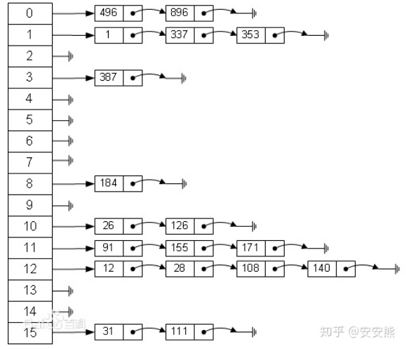

## **笔试题**

### 7.15字节笔试题

1、字符串中只含有`0~9和'+'、’-‘、’（’和‘）’`，输入合法的运算字符串，括号内不含·、`-`号的括号数

```cpp
#include <iostream>
#include <vector>
#include <stack>
using namespace std;
int main()
{
    string s;
    while (getline(cin, s))
    {
        stack<char> st;
        int res = 0;
        int i = 0;
        bool flag = true;
        while (i < s.length())
        {
            // if(s[i]=='(')
            //     n1++;
            while (s[i] == ')')
            {
                if (st.top() != '(')
                {
                    char cur = st.top();
                    st.pop();
                    if (cur == '+' && flag)
                    {
                        res++;
                    }
                    else if (cur == '-')
                    {
                        flag = false;
                    }
                }
                else
                {
                    st.pop();
                    if (st.empty())
                        flag = true;
                    i++;
                    break;
                }
            }
            if (i < s.length() - 1)
            {
                st.push(s[i]);
                i++;
            }
        }
        cout << res << endl;
    }
    return 0;
}
```


2、给出一系列的字符串，统计字符串中网址的访问量，输出访问量超过180的网站（输出一个即可）

字符串分割+哈希表

```cpp
#include <iostream>
#include <map>
#include <cstdlib>
using namespace std;
int main()
{
    string s;
    map<string, int> mp;
    int index = 0;
    while (getline(cin, s))
    {
        int pos1 = s.find(' ', 0);
        int pos2 = s.find(' ', pos1 + 1);
        string web = s.substr(pos1 + 1, pos2 - pos1 - 1);
        int data = atoi(&s[pos2 + 1]);
        // cout << web <<" "<<data<<endl;
        mp[web] += data;
        index = max(index, mp[web]);
    }
    if (index < 180)
        cout << "null" << endl;
    for (auto i : mp)
    {
        if (i.second >= 180)
        {
            cout << i.first << endl;
        }
    }
    return 0;
}

```

### 面经汇总

#### 哈希表与哈希函数

当数据经过哈希函数处理后，有可能会出现哈希冲突（即用同一个key值对应多个数据），为了避免哈希冲突一般采用**拉链法**和**开放寻址法**来处理。

- **拉链法**

  拉链发示意图如下

  

  同一key值下的数据以链表的形式进行储存。查找时，通过哈希函数计算出数据对应的key值，然后在该key值对应的链表中进行查找。

  **基于链表的拉链法代码如下：**

  ```cpp
  #include <iostream>
  #include <vector>
  using namespace std;
  // 定义哈希表的长度
  const int TABLE_LEN = 10;
  //定义链表
  struct ListNode
  {
      int val;
      ListNode *next;
      ListNode(int x) : val(x), next(NULL) {}
  };
  //定义哈希表,初始化链表每个key值对应的头节点位空
  ListNode *hash_table[TABEL_LEN] = {0};
  //将数据用链表结构来表示
  vector<ListNode *> node_data;
  int hash_func(int x)
  {
      return (x % TABLE_LEN + TABLE_LEN) % TABLE_LEN;
  }
  void inset(ListNode *node)
  {
      int hash_key = hash_func(node->val);
      //头插法，这里链表的头节点位哈希表中对应key值的链表头节点，于图中的next节点有所差异
      node->next = hash_table[hash_key];
      hash_table[hash_key] = node;
  }
  bool find(int x)
  {
      int hash_key = hash_func(x);
      ListNode *head = hash_table[hash_key];
      while (head)
      {
          if (head->val == x)
              return true;
          head = head->next;
      }
      return false;
  }
  int main()
  {
      vector<int> test{1, 1, 4, 9, 20, 30, 150, 500};
      for (int i = 0; i < test.size(); i++)
      {
          node_data.push_back(new ListNode(test[i]));
      }
      for (int i = 0; i < node_data.size(); i++)
      {
          inset(node_data[i]);
      }
      cout << "hash table" << endl;
      for (int i = 0; i < TABLE_LEN;i++)
      {
          cout << '[' << i << ']';
          ListNode *head = hash_table[i];
          while (head)
          {
              cout << "->" << head->val;
              head = head->next;
          }
          cout << endl;
      }
      cout << "search result" << endl;
      for (int i = 0; i < 10; i++)
      {
          if(find(i))  cout << i << " is in the hash table" << endl;
          else cout << i << " is not in the hash table" << endl;
      }
      return 0;
  }
  ```

  ACWing上的模板方法采用数组来进行，理解起来更为困难，其思想也是采用拉链法。

  ```cpp
  #include<iostream>
  #include<vector>
  using namespace std;
  
  const int N = 1010;                  //数据量
  const int TABLE_LEN = 10;            //哈希表大小
  vector<int> hash_table(TABLE_LEN,0); //储存头节点地址
  vector<int> nums(N,0);               // 储存数据
  vector<int> nextindex(N,0);          // 储存出现哈希冲突后的下一个数据在nums数组的位置
  int index = 0;
  int hash_func(int x)                 //哈希函数
  {
      return (x % TABLE_LEN + TABLE_LEN) % TABLE_LEN;
  }
  void insert(int x )
  {
      int hash_key = hash_func(x);
   	nums[index] = x;                          //将数据储存到nums中
      nextindex[index] = hash_table[hash_key];  //如果发生哈希冲突时储存该key值下的已有数据索引
      hash_table[hash_key] = index++;           //储存号原来数据索引后，将当前数据索引记录下来 
  }
  bool find(int x)
  {
      int hash_key = hash_func(x);
      for(int i = hash_table[hash_key];i!=-1;i=nextindex[i])
      {
          if(nums[i]==x) return true;
      }
      return false;
  }
  int main()
  {
      vector<int> test = {1, 4, 9, 20, 30, 150, 500};
      for (int i = 0; i < test.size(); i++) insert(test[i]);
      cout << "hash+table" << endl;
      for (int i = 0; i < TABLE_LEN; i++)
      {
          cout << "[" << i << "]";
          for (int j = hash_table[i]; j != 0;j = nextindex[j])
          {
              cout << "->" << nums[j];
          }
          cout << endl;
      }
      return 0;
  }
  ```

- **开放寻址法**

  主要思路就是如果数据取模后的位置未被占用，那么就直接将该数据存储着该位置，如果已被占用，则往后寻找直至找到一个未被占用的位置。

  ```cpp
  #include<iostream>
  #include<vector>
  const int N = 1010;
  const int TABLE_LEN = 10;
  const int inf = 0x3f3f3f3f;
  vector<int> hash_table(N, inf);
  int hash_func(int x)                 //哈希函数
  {
      return (x % TABLE_LEN + TABLE_LEN) % TABLE_LEN;
  }
  
  int insert(int x)
  {
      int hash_key = hash_func(x);
      //如果该哈希值对应位置已经被使用，且该位置对应的数据不是x,
      //则通过累加的方式寻找其他没有被占用的位置
      while (hash_table[hash_key] != inf&&hash_table[hash_key]!=x)
      {
          hash_key++;
          if(hash_key==N)
              hash_key = 0;
      }
      return hash_key;
  }
  bool find(int x)
  {
      int hash_key = hash_func(x);
      //如果该哈希值对应位置已经被使用，且该位置对应的数据不是x,
      //则通过累加的方式寻找其他没有被占用的位置
      while (hash_table[hash_key] != inf&&hash_table[hash_key]!=x)
      {
          hash_key++;
          if(hash_key==N)
              hash_key = 0;
      }
      return hash_table[hash_key]==x;
  }
  int main()
  {
      vector<int> test{1, 1, 4, 9, 2, 30, 150, 500};
      for (int i = 0; i < test.size();i++)
      {
          hash_table[insert(test[i])] = test[i];
      }
      cout << "search result" << endl;
      for (int i = 0; i < 10; i++)
      {
          if(find(i))  cout << i << " is in the hash table" << endl;
          else cout << i << " is not in the hash table" << endl;
      }
  }
  ```

#### 堆排序

最简单的做法可以利用STL库中的优先队列，

```cpp
#include<iostream>
#include<queue>
using namespace std;
void heapSort(vector<int> &nums)
{
    
}
```


#### 单调栈

### C++多态与内存模型

多态是C++中一个非常主要的概念，虚函数机制实现了在程序运行时根据调用对象来判断具体调用哪一个函数。

多态的实现方式主要有两种，