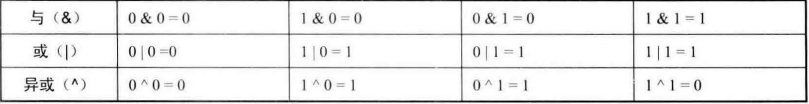
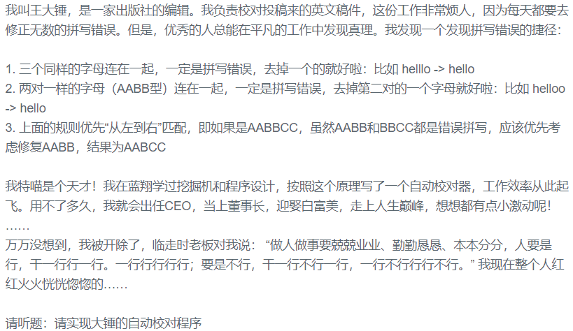

### 字符串转数字

- STL函数调用

  把一个数字型字符串转换为对应的10进制的数字型数字

  转换为int型`stoi()`

  转换成double型`stod()`

  转换成float型`stdf()`

  `int stoi(const string& str, size_t* idx = 0, int base = 10)`

  **用法**

  `stoi（字符串，起始位置，n进制）`，将 **n 进制的字符串**转化为十进制

  ```cpp
  int main()
  {
      //将2进制数255转换成10进制数
      string a = "1111";
      int b = stoi(a, 0, 2);    //stoi（字符串，起始位置，n进制），将 n 进制的字符串转化为十进制
      cout << b << endl;
      return 0;
  }
  //输出：15
  ```

- `atoi()`函数

  **将字符串里的数字字符转化为整形数。返回整形值**

  注意：转化时跳过前面的空格字符，**直到遇上数字或正负符号才开始做转换**，而**再遇到非数字或字符串结束时('/0')才结束转换**，并将结果返回。

- `atoi()函数的实现`

  ```cpp
  int strToInt(string s)
  {
      bool is_negative = false;
      int k=0;
      while (k < s.size() && s[k] == ' ')
          k++;
      if (s[k] == '+')
          k++;
      else if (s[k] == '-')
          k++, is_negative = true;
      int res = 0;
      while (k < s.size() && s[k] >= '0' && s[k] <= '9')
      {
          res = res * 10 + s[k] - '0';
          k++;
      }
      return is_negative == true ? res * (-1) : res;
  }
  ```

  

  可以将`"0001"`转换成`1`;

  ```cpp
  #include<iostream>
  int main()
  {
      string s = "192.168.10.4";
      int pos = 0;
      int a = atoi(&s[pos]);
      pos = s.find('.', pos);
      int b = atoi(&s[pos + 1]);
      pos = s.find('.', pos + 1);
      int c = atoi(&s[pos + 1]);
      pos = s.find('.', pos + 1);
      int d = atoi(&s[pos + 1]);
      cout<<a<<" "<<b<<" "<<c<<" "<<d<<endl;
      return 0;
  }
  //输出:192 168 10 4 
  ```

  

- **自己手写**

  ```cpp
  #include<iostream>
  using namespace std;
  int main()
  {
      string s = "123456";
      int num = 0;
      for (int i =0; i <s.length();i++)
      {
          num = num * 10 + (s[i] - '0');   
      }
      cout << num << endl;
      return 0;
  }
  ```

  

### 数字转字符串

`to_string()`函数，可以将任意类型的数字转换成相应的字符串。对于浮点数有可能会损失精度。

```cpp
#include<iostream>
using namespace std;
int main()
{
    int a = 255;
    string s = to_string(a);
    cout << s;
}
//输出：255
```


### string 的find函数

查找所有子串在母串中出现的位置

```cpp
int main()
{
    string s = "abc123432abc";
    string sub_str = "abc";
    auto i = s.find(sub_str, 3); //这里返回字符串s从s[3-s.length()]中出现sub_str的位置
    cout << i << endl;
    //如果没找到sub_str,返回string::npos
    string sub_str2 = "abcd";
    if (s.find(sub_str2, 3) == string::npos)
    {
        cout << "can not find sub_str2" << endl;
    }
}
```

### 进制转换

#### 位运算基本操作

- **“与”、“或”、“异或”**



- **左移右移**

  `>>`右移，`<<`左移

| **功能**                                 | **示例**               | **位运算**          |
| ---------------------------------------- | ---------------------- | ------------------- |
| **消除数字 x的二进制表示中的最后一个 1** | (110100->110000)       | `x&(x-1)`           |
| **在最后加一个0（乘以2）**               | (101101->1011010)      | `x << 1`            |
| **取数字x的最近偶数**                    | 5->4, 7->6...          | `x&-2`              |
| 在最后加一个1                            | (101101->1011011)      | `(x << 1)|1`        |
| 把最后一位变成1x                         | (101100->101101)       | `x | 1`             |
| 把最后一位变成0                          | (101101->101100)       | `(x | 1)-1`         |
| 最后一位取反                             | (101101->101100)       | `x ^ 1`             |
| 把右数第k位变成1                         | (101001->101101,k=3)   | `x | (1 << (k-1))`  |
| 把右数第k位变成0                         | (101101->101001,k=3)   | `x & ~(1 << (k-1))` |
| 右数第k位取反                            | (101001->101101,k=3)   | `x ^ (1 << (k-1))`  |
| 取末三位                                 | (1101101->101)         | `x & 7`             |
| 取末k位                                  | (1101101->1101,k=4)    | `x & ((1 << k)-1)`  |
| 把右起第一个0变成1                       | (100101111->100111111) | `x | (x+1)`         |
| 取右数第k位                              | (1101101->1,k=4)       | `(x >> (k-1)) & 1`  |
| 把右边连续的1变成0                       | (100101111->100100000) | `x & (x+1)`         |
| 把右边连续的0变成1                       | (11011000->11011111)   | `x | (x-1)`         |


#### 进制表示

16进制数通常以`0x`开头，

`0xff=1111 1111`

`0xff00=1111 1111 0000 0000`

#### 10进制转任意进制

算法过程为短除法的过程，注意判断正负

```cpp
//将10进制数转为任意进制数
string convert10ToDigit(int num, int digit)
{
    string res = "";
    if (num == 0) return "0";
    int flag = 1; //num>0时为1 小于0时为0
    if (num < 0)
        num = -num;
        flag = 0;
    //短除法过程，不断的除以进制，再用余数继续除以进制
    while (num)
    {
        int temp = num % digit;   //求余数
        if (temp < 10)            
            char t = temp + '0';
            res += t;
        else
            char t = temp - 10 + 'a'; // 如 temp = 11 在16进制中为b
            res += t;
        num = num / digit;
    }
    if (flag == 0)
    {
        res += '-';
    }
    reverse(res.begin(), res.end());   //短除法的结果是倒着的
    return res;
}
```

#### 0-16进制转10进制

由于高于16进制没有一个标准的表示方法，所以这里只给出0-16进制的转换。

其他进制转10进制，例如二进制转10进制，$1010 = 1*2^3+0*2^2+1*2^1=10$

但是再实际编码中，采用加法的形式来还原这一过程，从高位还原到地位，将原来的进位还原到进位前的数。

```cpp
//例如1010的计算过程如下。 
int ans = 0;
0*2+1 = 1        //初始值为0     
1*2+0 = 2
2*2+1 = 5
5*2+0 = 10
```

代码如下，

```cpp
int convertDigitTo10(string digitNum, int digit)
{
    int ans = 0;
    int flag = 1;   //正负数标记
    if(digitNum[0] = '-')
    {
        flag = 0;
        digitNum = digitNum.substr(1, digitNum.length() - 1);
    }
    //这里不是用传统的进制计算方法，而是从高位还原进位过程。例如二进制数111，把最高位加回到此高位，依次叠加。
    for (int i = 0; i < digitNum.size(); i++)          
    {
        char t = digitNum[i];
        if (t >= '0' && t <= '9')
            ans = ans * digit + t - '0';
        else if(t>='a'&&t<='f')           // 这里要注意的，比如输入是16进制的0XA，0和X应该跳过不能计算
            ans = ans * digit + t - 'a' + 10;
    }
    if(flag==0)
    {
        ans = -ans;
    }
    return ans;
}
```

### 关于字符串按照一定规则变换的问题

对于这类问题，按照字符串的规则将需要变换的字符的变换结果排出来。

```cpp
//需要变换的全部字符
const string helper1 = "abcdefghijklmnopqrstuvwxyzABCDEFGHIJKLMNOPQRSTUVWXYZ0123456789";
//变换后相对应的字符
const string helper2 = "BCDEFGHIJKLMNOPQRSTUVWXYZAbcdefghijklmnopqrstuvwxyza1234567890";
```

[字符串加密](https://www.nowcoder.com/practice/2aa32b378a024755a3f251e75cbf233a?tpId=37&tqId=21252&tPage=2&rp=&ru=%2Fta%2Fhuawei&qru=%2Fta%2Fhuawei%2Fquestion-ranking)

[字符串合并处理](https://www.nowcoder.com/practice/d3d8e23870584782b3dd48f26cb39c8f?tpId=37&tqId=21253&tPage=2&rp=&ru=/ta/huawei&qru=/ta/huawei/question-ranking)

### 有限自动机



```cpp
#include <iostream>
using namespace std;
void helper(string s)
{
    string res = "";
    res += s[0];
    int state = 0;
    for (int i = 1; i < s.length(); i++)
    {
        switch (state)
        {
        case 0:
        {
            if (s[i] == s[i - 1])
                state = 1;
            else
                state = 0;
            break;
        }
        case 1:
        {
            if (s[i] == s[i - 1])
                continue;
            else
                state = 2;
            break;
        }
        case 2:
        {
            if (s[i] == s[i - 1])
                continue;
            else
                state = 0;
            break;
        }
        default:
            break;
        }
        res += s[i];
    }
    cout << res << endl;
}
int main()
{
    int n;
    cin >> n;
    while (n--)
    {
        string s;
        cin >> s;
        helper(s);
    }
}
```


