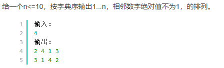

## 编程题


```cpp
#include<iostream>
#include<vector>
using namespace std;
int exchange(int n)
{
    int emp=n;
    if(emp==1||emp==0)
        return 0;
    if(emp==2)
        return 1;
    return (emp/3+exchange(emp/3+emp%3));
}
int change(int num)
{
    if(num<=1)
    {
        return 0;
    }
    if(num==2)
    {
        return 1;
    }
    int res = 0;
    while(num>3)
    {
        int a = num / 3;
        int b = num % 3;
        res += a;
        num = a + b;
        if(num==2||num==3)
        {
            return res+1;
        }
    }
    return res;
}
int main()
{
    int n;
    vector<int>vt;
    while(cin>>n)
    {
        if(n>=1&&n<=100)
            vt.push_back(n);
    }
    for(int i=0;i<vt.size();i++)
    {
        cout<<change(vt[i])<<endl;
    }
    return 0;
}
```

### 阿里笔试7.22



遍历1-n，对以`i`开头的进行回溯。这里需要保留前一次的储存的数据，用于后面进行判断。

```cpp
#include<iostream>
#include<vector>
#include<algorithm>
using namespace std;
vector<vector<int>> res;
vector<int> temp;
int n;
void dfs(int start,vector<int> temp)
{
    temp.push_back(start);
    if(temp.size()==n)
    {
        res.push_back(temp);
        temp.clear();
        return;
    }
    for(int i = 1;i<=n;i++)
    {
        if(find(temp.begin(),temp.end(),i)==temp.end()&&abs(i-start)!=1)
        {
            dfs(i,temp);
        }
    }
}
int main()
{
    cin>>n;
    for(int i = 1;i<=n;i++)
    {
        dfs(i,temp);
    }
     for(auto item:res)
    {
        for(auto i:item)
        {
            cout << i << " ";
        }
        cout << endl;
    }
}
```


