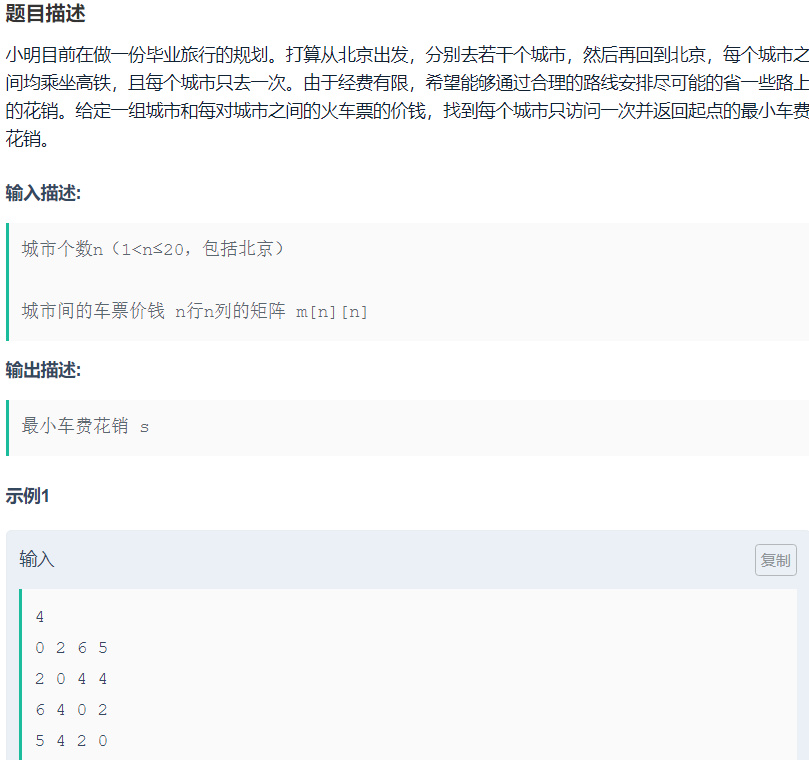

### [毕业旅行(TSP问题)](https://www.nowcoder.com/practice/3d1adf0f16474c90b27a9954b71d125d?tpId=98&tqId=33010&rp=1&ru=/ta/2019test&qru=/ta/2019test/question-ranking)



TSP问题一般采用动态规划法，这里先采用回溯法来解决该问题，目的是掌握回溯中**for循环+回溯（回溯中参数改变循环起始位置）**的问题，类似于子集问题。 

```cpp
#include <iostream>
#include <vector>
#include <algorithm>
using namespace std;
void backTrack(vector<vector<int>> &prices, int n, vector<int> &path, vector<int> &bestPath,int curCity, int cp, int &res)
{
    if (curCity > n)   //准备返程，加上返程的钱
    {
        if (prices[path[n]][1] &&        // path[n] 最后到达的城市，准备返回老家（起点）。
            prices[path[n]][1] + cp < res)// 如果当前路径总和比其他方案的res大，则选择该方案。
        {
            res = prices[path[n]][1] + cp;      
            for (int i = 1; i <= n;i++)  //记录当前res的路径
            {
                bestPath[i] = path[i]; 
            }
        }
    }
    else
    {
        for (int i = curCity; i <= n; i++)
        {
            if (prices[path[curCity - 1]][path[i]] &&   // 前一到达的城市到现在的城市+cp
                cp + prices[path[curCity - 1]][path[i]] < res)
            { 
                swap(path[curCity], path[i]);
                cp += prices[path[curCity - 1]][path[curCity]];
                backTrack(prices, n, path, bestPath, curCity + 1, cp, res);
                cp -= prices[path[curCity - 1]][path[curCity]];
                swap(path[curCity], path[i]);
            }
        }
    }
}
int main()
{
    int res = 63355;
    int n; //城市数
    cin >> n;
    vector<int> path(n + 1, 0);     //记录路径,记录去过的城市号
    vector<int> bestPath(n + 1, 0); // 记录最优路径
    int cp = 0;                     //记录当前需要钱的数量
    for (int i = 1; i < path.size(); i++)
    {
        path[i] = i;
    }
    vector<vector<int>> prices(n + 1, vector<int>(n + 1, 0)); // 价格表
    int item;
    for (int i = 1; i <= n; i++)
    {
        for (int j = 1; j < n + 1; j++)
        {
            cin >> item;
            prices[i][j] = item;
        }
    }
    backTrack(prices, n, path, bestPath, 2, cp, res);
    cout << "最少旅行费用为: " << res << endl;
    cout << "旅行路径为:" << endl;
    for (int i = 1; i <= n; i++)
    {
        cout << bestPath[i] << "->";
    }
    cout << bestPath[1] << endl;

    return 0;
}

```

对于TSP问题回溯法在处理较多城市的情况下，往往回超时。所以对于该问题的解法一般采用动态规划法。[参考讲解](https://www.cnblogs.com/youmuchen/p/6879579.html)

要使用动态规划，需要问题本身有最优子结构，我们需要找到要解决的问题的子问题。

题目要求，从0出发，经过[1,2,3]这几个城市，然后回到0，使得花费最少。要实现这个要求，需要从下面三个实现方案中选择花费最少的方案。

　　　　1、 从0出发，到1，然后再从1出发，经过[2,3]这几个城市，然后回到0，使得花费最少。

　　　　2、 从0出发，到2，然后再从2出发，经过[1,3]这几个城市，然后回到0，使得花费最少。

　　　　3、 从0出发，到3，然后再从3出发，经过[1,2]这几个城市，然后回到0，使得花费最少。

　　可以发现，三个小的解决方案的最优解，构成了大的解决方案，所以这个问题具有最优子结构，可以用动态规划来实现。

　　设置一个二维的动态规划表dp,定义符号{1,2,3}表示经过[1,2,3]这几个城市，然后回到0。

　　那么题目就是求`dp[0][{1,2,3}]`。将{1,2,3}表示成二进制，就是111，对应10进制的7，所以题目是在求`dp[0][7]`;

要求三个方案的最小值意味：

`dp[0][{1,2,3}] = min{ C01+dp[1][{2,3}] ，C02+dp[2][{1,3}] ，C03+dp[3][{1,2}]}`

其中C01 表示从0出发到1的距离。

`dp[1][{2,3}] = min{ C12+dp[2][{3}] ，C13+dp[3][{1}]}`

`dp[2][{3}] = C23+dp[3][{}]`

`dp[3][{}]`就是从3出发，不经过任何城市，回到0的花费，所以`dp[3][{}] = C30`

dp表的大小，有n个城市，从0开始编号，那么dp表的行数就是n，列数就是2^(n-1)，即1 << （n – 1）,集合{1,2,3}的子集个数。在求解的时候，第一列的值对应这从邻接矩阵可以导出，后面的列可以有前面的列和邻接矩阵导出。


第一轮首先将各城市回到起点城市0的花费

```cpp
//各城市回到起点花费，dp初始值
for(int i=0;i<n;i++)
{
    dp[i][0] = nums[i][0];
}
```

当`j>=1时`即经过城市后，

例如对于`dp[2][5]`,从城市2出发，经过{1,3}后，返回到起点的花费。

即`dp[2][5]=min(c21+dp[1][{3}]),cp23+dp[3][{1},]`   

转换为二进制集合为`dp[2][5] = min(c21+dp[1][4],c23+dp[3][1]`

从城市2出发，去**集合{1，3}**的城市

- 先去试试去城市1，此时集合中只有{3}，需要求出`dp[1][4]`,4可以通过二进制集合与当前城市异或求出，例如当前集合`101^1=100`即为4。
- 尝试去尝试2，由于集合中没有 2城市，不能去。并且由于出发点是城市2，也不能再去2城市。判断集合第二位是否存在即可`(5>>(2-1))&1==0`表示待去集合中没有城市2，跳过。
- 尝试去城市3，此时集合中只有{1}，需要求出`dp[3][1]`，同样`101^(1<<(3-1)),即101^100=1`

```cpp
#include <iostream>
#include <vector>
#include <algorithm>
using namespace std;
int getAns(vector<vector<int>> &nums)
{
    const int MAX = 0x0fffffff;
    int n = nums.size();
    int stateNum = 1 << (n - 1); //即2的n次方，也就是第n个城市
    // dp[i][j]中的j是一个二进制形式的数，表示经过城市的集合，
    // 如111表示经过了城市1,2,3,排除了城市0 dp[0][{1,2,3}] 即为所求
    // dp[i][j]表示从城市i出发，经过j集合中的城市所需最小花费n

    vector<vector<int>> dp(n, vector<int>(stateNum, MAX));
    for (int i = 0; i < n; i++)
    {
        dp[i][0] = nums[i][0]; //每个城市hui到起点的花费
    }
    // 这里j不仅是dp表的列坐标值，j的二进制表示城市相应城市是否在子集中
    for (int j = 1; j < stateNum; j++)
    {
        //从i出发，去集合j的城市
        for (int i = 0; i < n; i++)
        {
            //查看集合j的第i位是否为1，为1说明待走集合中包含起点，
            // 该方式错误，跳过（例如d[1][{1}]，d[2][{1,2}]）
            if ((j >> (i - 1) & 1 == 1))
            {
                continue;
            }
            //如果j >> (i - 1) & 1 == 0,则表示从城市i出发，经过集合j的城市，回到起点0所需花费
            //尝试去k城市，
            for (int k = 1; k < n; k++)
            {
                //待走集合最终没有当前城市，跳过。
                if ((j >> (k - 1) & 1) == 0)
                {
                    continue;
                }
                if (dp[i][j] > nums[i][k] + dp[k][j ^ (1 << (k - 1))])

                {
                    //dp[k][j ^ (1 << (k - 1))]表示从k城市出发，经过子集不包含k城市的路径，返回起点的花费。
                    //dp[2][{1,3}] =min(nums[2][1]+dp[1][{3}],nums[2][3]+dp[3][{1}])
                    //即 dp[2][5] = min(nums[2][1]+dp[1][4],nums[2][3]+dp[3][1])
                    // j ^ (1 << (k - 1)),去掉原来集合j中的城市k，得到的新集合
                    dp[i][j] = nums[i][k] + dp[k][j ^ (1 << (k - 1))];
                }
            }
        }
    }
    return dp[0][(1 << (n - 1)) - 1]; //dp[0][7]   7:0111
}
int main()
{
    int n;
    while (cin >> n)
    {
        vector<vector<int>> edges(n, vector<int>(n, 0));
        int x;
        for (int i = 0; i < n; i++)
        {
            for (int j = 0; j < n; j++)
            {
                cin >> edges[i][j];
            }
        }
        cout << getAns(edges) << endl;
    }
    return 0;
}
```

 