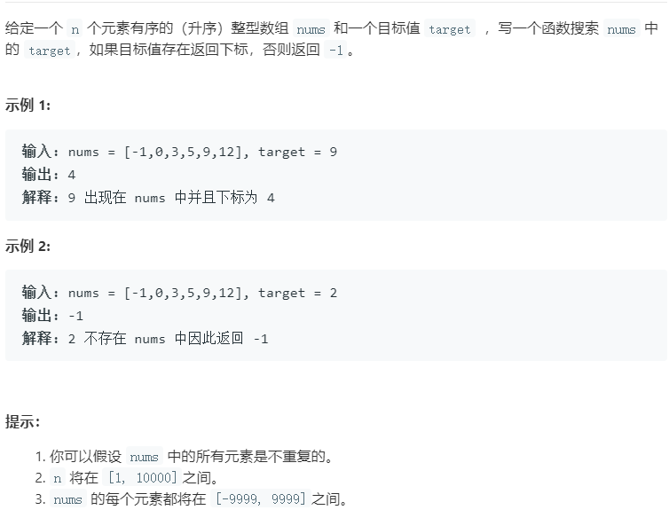

## 二分查找

在排序的数数组（或者部分排序的数组）中查找一个
数字或者统计某个数字出现的次数，一般都采用二分查找的方法。

二分查通过左右两个指针，实现缩小查找区间，**算法复杂度为O(nlogn)**。二分查找的关键在于处理好查找的边界条件和查找终止条件。

一般情况下，我将左右两个指针统一初始化为`int left=0;int right = nums.size()-1`（闭区间）这样一来你不需要过分讨论边界，在同一的边界闭合边界处进行。

首先从最简单的**排序数组中目标数组的查找**开始，然后再讨论**查找左边界**，**查找右边界**。最后讨论**旋转数组中的查找**问题（部分排序）

### 二分查找框架

通过对比目标值和排序数组的中间元素，缩小搜索范围。

```cpp
int binarySearch(vector<int>&nums,int target)
{
    int left = 0;
    int right = nums.size()-1;   // 我统一为闭区间内的查找。
    while(left<=right)           // 闭区间内的查找可以取等 终止条件为left == right + 1
    {
        int mid = left+(right-left)/2  // 这种求中点的方法更好，防止直接求和时溢出
        if(nums[mid]==target)
        {
            .....;
        }
        //在完全排序数组中，目标值在左侧
        else if(nums[mid]>target)
        {
            right = ...;
        }
        //目标值在右侧
        else if(nums[mid]<target)
        {
            left = ...;
        }
    }
    return ...;
}
```

### [寻找一个数](https://leetcode-cn.com/problems/binary-search/)



这是一个最基础，最典型的二分查找，代码如下。

```cpp
class Solution {
public:
    int search(vector<int>& nums, int target) {
        if(nums.size()==0) return -1;
        int left = 0;
        int right = nums.size()-1;
        while(left<=right)
        {
            int mid = left+(right-left)/2;
            if(nums[mid]==target)
            {
                return mid;
            }
            else if(nums[mid]>target)
            {
                right = mid-1;
            }
            else if(nums[mid]<target)
            {
                left = mid+1;
            }
        }
        return -1;
    }
};
```

对于有序数组 `nums = [1,2,2,2,3]`，`target` 为 2，此算法返回的索引是 2，没错。但是如果我想得到 `target` 的左侧边界，即索引 1，或者我想得到 `target` 的右侧边界，即索引 3，这样就需要[查找数组元素的左右边界](https://leetcode-cn.com/problems/find-first-and-last-position-of-element-in-sorted-array/submissions/)。

### 查找左边界

```cpp
int left_bound(vector<int>&nums,int target)
{
    int left = 0;
    int right = nums.size()-1;   //统一
    while(left<=right)           //终止条件left == right + 1
    {
        int mid = left+(right-left)/2;
        if(nums[mid]==target)
        {
            //相等时判断nums[mid]是不是最左边的目标值。
            //这里必须先判断mid=0，否则，如果mid=0时，先判断nums[mid-1] 会出现数组越界
            if(mid==0||nums[mid-1]<target)
            {
                return mid;
            }
            right = mid-1;
        }
        else if(nums[mid]<target)
        {
            left = mid+1;
        }
        else if(nums[mid]>target)
        {
            right = mid-1;
        }
    }
    return -1;
}
```

### 查找右侧边界

```cpp
int right_bound(vector<int>&nums,int target)
{
    int left = 0;
    int right = nums.size()-1;   //统一
    while(left<=right)           //终止条件left == right + 1
    {
        int mid = left+(right-left)/2;
        if(nums[mid]==target)
        {
            //相等时判断nums[mid]是不是最右边的目标值。
            //这里必须先判断mid=nums.size()-1
            if(mid==nums.size()-1||nums[mid+1]>target)
            {
                return mid;
            }
            left = mid+1;
        } 
        else if(nums[mid]<target)
        {
            left = mid+1;
        }
        else if(nums[mid]>target)
        {
            right = mid-1;
        }
    }
    return -1;
}
```

### [旋转数组中的查找最小值](https://leetcode-cn.com/problems/find-minimum-in-rotated-sorted-array-ii/)

旋转数组指将排序好的数组绕其中一个元素进行旋转。例如[1,2,3,4,5]的其中一个旋转数组为[4,5,1,2,3]。旋转数组中进行二分查找的关键在于判断数组中间数是在左侧有序数组还是右侧有序数组。考虑二分法寻找此两数组的分界点 `nums[i] `(即第 2 个数组的首个元素)。

即`nums可以才分为nums1和nums2;并且nums1中的任意元素>=nums2中的任意元素`

具体步骤如下：

- 设置`left=0;right = nums.size()-1;mid = left+(right-left)/2`

- 当`nums[mid]>nums[right]`，`nums[mid]`一定在左边有序数组`(nums1)`；`nums[i]在nums[mid]和nums[right]之间，即mid<i<=right`;所以此时`left=mid+1`;

- 当`nums[mid]<nums[right]`，`nums[mid]`一定在右边有序数组`(nums2)`；`nums[i]在nums[left]和nums[mid]之间，即left<i<=mid`;所以此时`right = mid`;

- 当`nums[mid]==nums[right]`，对于具备重复元素的旋转数组，不能判断出分界点`nums[i]`的区间范围。

  例如`[1,0,1,1,1]和[1,1,1,0,1] `,无法判断` nums[mid]`在哪一个排序数组。

  这种情况我们可以右以下两种方案

  - 采用`right = right-1`解决该问题。

    **证明：**只需证明每次执行此操作后，旋转点仍在 `[left, right]`区间内即可。

    - 此操作不会使数组越界：因为迭代条件保证了 `right>=left`；

    - 此操作不会使最小值丢失：假设` nums[right]` 是最小值，

      有两种情况：

      - 若` nums[right]`是唯一最小值：只有当`left=right时（mid = left=right）`，才可能满足判断条件 `nums[mid] == nums[right]`，而此时是成立；
      - 若` nums[right] `不是唯一最小值，由于 `mid < right `而 `nums[mid] == nums[right]`，即还有最小值存在于 `[left, right - 1]` 区间，因此不会丢失最小值。

  - 按照剑指offer的方法，这里可以直接采用暴力的方法解决

```cpp
class Solution {
public:
    int findMin(vector<int>& nums) {
        int left = 0;
        int right = nums.size()-1;
        while(left<=right)
        {
            int mid = left+(right-left)/2;
            if(nums[mid]>nums[right])
            {
                left = mid+1;
            }
            else if(nums[mid]<nums[right])
            {
                right = mid;
            }
            else
            {
                right--;
            }
        }
        return nums[left];
    }
};
```

## 二分专题

二分法的本质在于对边界的处理，当边界满足某种条件时，会将数据分成两个部分。对两个部分对应下面两个模板。

```cpp
bool check(int x) {/* ... */} // 检查x是否满足某种性质

// 区间[l, r]被划分成[l, mid]和[mid + 1, r]时使用：
//实际是找左边界
int bsearch_1(int l, int r)
{
    while (l < r)
    {
        int mid = l + r >> 1;
        if (check(mid)) r = mid;    // check()判断mid是否满足性质
        else l = mid + 1;
    }
    return l;
}
// 区间[l, r]被划分成[l, mid - 1]和[mid, r]时使用：
//实际是找右边界
int bsearch_2(int l, int r)
{
    while (l < r)
    {
        int mid = l + r + 1 >> 1;
        if (check(mid)) l = mid;
        else r = mid - 1;
    }
    return l;
}
```


