#  二叉树

**二叉树：**是树的一种特殊结构，在二叉树中每个节点最多只能有两个子节点。

**二叉树的深度优先遍历（DFS）与广度优先遍历（BFS）**

**深度优先遍历：**从根节点出发，沿着左子树方向进行纵向遍历，直到找到叶子节点为止。然后回溯到前一个节点，进行右子树节点的遍历，直到遍历完所有可达节点为止。

**广度优先遍历**：从根节点出发，在横向遍历二叉树层段节点的基础上纵向遍历二叉树的层次。

## 二叉树的遍历方式


二叉树的遍历通常位以下两种情况：**深度优先搜索和宽度优先搜索**，其中深度优先搜索可以分为：前序遍历、中序遍历和后续遍历。

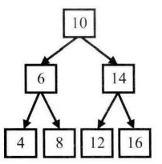

**前序遍历：**先访问根节点，在访问左子节点，最后访问右子节点。如上图所示的二叉树按照前序遍历的顺序为：10、6、4、8、14、12、16。

**中序遍历：**先访问左子节点，在访问根节点，最后访问右子节点。如上图所示的二叉树按照前序遍历的顺序为：4，6，8，10，12，14，16。

**后续遍历：**先访问左子节点，在访问右子节点，最后访问根节点。如上图所示的二叉树按照后序遍历的顺序为：4、8、6、12、16、14、10。

**宽度优先搜索：**先访问树的第一层节点，再访问树的第二层节
点……一直到访问到最下面一层节点。在同一层节点中，以从左到
右的顺序依次访问。如上图所示的二叉树按照宽度优先搜索的顺序为：10、6、14、4、8、12、16。

## 二叉树的常见特例

### 二叉搜索树

二叉搜索树（Binary Search Tree），也别称为二叉查找树，二叉排序树。**二叉搜索树中 ， 左子节点总是小于或等于根节点 ，而右子节点总是大于或等于根节点 。**  也就是，根节点的值大于其左子树中任意一个节点的值，小于其右节点中任意一节点的值，这一规则适用于二叉查找树中的每一个节点。如下图所示。

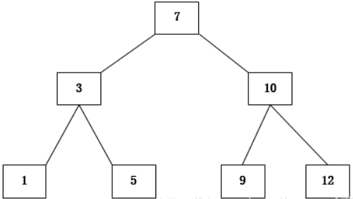

#### **特点如下：**

- 根节点值大于或等于其左子树任意节点的值。
- 根节点值小于或等于右子树任意节点的值
- 以上两个性质在二叉搜索树中的**每一个节点均满足**
- 二叉搜索树的中序遍历为**升序序列**。

#### 构建二叉搜索树

```cpp
#include <iostream>
using namespace std;
struct TreeNode
{
    int val;
    TreeNode *left;
    TreeNode *right;
    TreeNode(int x) : val(x), left(NULL), right(NULL) {}
}; 
void buildBST(TreeNode *&root, int x)   //这里是节点指针的引用
{
    if (root == NULL) 
    {
        root = new TreeNode(x);
        return;
    }
    //去重
    // if (x == root->val)
    // {
    //     return;
    // }
    if (x < root->val)
    {
        buildBST(root->left, x);
    }
    if(x>=root->val)
    {
        buildBST(root->right, x);
    }
}

void inOrder(TreeNode *root)
{
    if (root == NULL)
    {
        return;
    }
    inOrder(root->left);
    cout << root->val << " ";
    inOrder(root->right);
}
int main()
{
    int x;
    TreeNode *root = NULL;
    while (cin >> x)
    {
        buildBST(root, x);
    }
    inOrder(root);
    cout << endl;
    return 0;
}
```


### 堆

### 红黑树

## 二叉树的遍历

对于二叉树的三种遍历方式都有递归和循环两种实现方法。

### [前序遍历](https://leetcode-cn.com/problems/binary-tree-preorder-traversal/solution/)

**递归方法**

```cpp
struct TreeNode
{
    int val;
    TreeNode *left;
    TreeNode *right;
    TreeNode(int x):val(x),left(NULL),right(NULL){}
};
//递归方法
class Solution {
public:
    vector<int> preorderTraversal(TreeNode* root) {
        if(root==NULL)
        {
            return res;
        }
        res.push_back(root->val);
        preorderTraversal(root->left);
        preorderTraversal(root->right);
        return res;

    }
private:
    vector<int> res;
};
```

**迭代方法**，递归的本质就是栈结构，迭代的方法就是构建一个栈来代替系统栈。

```cpp
struct TreeNode
{
    int val;
    TreeNode *left;
    TreeNode *right;
    TreeNode(int x):val(x),left(NULL),right(NULL){}
};
class Solution {
public:
  vector<int> preorderTraversal(TreeNode *root)
    {
      	//构建一个栈
        stack<TreeNode *> s;
        vector<int> res;
        if (root == NULL)
        {
            return res;
        }
      s.push(root);
      while(!s.empty())
      {
          TreeNode*temp = s.top();
          res.push_back(temp->val);
          s.pop();
          //后遍历右子树，所以根据栈的特性先压入右子树
          if(temp->right)
          {
              s.push(temp->right);
          }
          if(temp->left)
          {
              s.push(temp->left);
          }
          temp  = NULL;  //释放指针
      }
      return res;
    }
};
```

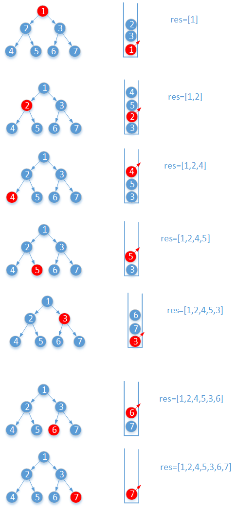

为了和后续的遍历方法统一架构，这里提供另一种迭代方法

```cpp
class Solution
{
public:
    vector<int> preorderTraversal(TreeNode *root)
    {
        stack<TreeNode *> s;
        vector<int> res;
        TreeNode *temp = root;
        while (   || !s.empty())
        {
            while (temp)
            {
                s.push(temp->right);    // 就算是空可要压入栈中。
                res.push_back(temp->val);
                temp = temp->left;
            }
            temp = s.top();
            s.pop();
        }
        return res;
    }
};
```


### [中序遍历](https://leetcode-cn.com/problems/binary-tree-inorder-traversal/solution/er-cha-shu-de-zhong-xu-bian-li-by-leetcode/)

**递归方法**

```cpp
struct TreeNode
{
    int val;
    TreeNode *left;
    TreeNode *right;
    TreeNode(int x):val(x),left(NULL),right(NULL){}
};
class Solution {
public:
    vector<int> inorderTraversal(TreeNode* root) {
        if(root==NULL)
        {
            return res;
        }
        inorderTraversal(root->left);
        res.push_back(root->val);
        inorderTraversal(root->right);
        return res;
    }
private:
    vector<int> res;
};
```

**迭代方法**

每到一个节点 A，因为根的访问在中间，将 A 入栈。然后遍历左子树，接着访问 A，最后遍历右子树。在访问完 A 后，A 就可以出栈了。因为 A 和其左子树都已经访问完成。

```cpp
struct TreeNode
{
    int val;
    TreeNode *left;
    TreeNode *right;
    TreeNode(int x):val(x),left(NULL),right(NULL){}
};
class Solution {
public:
    vector<int> inorderTraversal(TreeNode* root) {
        vector<int> res;
        stack<TreeNode*> s;
        TreeNode*temp =root;
        if(root==NULL)
        {
            return res;
        }
        while(temp||!s.empty())
        {
            //遍历左子树
            while(temp)
            {
                s.push(temp);
                temp = temp->left;
            }
            temp = s.top();
            s.pop();
            res.push_back(temp->val);
            temp = temp->right;    //查看右子节点
        }
        return res;
    }
};

```

### [后续遍历](https://leetcode-cn.com/problems/binary-tree-postorder-traversal/solution/er-cha-shu-de-hou-xu-bian-li-by-leetcode/)

**递归方法**

```cpp
struct TreeNode
{
    int val;
    TreeNode *left;
    TreeNode *right;
    TreeNode(int x):val(x),left(NULL),right(NULL){}
};
//递归方法
class Solution {
public:
    vector<int> postorderTraversal(TreeNode* root) {      
        if(root==NULL)
        {
            return res;
        }
        postorderTraversal(root->left);
        postorderTraversal(root->right);
        res.push_back(root->val);
        return res; 
    }
private:
    vector<int> res;
};

```

**迭代方法1**

这里采用了采用了类似前序遍历的方法（将前序遍历的root->left->right改为root->right->left），再将最后结果逆序。

```cpp
struct TreeNode
{
    int val;
    TreeNode *left;
    TreeNode *right;
    TreeNode(int x):val(x),left(NULL),right(NULL){}
};
class Solution {
public:
    vector<int> postorderTraversal(TreeNode* root) {
        vector<int> res;
        stack<TreeNode*> s;
        if(root==NULL)
        {
            return res;
        }
        s.push(root);
        while(!s.empty())
        {
            TreeNode*temp = s.top();
            res.push_back(temp->val);
            s.pop();
            //这里需要先访问右节点，故而先将做左子节点压入栈中 
            if(temp->left)
            {
                s.push(temp->left);
            }
            if(temp->right)
            {
                s.push(temp->right);
            }
            temp==NULL;
        }
        reverse(res.begin(),res.end());
        return res; 
    }
};
```

**标准后续遍历的迭代方法**，标准的迭代方法比较困难，由于根节点需要再最后访问，所以通过根节点访问左子节点后，pop后回到根节点时并不能对根节点进行pop和添加操作。

```cpp
struct TreeNode
{
    int val;
    TreeNode *left;
    TreeNode *right;
    TreeNode(int x):val(x),left(NULL),right(NULL){}
};

class Solution {
public:
    vector<int> postorderTraversal(TreeNode* root) {
        vector<int> res;
        if(root==NULL)
        {
            return res;
        }
        stack<TreeNode*>s;
        TreeNode*cur = root;
        TreeNode*pre = NULL;   //记录前一节点
        while(cur||!s.empty())
        {
            while(cur)
            {
                s.push(cur);
                cur = cur->left;
            }
            cur = s.top();
            //当前左子节点为空，如果右子节点也为空，则添加当前节点。
            //如果当前节点的右子节点被记录过，则添加当前根节点
            if(cur->right==NULL||cur->right==pre) 
            {
                res.push_back(cur->val);
                s.pop();
                pre = cur;     //记录已经添加的节点
                cur = NULL;    //如果当前节点已被添加，则置为空，不再进行查找
            }
            else
            {
                cur = cur->right;
            }
        }
        return res;
    }
};
//另一种思路
class Solution
{
public:
    vector<int> postorderTraversal(TreeNode *root)
    {
        vector<int> res;
        if (!root)
            return res;
        stack<TreeNode *> s;
        s.push(root);
        TreeNode *cur;
        while (!s.empty())
        {
            cur = s.top();
            s.pop();
            //无左右子节点，添加
            if (!cur->left && !cur->right)
            {
                res.push_back(cur->val);
            }
            else
            {
                //对于有左右子节点的节点，将其左右子节点置空。方便后续判断添加
                TreeNode *left = cur->left;
                TreeNode *right = cur->right;
                //当前节点的左右节点置空
                cur->left = NULL;
                cur->right = NULL;
                //然后将该节点压入栈中，该节点已经没有了左右子节点
                //最后访问根节点，所以最先入栈
                s.push(cur);
                //后边了右子节点，先入栈
                if (right)
                {
                    s.push(right);
                }
                //最先访问左子节点，最后入栈
                if (left)
                {
                    s.push(left);
                }
            }
        }
        return res;
    }
};
```

### 宽度优先搜索

**递归的方法**

利用深度优先搜索（DPS）的方法进行遍历，通过二维数组，将结果分层输出。虽然递归按照前序遍历的方式进行，但是通过数据进行分层输入实现了层次遍历。

```cpp
class Solution {
public:
    vector<vector<int>> res;   
    vector<vector<int>> levelOrder(TreeNode* root) 
    {
        addVector(root,0);      //调用递归函数
        return res;
    }
  
    void addVector(TreeNode* root,int level)
    {
        if(root == NULL)    return;
        //level表示层数，也对应二维数组的第一层索引，
        if(res.size()==level)       
        {
            res.resize(level+1);    
        }
        res[level].push_back(root->val);
        addVector(root->left,level+1);
        addVector(root->right,level+1);
    }
};
```

**迭代的方法**

利用队列的先进先出的特性来实现宽度优先搜索层次遍历。

```cpp
class Solution {
public:
    vector<vector<int>> levelOrder(TreeNode* root) {
        vector<vector<int>> ans;
        vector<int> res;
        if(root==NULL)
        {
            return ans;
        }
        queue<TreeNode*>q;
        q.push(root);
        while(!q.empty())
        {
            int length = q.size();
            res.clear();
            //将当前层处理完后再添加进ans
            while(length--)
            {
                TreeNode*temp = q.front();
                res.push_back(temp->val);
                q.pop();
                if(temp->left)
                {
                    q.push(temp->left);
                }
                if(temp->right)
                {
                    q.push(temp->right);
                }
            }
            ans.push_back(res);
            
        }
        return ans;
    }
};
```

过程如下图所示：

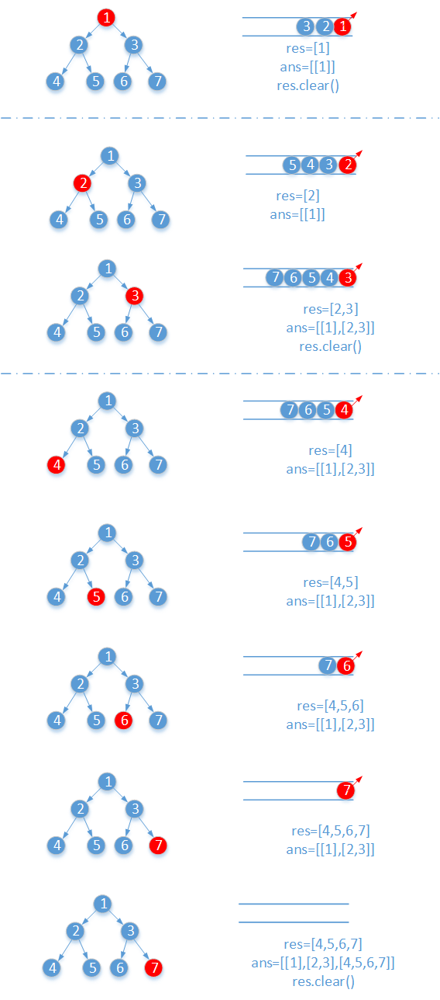

## 二叉树刷题

###  递归

#### [树的高度](https://leetcode-cn.com/problems/maximum-depth-of-binary-tree/submissions/)

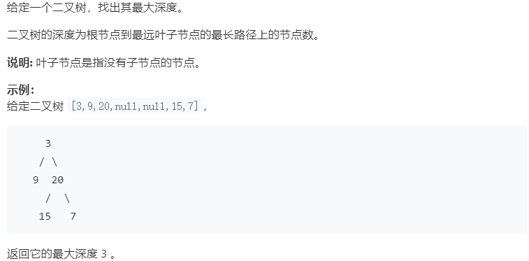

**递归的方法**

```cpp
class Solution {
public:
    int maxDepth(TreeNode* root) {
        if(root==NULL)	
        {
            return 0;
        }
        int left = maxDepth(root->left);
        int right = maxDepth(root->right);
        return max(left,right)+1;
    }
};
```

**迭代法**

这里使用的是宽度优先搜索的方法来遍历二叉树，并统计深度。

```cpp
struct TreeNode
{
    int val;
    TreeNode*left;
    TreeNode*right;
    //初始化
    TreeNode(int x):val(x),left(NULL),right(NULL){}
};
class Solution {
public:
    int maxDepth(TreeNode* root) {
        if(root==NULL)
        {
            return 0;
        }
        queue<TreeNode*>q;
        int depth = 0;
        q.push(root);
        while(!q.empty())
        {
            //记录当前队列中的元素个数，这里即为当前层的节点数
            int level = q.size();
            //分层操作
            while(level--)
            {
                TreeNode*temp = q.front();
                q.pop();
                if(temp->left) q.push(temp->left);
                if(temp->right) q.push(temp->right);    
            }
            depth++;
        }
        return depth;
    }
};
```

#### [平衡二叉树](https://leetcode-cn.com/problems/balanced-binary-tree/description/)

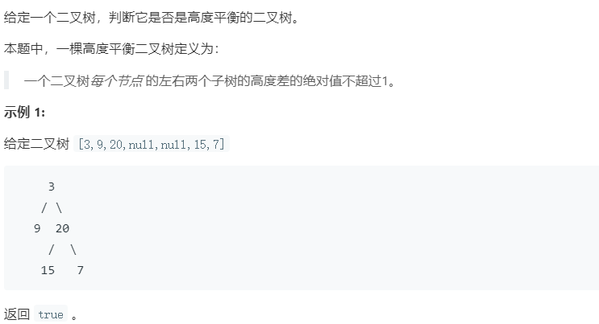

递归判断左右子树和自身是否满足要求即可。递归计算树的高度，递归比较左右子树。

```cpp
class Solution {
public:
    bool isBalanced(TreeNode* root) {
        if(root==NULL) return true;
        //计算左右子树的高度
        int left = MaxDepth(root->left);
        int right = MaxDepth(root->right);
        //比较左右子树的差值
        if(abs(left-right)>1) return false;
        //递归判断左子树和右子树是否满足平衡二叉树的条件
        return abs(left-right)<=1&&isBalanced(root->left)&&isBalanced(root->right);   
    }
private:
    int MaxDepth(TreeNode*node)
    {
        if (node==NULL) return true;
        int left = MaxDepth(node->left);
        int right = MaxDepth(node->right);
        return max(left,right)+1;
    }
};
```

#### [二叉树直径]([二叉树的直径](https://leetcode-cn.com/problems/diameter-of-binary-tree/))


本体并不是简单的左子树的最大高度+右子树的最大高度，而实两个节点你之间的最大路径长。😂😂

也就是对**每一个节点**求左子树和右子树深度之和，然后取其中最大的值。看下面这个鬼二叉树，应该按照图示中的路径走才是最大路径。所以再进行递归时要不断更新路径值。

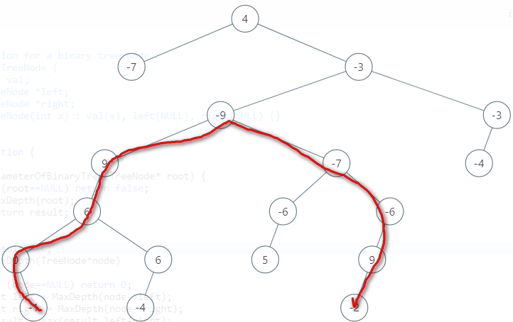

```cpp
struct TreeNode{
    int val;
    TreeNode*left;
    TreeNode*right;
    TreeeNode(int x):val(x),left(NULL),right(NULL){}
};
class Solution{
public:
    int diameterOfBinaryTree(TreeNode*root)
    {
        if(root==NULL)
            return 0;
        MaxDepth(root);
        return result;
    }
private:
    int result = 0;
    //计算当前节点为根节点时的最大深度
    int MaxDepth(TreeNode*node)
    {
        if(node==NULL)
            return 0;
        int left = MaxDepth(node->left);
        int right = MaxDepth(node->right);
        result = max(result,left+right);
        return max(left,right)+1; //+1 指以root->left为根节点的最大深度+该节点到当前root的深度1
    }
};
```

#### [二叉树中的最大路径和](https://leetcode-cn.com/problems/binary-tree-maximum-path-sum/)

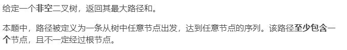

类比[二叉树直径]([二叉树的直径](https://leetcode-cn.com/problems/diameter-of-binary-tree/))，二叉树直径是对**每一个节点**求左子树和右子树深度之和，然后取其中最大的值。而本体思想相同，对每一个节点求左右子树节点和的最大值，取最大。（相当于权重步数1，而是各个节点值）

对于每一个节点都有三种情况

- `root->val+left`
- `root->val+right`
- `root->val`

在计算`left和right`时要考虑左右子树路径和是否小于0，如果小于0，那就不考试该子树。

```cpp
class Solution {
    int res = INT_MIN;
public:
    int maxPathSum(TreeNode* root) {
        if(root==NULL) return 0;
        dfs(root);
        return res;
    }
    int dfs(TreeNode*root)
    {
        if(root==NULL) return 0;
        int left = max(dfs(root->left),0);    //如果左子树之和小于0，那就不考虑左子树
        int right = max(dfs(root->right),0);  //如果右子树之和小于0，那就不考虑右子树
        res = max(res,left+right+root->val);
        return max(left,right)+root->val; 
    }
};
```


#### [翻转二叉树](https://leetcode-cn.com/problems/invert-binary-tree/submissions/)

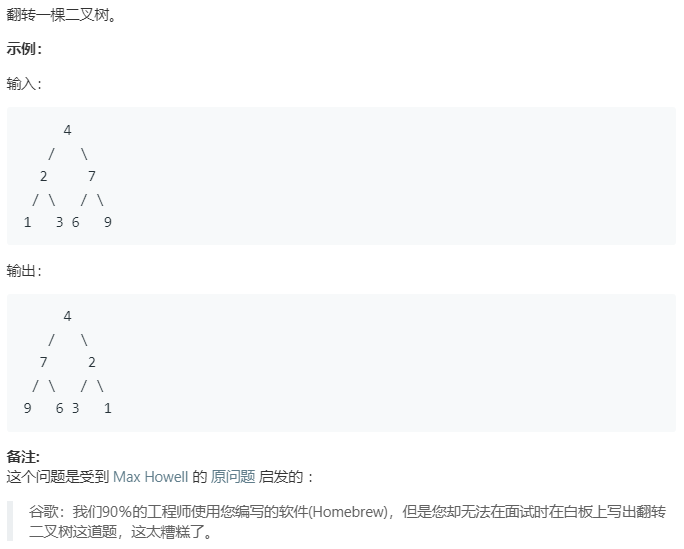

用递归的方法可以很简单的解决。

```cpp
struct TreeNode{
    int val;
    TreeNode*left;
    TreeNode*right;
    TreeeNode(int x):val(x),left(NULL),right(NULL){}
};
class Solution {
public:
    //返回反转后二叉树的根节点
    TreeNode* invertTree(TreeNode* root) {
        if(root==NULL)
        {
            return NULL;
        }
        TreeNode *temp = root->left;
        root->left = invertTree(root->right);
        root->right = invertTree(temp);
        return root;
    }
};
```

也可以使用迭代的方法来实现，这里采用前序遍历的方式来进行。

```cpp
class Solution {
public:
    //返回反转后二叉树的根节点
    TreeNode* invertTree(TreeNode* root) {
        if(root==NULL)
        {
            return NULL;
        }
        stack<TreeNode*>s;
        s.push(root);
        while(!s.empty())
        {
            TreeNode*cur = s.top();
            s.pop();
            TreeNode*temp = cur->left;
            cur->left = cur->right;
            cur->right = temp;
            if(cur->right) s.push(cur->right);
            if(cur->left) s.push(cur->left);
            cur=NULL;
        	temp=NULL;	
        }
        return root;
    }
};
```


#### [合并而二叉树](https://leetcode-cn.com/problems/merge-two-binary-trees/)

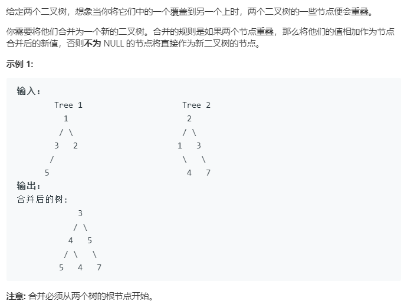

```cpp
class Solution {
public:
    TreeNode* mergeTrees(TreeNode* t1, TreeNode* t2) {
        if(t1==NULL) return t2;
        if(t2==NULL) return t1;
        t1->val+=t2->val;
        t1->left = mergeTrees(t1->left,t2->left);
        t1->right = mergeTrees(t1->right,t2->right);
        return t1;
    }
};
```

#### [二叉树的所有路径](https://leetcode-cn.com/problems/binary-tree-paths/)

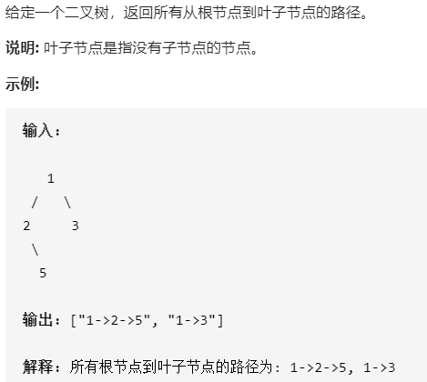

```cpp
class Solution {
public:
    vector<string> binaryTreePaths(TreeNode* root) {
        vector<string> res;
        string s;
        dfs(root,res,"");
        return res;

    }
    private:
    void dfs(TreeNode *root, vector<string> &res, string path)
    {
        if(root==NULL) return;
        path += to_string(root->val);
        if(root->left==NULL&& root->right==NULL) 
        {
            res.push_back(path);
        }
        else
        {
            path+="->";
            dfs(root->left,res,path);
            dfs(root->right,res,path);
        }
    }
};
```


#### [路径总和](https://leetcode-cn.com/problems/path-sum/)

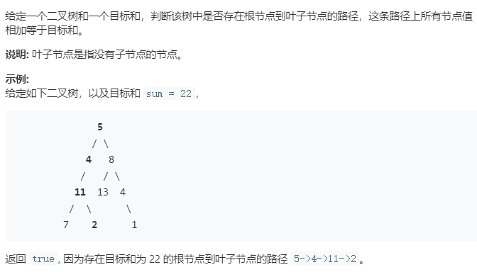

题目要求的是根节点到叶子节点的路径，所以再遍历的时候一定要遍历到底部。

**递归方法**

```cpp
class Solution {
public:
    bool hasPathSum(TreeNode* root, int sum) {
        if(root == NULL) return false;
        if(root->left == NULL&&root->right==NULL&&root->val == sum) 
        {
            return true;
        }
        return hasPathSum(root->left,sum-root->val)
            ||hasPathSum(root->right,sum-root->val);
    }
};
```

**迭代方法**，由于计算根节点到叶子节点的路径和，所以采用后续遍历更方便实施。

```cpp
class Solution {
public:
    bool hasPathSum(TreeNode* root, int sum) {
        if(root==NULL) return false;
        stack<TreeNode*> s;
        TreeNode*cur = root;
        TreeNode*pre = NULL;  //记录遍历过的前一节点
        int curSum = 0;
        while(cur||!s.empty())
        {
            while(cur)
            {
                s.push(cur);
                curSum += cur->val;
                cur=cur->left;
            }
            cur = s.top();
            if(curSum==sum&&cur->right == NULL&&cur->left==NULL)
            {
                return true;
            }
            if(cur->right==NULL||cur->right==pre)
            {
                s.pop();
                curSum -= cur->val;
                pre = cur;
                cur = NULL;
            }
            else
            {
                cur = cur->right;
            }
        }
        return false;
    }
};
```

#### [路径总和 II](https://leetcode-cn.com/problems/path-sum-ii/)

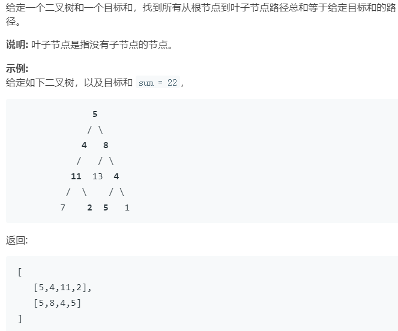

```cpp
class Solution {
public:
    vector<vector<int>> pathSum(TreeNode* root, int sum) {
        vector<vector<int>>res;
        vector<int> path;
        dfs(root,sum,path,res);
        return res;
    }
    void dfs(TreeNode*root,int cursum,vector<int>&path,vector<vector<int>>&res)
    {
        if(root==NULL) return;
        path.push_back(root->val);
        if(cursum==root->val&&root->left==NULL&&root->right==NULL)
        {
            res.push_back(path);
        }
        dfs(root->left,cursum-root->val,path,res);
        dfs(root->right,cursum-root->val,path,res);
        //回溯
        path.pop_back();
    }
};
```

#### [ 路径总和 III](https://leetcode-cn.com/problems/path-sum-iii/)

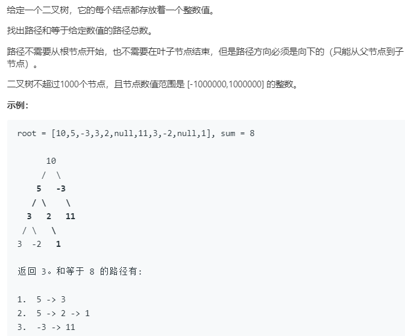

题目要求的路径总合并不限制从根节点开始，到叶子节点结束。所以最容易想到的方法就是计算以每一个节点为根节点是的路径和，记录满足要求的个数。

```cpp
class Solution {
public:
    int pathSum(TreeNode* root, int sum) {
        if(root == NULL) return 0;
        //以root根节点为起点的满足条件的路径数
        int res = helper(root,sum);
        if(root->left)
        {
            res +=pathSum(root->left,sum);
        }
        if(root->right)
        {
            res += pathSum(root->right,sum); 
        }
        return res;
    }
private:
    //返回以node为根节点的满足路径和为sum的路径数
    int helper(TreeNode*node,int sum)
    {
        if(node==NULL) return 0;
        int res = 0;
        if(node->val==sum) res++;
        res += helper(node->left,sum-node->val)+helper(node->right,sum-node->val);
        return res;
    }
    
};
```

前一种方法有太多的重复运算，效率不够高。

下面这种方法采用前n项和的方法结合哈希表存储遍历的前N个节点的和（curSum），通过再哈希表中查找curSum-Sum,来确定是否存在满足条件的路径。（前缀和+哈希表）

```
     10
     /  \
    5   -3
   / \    \
  3   2   11
 / \   \
3  -2   1
例如遍历最二叉树最左边的路径 sum = 8
map{{0,1},
	{10,1},
	{15,1},
	{18,1}，   //当累加到3时发现哈希表中存在18-8，所以又满足条件的路径。
	}
```

```cpp
class Solution {
public:
    public:
    int pathSum(TreeNode* root, int sum) {
        if(!root) return 0;
        unordered_map<int, int> mp;
        mp[0] = 1;
        search(root, sum, 0, mp);
        return res;
    }
    int res = 0;
    void search(TreeNode* node, int target, int curSum, unordered_map<int, int>& mp){
        if(!node) return;
        curSum+=node->val;
        if(mp.find(curSum-target)!=mp.end())
            res+=mp[curSum-target];
        mp[curSum]++;
        search(node->left,target,curSum,mp);
        search(node->right,target,curSum,mp);
        mp[curSum]--;
    }
};
```

#### [另一个树的子树](https://leetcode-cn.com/problems/subtree-of-another-tree/)

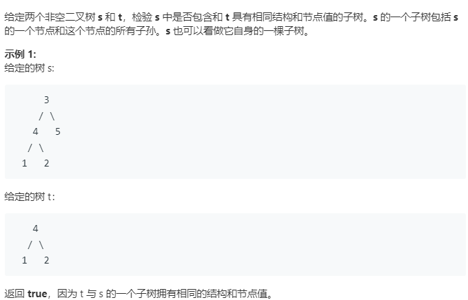

和 [ 路径总和 III](https://leetcode-cn.com/problems/path-sum-iii/) 一样也是要运行双递归

s是t的子树可以分为以下三种情况

- t等于s本身
- t是s左子树的子树
- t是s右子树的子树

判断两个树(a,b)相同也就是判断

- a的根节点和b的根节点值相同
- a的右子节点和b的右子节点相同
- a的左子节点和b的左子节点相同

```cpp
class Solution {
public:
    bool isSubtree(TreeNode* s, TreeNode* t) {
        if(s==NULL) return false;
        return isEqual(s,t)||isSubtree(s->left,t)||isSubtree(s->right,t);
    }
private:
    bool isEqual(TreeNode* s,TreeNode* t)
    {
        if(s==NULL&&t==NULL) return true;
        if(s==NULL||t==NULL) return false;
        if(s->val!=t->val) return false;
        return isEqual(s->left,t->left)&&isEqual(s->right,t->right);
    }
};
```

#### [对称二叉树](https://leetcode-cn.com/problems/symmetric-tree/)

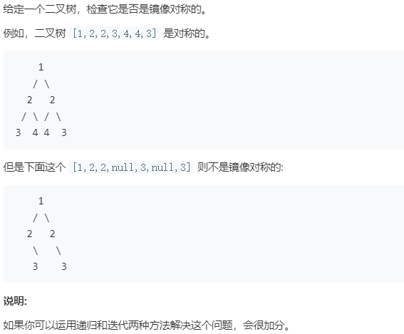

判断是否是镜像对称，相当于判断左右两个子树是否“相等”，这里的相等并不是对应相等，而是镜像位置对应相等，也就是（左子树等于右子树）

**递归法**

```cpp
class Solution {
public:
    bool isSymmetric(TreeNode* root) {
        if(root==NULL) return true;
        return isSymmetricEqual(root->left,root->right);
    }
private:
    bool isSymmetricEqual(TreeNode*t1,TreeNode*t2)
    {
        if(t1==NULL&&t2==NULL) return true;   //递归终止还没出现false 自然是true。
        if(t1==NULL||t2==NULL) return false;
        if(t1->val!=t2->val) return false;
        return isSymmetricEqual(t1->right,t2->left)&&isSymmetricEqual(t1->left,t2->right);
    }
};

```

**迭代法**

参考中序遍历的迭代算法。

```cpp
class Solution {
public:
    bool isSymmetric(TreeNode* root) {
        if(!root) return true;
        stack<TreeNode*> left,right;
        auto l = root->left;
        auto r = root->right;
        while(l||r||!left.empty()||!right.empty())
        {
            while(l&&r)
            {
                left.push(l), l=l->left;
                right.push(r),  r = r->right;
            }
            if(l||r) return false;
            l = left.top(),left.pop();
            r = right.top(),right.pop();
            if(l->val!=r->val) return false;
            l = l->right;
            r = r->left;
        }
        return true;
    }
};
```

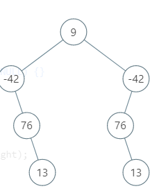

#### [ 二叉树的最小深度](https://leetcode-cn.com/problems/minimum-depth-of-binary-tree/)

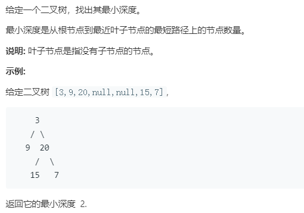

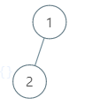

注意上面这种情况，最小深度为2.

```cpp
class Solution {
public:
    int minDepth(TreeNode* root) {
        if(root==NULL) return 0;
        int left = minDepth(root->left);
        int right = minDepth(root->right);
        if(left==NULL||right==NULL)    //考虑独生子的情况
        {
            return left+right+1;
        }
        return min(left,right)+1;
    }
};
```

#### [左叶子之和](https://leetcode-cn.com/problems/sum-of-left-leaves/)

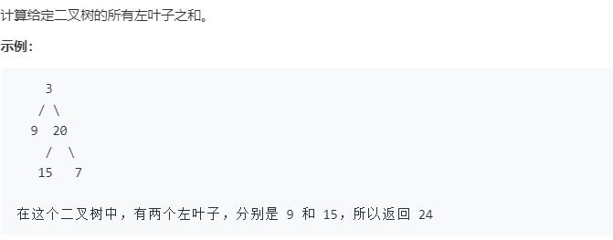

都先需要判断是否为叶子节点，这个很重要。

```cpp
class Solution {
public:
    int sumOfLeftLeaves(TreeNode* root) {
        if(root==NULL) return 0;
        if(isLeaf(root->left))
        {
            /*如果当前节点的左子树是叶子节点，就将该叶子节点+右子树中可能存在的左叶子节点
            例如
                2
               / \
              1   5
             / \
            2   3 
               / \
              1   6
              */    
            return root->left->val+sumOfLeftLeaves(root->right);
        }
        //返回左子树和右子树中的左叶子节点和
        return sumOfLeftLeaves(root->left)+sumOfLeftLeaves(root->right);
    }
private:
    bool isLeaf(TreeNode* node)
    {
        if(node==NULL) return false;
        return node->left==NULL&&node->right==NULL;
    }
};
```

#### [ 最长同值路径](https://leetcode-cn.com/problems/longest-univalue-path/)

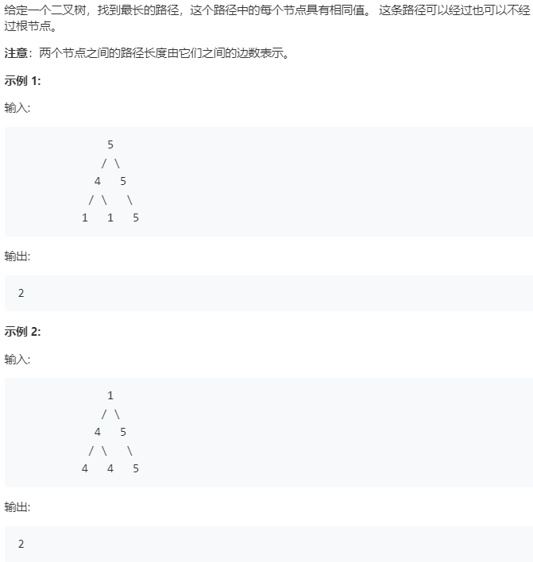

注意题中要求路径上每一个节点的值相同。（类比[二叉树的直径](https://leetcode-cn.com/problems/diameter-of-binary-tree/))

```cpp
class Solution {
public:
    int longestUnivaluePath(TreeNode* root) {
        if(root==NULL)
            return 0;
        int res = 0;
        getPath(root,res);
        return res;
    }
private:
    int getPath(TreeNode* node,int&res)
    {
        if(node==NULL) return 0;
        int left = getPath(node->left,res);
        int right = getPath(node->right,res);
        int leftPath = (node->left&&node->left->val==node->val)? left+1:0;
        int rightPath = (node->right&&node->right->val==node->val)?right+1:0;
        res = max(res,leftPath+rightPath);
        return max(leftPath,rightPath);
    }
};
```

#### [打家劫舍 III（二叉树的动态规划）](https://leetcode-cn.com/problems/house-robber-iii/)

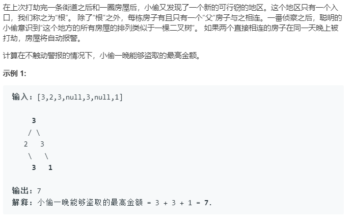

**递归暴力求解** 

提交超时了（为什么Java不会超时？）

```cpp
class Solution {
public:
    int rob(TreeNode* root) {
        if(root==NULL) return 0;
        //res1 当下选择偷，则子节点不能偷
        //res2 当下不偷，可以偷子节点
        int res1 = root->val;
        if(root->left)
        {
            res1 +=rob(root->left->left)+rob(root->left->right);
        }
        if(root->right)
        {
            res1 += rob(root->right->left)+rob(root->right->right);            
        }
        int res2 = rob(root->left)+rob(root->right);
        return max(res1,res2);  
    }
};
```

该问题可以考虑为一个动态规划问题，由于暴力求解有很多重复性计算，通常是用备忘录和动态规划的方法来解决该问题。

**备忘录**

通过记录每一次计算的结果，将其保存再一个容器中，当再次需要使用该结果时直接提取出来。避免了很多重复计算。

```cpp
class Solution {
public:
    int rob(TreeNode* root) {
        if(root==NULL) return 0;
        return tryRob(root);
    }
private:
    //记录中间结果
    unordered_map<TreeNode *, int> sums;
    int tryRob(TreeNode*root)
    {
        if(root==NULL) return 0;
        //如果计算过该结果，直接提取出来
        if(sum.count(root))
        {
            return sums[root];	
        }
        //偷当前节点
        int res1 = root->val;
        if(root->left)
        {
            res1 += tryRob(root->left->left)+tryRob(root->left->right);
        }
        if(root->right)
        {
            res1 += tryRob(root->right->left)+tryRob(root->right->right);            
        }
        //不偷当前节点，则子节点可偷
        int res2 = tryRob(root->left)+tryRob(root->right);
        //记录当前最佳偷取方案结果到哈希表中
        sum[root] = max(res1,res2);
        return sum[root];
    }
};
```

**动规划法**

当前节点的偷的最佳方案只和其子节点的方案有关。子节点的最佳方案为**子节点本身偷或不偷的最大值**。符合动态规划的思想。

```cpp
class Solution {
public:
    int rob(TreeNode* root) {
        if(root==NULL) return 0;
        pair<int,int> res = dp(root);
        return max(res.first,res.second);
    }
private:
   pair<int,int>dp(TreeNode*root)
   {
       if(root==NULL) return {0,0};
       //pair<rob,no_rob>
       //子节点的偷取方案，包括子节点偷或不偷的情况
       pair<int,int> left = dp(root->left);
       pair<int,int> right = dp(root->right);
       //当前偷，子节点不偷
       int rob = root->val+left.second+right.second;
       //当前不偷，子节点可偷，所以现在左右子节点的最佳方案。
       int no_rob = max(left.first,left.second)+max(right.first,right.second);
       return make_pair(rob,no_rob);
   }
};
```

#### [二叉树中第二小的节点](https://leetcode-cn.com/problems/second-minimum-node-in-a-binary-tree/)

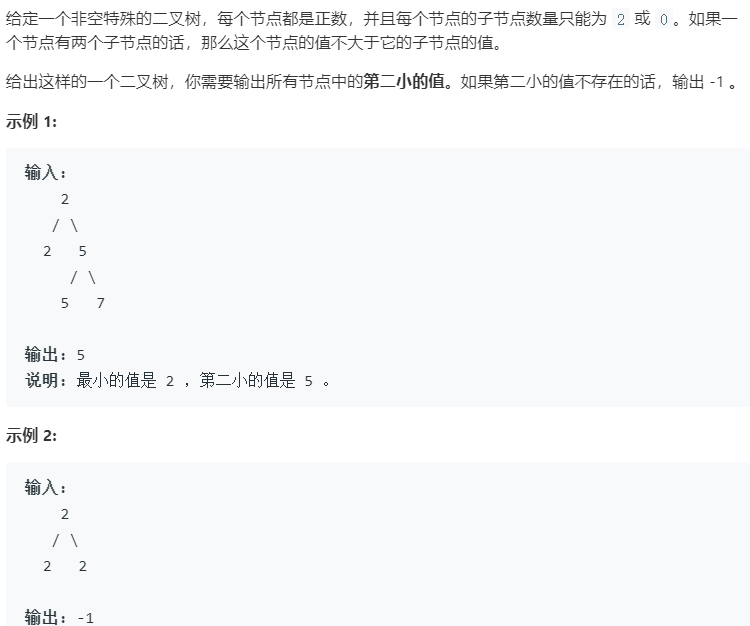

由题意可知

- 根节点小于等于子节点。
- 当没有子节点或者根节点和左右子节点相同，返回-1；
- 当根节点不存在，返回-1；


```cpp
class Solution {
public:
    int findSecondMinimumValue(TreeNode* root){
        if(root==NULL) return -1;
        if(root->left==NULL&&root->right==NULL) return -1;
        int left = root->left->val;
        int right = root->right->val;
        //如果当前左子节点和根节点相等则搜寻以左子节点为根节点的倒数第二小的。
        if(root->val==left)
        {
            left = findSecondMinimumValue(root->left);
        }
        if(root->val==right)
        {
            right = findSecondMinimumValue(root->right);
        }
        //如果左右子节点都有子节点，则取左右最小的
        if(left!=-1&&right!=-1)
        {
            return min(left,right);
        }
        //如果左子树有倒数第二小，右子树没有，则返回左子树结果
        if(left!=-1)
        {
            return left;
        }
        return right;
    }
};
```

#### [将满二叉树转换为求和树](https://www.nowcoder.com/practice/b31734e46ba644de85a9cf95bbd57a5f)

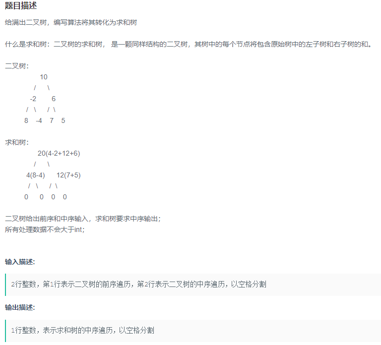

分析满二叉树的特点，不用取构建二叉树。

```cpp
#include <iostream>
#include <vector>
#include<algorithm>
#include<numeric>
using namespace std;
void subTree(vector<int>&inorder,int left,int right)
{
    int mid = left+(right-left)/2;
    if(left==mid)
    {
        inorder[mid] = 0;
        return;
    }
    //这个函数很不错呦
    //注意right+1，
    inorder[mid] = accumulate(inorder.begin()+left,inorder.begin()+right+1,-inorder[mid]);
    subTree(inorder,left,mid-1);
    subTree(inorder,mid+1,right);
}
int main()
{
    vector<int> nums;
    vector<int> preorder;
    vector<int> inorder;
    int temp;
    while (cin >> temp)
    {
        nums.push_back(temp);
    }
    int len = nums.size() / 2;
    int i = 0;
    while (i < len)
    {
        preorder.push_back(nums[i]);
        inorder.push_back(nums[i + len]);
        i++;
    }
    subTree(inorder, 0, inorder.size() - 1);
    for(auto i:inorder)
    {
        cout << i << ' ';
    }
    return 0;
}

```


### 层次遍历

#### [二叉树的层平均值](https://leetcode-cn.com/problems/average-of-levels-in-binary-tree/)

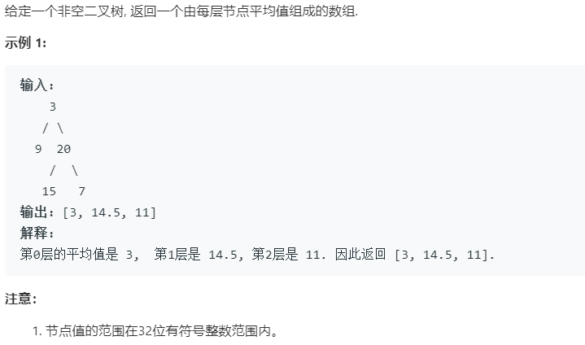

将前面宽度优先搜索略作修改就可以得到

```cpp
class Solution {
public:
    vector<double> averageOfLevels(TreeNode* root) {
        queue<TreeNode*> q;
        vector<double> ans;
        double res = 0;
        if(root==NULL) return ans;
        q.push(root);
        while(!q.empty())
        {
            int len = q.size();
            //每一层进行计算
            for(int i=0;i<len;i++)
            {
                TreeNode*temp = q.front();
                q.pop();
                res += temp->val;
                if(temp->left)
                {
                    q.push(temp->left);
                }
                if(temp->right)
                {
                    q.push(temp->right);
                }
            }
            ans.push_back(res/len);
            res= 0;
        }
        return ans;
    }
};
```

#### [找树左下角的值](https://leetcode-cn.com/problems/find-bottom-left-tree-value/)

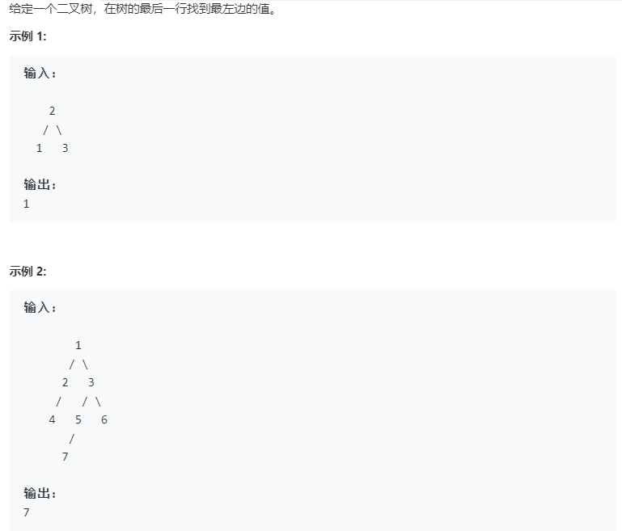

层次遍历，保存每一层的最左节点

```cpp
class Solution {
public:
    int findBottomLeftValue(TreeNode* root) {
        queue<TreeNode*> q;
        int res = 0;
        if(root==NULL) return 0;
        q.push(root);
        while(!q.empty())
        {
            int len = q.size();
            res = q.front()->val;
            //每一层进行计算
            while(len--)
            {
                TreeNode*temp = q.front();
                q.pop();
                //这里要先处理左边的节点，根据queue的先进先出，先将左子节点压入队列
                if(temp->left)
                {
                    q.push(temp->left);
                }
                if(temp->right)
                {
                    q.push(temp->right);
                }
            }
        }
        return res;
    }
};
```

### 二叉搜索树(BST)

#### [98. 验证二叉搜索树](https://leetcode-cn.com/problems/validate-binary-search-tree/)

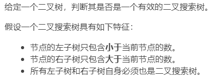

有个误区，BST的特点在于左子树上**所有的数**都要小于根节点，右子树上**所有  树**都要大于根节点。而不仅仅是左子节点小于根节点，右子节点大于根节点。

所以，左子树中所有节点都要在$(-\infty,x)$ ,右子树所有节点都要在$(x,+\infty)$

```cpp
class Solution {
public:
    bool isValidBST(TreeNode* root) {
        return  dfs(root,LONG_MIN,LONG_MAX);
    }
    bool dfs(TreeNode*root,long long minv,long long maxv)
    {
        if(root==NULL) return true;
        if(root->val<=minv||root->val>=maxv) return false;
        return dfs(root->left,minv,root->val)&&dfs(root->right,root->val,maxv);
    }
};
```

**中序遍历法**

```cpp
//定义最小值
long pre = LONG_MIN;
bool isValidBST(TreeNode* root)
{
    if(root==NULL) return true;
    //递归遍历左子树
    if(!isValidBST(root->left)) return false;
    if(root->val<=pre) return fasle;
    pre = root->val;
    return isValidBST(root->right);
} 
```


#### [修剪二叉搜索树](https://leetcode-cn.com/problems/trim-a-binary-search-tree/)

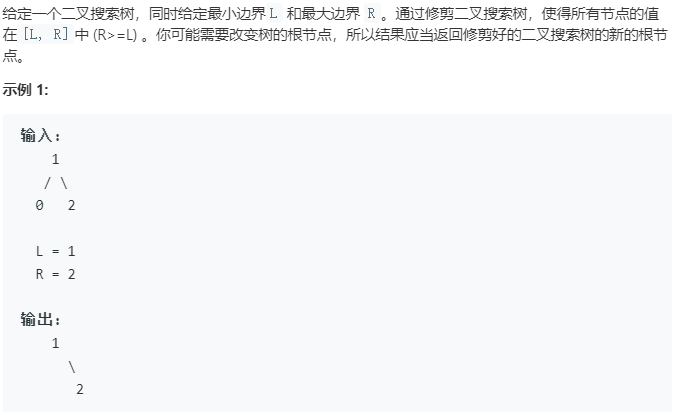

给定的是一个二叉搜索树，注意二叉搜索树的性质

- 根节点值大于或等于其左子树任意节点的值。
- 根节点值小于或等于右子树任意节点的值
- 以上两个性质在二叉搜索树中的**每一个节点均满足**

根据二叉树的性质可以进行修建。

-  当根节点的值大于R，则右子树所有节点值均大于R。
- 当根节点的值小于L，则左子树所有节点值均小于L。

```cpp
class Solution {
public:
    TreeNode* trimBST(TreeNode* root, int L, int R) {
        if(root==NULL) return root;
        //如果根节点值大于R，右子树值均大于R，不满足条件，修剪掉
        //所以在左子树查找
        if(root->val>R)  
        {
            return trimBST(root->left,L,R);
        }
        //如果根节点的值小于L，左子树所有值都小于L，不满足条件，修剪掉
        //所以在其右子树中查找
        if(root->val<L)
        {
            return trimBST(root->right,L,R);
        }
        root->left = trimBST(root->left,L,R);
        root->right = trimBST(root->right,L,R);
        return root;
    }
};
```

#### [二叉搜索树中第K小的元素](https://leetcode-cn.com/problems/kth-smallest-element-in-a-bst/)


**中序遍历法**

根据**二叉搜索树中序遍历为升序序列**的特点，可以利用中序遍历的方法来实现该题，并通过k值进行二叉树的修剪，当满足k后直接返回不再进行查找。

**迭代**

```cpp
class Solution {
public:
    int kthSmallest(TreeNode* root, int k) {
        stack<TreeNode*> s;
        int cnt=0;
        int res;
        TreeNode*temp = root;
        while(temp||!s.empty())
        {
            while(temp)
            {
                s.push(temp);
                temp=temp->left;
            }
            temp = s.top();
            s.pop();
            cnt++;
            if(cnt==k)
            {
                res = temp->val;
                break;
            }
            temp = temp->right;
        }
        return res;
    }
};
```

**递归**

```cpp
class Solution {
public:
    int kthSmallest(TreeNode* root, int k) {
        inorderTraversal(root,k);
        return res;
    }
private:
    int res;
    int count = 0;
    void inorderTraversal(TreeNode*node,int k)
    {
        if(node==NULL) return ;
        inorderTraversal(node->left,k);
        count++;
        if(k==count)
        {
            res = node->val;
        }
         inorderTraversal(node->right,k);
    }
};
```

**通用解法**

**思想很不错，但是并不通用，对于二叉搜索树可以，对其他的二叉树不一定，原图的测试示例全是二叉搜索树，所以能通过。**

如果不利用二叉搜索树中序遍历为升序序列的性质，采用二分法来实现。

**步骤如下**

我们只需要先计算左子树的节点个数，记为 `n`，然后有三种情况。

- `n` 加 `1` 等于 `k`，那就说明当前根节点就是我们要找的。

- `n`加 `1` 小于 `k`，那就说明第 `k` 小的数一定在右子树中，我们只需要递归的在右子树中寻找第 `k - n - 1` 小的数即可。

- `n` 加 `1` 大于 `k`，那就说明第 `k` 小个数一定在左子树中，我们只需要递归的在左子树中寻找第 `k` 小的数即可。

重复元素时好像不对，会自动将重复元素滤掉。

```cpp
class Solution {
public:
    int kthSmallest(TreeNode* root, int k) {
        int n = nodeCount(root->left);
      
        if(n+1==k)
        {
            return root->val;
        }
        else if(n+1<k)
        {
            res = kthSmallest(root->right, k - n - 1);
        }
         else if(n+1>k)
        {
            res = kthSmallest(root->left, k);
        }
        return res;
    }
private:
     int res;
    int nodeCount(TreeNode*root)
    {
        if(root==NULL) return 0;
        return nodeCount(root->left)+nodeCount(root->right)+1;
    }
};
```

#### [把二叉搜索树转换为累加树](https://leetcode-cn.com/problems/convert-bst-to-greater-tree/)

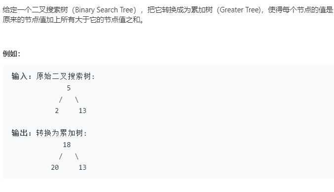

根据二叉搜索树的特性，从右子树开始遍历，逐渐对节点进行累加，在遍历左子树，进行累加。

基于中序遍历，先便利左子树，处理，再遍历右子树。本题先遍历右子树，累加 替换，再遍历左子树。所以本题只需要对中序遍历略作修改即可。

整体来讲，根节点（root）累加后，将所有右子树节点值的和加到root->val，毕竟右子树所有值都比根节点大。

**递归法**

```cpp
class Solution {
public:
    int num=0;
    TreeNode* convertBST(TreeNode* root) {
        if(root)
        {
            //遍历右子树
            convertBST(root->right);
            //回溯累加(从底部向上累加)
            root->val+=num;
            num=root->val;
            //遍历左子树,从上往下累加
            convertBST(root->left); 
            return root;
        }
        return NULL;
    }
};
```

**迭代法**

```cpp
class Solution{
public:
    TreeNode*convertBST(TreeNode*root)
    {
        if(root==NULL) return root;
        int sum=0;
        stack<TreeNode*>s;
        TreeNode*cur = root;
        while(cur||!s.empty())
        {
            //遍历右子树，到叶子节点
            while(cur)
            {
                s.push(cur);
                cur=cur->right;
            }
            cur = s.top();
            s.pop();
            //累加
            sum += cur->val;
            cur->val = sum;
            cur = cur->left;
        }
        return root;
    }
};
```

#### [ 二叉搜索树的最近公共祖先](https://leetcode-cn.com/problems/lowest-common-ancestor-of-a-binary-search-tree/)

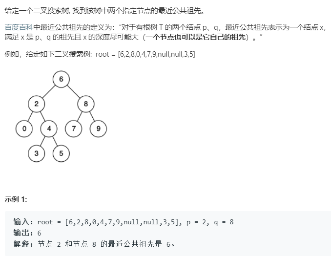

对于搜索二叉树，如果p、q节点的值都大于或小于根节点，则二者在同一子树上。否则，二者属于不同子树，根节点即为最近公共祖先

```cpp
class Solution {
public:
    TreeNode* lowestCommonAncestor(TreeNode* root, TreeNode* p, TreeNode* q) {
        if(root==NULL) return root;
        if(root->val>p->val&&root->val>q->val)
        {
            return lowestCommonAncestor(root->left,p,q);
        }
        if(root->val<p->val&&root->val<q->val)
        {
            return lowestCommonAncestor(root->right,p,q);
        }
        return root;
        
    }
};
```

**迭代法**

```cpp
class Solution {
public:
    TreeNode* lowestCommonAncestor(TreeNode* root, TreeNode* p, TreeNode* q) {
        if(root==NULL) return root;
        while(root)
        {
            if(root->val>p->val&&root->val>q->val)
            {
                root = root->left;
            }
            else if(root->val<p->val&&root->val<q->val)
            {
                root = root->right;
            }
            else
            {
                return root;
            }
        }
        return NULL;
    }
};
```

#### [二叉树的最近公共祖先](https://leetcode-cn.com/problems/lowest-common-ancestor-of-a-binary-tree/)

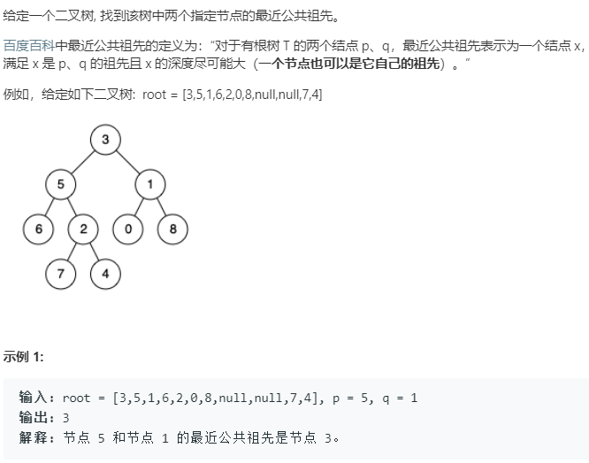

二叉树公共祖先的通用解法，不依赖于二叉树的特性

- 在左右子树寻找目标节点（p或者q），如果有返回该节点。
- 如果在左右子树中均找到了目标节点，则根节点即最近公共祖先。否则就在其中一个子树上。递归寻找就得了。

```cpp
class Solution {
public:
    TreeNode* lowestCommonAncestor(TreeNode* root, TreeNode* p, TreeNode* q) {
        if (!root || root == p || root == q) {
            return root;
        }
        TreeNode *left = lowestCommonAncestor(root->left, p, q);
        TreeNode *right = lowestCommonAncestor(root->right, p, q);
        if (left && right) return root;   //在左右两侧
        return left ? left : right;
    }
};
```


#### [将有序数组转换为二叉搜索树](https://leetcode-cn.com/problems/convert-sorted-array-to-binary-search-tree/)

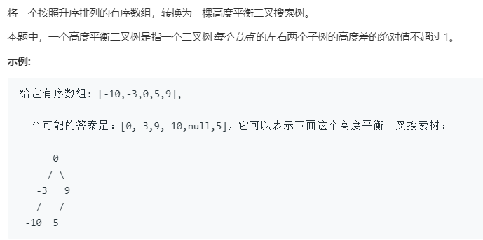

根据中序遍历还原一颗树，又想到了 105 题 和 106 题，通过中序遍历加前序遍历或者中序遍历加后序遍历来还原一棵树。前序（后序）遍历的作用呢？提供根节点！然后根据根节点，就可以递归的生成左右子树。

这里的话怎么知道根节点呢？平衡二叉树，既然要做到平衡，我们只要把根节点选为数组的中点即可。

综上，和之前一样，找到了根节点，然后把数组一分为二，进入递归即可。注意这里的边界情况，包括左边界，不包括右边界。

```cpp
class Solution {
public:
    TreeNode* sortedArrayToBST(vector<int>& nums) {
        if(nums.size()==0) return NULL;
        return helper(nums,0,nums.size());
        
    }
private:
    TreeNode* helper(vector<int>&nums,int start,int end)
    {
        if(start==end) return NULL;
        int mid = (start+end)>>1;
        TreeNode*root = new TreeNode(nums[mid]);
        //注意边界条件，右边界是取不到的。
        root->left = helper(nums,start,mid);
        root->right = helper(nums,mid+1,end);
        return root;
    }
};
```

#### [有序链表转换二叉搜索树](https://leetcode-cn.com/problems/convert-sorted-list-to-binary-search-tree/)

和前一题思想一样，不同之处仅仅是将对数组的分割换成了对链表的分割。同样注意边界条件

```cpp
class Solution {
public:
    TreeNode* sortedListToBST(ListNode* head) {
        if(head==NULL) return NULL;
        if(head->next==NULL) return new TreeNode(head->val);
        ListNode*premid=findPreMid(head);
        ListNode*right = premid->next->next;
        TreeNode*root = new TreeNode(premid->next->val);
        //断开链表，分割
        //1->2->3>4>5
        //1->2->NULL|3|4->5->NULL
        premid->next = NULL;
        root->left = sortedListToBST(head);
        root->right = sortedListToBST(right);
        return root;
    
    }
private:
    //找链表中点的前一节点，便于后面对链表的分割。
    ListNode*findPreMid(ListNode* head)
    {
        ListNode *slow=head, *fast=head;
        ListNode *pre;
        while (fast && fast->next) {
            pre = slow;
            slow = slow->next;
            fast = fast->next->next;
        }
        return pre;
    }
};
```

#### [两数之和 IV - 输入 BST](https://leetcode-cn.com/problems/two-sum-iv-input-is-a-bst/)

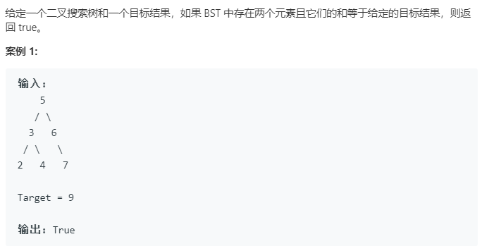

先进行中序遍历，得到有序数组，再用双指针的方法进行查找。

```cpp
class Solution {
public:
    bool findTarget(TreeNode* root, int k) {
        if(root==NULL) return false;
        inorderTraversal(root);
        int left = 0;
        int right = nums.size()-1;
        while(left<right)
        {
            int sum = nums[left]+nums[right];
            if(sum==k)
            {
                return true;
            }
            
            if(sum>k)
            {
                right--;
            }
            if(sum<k)
            {
                left++;
            }
        }
        return false;
    }
private:
    vector<int> nums;
    //中序遍历
    void inorderTraversal(TreeNode*root)
    {
        if(root==NULL) return;
        inorderTraversal(root->left);
        nums.push_back(root->val);
        inorderTraversal(root->right);
    }
    
};
```

#### [二叉搜索树的最小绝对差](https://leetcode-cn.com/problems/minimum-absolute-difference-in-bst/)


中序遍历的同时进行差值计算。

```cpp
class Solution {
public:
    int getMinimumDifference(TreeNode* root) {
        inorderTraversal(root);
        return res;
    }
private:
    TreeNode* pre = NULL;
    int res = INT_MAX;
    void inorderTraversal(TreeNode*root)
    {
        if(root==NULL) return;
        inorderTraversal(root->left);
        if(pre!=NULL)
        {
            res = min(res,root->val-pre->val);
        }
        pre = root;
        inorderTraversal(root->right);
    }
};
```

#### [二叉搜索树中的众数](https://leetcode-cn.com/problems/find-mode-in-binary-search-tree/)

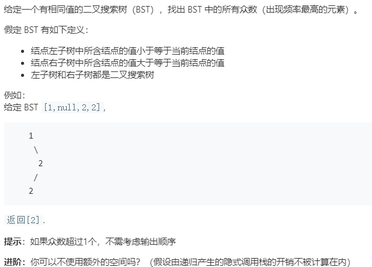

思路：二叉搜索树的中序遍历是一个升序序列，逐个比对当前结点(root)值与前驱结点（pre)值。更新当前节点值出现次数(curTimes)及最大出现次数(maxTimes)，更新规则：

- 若curTimes=maxTimes,将root->val添加到结果向量(res)中；
- 若curTimes>maxTimes,清空res,将root->val添加到res,并更新maxTimes为curTimes。

```cpp
class Solution {
public:
    vector<int> findMode(TreeNode* root) {
        vector<int>res;
        if(root==NULL) return res;
        
        int curCnt = 1;
        int maxCnt = 0;
        helper(root,curCnt,maxCnt,res);
        return res;    
    }
private:
    TreeNode*pre = NULL;
    void helper(TreeNode*root,int& curCnt,int& maxCnt,vector<int>&res)
    {
        if(root==NULL) return;
        helper(root->left,curCnt,maxCnt,res);
        if(pre)
        {
            if(root->val==pre->val)
            { 
                curCnt++;
            }
            else
            {
                curCnt = 1;
            }
        }
        if(curCnt==maxCnt)
        {
            res.push_back(root->val);
        }
        else if(curCnt>maxCnt)
        {
            res.clear();
            res.push_back(root->val);
            maxCnt = curCnt;
        }
        pre=root;
        helper(root->right,curCnt,maxCnt,res);
    }
};
```

隐式调用 pre节点，`TreeNode* &pre;`相当于定义全局TreeNode*pre

```cpp
class Solution {
public:
    vector<int> findMode(TreeNode* root) {
        vector<int>res;
        if(root==NULL) return res;
        TreeNode*pre = NULL;
        int curCnt = 1;
        int maxCnt = 0;
        helper(root,pre,curCnt,maxCnt,res);
        return res;    
    }
private:
    void helper(TreeNode*root,TreeNode*&pre,int& curCnt,int& maxCnt,vector<int>&res)
    {
        if(root==NULL) return;
        helper(root->left,pre,curCnt,maxCnt,res);
        if(pre)
        {
            if(root->val==pre->val)
            {
                curCnt++;
            }
            else
            {
                curCnt = 1;
            }
        }
        if(curCnt==maxCnt)
        {
            res.push_back(root->val);
        }
        else if(curCnt>maxCnt)
        {
            res.clear();
            res.push_back(root->val);
            maxCnt = curCnt;
        }
        pre=root;
        helper(root->right,pre,curCnt,maxCnt,res);
    }
};
```

#### 判断序列是不二叉搜索树的后序遍历

根据二叉搜索树的特点，其后续遍历的最后一个数为根节点。所以可以根据二叉搜索树的性质找到二叉搜索树的左右子树。递归的对左右子树进行判断。

例如

1，5，3，9，12，10，7

根节点为7，左子树为1，5，3，右子树为9，12，10，

```cpp
struct TreeNode{
    int val;
    TreeNode *left;
    TreeNode *right;
    TreeNode(int x):val(x),left(NULL),right(NULL){}
};
class Solution{
    public:
    bool VerifySquenceOfBST(vector<int> sequenece)
    {
        if(sequence.size()==0) return fasle;
        return help(sequence,0,sequence.size()-1);
    }
    private:
    bool help(vector<int> sequence,int start, int end)
    {
        if(end>=start) return true;
        int i = start;
        for(;i<end;i++)
        {
            if(sequence[i]>sequence[end]) break;
        }
        for(int j = i;j<end;j++)
        {
            if(sequence[j]<sequence[end]) return fasle;
        }
        return help(sequence,start,i-1)&&help(sequence,i,end-1);
    }
};
```


#### 构建二叉树

##### 给出**搜索二叉树**的后续遍历数组，构建二叉树

后续遍历的最后一个数为根节点。

```cpp
class Solution
{
    //给出搜索二叉树的后续遍历，构建二叉树
public:
    TreeNode *build(vector<int> &backOrder)
    {
        if (backOrder.size() == 0)
        {
            return NULL;
        }
        return buildTree(backOrder, 0, backOrder.size() - 1);
    }

private:
    TreeNode *buildTree(vector<int> &backOrded, int left, int right)
    {
        if (left > right)
        {
            return NULL;
        }
        TreeNode*root = new TreeNode(backOrded[right]);
        if (left == right)
        {
            return root;
        }
        int mid=0;
        for (int i = left; i < right; i++)
        {
            if (backOrded[i] < backOrded[right])
            {
                mid = i;
            }
        }
        root->left = buildTree(backOrded, left, mid);
        root->right = buildTree(backOrded, mid + 1, right-1);   // 最后一个数已经拿走了
        return root;
    }
};
```

##### [给出前序遍历和后续遍历，构建二叉树](https://leetcode-cn.com/problems/construct-binary-tree-from-preorder-and-inorder-traversal/)

`preorder:[3, 9, 20, 15, 7]`

`inorder:[9, 3, 15, 20, 7]`

关键在于划分左右子树，

二叉树的根节点为前序遍历中的第一个元素，通过中序遍历就可以知道左右子树分别有多少节点

```cpp
struct TreeNode{
    int val;
    TreeNode*left;
    TreeNode*right;
    TreeNode(int x):val(x),left(NULL),right(NULL){}
};
class Solution {
    unordered_map<int,int> hmap;
public:
    TreeNode* buildTree(vector<int>& preorder, vector<int>& inorder) {
        int n = inorder.size();
        for(int i=0;i<n;i++)
        {
            hmap[inorder[i]]=i;
        }
        return dfs(preorder,inorder,0,n-1,0,n-1);
        
    }
    TreeNode*dfs(vector<int>& preorder,vector<int>& inorder,int pl,int pr,int il,int ir)
    {
        if(pl>pr) return NULL;
        int k = hmap[preorder[pl]];
        int len = k-il;
        auto root = new TreeNode(preorder[pl]);
        root->left = dfs(preorder,inorder,pl+1,pl+len,il,k-1);
        root->right = dfs(preorder,inorder,pl+len+1,pr,il+len+1,ir);
        return root;
    }
};
```


