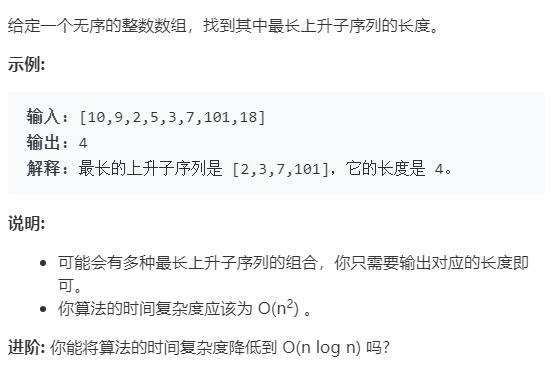
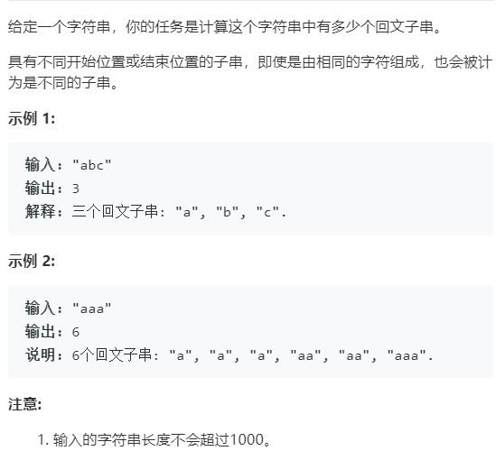
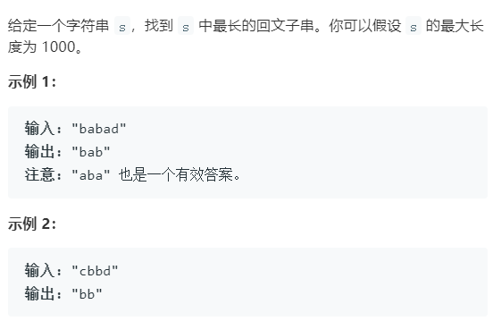
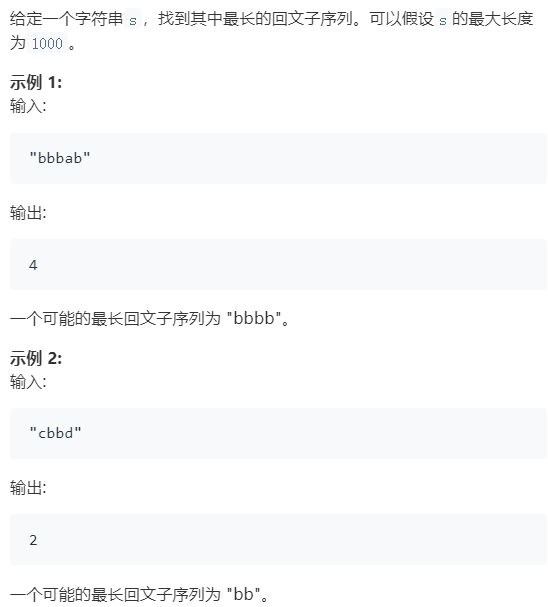
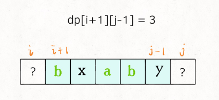
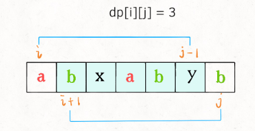
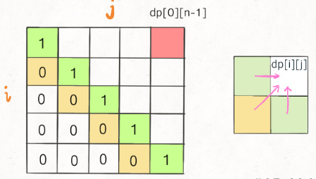
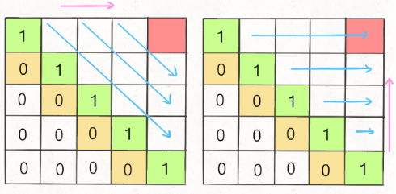

# 动态规划


## 一维动态规划

### [300. 最长上升子序列](https://leetcode-cn.com/problems/longest-increasing-subsequence/)



`dp[i]` 表示以 `nums[i] `这个数结尾的最长递增子序列的长度。转移方程为

​                                               $dp[i]= max(dp[j]+1,dp[i]),0<=j<i$

- **动态数组**

  `dp[i]` 表示以 `nums[i] `这个数结尾的最长递增子序列的长度。

- **初始化**

  根据动态数组的定义，以`nums[i]`结尾的最长递增子序列最小为其本身，所有初始化`dp[i]==1`

- **动态转移方程**

     判断是否将`nums[i]`是否大于`nums[j]`,如果大于，$dp[i]= max(dp[j]+1,dp[i]),0<=j<i$

- **转移过程**

  由于寻找的是最长上升子序列，不要求连续。所以需要双重循环，遍历以`i`结尾的所有字串，判断是否为递增  

```cpp
class Solution {
public:
    int lengthOfLIS(vector<int>& nums) {
        int res = 0;
        vector<int> dp(nums.size(),1);
        for(int i=0;i<nums.size();i++)
        {
            for(int j=0;j<i;j++)
            {
                if(nums[i]>nums[j])
                {
                    dp[i] = max(dp[j]+1,dp[i]);
                }
            }
        }
        for(int i=0;i<dp.size();i++)
        {
            res = max(res,dp[i]);
        }
        return res;
    }
};
```

最长递增子序列（Longest Increasing Subsequence，简写 LIS）是比较经典的一个问题，延申出的题目[合唱队](https://www.nowcoder.com/practice/6d9d69e3898f45169a441632b325c7b4?tpId=37&tqId=21247&tPage=2&rp=&ru=/ta/huawei&qru=/ta/huawei/question-ranking)

## 二维动态规划

### [1143. 最长公共子序列](https://leetcode-cn.com/problems/longest-common-subsequence/)

最长公共子序列（Longest Common Subsequence，简称 LCS）是一道非常经典的面试题目，因为它的解法是典型的二维动态规划，大部分比较困难的字符串问题都和这个问题一个套路，比如说编辑距离.

- **LCS问题的动态数组定义**

  `dp[i][j]表示，字符串s1[1...i]和s2[1...j]的最长公共字串长度`所求即为`dp[s1.length()][s2.length()]`

- **动态转移方程**

  要求`dp[i][j]`，需要求出其子问题`dp[i-1][j-1]`，如何从`dp[i-1][j-1]`转移到`dp[i][j]`?

  - 判断`s1[i] s2[j]`是否相等-

    - 如果`s1[i]==s2[j]`,则` dp[i][j] = dp[i-1][j-1]+1;`

    - 如果`s1[i]!=s2[j]`,则`dp[i][j] = max(dp[i-1][j],dp[i][j-1],dp[i-1][j-1])`，由于`dp[i-1][j-1]`总是小于等于`dp[i-1][j]和dp[i][j-1]`

      所以，这里为了程序简洁，`dp[i][j] = max(dp[i-1][j],dp[i][j-1])`

- **初始化**

  如下表所示，当`s1`为空或者`s2`为空，LCS结果为0.

- **转移过程**

  由于求的是`dp[s1.length()][s2.length()]`，初始值是`dp[0][j]=0，和dp[i][0]`。所以可以从1开始遍历`s1`和`s2`。

如下表所示：


```cpp
class Solution {
public:
    int longestCommonSubsequence(string text1, string text2) {
        int len1 = text1.length();
        int len2 = text2.length();
        vector<vector<int>> dp(len1+1,vector<int>(len2+1,0));
        for(int i=1;i<len1+1;i++)
        {
            for(int j=1;j<len2+1;j++)
            {
                if(text1[i-1]==text2[j-1])
                {
                    dp[i][j] = dp[i-1][j-1]+1;
                }
                else
                {
                    //dp[i-1][j-1] 永远是三者中最小的，max 根本不可能取到它。所以这里忽略了
                    dp[i][j] = max(dp[i-1][j],dp[i][j-1]);
                }
            }
        }
        return dp[len1][len2];
    }
};
```

**总结**

对于两个字符串的动态规划问题，一般来说都是像本文一样定义 DP table，因为这样定义有一个好处，就是容易写出状态转移方程，`dp[i][j]` 的状态可以通过之前的状态推导出来


### [647. 回文子串](https://leetcode-cn.com/problems/palindromic-substrings/)



**分析与最长回文子串相同**

```cpp
class Solution {
public:
    int countSubstrings(string s) {
        int len = s.length();
        if(len<2) return len;
        int res = 0;
        bool dp[len][len];
        for(int i=0;i<len;i++) dp[i][i] = true;
        for(int j=0;j<len;j++)
        {
            for(int i=0;i<=j;i++)
            {
                if(s[i]==s[j])
                {
                    if(j-1<=i+1)
                        dp[i][j] = true;
                    else
                        dp[i][j] = dp[i+1][j-1];
                }
                else
                {
                    dp[i][j] = false;
                }
                if (dp[i][j])  res++;
            }
        }
        return res;
    }
};
```


### [5. 最长回文子串](https://leetcode-cn.com/problems/longest-palindromic-substring/)



回文”是天然具有“状态转移”性质的：

**一个回文去掉两头以后，剩下的部分依然是回文（这里暂不讨论边界）。**

依然从回文串的定义展开讨论：

1、如果一个字符串的头尾两个字符都不相等，那么这个字符串一定不是回文串；

2、如果一个字符串的头尾两个字符相等，才有必要继续判断下去。

（1）如果里面的子串是回文，整体就是回文串； 

（2）如果里面的子串不是回文串，整体就不是回文串。

即在头尾字符相等的情况下，里面子串的回文性质据定了整个子串的回文性质，这就是状态转移。因此可以把“状态”定义为原字符串的一个子串是否为回文子串。

- **动态数组**

  `dp[i][j]` 表示字符串`s`在`[i,j]`区间的子串是否是一个回文串。判断所有子串是否为回文串

- **状态转移方程为**

  `dp[i][j]=(s[i]==s[j])?dp[i+1][j-1]:fasle`     

- **初始化**

  由于单个字符为回文串，所以初始化对较小元素为true。

- **转移过程**

  双指针窗口遍历所有的子串，判断字串死否满足回文要求。按照前面对于回文串的分析进行转移。

需要判断`dp[i+1][j-1]`边界，`i+1<=j-1`

```cpp
class Solution
{
public:
    string longestPalindrome(string s)
    {
        if (s.length() < 2)
            return s;
        bool dp[s.length()][s.length()];
        for(int i=0;i<s.length();i++)
        {
            dp[i][i] = true;
        }
        int start = 0;
        int len = 1;    //单个字符串
        for (int j = 1; j < s.length(); j++)
        {
            for (int i = 0; i < j; i++)
            {
                if (s[i] == s[j])
                {
                    //如果s[i+1][j-1] 不构成合理的字符串（i+1，j-1）区间
                    //即j-1<=i+1,即i+1~j-1的字符串为空 或者只有一个字符串
                    if (j-1<=i+1)
                        dp[i][j] = true;
                    else
                        dp[i][j] = dp[i + 1][j - 1];
                }
                else
                {
                    dp[i][j] = false;
                }
                if (dp[i][j])
                {
                    int curlen = j - i + 1;
                    if (curlen > len)
                    {
                        len = curlen;
                        start = i;
                    }
                }
            }
        }
        return s.substr(start, len);
    }
};

```

**方法二：中心扩展法**

```cpp
class Solution {
public:
    string longestPalindrome(string s) {
        if(s.length()<2) return s;
        int len = 0;
        int start = 0, end = 0;
        for(int i=0;i<s.length();i++)
        {
            //奇数以自身为中心
            int len1 = help(s,i,i); 
            //偶数以两个字符为中心。
            int len2 = help(s,i,i+1);
            len = max(len1,len2);
            if(len>(end-start))
            {
                start = i - (len - 1) / 2;
                end = i + len / 2;
            }
        }
        return s.substr(start, end-start+1); 
    }
private:
    int help(string s,int left,int right)
    {
        while(left>=0&&right<s.length()&&s[left]==s[right])
        {
            left--;
            right++;
        }
        return right-left-1;
    }
};
```


### [516. 最长回文子序列](https://leetcode-cn.com/problems/longest-palindromic-subsequence/)

子序列和字串的不同之处在于，**子串是连续的**，而**子序列可以不是连续的**。例如对于`s="abcd",其中ab是一个子串，ad是一个子序列` 



- **状态数组**

  `dp[i][j]表示s[i...j]中最长回文序列的长度`，所以所求即为`dp[0][s.size()-1]`

- **状态转换方程**

  要想求出`dp[i][j]` 我们需要知道只问题`dp[i+1][j-1]`如下图所示。

  

  - 如果`s[i]==s[j]`，则`dp[i][j]=dp[i+1][j-1]+2`

  - 如果`s[i]!=s[j]`，则`dp[i][j] = max(dp[i][j-1],dp[i+1][j])`

    

- **初始化**

  

  - 因为 `i` 肯定小于等于 `j`，所以对于那些 `i > j` 的位置，根本不存在什么子序列，应该初始化为 0
  - 由于只有一个字符时，最长回文子序列为1，即dp table中对角线上的元素。

- **转移过程**

  由于需要求的是`dp[0][s.size()-1]`，而初始值是对角线上的元素，即`dp[i][i]`。**为了保证每次计算 `dp[i][j]`，左下右方向的位置已经被计算出来，只能斜着遍历或者反着遍历**：



```cpp
class Solution {
public:
    int longestPalindromeSubseq(string s) {
        int n = s.size();
        // dp 数组全部初始化为 0
        vector<vector<int>> dp(n, vector<int>(n, 0));
        // base case
        for (int i = 0; i < n; i++)
            dp[i][i] = 1;
        // 反着遍历保证正确的状态转移
        for (int i = n - 1; i >= 0; i--) {
            for (int j = i + 1; j < n; j++) {
                // 状态转移方程
                if (s[i] == s[j])
                    dp[i][j] = dp[i + 1][j - 1] + 2;
                else
                    dp[i][j] = max(dp[i + 1][j], dp[i][j - 1]);
            }
        }
        // 整个 s 的最长回文子串长度
        return dp[0][n - 1];
    }
};
```

