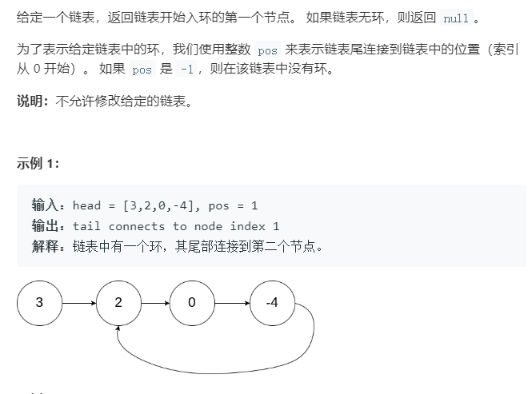
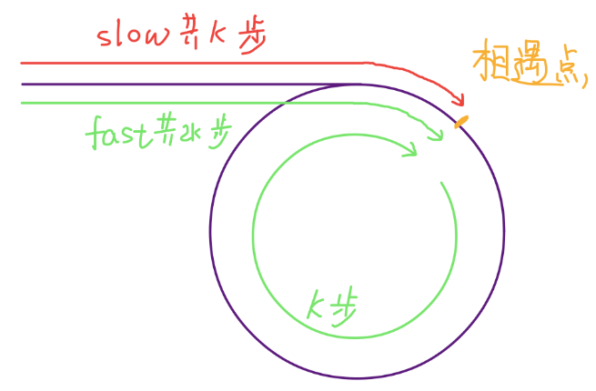
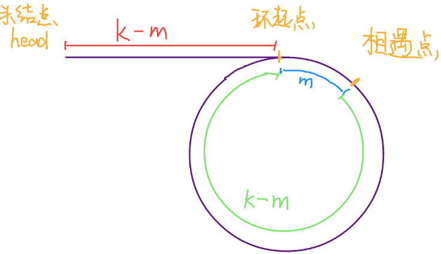
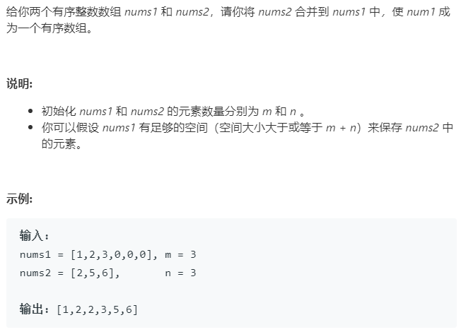

# 双指针

一类是「快慢指针」，一类是「左右指针」。前者解决主要解决链表中的问题，比如典型的判定链表中是否包含环；后者主要解决数组（或者字符串）中的问题，比如二分查找。
## 快慢指针

通过两个指针，fast 和 slow来遍历链表。leetcode中141环形链表1；142环形链表2；160相交链表。也可以利用双指针寻找链表的中点和倒数k个节点。后续将进行代码和原理介绍。

### [141判断链表是否有环](https://leetcode-cn.com/problems/linked-list-cycle/)

如果链表无环，则遍历链表的过程中肯定会遇到空指针NULL.如果有环，遍历就会陷入死循环。通过快慢指针，fast走两步，slow走一步，则在遍历过程中fast指针会追上slow。
 ```c++
class Solution {
public:
    bool hasCycle(ListNode *head) {
        ListNode*fast=head;
        ListNode*slow = head;
        //fase->next 要存在
        while(fast!=NULL&&fast->next!=NULL)
        {
            fast = fast->next->next;
            slow = slow->next;
            if(slow==fast)
            {
                return true;
            }
        }
        return false;
    }
};
 ```
### [142链表环的起始位置](https://leetcode-cn.com/problems/linked-list-cycle-ii/)



通过fast slow指针判断是否有环，如若有环，在fast指针和slow指针相遇时，如果slow指针走了k步，则fast指针走了2k步，即多走了一个k步。（自己画一画就出来img了）相遇后将其中一个指针指向头节点，然后都以单步移动指针，再次相遇时即为头节点





```c++
class Solution {
public:
    ListNode *detectCycle(ListNode *head) {
        ListNode *slow=head, *fast=head;
        while (fast && fast->next) {
            slow = slow->next;
            fast = fast->next->next;
            if (slow == fast) {
                slow = head;
                while (slow != fast) {
                    slow = slow->next;
                    fast = fast->next;
                }
                return slow;
            }
        }
        return NULL;
    }
};
```
### 快慢指针找中点

fast指针走两步, slow指针走一步。当fast指针到达链表中间时，slow到达中点。
当链表的长度是奇数时，**slow 恰巧停在中点位置；如果长度是偶数，slow 最终的位置是中间偏右**,该方法可以用在对链表进行归并排序时。
```c++
class Solution {
public:
    ListNode *detectmid(ListNode *head) {
        ListNode *slow=head, *fast=head;
        while (fast && fast->next) {
            slow = slow->next;
            fast = fast->next->next;
        }
        return slow;
    }
};
```
### 寻找链表的倒数第 k 个元素

使用快慢指针，让快指针先走 k 步，然后快慢指针开始同速前进。这样当快指针走到链表末尾 null 时，慢指针所在的位置就是倒数第 k 个链表节点（为了简化，假设 k 不会超过链表长度）。在leetcode 19题中可以用该思想
```c++
//寻找倒数第k个元素
class Solution {
public:
    ListNode* removeNthFromEnd(ListNode* head, int n) {
        ListNode *slow = head;
        ListNode *fast = head;
        while(n--)
        {
            fast = fast->next;
        }
        while(fast)
        {
            slow = slow->next;
            fast = fast->next;
        }
        return slow;
    }
};

//leetcode 19 删除倒数第k个节点
class Solution {
public:
    ListNode* removeNthFromEnd(ListNode* head, int n) {
        ListNode*dummy = new ListNode(-1);
        dummy->next = head;
        ListNode*fast = dummy;
        ListNode*slow = dummy;
        while(n--) fast = fast->next;
        while(fast->next) 
        {
            fast = fast->next;
            slow = slow->next;
        }
        slow->next = slow->next->next;
        return dummy->next;
    }
};
```

## 左右指针

左右指针在数组中实际是指两个索引值，一般初始化为 `left = 0; right = nums.length - 1;` 
### 双指针二分查找

```c++
int binarySearch(int[] nums, int target) {
    int left = 0; 
    int right = nums.length - 1;
    while(left <= right) {
        int mid = (right + left) / 2;
        if(nums[mid] == target)
            return mid; 
        else if (nums[mid] < target)   // 缩小查找边界
            left = mid + 1; 
        else if (nums[mid] > target)
            right = mid - 1;
    }
    return -1;
}
```
### [167两数之和2-输入有序数组](https://leetcode-cn.com/problems/two-sum-ii-input-array-is-sorted/)

由于是有序数组，所以通过移动left 和 fast指针，来调整sum大小
```c++
class Solution {
public:
    vector<int> twoSum(vector<int>& numbers, int target) {
        int left = 0;
        int right = numbers.size()-1;
        vector<int>result;
        while(left<right)
        {
            int sum = (numbers[left]+numbers[right]);
            if(sum==target)
            {
                result.push_back(left+1);
                result.push_back(right+1);
                return result;
                
            }
            else if(sum<target)
            {
                left++;
            }
            else if(sum>target)
            {
                right--;
            }
        }
        return result;

    }
};
```
### 反转数组
```
void reverse(int[] nums) {
    int left = 0;
    int right = nums.length - 1;
    while (left < right) {
        // swap(nums[left], nums[right])
        int temp = nums[left];
        nums[left] = nums[right];
        nums[right] = temp;
        left++; right--;
    }
}
```
## 滑动窗口算法

利用双指针维护一个窗口,使其满足条件。


## leetcode题

### 88 合并两个有序数组



只考虑采用双指针的方法来解决该问题

#### 方法一：采用两个指针，从前向后遍历。

由于要采用
```c++
class Solution {
public:
    void merge(vector<int>& nums1, int m, vector<int>& nums2, int n) {
        int i=0;int j=0;int p=0;
        vector<int>temp_nums;
        temp_nums = nums1;
        while(i<m&&j<n)
        {
            // if(temp_nums[i]<nums2[j])
            // {
            //     nums1[p] = temp_nums[i];
            //     i++;
            // }
            // else
            // {
            //     nums1[p] = nums2[j];
            //     j++;
            // }
            // p++;
            //可以改写为
            nums1[p++] = (temp_nums[i]<nums2[j])?temp_nums[i++]:nums2[j++]
        }
        //当有一个还没有遍历完时
        while(i<m)
        {
            nums1[p++] = temp_nums[i++];
        }
        while(j<n)
        {
            nums1[p++] = nums2[j++];
        }

    }
};
```
#### 方法二：双指针从后向前

从后向前遍历可以不用开辟一个新的数组
```c++
class Solution_2 {
public:
    void merge(vector<int>& nums1, int m, vector<int>& nums2, int n) {
        int i = m-1;
        int j = n-1;
        int p = m+n-1;
        while(i>=0&&j>=0)
        {
            // if(nums1[i]>nums2[j])
            // {
            //     nums1[p] = nums1[i];
            //     i--;
            // }
            // else
            // {
            //     nums1[p] = nums2[j];
            //     j--;
            // }
            // p--;
            nums1[p--] = (nums1[i] > nums2[j]) ? nums1[i--] : nums2[j--];
        }
        while(i>=0)
        {
            nums1[p--] = nums1[i--];
        }
        while(j>=0)
        {
            nums1[p--] = nums2[j--];
        }
    }
};
```