##   回溯


### 深搜（dfs）和广搜(bfs)

- BFS是用来搜索最短径路的解是比较合适的，比如求最少步数的解，最少交换次数的解，因为BFS搜索过程中遇到的解一定是离根最近的，所以遇到一个解，一定就是最优解，此时搜索算法可以终止。这个时候不适宜使用DFS，因为DFS搜索到的解不一定是离根最近的，只有全局搜索完毕，才能从所有解中找出离根的最近的解。（当然这个DFS的不足，可以使用迭代加深搜索ID-DFS去弥补）

- 空间优劣上，DFS是有优势的，DFS不需要保存搜索过程中的状态，而BFS在搜索过程中需要保存搜索过的状态，而且一般情况需要一个队列来记录。
  3.DFS适合搜索全部的解，因为要搜索全部的解，那么BFS搜索过程中，遇到离根最近的解，并没有什么用，也必须遍历完整棵搜索树，DFS搜索也会搜索全部，但是相比DFS不用记录过多信息，所以搜素全部解的问题，DFS显然更加合适

### 回溯的框架

```cpp
result = []
def backtrack(路径, 选择列表):
    if 满足结束条件:
        result.add(路径)
        return	
    for 选择 in 选择列表:
        做选择
        backtrack(路径, 选择列表)
        撤销选择
```


### [全排列](https://leetcode-cn.com/problems/permutations/)

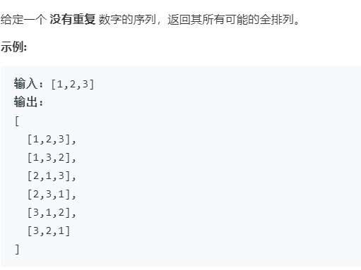

全排列即做如下深搜+剪枝。


```cpp
class Solution {
public:
    vector<vector<int>> permute(vector<int>& nums) {
        vector<vector<int>> res;
        vector<int> path;
        backtrack(nums, res, path);
        return res;
        
    }
    void backtrack(vector<int>& nums,vector<vector<int>>& res,vector<int>& path)
    {
        //终止条件
        if(path.size()==nums.size())
        {
            res.push_back(path);
            return;
        }
        //选择列表
        for(int i=0;i<nums.size();i++)
        {
            //剪枝操作，当发现path中的数与当前数相等时，跳出该次循环
            //STLvector的find函数，返回查找到之的迭代器iterator
            if(find(path.begin(),path.end(),nums[i])!=path.end())
            {
                continue;
            }
            //做选择
            path.push_back(nums[i]);
            //递归
            backtrack(nums,res,path);
            //撤销选择
            path.pop_back();
        }
    }
};
```

按照后面一个题的方法，设置访问数组。

```cpp
class Solution {
public:
    vector<vector<int>> permute(vector<int>& nums) {
        vector<vector<int>> res;
        vector<int> item;
        vector<bool>used(nums.size(),false);
        backtrack(nums, res, used, item);
        return res;
    }
    void backtrack(vector<int>& nums,vector<vector<int>>& res,vector<bool>&used,vector<int>& item)
    {
        //终止条件
        if(item.size()==nums.size())
        {
            res.push_back(item);
            return;
        }
        //for循环里面调用递归，一定要清楚回溯后所处的状态，是否前一递归的for循环已经执行完，执行完会再次回溯，
        //选择列表
        for(int i=0;i<nums.size();i++)
        {
            //减枝
            if(used[i])
            {
                continue;
            }
            used[i] = true;
            //做选择
            item.push_back(nums[i]);
            //递归
            backtrack(nums,res,used,item);
            used[i] = false;
            //撤销选择
            item.pop_back();
        }
    }
};
```

### [全排列2](https://leetcode-cn.com/problems/permutations-ii/)

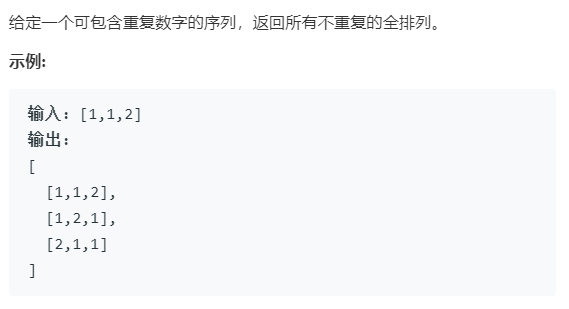

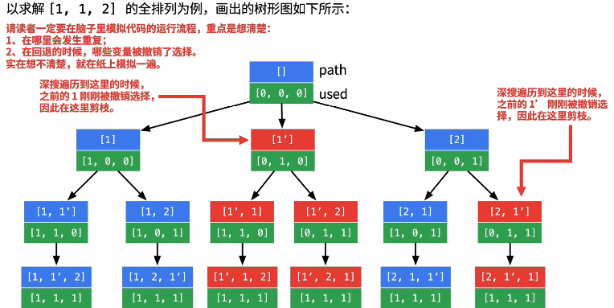

```cpp
class Solution
{
public:
    vector<vector<int>> permuteUnique(vector<int> &nums)
    {
        sort(nums.begin(), nums.end());
        vector<int> item;
        vector<vector<int>> result;
        vector<bool>used(nums.size(),0);   // 标记数组，当前值访问过为1.
        backtrack(nums, result, used, item);
        return result;
    }

private:
    void backtrack(vector<int> &nums, vector<vector<int>> &result, vector<bool> &used, vector<int> &item)
    {
		// 终止条件
        if (item.size() == nums.size())
        {
            result.push_back(item);
            return;
        }
        //选择列表
        for (int i = 0; i < nums.size(); i++)
        {
            //剪值
            //如果路径中包含了改元素，则跳出本次循环
            if (used[i])
            {
                continue;
            }
            //这里剪枝条件为当前值和前一值相同，且前一个值没有访问，现在开始访问当前值
            //如上图中1‘，由于i=1时，num[i]=nums[i-1]=1,并且此时nums[i-1]有访问。
            //相当于又遍历了一遍1，所以减枝。
            if (i > 0 && nums[i] == nums[i - 1] && !used[i-1])
            {
                continue;
            }
            used[i] = true;
            //做选择
            item.push_back(nums[i]);
            //递归
            backtrack(nums, result, used, item);
            used[i] = false;
            //撤销选择
            item.pop_back();
        }
    }
};
```

### [子集](https://leetcode-cn.com/problems/subsets/)

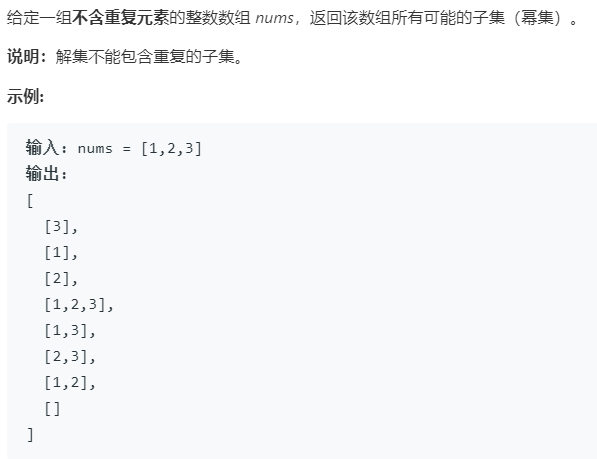

```cpp
class Solution {
public:
	vector<vector<int>> subsets(vector<int>& nums) {
		vector<vector<int>> result;
		vector<int> tmp;
		getResult(result, nums, 0, tmp);
		return result;
	}

	void getResult(vector<vector<int>>& result, vector<int> nums, 
                   int startPoint, vector<int> &tmp) {
        //由于result的子集特性，所以需要判断进行添加，而递归终止条件for循环的条件可以保证
		result.push_back(tmp);
        //注意for循环里面，回溯后属于什么状态？是已经完成当前的循环，还是回溯后继续未完成的循环。
        //（前一递归调用的循环是否已经执行完）
        //例如[1,2,3]回溯后变为[1,2]此时的循环已经完成（就是刚刚回溯那一个），所以再回溯到[1];
        //由于选择2的已经完成（刚刚回溯），但是还有3没有选，所以继续循环[1,3]
		for (int i = startPoint; i < nums.size(); i++) {
            //做选择
			tmp.push_back(nums[i]);
			//递归
            getResult(result, nums, i + 1, tmp);
            //撤销选择
			tmp.pop_back();
		}
	}
};

//或者下面这种写法
class Solution
{
public:
    vector<vector<int>> subsets(vector<int> &nums)
    {
        vector<vector<int>> result; // 储存最终结果
        vector<int> item;           //回溯时产生的各个子集数组
        result.push_back(item);     //将空集push进入result
        generate(0, nums, item, result);
        return result;
    }

private:
    void generate(int i,
                  vector<int> &nums,
                  vector<int> &item,
                  vector<vector<int>> &result)
    {
        if (i >= nums.size()) //递归结束的条件，必须要有，否则会陷入死循环
        {
            return;
        }
        item.push_back(nums[i]);
        //做选择
        result.push_back(item);
        //递归
        generate(i + 1, nums, item, result);
        //撤销选择
        item.pop_back();
        //再次递归，这里和for循环其实一样，只是这里直接再次递归，而or循环是再for循环中实现未完成的递归
        generate(i + 1, nums, item, result);
    }
};
```

**位运算方法**

对于子集中的元素只有选和不选两种情况。

例如{1，2，3} 每一个数都可以选或者不选可以用二进制来表示.

```
例如
000 {}
001 {1}
010 {2}
011 {1,2}
100 {3}
101 {1,3}
110 {2,3}
111 {1,2,3}
```

所以可以通过判断所有的二进制数中1的位置，来对应相应的子集

```cpp
class Solution {
public:
    vector<vector<int>> subsets(vector<int>& nums) {
        vector<vector<int>> res;
        //一共有8(0-2^n-1)个子集
        for(int i = 0;i<1<<nums.size();i++)
        {
            vector<int> temp;
            //判断二进制每一位上是否为1
            for(int j=0;j<nums.size();j++)
            {
                if(i>>j&1) temp.push_back(nums[j]);
            }
            res.push_back(temp);
        }
        return res;
    }
};
```


### [子集2](https://leetcode-cn.com/problems/subsets-ii/)

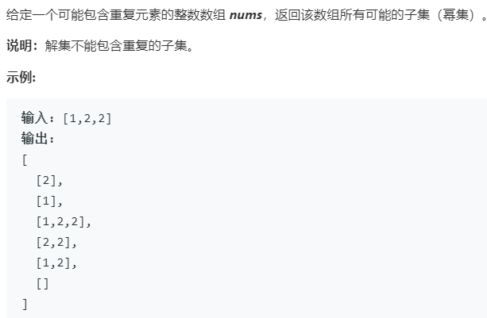

与前一题的不同之处在于，该题中给定的数组有重复元素。所以需要再前一题的基础上对重复的子集进行排除。

```cpp
class Solution
{
public:
    vector<vector<int>> subsetsWithDup(vector<int> &nums)
    {
        vector<vector<int>> result;
        vector<int> item;
        set<vector<int>> res_set;
        sort(nums.begin(), nums.end());
        result.push_back(item); //push空集
        generate(0, nums, result, item, res_set);
        return result;
    }

private:
    void generate(int i,
                  vector<int> &nums,
                  vector<vector<int>> &result,
                  vector<int> &item,
                  set<vector<int>> &res_set)
    {
        //结束条件
        if (i >= nums.size())
        {
            return;
        }
        item.push_back(nums[i]);
        //如果在res_set中没有找到改item,则添加改元素
        if (res_set.find(item) == res_set.end())    
        {
            result.push_back(item);
            res_set.insert(item);
        }
        generate(i + 1, nums, result, item, res_set);
        item.pop_back();
        generate(i + 1, nums, result, item, res_set);
    }
};
```

方法2

```cpp
class Solution {
public:
    vector<vector<int>> subsetsWithDup(vector<int>& nums) {
        sort(nums.begin(),nums.end());
        vector<vector<int>> res;
        set<vector<int>> res_set;
        vector<int> item;
        dfs(nums,res,0,item,res_set);
        return res;    
    }
private:
    void dfs(vector<int>&nums,vector<vector<int>>&res,int startPoint,
             vector<int>&item,set<vector<int>> &res_set)
    {
        //排除重复，选择添加
        if(res_set.find(item)==res_set.end())
        {
            res.push_back(item);
            res_set.insert(item);
        }
        //选择列表+终止条件（递归到底）
        for (int i = startPoint; i < nums.size(); i++) {
            //做选择
			item.push_back(nums[i]);
			//递归
            dfs(nums, res, i + 1, item,res_set);
			//撤销选择
            item.pop_back();
		}
    }
    
};
```


### 单词查找

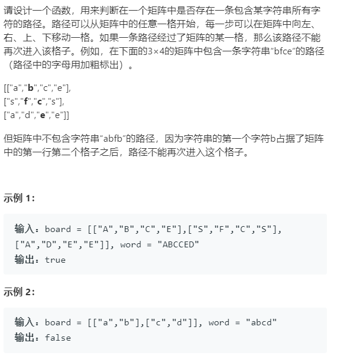

**算法原理：**

- 深度优先搜索： 可以理解为暴力法遍历矩阵中所有字符串可能性。DFS 通过递归，先朝一个方向搜到底，再回溯至上个节点，沿另一个方向搜索，以此类推。
- 剪枝： 在搜索中，遇到**这条路不可能和目标字符串匹配成功**的情况（例如：此矩阵元素和目标字符不同、此元素已被访问），则应立即返回，称之为可行性剪枝 。

**步骤：**

- 递归参数： 当前元素在矩阵 board 中的行列索引 i 和 j ，当前目标字符在 word 中的索引 k 。
- 终止条件：
  - 返回 false： ① 行或列索引越界**或** ② 当前矩阵元素与目标字符不同 **或** ③ 当前矩阵元素已访问过 （③ 可合并至 ② ）。
  - 返回 true： 字符串 word 已全部匹配，即 `k = word.size() - 1 `(下面两种方法这里的表示不一样，这个所有判断先后决定的，如果判断在后两种方法都为`k=word.size()`)。
- 递推工作：
  - 标记当前矩阵元素： 将` board[i][j] `值暂存于变量 temp ，并修改为字符 '/' ，代表此元素已访问过，防止之后搜索时重复访问。
  - 搜索下一单元格： 朝当前元素的 上、下、左、右 四个方向开启下层递归，使用 或 连接 （代表只需一条可行路径） ，并记录结果至 res 。
  - 还原当前矩阵元素： 将` tmp `暂存值还原至 `board[i][j]` 元素。
    回溯返回值： 返回 res ，代表是否搜索到目标字符串。

```cpp
class Solution {
public:
    bool exist(vector<vector<char>>& board, string word) {
        int rows=board.size();
        int cols=board[0].size();
        if(board.size()<1 || word.size()<1 || rows<1 || cols<1) return false;
        for(int i=0;i<rows;i++){
            for(int j=0;j<cols;j++){
                if(dfs(board,word,i,j,0)) return true;
            }
        }
        return false;
    }
private:
    bool dfs(vector<vector<char>>& board, string word,
            int i ,int j,int k)
    {
        if(i>=board.size()||i<0||j>=board[0].size()||j<0||board[i][j]!=word[k])
        { 
            return false;
        }
        // 这里是word.length()-1,因为在前面已经判断力k=word.length()-1成立，判断成立在前
        if(k==word.length()-1)   
        {
            return true;
        }
        char temp = board[i][j];
        board[i][j] = '/';
        bool res = dfs(board, word,i+1,j,k+1)||dfs(board,word,i-1,j,k+1)||
                    dfs(board,word,i,j+1,k+1)||dfs(board,word,i,j-1,k+1);
        board[i][j] = temp;
        return res;
    } 
};
```

利用**方向数组实现**

```cpp
class Solution
{
public:
   bool exist(vector<vector<char>>& board, string word) {
        int rows = board.size();
        int cols = board[0].size();
        for (int i = 0; i < rows; i++) {
            for (int j = 0; j < cols; j++) {
                if (board[i][j] == word[0]) {
                    if (dfs(board,word,i,j,1)) return true;
                }
            }
        }
        return false;
    }

private:
    bool dfs(vector<vector<char>> &board, string word,
             int i, int j, int num)
    {
        static const int dx[] = {-1, 1, 0, 0}; // 静态成员在类中不能进行初始化，因为静态成员变量不是通过构 
        static const int dy[] = {0, 0, -1, 1}; //造函数赋值的。所以可以放在类里面的函数体中和类外
        ///此时代表完成了word中所有字符的查找，即（0-word.length()-1）的字符。
        //判断成立在后
        if (num == word.length())   
        {
            return true;
        }
        //备份当前的位置的字符，并修改为*标记已经查找过
        char temp = board[i][j];
        board[i][j] = '/';
        //四个方向
        for (int k = 0; k < 4; k++)
        {
            int d_x = dx[k] + i; // 新的i值
            int d_y = dy[k] + j; // 新的j值
            if (d_x >= 0 && d_x < board.size() && d_y >= 0 && d_y < board[0].size() && word[num] == board[d_x][d_y])
            {
                if (dfs(board, word, d_x, d_y, num + 1))	
                    return true;
            }
        }
        //恢复该位置原来的字符，方便下一基点查找
        board[i][j] = temp; 
        return false;
    }
};
```

### [N皇后](https://leetcode-cn.com/problems/n-queens/solution/nhuang-hou-by-leetcode/)

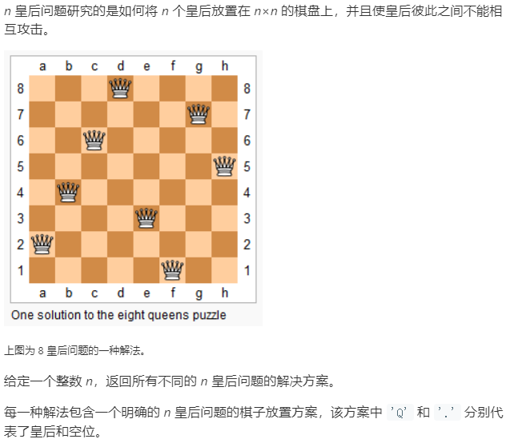

棋盘上的皇后可以攻击其周身八个方向的皇后，即上、下、左、右，左上，左下，右上、右下。并且只要再这些方位的线上，都能被攻击。

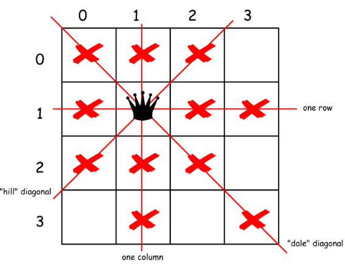

```cpp
class Solution
{
public:
    vector<vector<string>> solveNQueens(int n)
    {
        vector<vector<string>> res;
        //初始化一个空气盘，'Q'表示防止皇后，'.'表示空
        vector<string> board(n, string(n, '.'));
        backtrack(res, board, 0, n);
        return res;
    }

private:
    // 路径：board 中小于 row 的那些行都已经成功放置了皇后
    // 选择列表：第 row 行的所有列都是放置皇后的选择
    // 结束条件：row 超过 board 的最后一行
    void backtrack(vector<vector<string>> &res, vector<string> &board,
                   int row, int n)
    {
        //终止条件，完成所有行的放置
        if (row == n)
        {
            res.push_back(board);
            return;
        }
        //当前行，按列选放置位置。
        for (int col = 0; col < n; col++)
        {
            //判断当前放置的皇后死否和前面放置的冲突。
            if (!isvalid(board, row, col, n))
            {
                continue;
            }
            //选择放置
            board[row][col] = 'Q';
            //递归下一行
            backtrack(res, board, row + 1, n);
            //撤销选择，返回上一递归，进行当前行的下一列。
            board[row][col] = '.';
            
        }
    }
    //判断是否可以再（row，col)处放置皇后
    bool isvalid(vector<string> &board, int row, int col, int n)
    {
        // 定义方向数组,x:向下，y:向左, 上，下，左，右，左上，左下，右下，右上
        static const int dx[] = {-1, 1, 0, 0, -1, -1, 1, 1};
        static const int dy[] = {0, 0, -1, 1, -1, 1, -1, 1};
        for (int i = 0; i < n; i++)
        {
            for (int j = 0; j < 8; j++) // 八个方向
            {
                int x = row + i * dx[j];
                int y = col + i * dy[j];
                // 如果当前位置（row，col）的八个方向上有皇后，这说明该位置不能放置
                if (x >= 0 && x < n && y >= 0 && y < n)
                {
                    if (board[x][y] == 'Q')
                    {
                        return false;
                    }
                }
            }
        }
        return true;
    }
};
```

对于上面的`isvalid()`函数，对于任何一个位置，都进行八个方位，全面计算。其实这个是没有必要的。因为我们是按照行进行放置皇后的，所以 当前操作行的下一行是不会有皇后的，只需要判断当前行尝试放置的皇后是否和前几行放置的冲突就可以了。所以我们更改`isvalid()`函数，只需要满足不和上面已经放置好的冲突。(更改后运行时间减大半)

```cpp
bool isvalid(vector<string>& board, int row, int col) {
    int n = board.size();
    // 检查列是否有皇后互相冲突
    for (int i = row; i >=0; i--) {
        if (board[i][col] == 'Q')
            return false;
    }
    // 检查右上方是否有皇后互相冲突
    for (int i = row - 1, j = col + 1; 
            i >= 0 && j < n; i--, j++) {
        if (board[i][j] == 'Q')
            return false;
    }
    // 检查左上方是否有皇后互相冲突
    for (int i = row - 1, j = col - 1;
            i >= 0 && j >= 0; i--, j--) {
        if (board[i][j] == 'Q')
            return false;
    }
    return true;
}
```

### [毕业旅行(TSP问题)](https://www.nowcoder.com/practice/3d1adf0f16474c90b27a9954b71d125d?tpId=98&tqId=33010&rp=1&ru=/ta/2019test&qru=/ta/2019test/question-ranking)

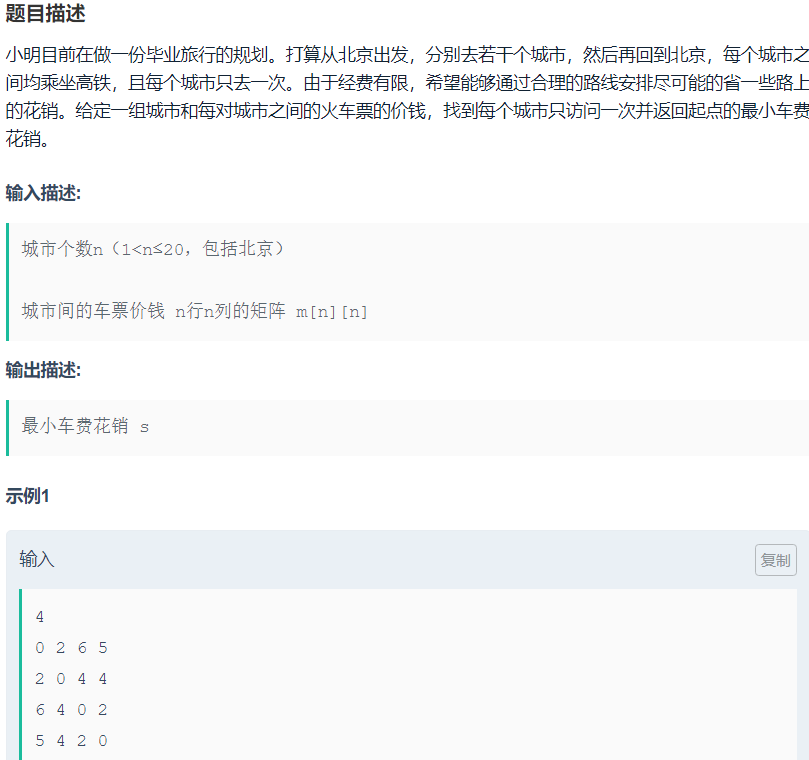

TSP问题一般采用动态规划法，这里先采用回溯法来解决该问题，目的是掌握回溯中**for循环+回溯（回溯中参数改变循环起始位置）**的问题，类似于子集问题。

```cpp
#include <iostream>
#include <vector>
#include <algorithm>
using namespace std;
void backTrack(vector<vector<int>> &prices, int n, vector<int> &path, vector<int> &bestPath,int curCity, int cp, int &res)
{
    if (curCity > n)   //准备返程，加上返程的钱
    {
        if (prices[path[n]][1] &&            // path[n] 最后到达的城市，准备返回老家（起点）。
            prices[path[n]][1] + cp < res)   // 如果当前路径总和比其他方案的res大，则选择该方案。
        {
            res = prices[path[n]][1] + cp;      
            for (int i = 1; i <= n;i++)           //记录当前res的路径
                bestPath[i] = path[i];
        }
    }
    else
    {
        for (int i = curCity; i <= n; i++)
        {
            if (prices[path[curCity - 1]][path[i]] &&   // 前一到达的城市到现在的城市+cp
                cp + prices[path[curCity - 1]][path[i]] < res)
            {
                swap(path[curCity], path[i]);
                cp += prices[path[curCity - 1]][path[curCity]];
                backTrack(prices, n, path, bestPath, curCity + 1, cp, res);
                cp -= prices[path[curCity - 1]][path[curCity]];
                swap(path[curCity], path[i]);
            }
        }
    }
}
int main()
{
    int res = 63355;
    int n; //城市数
    cin >> n;
    vector<int> path(n + 1, 0);     //记录路径,记录去过的城市号
    vector<int> bestPath(n + 1, 0); // 记录最优路径
    int cp = 0;                     //记录当前需要钱的数量
    for (int i = 1; i < path.size(); i++)
    {
        path[i] = i;
    }
    vector<vector<int>> prices(n + 1, vector<int>(n + 1, 0)); // 价格表
    int item;
    for (int i = 1; i <= n; i++)
    {
        for (int j = 1; j < n + 1; j++)
        {
            cin >> item;
            prices[i][j] = item;
        }
    }
    backTrack(prices, n, path, bestPath, 2, cp, res);
    cout << "最少旅行费用为: " << res << endl;
    cout << "旅行路径为:" << endl;
    for (int i = 1; i <= n; i++)
    {
        cout << bestPath[i] << "->";
    }
    cout << bestPath[1] << endl;

    return 0;
}

```

对于TSP问题回溯法在处理较多城市的情况下，往往回超时。所以对于该问题的解法一般采用动态规划法。[参考讲解](https://www.cnblogs.com/youmuchen/p/6879579.html)

要使用动态规划，需要问题本身有最优子结构，我们需要找到要解决的问题的子问题。

题目要求，从0出发，经过[1,2,3]这几个城市，然后回到0，使得花费最少。要实现这个要求，需要从下面三个实现方案中选择花费最少的方案。

　　　　1、 从0出发，到1，然后再从1出发，经过[2,3]这几个城市，然后回到0，使得花费最少。

　　　　2、 从0出发，到2，然后再从2出发，经过[1,3]这几个城市，然后回到0，使得花费最少。

　　　　3、 从0出发，到3，然后再从3出发，经过[1,2]这几个城市，然后回到0，使得花费最少。

　　可以发现，三个小的解决方案的最优解，构成了大的解决方案，所以这个问题具有最优子结构，可以用动态规划来实现。

　　设置一个二维的动态规划表dp,定义符号{1,2,3}表示经过[1,2,3]这几个城市，然后回到0。

　　那么题目就是求`dp[0][{1,2,3}]`。将{1,2,3}表示成二进制，就是111，对应10进制的7，所以题目是在求`dp[0][7]`;

要求三个方案的最小值意味：

`dp[0][{1,2,3}] = min{ C01+dp[1][{2,3}] ，C02+dp[2][{1,3}] ，C03+dp[3][{1,2}]}`

其中C01 表示从0出发到1的距离。

`dp[1][{2,3}] = min{ C12+dp[2][{3}] ，C13+dp[3][{1}]}`

`dp[2][{3}] = C23+dp[3][{}]`

`dp[3][{}]`就是从3出发，不经过任何城市，回到0的花费，所以`dp[3][{}] = C30`

dp表的大小，有n个城市，从0开始编号，那么dp表的行数就是n，列数就是2^(n-1)，即1 << （n – 1）,集合{1,2,3}的子集个数。在求解的时候，第一列的值对应这从邻接矩阵可以导出，后面的列可以有前面的列和邻接矩阵导出。


第一轮首先将各城市回到起点城市0的花费

```cpp
//各城市回到起点花费，dp初始值
for(int i=0;i<n;i++)
{
    dp[i][0] = nums[i][0];
}
```

当`j>=1时`即经过城市后，

例如对于`dp[2][5]`,从城市2出发，经过{1,3}后，返回到起点的花费。

即`dp[2][5]=min(c21+dp[1][{3}]),cp23+dp[3][{1},]`   

转换为二进制集合为`dp[2][5] = min(c21+dp[1][4],c23+dp[3][1]`

从城市2出发，去**集合{1，3}**的城市

- 先去试试去城市1，此时集合中只有{3}，需要求出`dp[1][4]`,4可以通过二进制集合与当前城市异或求出，例如当前集合`101^1=100`即为4。
- 尝试去尝试2，由于集合中没有 2城市，不能去。并且由于出发点是城市2，也不能再去2城市。判断集合第二位是否存在即可`(5>>(2-1))&1==0`表示待去集合中没有城市2，跳过。
- 尝试去城市3，此时集合中只有{1}，需要求出`dp[3][1]`，同样`101^(1<<(3-1)),即101^100=1`

```cpp
#include <iostream>
#include <vector>
#include <algorithm>
using namespace std;
int getAns(vector<vector<int>> &nums)
{
    const int MAX = 0x0fffffff;
    int n = nums.size();
    int stateNum = 1 << (n - 1); //即2的n次方，也就是第n个城市
    // dp[i][j]中的j是一个二进制形式的数，表示经过城市的集合，
    // 如111表示经过了城市1,2,3,排除了城市0 dp[0][{1,2,3}] 即为所求
    // dp[i][j]表示从城市i出发，经过j集合中的城市所需最小花费n

    vector<vector<int>> dp(n, vector<int>(stateNum, MAX));
    for (int i = 0; i < n; i++)
    {
        dp[i][0] = nums[i][0]; //每个城市会到起点的花费
    }
    // 这里j不仅是dp表的列坐标值，j的二进制表示城市相应城市是否在子集中
    for (int j = 1; j < stateNum; j++)
    {
        //从i出发，去集合j的城市
        for (int i = 0; i < n; i++)
        {
            //查看集合j的第i位是否为1，为1说明待走集合中包含起点，
            // 该方式错误，跳过（例如d[1][{1}]，d[2][{1,2}]）
            if ((j >> (i - 1) & 1 == 1))
            {
                continue;
            }
            //如果j >> (i - 1) & 1 == 0,则表示从城市i出发，经过集合j的城市，回到起点0所需花费
            //尝试去k城市，
            for (int k = 1; k < n; k++)
            {
                //待走集合最终没有当前城市，跳过。
                if ((j >> (k - 1) & 1) == 0)
                {
                    continue;
                }
                if (dp[i][j] > nums[i][k] + dp[k][j ^ (1 << (k - 1))])

                {
                    //dp[k][j ^ (1 << (k - 1))]表示从k城市出发，经过子集不包含k城市的路径，返回起点的花费。
                    //dp[2][{1,3}] =min(nums[2][1]+dp[1][{3}],nums[2][3]+dp[3][{1}])
                    //即 dp[2][5] = min(nums[2][1]+dp[1][4],nums[2][3]+dp[3][1])
                    // j ^ (1 << (k - 1)),去掉原来集合j中的城市k，得到的新集合
                    dp[i][j] = nums[i][k] + dp[k][j ^ (1 << (k - 1))];
                }
            }
        }
    }
    return dp[0][(1 << (n - 1)) - 1]; //dp[0][7]   7:0111
}
int main()
{
    int n;
    while (cin >> n)
    {
        vector<vector<int>> edges(n, vector<int>(n, 0));
        int x;
        for (int i = 0; i < n; i++)
        {
            for (int j = 0; j < n; j++)
            {
                cin >> edges[i][j];
            }
        }
        cout << getAns(edges) << endl;
    }
    return 0;
}
```

### **[迷宫问题](https://www.nowcoder.com/practice/cf24906056f4488c9ddb132f317e03bc?tpId=37&tqId=21266&tPage=3&rp=&ru=/ta/huawei&qru=/ta/huawei/question-ranking)**

```cpp
#include <iostream>
#include <vector>
using namespace std;
//方向数组上下左右（横Y）
static const int dx[] = {0, 1, 0, -1};
static const int dy[] = {1, 0, -1, 0};
void mazeTrack(int x, int y, vector<vector<int>> &maze,
               vector<vector<int>> &bestPath,
               vector<vector<int>> &curpath,
               vector<vector<int>> &visit)
{
    curpath.push_back({x, y});
    visit[x][y] = 1;
    if (x == maze.size() - 1 && y == maze[0].size() - 1)
    {
        if (bestPath.empty() || curpath.size() < bestPath.size())
            bestPath = curpath;
        return;
    }
    for (int i = 0; i < 4; i++)
    {
        int tx = x + dx[i];
        int ty = y + dy[i];
        if (tx >= 0 && tx < maze.size() && ty >= 0 && ty < maze[0].size() && visit[tx][ty] == 0 && maze[tx][ty] == 0)
        {

            mazeTrack(tx, ty, maze, bestPath, curpath, visit);
            visit[tx][ty] = 0;
            curpath.pop_back();
        }
    }
}
int main()
{
    int N, M;                 //分别代表行和列
    vector<vector<int>> maze; //迷宫矩阵

    while (cin >> N >> M)
    {
        maze = vector<vector<int>>(N, vector<int>(M, 0));
        vector<vector<int>> path_temp; //存储当前路径，第一维表示位置
        vector<vector<int>> path_best; //存储最佳路径
        vector<vector<int>> visit(N, vector<int>(M, 0));  //访问矩阵1为访问
        for (int i = 0; i < N; i++)
        {
            for (int j = 0; j < M; j++)
            {
                cin >> maze[i][j];
            }
        }
        mazeTrack(0, 0, maze, path_best, path_temp, visit); //回溯寻找迷宫最短通路
        for (auto i : path_best)
            cout << '(' << i[0] << ',' << i[1] << ')' << endl; //输出通路
    }
    return 0;
}

```

### 种树-深信服

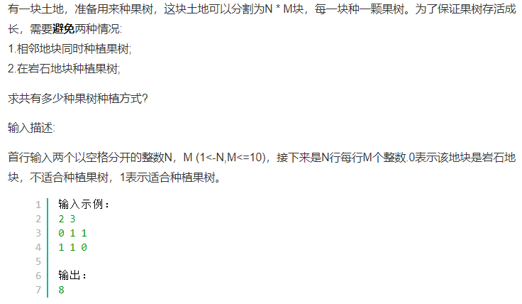  

```cpp
#include<iostream>
#include<vector>
using namespace std;
static const int dx[4] = {0, 1, 0, -1};
static const int dy[4] = {1, 0, -1, 0};
int res = 0;
int N, M;
bool judge(vector<vector<int>>&plant,int x,int y,vector<vector<int>>&visit)
{
    for (int i = 0; i < 4;i++)
    {
        int tx = x + dx[i];
        int ty = y + dy[i];
        if(tx>=0&&tx<N&&ty>=0&&ty<M)
        { 
            if(visit[tx][ty])
            {
                return false;
            }
        }
    }
    return true;
}
void backTrack(vector<vector<int>>&plant,int x,int y ,vector<vector<int>>&visit)
{
    if(x==N)
    {
        res += 1;
        return;
    }
    //逐行
    //当前岩石时，
    if(!plant[x][y])
    {
        if(y==M-1)
        {
            backTrack(plant, x + 1, 0, visit);
        }
        else
        {
            backTrack(plant, x, y + 1, visit);
        }
    }
    //当前土地可种
    else
    {
        if(judge(plant,x,y,visit))
        {
            visit[x][y] = 1;
            if(y==M-1)
            {
                backTrack(plant, x + 1, 0, visit);
            }
            else
            {
                backTrack(plant, x, y + 1,visit);
            }
            visit[x][y] = 0;
        }
        if(y==M-1)
        {
            backTrack(plant, x + 1, 0,visit);
        }
        else
        {
            backTrack(plant, x, y + 1, visit);
        }
    }
}
int main()
{    
    while(cin>>N>>M)
    {
        vector<vector<int>> plant(N,vector<int>(M,0));
        vector<vector<int>> visit(N, vector<int>(M, 0));
        for (int i = 0; i < N;i++)
        {
            for (int j = 0; j < M;j++)
            {
                cin >> plant[i][j];
            }
        }
        backTrack(plant, 0, 0, visit);
        cout << res << endl;
    }
    return 0;
}
```

### 手机解锁

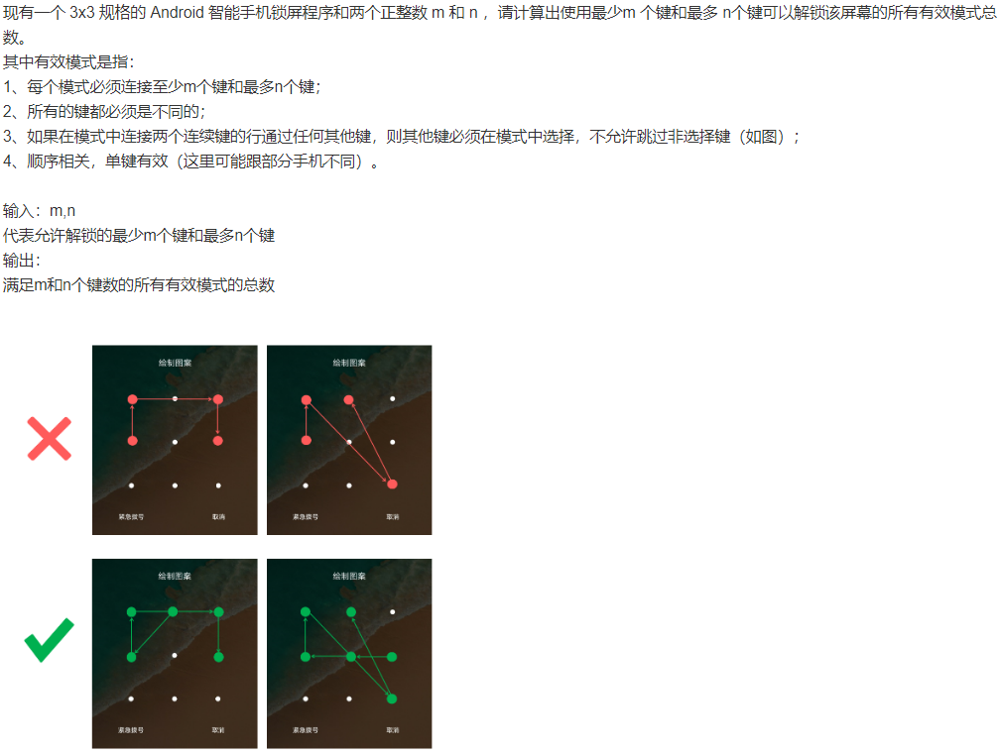

注意两点，一是选择起点，二是选择的节点数。

```cpp
static const int dx[16] = {-1, -1, 0, 1, 1, 1, 0, -1, -2, -1, 1, 2, 2, 1, -1, -2};
static const int dy[16] = {0, 1, 1, 1, 0, -1, -1, -1, 1, 2, 2, 1, -1, -2, -2, -1};
vector<vector<int>> visit(3,vector<int>(3,0));// 0表示没有来过
int res = 0;
class Solution
{
public:
    int solution(int m,int n)
    {
        for(int i=0;i<3;i++)
        {
            for(int j=0;j<3;j++)
            {
                dfs(i,j,m,n,1,visit);
            }
        }
        return res;
    } 
private:
    void dfs(int x,int y,int m,int n,int step,vector<vector<int>>&visit)
    {
        if(step>=m&&step<=n) res++;
        if(step>=n) return;
        visit[x][y] = 1;
        for(int i=0;i<16;i++)
        {
            int tx = x+dx[i];
            int ty = y+dy[i];
            if(visitjudge(tx,ty,visit))
            {
                dfs(tx,ty,m,n,step+1,visit);
            }
            else if(i<8)
            {
                //多走一步
                tx = tx+dx[i];
                ty = ty+dy[i];
                if(visitjudge(tx,ty,visit))
                {
                    dfs(tx,ty,m,n,step+1,visit);
                }
            }
        }
        visit[x][y] = 0;
    }
    bool visitjudge(int x,int y,vector<vector<int>>&visit)
    {
        if(x>=0&&x<3&&y>=0&&y<3&&visit[x][y]=duo=0) return true;
        return false;
    }
};
```

### [17. 电话号码的字母组合](https://leetcode-cn.com/problems/letter-combinations-of-a-phone-number/)