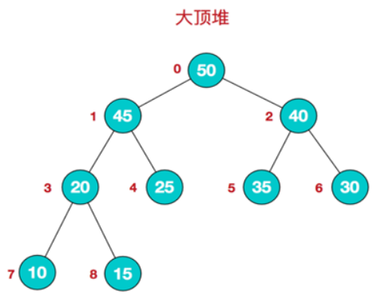

##   排序算法

**排序**是计算机内经常进行的一种操作，其目的是将一组“无序”的记录序列调整为“有序”的记录序列。

排序分为内部排序和外部排序。

若整个排序过程不需要访问外存便能完成，则称此类排序问题为**内部排序**。

反之，若参加排序的记录数量很大，整个序列的排序过程不可能在内存中完成，则称此类排序问题为**外部排序**。
八大排序算法均属于内部排序。如果按照策略来分类，大致可分为：交换排序、插入排序、选择排序、归并排序和基数排序。


### 冒泡排序

**冒泡排序**重复的扫描整个数组，在扫描过程中比较两个元素，如果不满足排序要求就将二者进行交换。每一次扫描都会将当前最大（或最小值移动到最后）。
**算法描述**
步骤一： 比较相邻的元素。如果前一个比后一个大，就交换它们两个；
步骤2: 对每一对相邻元素作同样的工作，从开始第一对到结尾的最后一对，这样在最后的元素应该会是最大的数；
步骤3: 针对所有的元素重复以上的步骤，除了最后一个；
步骤4: 重复步骤1~3，直到排序完成。
**动画如下**


**代码如下：**

```cpp
class Solution
{
    public:
    //冒泡排序
    vector<int> bubbleSort(vector<int> nums)
    {
        if(nums.size()==0||nums.size()==1)
        {
            return nums;
        }
        for (int i = 0; i < nums.size();i++)
        {
            //通过mark避免已经排序成功后的继续循环
            // 如nums[5,1,2,3,4],第一轮交换已经完成排序，后续就无需在继续扫描数组
            bool mark = true;
            // nums.size()-i-1,后面已经排好序的就不在扫描了
            for (int j = 0; j < nums.size()-i-1;j++)
            {
                if(nums[j+1]<nums[j])
                {
                    // swap(nums[j], nums[j + 1]); 
                    int temp = nums[j + 1];
                    nums[j + 1] = nums[j];
                    nums[j] = temp;
                    mark = false;
                }
            }
            if(mark)
            {
                return nums;
            }
        }
    }
};
```
### 快速排序
**快速排序**通过一趟排序将待排记录分隔成独立的两部分，其中一部分记录的关键字均比另一部分的关键字小，则可分别对这两部分记录继续进行排序，以达到整个序列有序。
**算法步骤**
快速排序使用分治法来把一个串（list）分为两个子串（sub-lists）。具体算法描述如下：
步骤1：从数列中挑出一个元素，称为 “基准”（pivot ）；
步骤2：重新排序数列，所有元素比基准值小的摆放在基准前面，所有元素比基准值大的摆在基准的后面
步骤3：递归地（recursive）把小于基准值元素的子数列和大于基准值元素的子数列排序。

**图示如下**


**代码如下**

下面的partition函数很重要，除了在快排中用的着，还能实现再长度为n的数组中查找第k大的数字。

```cpp
class QuickSort
{
public:
    //left right 表示数组第一和最后一个元素的索引
    void quickSort( vector<int> &nums,int left, int right)
    {
        if (left >= right)
        {
            return;
        }
        int j = partition(nums, left, right);
        quickSort(nums, left, j - 1);
        quickSort(nums, j + 1, right);
    }
private:
    //切分函数很重要，很多地方都用的着
    int partition(vector<int>&nums,int left,int right)
    {
        int base = nums[left];
        int i = left + 1;
        int j = right;
        while (i<=j)
        {
            //当遇到数大于等于基准是返回i。
            //在这里不能去掉等号，不然对于[2,2,2,2,2]的排序会陷入死循环
            //这种写法有时候会使得时间复杂度变成O(n*n)
            while (i <= j && nums[i] <= base)
            {
                i++;
            }
            while (i <= j && nums[j] >= base)
            {
                j--;
            }
            if (i >= j)
            {
                break;
            }
            int temp = nums[i];
            nums[i] = nums[j];
            nums[j] = temp;
        }
        nums[left] = nums[j];
        nums[j] = base;
        return j;
    }
};
```

#### **掌握如下算法更为合适**

按照算法4上的方法进行分析，首先，快速排序的切分（partition），切分的要点。

- 如果切分元素是数组中最小或最大的那个元素，我们就要小心别让扫描指针跑出数组的边界  
- 左侧扫描最好是在遇到**大于等于切分元素值的元素时停下**，右侧扫描则是遇
  到**小于等于切分元素值的元素时停下**。  虽然会遇到将相同数字交换的情况，但是可以避免运行时间变为平方级别 。
（上面代码没有避免这个。）

```cpp
class Solution
{
public:
    //left right 表示数组第一和最后一个元素的索引
    void quickSort(vector<int> &nums, int left, int right)
    {
        if (left >= right)
        {
            return;
        }
        int j = partition(nums, left, right);
        quickSort(nums, left, j - 1);
        quickSort(nums, j + 1, right);
    }
private:
    int partition(vector<int> &nums, int left, int right)
    {
        int base = nums[left];
        int i = left;
        int j = right + 1;
        while (true)
        {
            //当遇到数大于等于基准是返回i。
            //不同于前面的算法，这里可以不用取等，++i已经实现了累加。
            while (nums[++i] < base && i < right);

            while (nums[--j] > base && j > left);
            if (i >= j)
            {
                break;
            }
            int temp = nums[i];
            nums[i] = nums[j];
            nums[j] = temp;
        }
        nums[left] = nums[j];
        nums[j] = base;
        return j;
    }
};
```

### 插入排序

**插入排序**的算法描述是一种简单直观的排序算法。它的工作原理是通过构建有序序列，对于未排序数据，在已排序序列中从后向前扫描，找到相应位置并插入。插入排序在实现上，通常采用in-place排序（即只需用到O(1)的额外空间的排序），因而在从后向前扫描过程中，需要反复把已排序元素逐步向后挪位，为最新元素提供插入空间。
**算法描述**   
一般来说，插入排序都采用in-place在数组上实现。具体算法描述如下：
步骤1: 从第一个元素开始，该元素可以认为已经被排序；
步骤2: 取出下一个元素，在已经排序的元素序列中从后向前扫描；
步骤3: 如果该元素（已排序）大于新元素，将该元素移到下一位置；
步骤4: 重复步骤3，直到找到已排序的元素小于或者等于新元素的位置；
步骤5: 将新元素插入到该位置后；
步骤6: 重复步骤2~5。
**动画如下**

**代码如下** 插入法的关键在于找到插入位置，然后为插入数据腾地方

```cpp
class Solution
{
public:
    vector<int>insertSort(vector<int> nums)
    {
        if (nums.size() == 0 || nums.size() == 1)
        {
            return nums;
        }
        for (int i = 1; i < nums.size(); i++)
         {
            int temp = nums[i];
            int k = i-1;
            //
            while(k>=0&&nums[k]>temp)
            {
                k--;
            }
            //腾位置
            for(int j =i;j>k+1;j--)
            {
                nums[j] = nums[j-1];
            }
            nums[k+1] = temp;

         }
         return nums;
    }
};
```

#### 推荐方法

```cpp
class Solution {
public:
   void insertSort(vector<int>&nums)
   {
       int len = nums.size();
       if(len<2)
       {
           return;
       }
       for (int i = 1; i < len;i++)
       {
           for (int j = i; j > 0 ;j--)
           {
               //将当前值nums[j]与已排序的（0，j-1）部分对比
               //如果nums[j]<nums[j-1]，交换，不断向左边进行。直到nums[j]>=nums[j-1],停止
               if(nums[j]<nums[j-1])
               {
                   //    swap(nums[j], nums[j - 1]);
                   int temp = nums[j - 1];
                   nums[j - 1] = nums[j];
                   nums[j] = temp;
               }
               
           }
       }
       return;
   }
};
```


### 希尔排序

**希尔排序**希尔排序也是一种插入排序，它是简单插入排序经过改进之后的一个更高效的版本，也称为缩小增量排序，同时该算法是冲破O(n2）的第一批算法之一。它与插入排序的不同之处在于，它会优先比较距离较远的元素。希尔排序又叫缩小增量排序。在此我们选择增量gap=length/2，缩小增量继续以gap = gap/2的方式，这种增量选择我们可以用一个序列来表示，{n/2,(n/2)/2…1}，称为增量序列。希尔排序的增量序列的选择与证明是个数学难题，我们选择的这个增量序列是比较常用的，也是希尔建议的增量，称为希尔增量，但其实这个增量序列不是最优的。此处我们做示例使用希尔增量。
**算法描述**
先将整个待排序的记录序列分割成为若干子序列分别进行直接插入排序，具体算法描述：
步骤1：选择一个增量序列t1，t2，…，tk，其中ti>tj，tk=1；
步骤2：按增量序列个数k，对序列进行k 趟排序；
步骤3：每趟排序，根据对应的增量ti，将待排序列分割成若干长度为m 的子序列，分别对各子表进行直接插入排序。仅增量因子为1 时，整个序列作为一个表来处理，表长度即为整个序列的长度。
**图示**

**代码如下**
```cpp
class Solution
{
public:
    void shellSort(vector<int>&nums)
    {
        int len = nums.size();
        int temp, gap = len / 2;
        // 和插入排序相比，相当于进行了多次间隔的插入排序
        while (gap>0)
        {
            for (int i = gap; i < len;i++)
            {
                temp = nums[i];
                int preIndex = i - gap;
                //对比插入排序，都是找到需要插入的位置，然后进行腾地方，后插入
                while (preIndex >= 0&&nums[preIndex]>temp)
                {
                    //
                    nums[preIndex + gap] = nums[preIndex];
                    preIndex -= gap;
                }
                nums[preIndex + gap] = temp;
            }
            gap /= 2;
        }
    }
};
```

### 选择排序
**选择排序**无论对扫描数据进行排序都是O(n^2)的时间复杂度。工作原理：在未排序数组中寻找最小（或最大）元素，与数组第一个元素交换位置，然后再对未排序数组搜寻最小元素，与数组的第二个元素交换位置。
**动画如下**

**代码如下**
```cpp
class Solution
{
public:
    vector<int> selectSort(vector<int> nums)
        {
            if (nums.size() == 0 || nums.size() == 1)
            {
                return nums;
            }
            for (int i = 0; i < nums.size(); i++)
            {
                int minIndex = i;
                //比较后续未排列数组，不断更新最小值值索引，
                //找到未排列数组中最小值然后交换给第i个元素
                for (int j = i + 1; j < nums.size(); j++)
                {
                    if (nums[j] < nums[minIndex])
                    {
                        minIndex = j;
                    }
                }
                int temp = nums[i];
                nums[i] = nums[minIndex]; 
                nums[minIndex] = temp;
            }
            return nums;
        }
};
```
### 堆排序
堆是一种特殊的树形数据结构，即完全二叉树。堆分为大根堆和小根堆，**大根堆为根节点的值大于两个子节点的值**；**小根堆为根节点的值小于两个子节点的值**，同时根节点的两个子树也分别是一个堆。图下图所示
  

**堆排序** 是利用堆这种数据结构所设计的一种排序算法。堆的特点就是堆顶的元素是一个最值，大顶堆的堆顶是最大值，小顶堆则是最小值。堆排序就是把堆顶的元素与最后一个元素交换，交换之后破坏了堆的特性，我们再把堆中剩余的元素再次构成一个**大顶堆**，然后再把堆顶元素与最后第二个元素交换….如此往复下去，等到剩余的元素只有一个的时候，此时的数组就是有序的了。

**算法步骤：**
步骤1：将初始待排序关键字序列(R1,R2….Rn)构建成大顶堆，此堆为初始的无序区；

步骤2：将堆顶元素R[1]与最后一个元素R[n]交换，此时得到新的无序区(R1,R2,……Rn-1)和新的有序区(Rn),且满足R[1,2…n-1]<=R[n]；

步骤3：由于交换后新的堆顶R[1]可能违反堆的性质，因此需要对当前无序区(R1,R2,……Rn-1)调整为新堆，然后再次将R[1]与无序区最后一个元素交换，得到新的无序区(R1,R2….Rn-2)和新的有序区(Rn-1,Rn)。不断重复此过程直到有序区的元素个数为n-1，则整个排序过程完成。

**动画如下**


**代码如下**

```cpp
class Solution
{
public:
    void heapSort(vector<int> &nums, int size)
    {
        // 构建大根堆（从最后一个非叶子节点向上）
        //但是此时虽然满足了最大堆的特性，使得最大值在堆顶，但是并不是有序的
        for (int i = size / 2 - 1; i >= 0; i--)
        {
            adjust(nums, size, i);
        }

        // 调整大根堆
        for (int i = size - 1; i >= 1; i--)
        {
            swap(nums[0], nums[i]); // 将当前最大的放置到数组末尾
            adjust(nums, i, 0);     // 将未完成的n-1个数字排序的部分继续进行堆排序，
                                    //然后将调整好的堆的堆顶再次放置到当前末尾
        }
    }
private:
    /*
    index:当前非叶子节点的索引
    len:数组长度（而非索引）
     构建大根堆（从最后一个非叶子节点向上）
     但是此时虽然满足了最大堆的特性，使得最大值在堆顶，但是并不是有序的
    */
    void adjust(vector<int>&nums,int len,int index)
    {
        int left = 2 * index + 1;  //index左子树索引
        int right = 2 * index + 2; //index右子树索引
        int max_index = index;
        //如果当前节点的左子树或者右子树大于根节点，则更新为最大值索引
        if (left < len && nums[left] > nums[max_index])
        {
            max_index = left;
        }
        if (right < len && nums[right] > nums[max_index])
        {
            max_index = right;
        }
        if (index != max_index)
        {
            swap(nums[index], nums[max_index]);
            adjust(nums, len, max_index);
        }
    }
};
```
如果我们采用c++的stl库进行构建最小堆或最大堆，代码就会更加简洁。
```cpp
class StackSort
{
public:
    void stackSort(vector<int> &nums)
    {
        priority_queue<int, vector<int>, greater<int>> small_heap; //最小堆构造方法
        for (int i = 0; i < nums.size(); i++)
        {
            small_heap.push(nums[i]);
        }
        int index = 0;
        while (!small_heap.empty())
        {
            nums[index] = small_heap.top();
            small_heap.pop();
            index++;
        }
    }
};
```


### 归并排序

**归并排序**将一个大的无序数组有序，我们可以把大的数组分成两个，然后对这两个数组分别进行排序，之后在把这两个数组合并成一个有序的数组。由于两个小的数组都是有序的，所以在合并的时候是很快的。采用分治的思想对数组不断划分排序。**动画如下**


**代码如下	**

```cpp
//分治+递归
class Solution
{
public:
     void mergeSort(vector<int> &nums)
    {
        if (nums.size() < 2)
        {
            return;
        }
        int mid = nums.size() / 2;
        //划分为左右两个数组
        vector<int> left;
        vector<int> right;
        
        for (int i = 0; i < mid; i++)
        {
            left.push_back(nums[i]);
        }
        for (int i = mid; i < nums.size(); i++)
        {
            right.push_back(nums[i]);
        }
        //递归划分
        mergeSort(left);
        mergeSort(right);
        nums.clear();
        merge(left, right, nums);
    }
private:
    void merge(vector<int> &left,
               vector<int> &right,
               vector<int> &result)
    {
        int i = 0;
        int j = 0;
        while (i < left.size() && j < right.size())
        {
            //取等 确保相等时保留原始数组前面的数，确保稳定性
            if (left[i] <= right[j])
            {
                result.push_back(left[i]);
                i++;
            }
            else
            {
                result.push_back(right[j]);
                j++;
            }
        }
        while (i < left.size())
        {
            result.push_back(left[i]);
            i++;
        }
        while (j < right.size())
        {
            result.push_back(right[j]);
            j++;
        }
    }
};
//分治+非递归归并排序
class Solution
{
public:
    void mergeSort(vector<int> &nums)
    {
        int n = nums.size();
        for (int i = 1; i < n; i += i)
        {
            int left = 0;
            int mid = left + i - 1;
            int right = mid + i;
            while (right < n)
            {
                merge(nums, left, mid, right);
                left = right + 1;
                mid = left + i - 1;
                right = mid + i;
            }
            if (left < n && mid < n)
            {
                merge(nums, left, mid, n - 1);
            }
        }
    }

private:
    void merge(vector<int> &nums, int left, int mid, int right)
    {
        int temp[right-left+1];
        int i = left;
        int j = mid + 1;
        int k = 0;
        while (i <= mid && j <= right)
        {
            if (nums[i] <= nums[j])
            {
                temp[k++] = nums[i++];
            }
            else
            {
                temp[k++] = nums[j++];
            }
        }
        while (i <= mid)
        {
            temp[k++] = nums[i++];
        }
        while (j <= right)
        {
            temp[k++] = nums[j++];
        }
        for (i = 0; i <k; i++)
        {
            nums[left++] = temp[i];
        }
    }
};
```
#### 原地归并

```cpp
class MergeSort
{
public:
    void mergeSort(vector<int> &nums, int left, int right)
    {
        if(right<=left)
        {
            return;
        }
        int mid = left+(right-left)/2;
        //递归划分
        mergeSort(nums,left,mid);
        mergeSort(nums,mid+1,right);
        merge(nums, left, mid,right);
    }
private:	
     void merge(vector<int> &nums, int left, int mid, int right)
    {
        int temp[right-left+1];
        int i = left;
        int j = mid + 1;
        int k = 0;
        while (i <= mid && j <= right)
        {
            //相等时保留前面的数，确保稳定性
            if (nums[i] <= nums[j])
            {	
                temp[k++] = nums[i++];
            }
            else
            {
                temp[k++] = nums[j++];
            }
        }
        while (i <= mid)
        {
            temp[k++] = nums[i++];
        }
        while (j <= right)
        {
            temp[k++] = nums[j++];
        }
        for (i = 0; i < k; i++)
        {
            nums[left++] = temp[i];
        }
    }
};
```


### 计数排序

**计数排序**适用于量大但是范围小的情况，例如**大型企业数万名员工年龄排序**；快速得知高考名次。思想核心在于将输入的数据值转化为键存储在额外开辟的数组空间中。 作为一种线性时间复杂度的排序，计数排序要求输入的数据必须是有确定范围的整数。
    计数排序(Counting sort) 是一种稳定的排序算法。计数排序使用一个额外的数组C，**其中第i个元素是待排序数组A中值等于i的元素的个数**。然后根据数组C来将A中的元素排到正确的位置。它只能对整数进行排序。
**算法步骤**
步骤1：找出待排序的数组中最大和最小的元素；
步骤2：统计数组中每个值为i的元素出现的次数，存入数组C的第i项；
步骤3：对所有的计数累加（从C中的第一个元素开始，每一项和前一项相加）；
步骤4：反向填充目标数组：将每个元素i放在新数组的第C(i)项，每放一个元素就将C(i)减去1。
**动画如下**

**代码如下**
在进行算法步骤所描述的算法的代码前，我们先考虑简单的情况。
加入需要排序的数据是从0开始的，可以采用如下代码进行排序。

```cpp
class Solution
{
public:
void countSort(vector<int>&nums)
    {
        if(nums.size()==0)
        {
            return;
        }
        //找数组中的最大数，用来确定桶大小
        // 如果是对年龄排序，可以自己确定一个合理最大值，毕竟波动不会太大
        int max = nums[0];
        for(auto item:nums)
        {
            if(item>max)
            {
                max = item;
            }
        }
        vector<int> bucket(max + 1);
        for (int i = 0; i < nums.size();i++)
        {	
            bucket[nums[i]]++;  
        }
        // 按顺序输出桶中的元素
        int index = 0;   // nums的索引
        int i = 0;       //桶序号，也就是哈希表中的键，
        while (index<nums.size())   
        {
           if(bucket[i]!=0)
           {
               nums[index] = i;
               bucket[i]--;
               index++;
           }
           else
           {
               i++;
           }
        }
    }
};
```
但是如果数据不是从0开始，而是集中在某一个区间，例如100-150之间，如果还开辟一个0-max+1的bucket数组时0-100就浪费了，所以为了避免这种情况，可以定义一个bias值，将原始数据限制到0-max-min+1之间，具体看代码

#### 掌握下面这种方法

```cpp
class Solution
{
public:
    void countSort(vector<int>&nums)
    {
        if(nums.size()==0)
        {
            return;
        }
        int min = nums[0];
        int max = nums[0];
        //找到数组的最大值和最小值
        for (int i = 0; i < nums.size();i++)
        {
            if(nums[i]>max)
            {
                max = nums[i];
            }
            if(nums[i]<min)
            {
                min = nums[i];
            }
        }
        vector<int> bucket(max - min + 1, 0);
        for (int i = 0; i < nums.size(); i++)
        {
            bucket[nums[i] - min]++;
        }
        int index = 0;
        int i = 0;
        while (index<nums.size())   
        {
           if(bucket[i]!=0)
           {
               nums[index] = i+min;
               bucket[i]--;
               index++;
           }
           else
           {
               i++;
           }
        }
    }
};
```

目前该算法还有最后一个问题，就是**不稳定**,稳定性指在排序时对于相等元素不改变其位置。
解决该问题代码如下

```cpp
class Solution
{
public:
    vector<int>countSort_3(vector<int>&nums)
    {
        vector<int> result(nums.size(), 0);
        if (nums.size() == 0)
        {
            return nums;
        }
        int min = nums[0];
        int max = nums[0];
        //找到数组的最大值和最小值
        for (int i = 0; i < nums.size();i++)
        {
            if(nums[i]>max)
            {
                max = nums[i];
            }
            if(nums[i]<min)
            {
                min = nums[i];
            }
        }
        vector<int> bucket(max - min + 1, 0);
        for (int i = 0; i < nums.size(); i++)
        {
            bucket[nums[i]-min]++;
        }
        //累加数组,此时bucket数组的下标代表min-max的整数，
        //buncket[i]表示当前数排序后的最大位置索引 
        for (int i = 1; i < bucket.size();i++)
        {
            bucket[i] = bucket[i] + bucket[i - 1];
        }
        for (int i = nums.size() - 1; i >= 0;i--)
        {
            result[bucket[nums[i]-min]-1] = nums[i];
            bucket[nums[i]-min]--;
        }
        return result;
    }
};
```
### 基数排序

**基数排序**是桶排序的扩展，它的基本思想是：将整数按位数切割成不同的数字，然后按每个位数分别比较。
具体做法是：将所有待比较数值统一为同样的数位长度，数位较短的数前面补零。然后，从最低位开始，依次进行一次排序。这样从最低位排序一直到最高位排序完成以后, 数列就变成一个有序序列。
**算法步骤：**
步骤一：找出待排序数组的最大值，并计算出最大位数(maxradix)
步骤二：提取出数组中元素的每一位。
步骤三：对数组元素从低位到高位进行排序。
**图示如下：**

**代码如下**

```cpp
class Solution
{
public:
    void radixSort(vector<int>&nums)
    {
        int max = nums[0];
        for(auto item:nums)
        {
            if(nums[i]>max)
            {
                max = nums[i];
            }
        }
        int maxradix = 0;
        while(max!=0)
        {
            max = max/10;
            maxradix++;
        }
        vector<vector<int>> bucket;
        for(int i=0;i<10;i++>)
        {
            bucket.push_back(vector<int>());
        }
        int mod = 10;
        int div = 1;
        for(int i=0;i<maxradix;i++)
        {
            for(int j=0;j<nums.size();j++)
            {
                int num = (nums[j]%mod)/div;
                bucket[num].push_back(nums[j]);    
            }
            int index = 0;
            for (int i = 0; i < bucket.size();i++)
            {
                for (int j = 0; j < bucket[i].size();j++)
                {
                    nums[index] = bucket[i][j];
                    index++;
                }
                bucket[i].clear(); 
            }
            mod = mod * 10;
            div = div * 10;        
        }
    }
};
```


