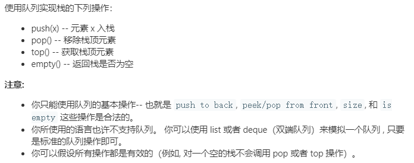
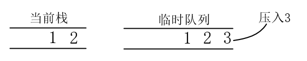
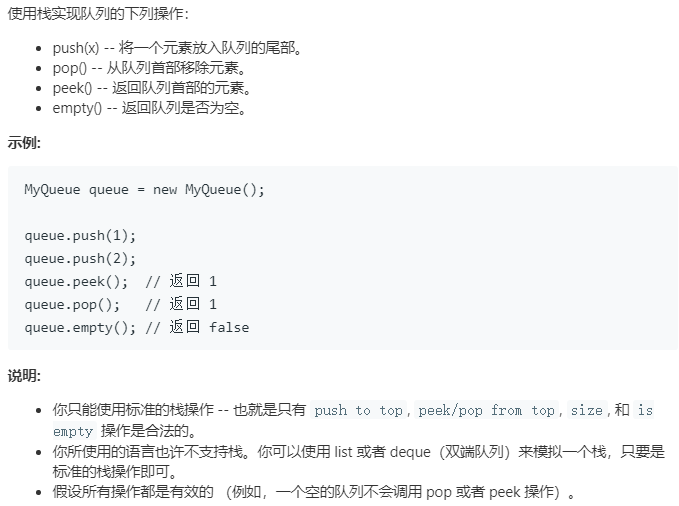
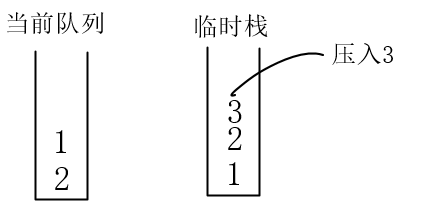
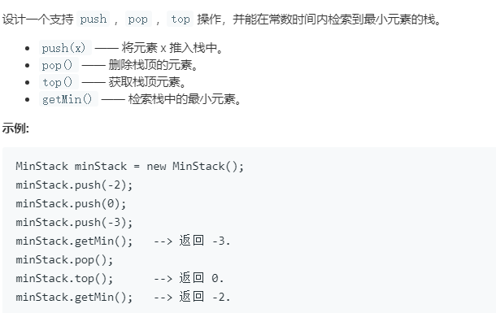
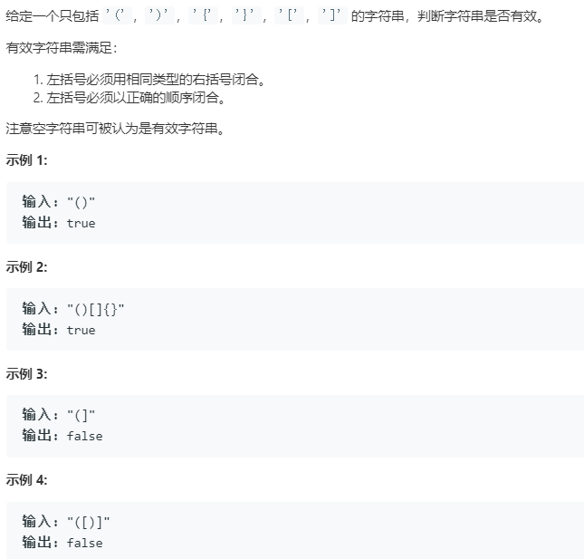
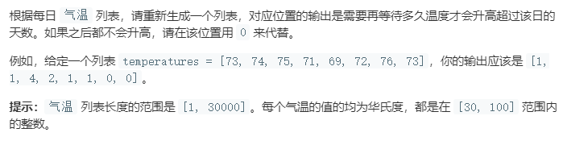
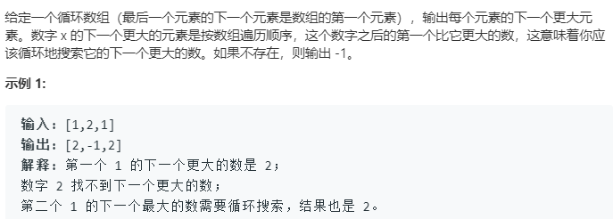

## 栈和队列

**栈：**特点是**后进先出**，它在计算机领域被广泛应用 ，比如操
作系统会给每个线程创建一个战用来存储函数调用时各个函数的参数、返
回地址及临时变量等。

**队列：**特点是**先进先出**

### 刷题

#### [用队列实现栈](https://leetcode-cn.com/problems/implement-stack-using-queues/)



队列是先进先出，要使其实现栈，需要将先将队列中的前面元素弹出，待新元素添加进来后，再将弹出的元素压入队列中。要想实现该过程，需要使用一个临时队列。



```
_data              temp       压入4到temp      将_data中元素压入temp     再把temp赋给_data
-----------    -----------   -----------      ----------------   
   3  2  1                            4              3  2  1 4
------------   -----------   -----------      -----------------
```

```cpp
class MyStack {
public:
    /** Initialize your data structure here. */
    MyStack() {

    }
    /** Push element x onto stack. */
    void push(int x) {
        queue<int> temp;
        temp.push(x);
        while(!_data.empty())
        {
            temp.push(_data.front());
            _data.pop();
        }
        _data = temp;
    }
    
    /** Removes the element on top of the stack and returns that element. */
    int pop() {
        int x =_data.front();
        _data.pop();
        return x;

    }
    
    /** Get the top element. */
    int top() {
        return _data.front();

    }
    
    /** Returns whether the stack is empty. */
    bool empty() {
        return _data.empty();

    }
    private:
    queue<int> _data;
};

/**
 * Your MyStack object will be instantiated and called as such:
 * MyStack* obj = new MyStack();
 * obj->push(x);
 * int param_2 = obj->pop();
 * int param_3 = obj->top();
 * bool param_4 = obj->empty();
 */
```

#### [用栈实现队列](https://leetcode-cn.com/problems/implement-queue-using-stacks/)



使用两个栈，具体过程如下。



- 新建一个栈，将新元素压入新栈。
- 再将原来存在的元素依次压入新栈。
- 将新栈中的元素依次压入原来数据栈。

```cpp
class MyQueue
{
    public:
    void push(int x) 
    {
        stack<int> temp_stack;
        while(!_data.empty())
        {
            temp_stack.push(_data.top());
            _data.pop();
        }
        temp_stack.push(x);
        while(!temp_stack.empty())
        {
            _data.push(temp_stack.top());
            temp_stack.pop();
        }
    }

    int pop()
    {
        int x;
        x = _data.top();
        _data.pop();
        return x;
    }
    //返回队列的首元素
    int peek()
    {
        return _data.top();
    }
    bool empty()
    {
        return _data.empty();
    }
    private:
        stack<int> _data;

};
```

#### [ 最小栈](https://leetcode-cn.com/problems/min-stack/)



最小值栈的栈顶元素为当前栈中的最小元素，会随着栈的`push() `，`pop()` 操作而变化。

```cpp
class MinStack
{
public:
    void push(int x)
    {
        _data.push(x);
        // 如果_min为空，直接push
        if (_min.empty())
        {
            _min.push(x);
        }
        // 非空，比较大小
        else
        {
            // 新插入值大于栈顶值，保留原值,并压入最小值栈
            if (x > _min.top())
            {
                x = _min.top();
            }
            _min.push(x);
        }
    }
    void pop()
    {
        _data.pop();
        _min.pop();
    }
    int top()
    {
        return _data.top();
    }
    int getMin()
    {
        return _min.top();
    }

private:
    stack<int> _data; //数据栈
    stack<int> _min;  //最小值栈
};


/**
 * Your MinStack object will be instantiated and called as such:
 * MinStack* obj = new MinStack();
 * obj->push(x);
 * obj->pop();
 * int param_3 = obj->top();
 * int param_4 = obj->getMin();
 */
```

#### [有效的括号](https://leetcode-cn.com/problems/valid-parentheses/)



利用栈，将字符串依次压入栈，比较需要字符和栈顶元素是否是一组括号.  

```cpp
class Solution {
public:
    bool isValid(string s) {
        //map，根据右括号，找左括号。
        //如果遍历到右括号，则其值为左括号，如果和栈顶元素相同则弹出
        map<char,char> s_map{{')','('},
                             {']','['},
                             {'}'.'{'}};
        stack<char> st;
        for(int i = 0;i<s.length();i++)
        {
            if(st.empty())
            {
                st.push(s[i]);
            }
            else
            {
                if(s_map[s[i]]!=st.top())
                {
                    st.push(s[i]);
                }
                else
                {
                    st.pop();
                }
            }
             if(st.size()>s.length()/2)
             {
                 return false;
             }
        }
        return st.empty();
    }
};
```

也可以这样

```cpp
class Solution
{
public:
    map<char, char> mp{{'(', ')'}, {'{', '}'}, {'[', ']'}};
    bool isValid(string s)
    {
        int len = s.length();
        if (len % 2 != 0)
        {
            return false;
        }
        stack<char> st;
        for (auto &i : s)
        {
            if (i == '(' || i == '{' || i == '[')
            {
                st.push(i);
            }
            else
            {
                if (st.empty())
                {
                    return false;
                }
                else
                {
                    if (mp[st.top()] == i)
                    {
                        st.pop();
                    }
                    else
                    {
                        return false;
                    }
                }
            }
        }
        if (st.empty())
            return true;
        else
            return false;
    }
};
```

#### [每日温度](https://leetcode-cn.com/problems/daily-temperatures/)



题目要求找出数组中比当前元素大的元素之间的距离。可以通过暴力遍历的方法进行寻找

```cpp
class Solution {
public:
    vector<int> dailyTemperatures(vector<int>& T) {
        vector<int> res(T.size(),0);   //这边一定初始化为0，后面不满足是改值的
        for(int i=0;i<T.size();i++)
        {
            for(int j=i+1;j<T.size();j++)
            {
                if(T[j]>T[i])
                {
                    res[i]=j-i;       //不要用push_back
                    break;
                }
            }
        }
        return res;

    }
};
```

上面方法时间复杂度为O(N^2)

利用栈来来储存温度的索引，本质是用栈来储存递减数据（由下到上）的索引。构建递减栈，如下图所示


```cpp
class Solution {
public:
    vector<int> dailyTemperatures(vector<int>& T) {
        vector<int> res(T.size(),0);   //这边一定初始化为0，后面不满足是不需要更改值的
        stack<int> index;
        for(int i=0;i<T.size();i++)
        {
            while(!index.empty()&&T[i]>T[index.top()])
            {
                res[index.top()] = i-index.top(); 
                index.pop();
            }
            index.push(i);
        }
        return res;
    }
};
```

#### [下一个更大元素 II](https://leetcode-cn.com/problems/next-greater-element-ii/)



和前一题相似，只不过将数组编程了循环数组，结果保存的是下一个更大元素，而非第几个数。

**对于循环数组的遍历，用取余的方式可以实现**。

```cpp
 int arr[]{1, 2, 3, 4, 5};
    int i = 0;
    while(i<5)
    {
        cout << arr[i % 5] << endl;
        i++;
    }
//输出：1，2，3，4，5
```

所以采用前面[每日温度](https://leetcode-cn.com/problems/daily-temperatures/)的方法，构建递减栈。

```cpp
class Solution {
public:
    vector<int> nextGreaterElements(vector<int>& nums) {
        stack<int> s;
        vector<int> res(nums.size(),-1);//初始化-1
        int len = nums.size();
        for(int i=0;i<len*2;i++)
        {
            int j = i%len;     // 取余，实现数组循环遍历
            while(!s.empty()&&nums[j]>nums[s.top()])
            {
                res[s.top()] = nums[j];     //新元素即为弹出元素后面第一个比起其大的数
                s.pop();
            }
            s.push(j);
                
        }
        return res;
    }
};
```

#### [柱状图中最大的矩形](https://leetcode-cn.com/problems/largest-rectangle-in-histogram/)

该题构建了一个递增栈，比较难，具体看原题。

