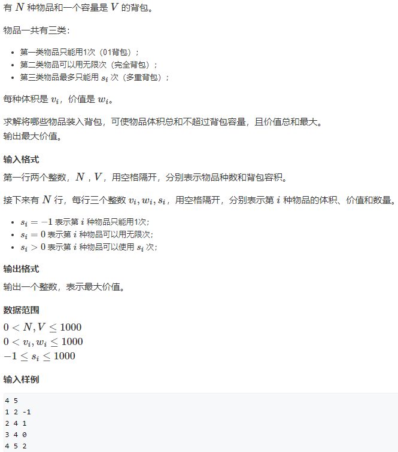

# 背包问题


## 背包问题模板

```python
//背包问题，先循环物品，然后循环容量（体积 重量..），最后循环决策（选或不选、选多少..等根据题目要求进行决策）  
for i in [1..N]:    
    for j in [1...W]:
        for choice in choices:
            dp[][]...
```

**关于初始化的一些小技巧**：

使用一维数组： 

(1)如果题目没有要求恰好把背包装满，那么很简单，dp数组全部初始化为0即可。

(2)如果题目要求**恰好**把背包装满，且求的的是价值的**最大值**，那么dp数组全部初始化为-INF，仅仅把dp[0]置为 0。

(3)如果题目要求恰好把背包装满，但是求的是价值的**最小值**，那么dp数组全部初始化为INF，仅仅把dp[0]置为0。

**理解：**

`dp[i]` 表示

- 最大价值，不要求装满：总体积为`i`的情况下能装的最大价值
- 恰好装满：总体积<strong style="color:red;">恰好为`i`</strong>的情况能装的最大价值。

初始化的dp数组事实上就是在没有任何物品可以放入背包时的合法状态。

如果要求背包**恰好装满**，那么此时只有容量为0的背包可能被价值为0的nothing“恰好装满”，其它容量的背包均没有合法的解，属于未定义的状态，它们的值就都应该是-∞了。

如果背包并非必须被装满，那么任何容量的背包都有一个合法解“什么都不装”，这个解的价值为0，所以初始时状态的值也就全部为0了。

## [01背包问题](https://www.acwing.com/problem/content/2/)


对于背包问题，`dp`数组为`dp[i][j]`的定义如下：对于前 `i` 个物品，当前背包的容量为 `j`，这种情况下可以装的最大价值是 `dp[i][j]`. $v_i$数组代表物体的体积，$w_i$数组代表物体的价值。

01背包问题对于物体只有选和不选两种情况。

- 不选：`dp[i][j]=dp[i-1][j]`
- 选：`dp[i][j] = dp[i-1][j-v[i]]+w[i]`

```cpp
#include<iostream>
#include<vector>
#include<algorithm>
using namespace std;
const int N = 1010;
int main()
{
    int n,m;
    cin>>n>>m;
    vector<int>value(N,0);
    vector<int>volume(N,0);
    vector<vector<int>> dp(N , vector<int>(N, 0));
    for(int i=1;i<=n;i++) cin>>volume[i]>>value[i];
    //遍历物品
    for(int i=1;i<=n;i++)
    {
        //遍历体积
        for(int j=0;j<=m;j++)
        {
            //遍历两种互斥决策
            //当前背包容量小于第i各物体的体积，当然不选
            if(j<volume[i])
                dp[i][j] = dp[i-1][j];
            else
                //如果有足够空间选择，则选择最佳方案
                dp[i][j] = max(dp[i-1][j],dp[i-1][j-volume[i]]+value[i]);
        }
    }
    cout<<dp[n][m];
    return 0;
}
```

可以优化为一位的动态规划，这是`dp[i]` 表示总体积为`i`的情况下能装的最大价值。

代码如下：

```cpp
#include<iostream>
#include<vector>
#include<algorithm>
using namespace std;
const int N = 1010;

int main()
{
    int n,v;
    cin>>n>>v;
    vector<int> dp(N,0);
	vector<int> value(N,0);  // 体积
	vector<int> volume(N,0); // 价值
    for(int i = 1;i<=n;i++) cin>>volume[i]>>value[i];
    // 遍历物品
    for(int i = 1;i<=n;i++)
    {
 		// 遍历体积
        for(int j = v;j>=volume[i];j--)
        {
            dp[j] = max(dp[j],dp[j-volume[i]]+value[i]);
        }
    }
    cout<<dp[v];
    return 0;
}

```

## [完全背包问题](https://www.acwing.com/problem/content/3/)

 

完全背包问题与01背包问题大体相同，不同之处在于每个物品可以选择多次。所以完全背包的状态转移方程为。

`dp[i][j] = max(dp[i-1][j-k*v[i]]+k*w[i]);(0<=k*v[i]<=j)`

采用二维动态规划的方法回超时。

```cpp
#include<iostream>
#include<vector>
#include<algorithm>
using namespace std;
int main()
{
    int n,m;
    cin>>n>>m;
    vector<int>v(n+1,0);
    vector<int>w(m+1,0);
    vector<vector<int>> dp(n+1 , vector<int>(m+1, 0));
    for(int i=1;i<=n;i++) cin>>v[i]>>w[i];
    
    for(int i=1;i<=n;i++)
    {
        for(int j=0;j<=m;j++)
        {
            for(int k=0;k*v[i]<=j;k++)   // 这里包含了不选的情况
                dp[i][j] = max(dp[i][j],dp[i-1][j-k*v[i]]+k*w[i]);
        }
    }
    cout<<dp[n][m];
    return 0;
}
```

优化

```cpp
#include<iostream>
#include<vector>
#include<algorithm>
using namespace std;
const int N = 1010;
int main()
{
    int n,v;
    cin>>n>>v;
    vector<int> value(N,0); 
    vector<int> volume(N,0);
    vector<int> dp(N,0);
    for(int i = 1; i <= n;i++) cin>>volume[i]>>value[i];
    for(int i = 1; i <= n; i++)
    {
        for(int j = volume[i]; j<=v;j++)
        {
            dp[j] = max(dp[j],dp[j-volume[i]]+value[i]);
        }
    }
    cout<<dp[v];
    return 0;
}
```

## [多重背包问题](https://www.acwing.com/problem/content/4/)


还是对比01背包问题，这里的每一个物品进行有限次的选取，根据s<100可知，在满足空间条件下直接循环出所有选择数目在时间复杂度上是满足要求的。

```cpp
#include<iostream>
#include<vector>
#include<algorithm>
using namespace std;
int main()
{
    const int N = 110;
    int n,m;
    cin>>n>>m;
    vector<int>v(N,0);
    vector<int>w(N,0);
    vector<int>s(N,0);
    vector<int> dp(m+1, 0);
    for(int i=1;i<=n;i++) cin>>v[i]>>w[i]>>s[i];
    //遍历物品
    for(int i=1;i<=n;i++)
    {
        //遍历体积
        for(int j=m;j>=0;j--)
        {
            //遍历决策
            //相比于01背包问题，多加了一个选择次数的循环。
            for(int k=1;k<=s[i];k++)
            {
                if(j>=k*v[i])
                {
                    dp[j] = max(dp[j],dp[j-k*v[i]]+k*w[i]);
                }
            }
        }
    }
    cout<<dp[m];  
    return 0;
}
```

当多重背包问题的数据量变为


此时再用上面那种$O(n^3)$复杂度的算法就不能够很好的解决该问题了。需要进行优化，将**多重背包问题**转化为**01背包问题**，如何做到这一点？最朴素的做法就是将s物品分成s分，每一份都是相同的体积$v$和价值$w$。然后我们来看看计算量最大为多少，N各商品每个商品有s中选择，$N*S*V=2*10^9$,复杂度没有改变，还是不可以。

所以我们需要一种拆分方法，将S成若干份，这些份数可以表示0-S内所有的数。例如7拆分为：1，2，4. 0-7内所有的数可以有这三个数来表示出来。这就是这就是二进制拆分法。

```cpp
vector<int> binarySplit(int S)
{
    vector<int> s;
    for (int i = 1; i <= S; i *= 2)      //也可以用i= i<<1或者i<<=1;
    {
        S -= i;
        s.push_back(i);
    }
    if (S > 0)
    {
        s.push_back(S);
    }
    return s;
}
```

通过二进制拆分就可以将**多重背包问题**转换成**01背包问题**，复杂度为$O(n^2)=1000*log_220000*2000$代码如下：

```cpp
#include<iostream>
#include<vector>
#include<algorithm>
using namespace std;
struct Good
{
    int v,w;
};
int main()
{
    const int N = 2010;
    int n, m;
    cin>>n>>m;
    vector<Good>goods;
    vector<int>dp(N,0);
    //读取数据，二进制拆分，添加到goods数组
    for(int i=0;i<n;i++)
    {
        int v,w,s;
        cin>>v>>w>>s;
        for(int k=1;k<=s;k*=2)
        {
            s-=k;
            goods.push_back({k*v,k*w});
        }
        if(s>0) goods.push_back({s*v,s*w});
    }
    //01背包
    for(auto good:goods)
    {
        for(int i=m;i>=0;i--)
        {
            if(i>=good.v)
            {
                dp[i] = max(dp[i],dp[i-good.v]+good.w);
            }
        }
    }
    cout<<dp[m]<<endl;
    return 0;
}
```

## [混合背包问题](https://www.acwing.com/problem/content/7/)



混合背包问题是01背包问题、完全背包问题、多重背包问题的混合，只需将不同类型的数据进行处理，分类执行相应的动态规划转移即可。即将多重背包问题转换为01背包问题，然后对数据进行01背包和完全背包两种处理方式。

```cpp
#include <iostream>
#include <vector>
#include <algorithm>
struct Thing
{
    int kind, v, w;
};

using namespace std;
int main()
{
    const int N = 1010;
    vector<Thing> things;
    vector<int> dp(N, 0);
    int n, m;
    cin >> n >> m;
    for (int i = 0; i < n; i++)
    {
        int v, w, s;
        cin >> v >> w >> s;
        //01背包问题
        if (s < 0)
            things.push_back({-1, v, w});
        //完全背包问题
        else if (s == 0)
            things.push_back({0, v, w});
        // 多重背包问题转完全背包问题
        else
        {
            for (int k = 1; k <= s; k <<= 1)
            {
                things.push_back({-1, v * k, w * k});
            }
        }
    }
    for (auto thing : things)
    {
        //01背包问题的处理
        if (thing.kind == -1)
        {
            for (int j = m; j >= thing.v; j--)
            {
                //if(j>=thing.v),在for循环中判断
                dp[j] = max(dp[j], dp[j - thing.v] + thing.w);
            }
        }
        //完全背包处理
        else if (thing.kind == 0)
        {
            for (int j = thing.v; j <= m; j++)
            {
                dp[j] = max(dp[j], dp[j - thing.v] + thing.w);
            }
        }
    }
    cout << dp[m] << endl;
    return 0;
}

```

## [二维费用的背包问题](https://www.acwing.com/problem/content/8/)


实质还是01背包问题，只是有了一个重量的条件。定义动态数组`dp[i][j]`为体积为`i`，质量为`j`时能装的最大价值。 

```cpp
#include <iostream>
#include <vector>
#include <algorithm>
struct Thing
{
    int kind, v, w;
};

using namespace std;
int main()
{
    const int N = 1010;
    vector<Thing> things;
    vector<vector<int>> dp(N, vector<int>(N,0));
    int n,v,m;     //数量，体积，质量
    cin >> n >> v>>m;
    for (int i = 0; i < n; i++)
    {
        int v1, m1, w1;   //体积 质量 价值
        cin >> v1 >> m1 >> w1;
        for (int j = v; j >= v1; j--)
        {
            for (int k = m; k >= m1;k--)
            {
                dp[j][k] = max(dp[j][k], dp[j - v1][k - m1] + w1);
            }
        }
    }
    cout << dp[v][m] << endl;
    return 0;
}
```

## 分组背包问题


分组背包问题，还是01背包的变体，区别在于对于每一组中选择一个最优的。

```cpp
#include<iostream>
#include<vector>
#include<algorithm>
using namespace std;
int main()
{
    const int N =110;
    vector<int>dp(N,0);
    vector<int>v(N,0);
    vector<int>w(N,0);
    int n,m;
    cin>>n>>m;
    for(int i=0;i<n;i++)
    {
        int s;
        cin>>s;
        //读取每一组的数据，在每一组数据中选择一个最优的。
        for(int i=0;i<s;i++) cin>>v[i]>>w[i];
        for(int i = m;i>=0;i--)
        {
            for(int j=0;j<s;j++)
            {
                if(i>=v[j])
                {
                    dp[i] = max(dp[i],dp[i-v[j]]+w[j]);
                }
            }
        }
    }
    cout<<dp[m]<<endl;
    return 0;
}
```

## [有依赖的背包问题](https://www.nowcoder.com/practice/f9c6f980eeec43ef85be20755ddbeaf4?tpId=37&tqId=21239&tPage=2&rp=&ru=/ta/huawei&qru=/ta/huawei/question-ranking)


此题是01背包问题的变形。物品的重要度乘以价格是背包问题中的价值，物品的价格是背包问题中的体积。

1、我们可以把如何在众多主件与附件之中选择购买的问题转变为看成购买的5种方案：

（1）什么都不买，（2）只买主件，（3）买主件和附件1，（4）买主件和附件2，（5）买主件和两个附件。

2、有些主件有附件，而有些没有，这为我们思考带来了负担，我们完全可以假设任何主件都有两个附件，也就是说如果题目没有给出某个主件的附件的话，我们就假设这个主件的附件是存在的，且价格和重要度都等于0。这个假设首先不会影响到程序的正确性，也不会增加多少运算时间，且这种假设使得我们想问题和写程序都变得简单多了。

3、题目中的价格都是10的这个条件，可以减少一些时间和空间的开销。
    

此题和01背包问题有2个主要的区别：
    

区别一：01背包问题对当前物品考虑的只有买和不买两种情况，而此题需要考虑上面所说的5种不同的购买方案。 

区别二：01背包问题是用v[i]来保存第i个物品的价值，而此题需要用v[i]来保存第i个物品和它的两个附件的价值，此时我们需要二维数组来实现，物品体积w同样需要用二维数组来保存。相当于将每个主件和其附件视为一组。 ` v[i][0]`表示第i个物品的主件价值， `v[i][1]`表示第i个物品的第一个附件的价值，`v[i][2]`表示第i个物品的第二个附件的价值 .`w[i][0..2]`表示同样的物品的体积。` f[i,j]`表示给定i个物品和j的空间能够获得的最大价值总合。
 则：

```cpp
f[i,j]=max{f[i-1,j],
           f[i-1,j-w[i,0]]+v[i,0],
           f[i-1,j-w[i,0]-w[i,1]]+v[i,0]+v[i,1],
           f[i-1,j-w[i,0]-w[i,2]]+v[i,0]+v[i,2],
           f[i-1,j-w[i,0]-w[i,1]-w[i,2]]+v[i,0]+v[i,1]+v[i,2]}
```

 其实，此题还有一个关键点，就是输入数据的处理。
    根据题目的意思，q是物品的编号，但是这个编号是在考虑附件时统计的编号，而我们认为附件和主件是一体的，因此附件编号因该和主件一致，所以我们需要对题目给出的编号进行转换。

```cpp
#include <iostream>
#include <vector>
#include <algorithm>
using namespace std;
int main()
{
    const int N = 3200;
    const int M = 70;
    vector<vector<int>> dp(M, vector<int>(N, 0));
    vector<vector<int>> value(M, vector<int>(3, 0));  //价值
    vector<vector<int>> weight(M, vector<int>(3, 0)); //重要度
    int n, m;
    cin >> n >> m;
    for (int i = 1; i <= m; i++)
    {
        int v, p, q;
        cin >> v >> p >> q;
        if (!q)
        {
            value[i][0] = v;
            weight[i][0] = p;
        }
        else
        {
            if (!value[q][1])
            {
                value[q][1] = v;
                weight[q][1] = p;
            }
            else
            {
                value[q][2] = v;
                weight[q][2] = p;
            }
        }
    }
    for (int i = 1; i <= m; i++) //遍历物品
    {
        for (int j = 1; j <= n; j++) //遍历钱数
        {
            if (j - value[i][0] >= 0)
            {
                //只放主件
                dp[i][j] = max(dp[i - 1][j], dp[i - 1][j - value[i][0]] + value[i][0] * weight[i][0]);
                //主件+附件1
                if (j - value[i][0] - value[i][1] >= 0)
                {
                    dp[i][j] = max(dp[i][j],
                                   dp[i - 1][j - value[i][0] - value[i][1]] +
                                       value[i][0] * weight[i][0] + value[i][1] * weight[i][1]);
                }
                //主键+附件2
                if (j - value[i][0] - value[i][2] >= 0) 
                {
                    dp[i][j] = max(dp[i][j],
                                   dp[i - 1][j - value[i][0] - value[i][2]] +
                                       value[i][0] * weight[i][0] + value[i][2] * weight[i][2]);
                }
                //主件+附件1+附件2
                if (j - value[i][0] - value[i][1] - value[i][2] >= 0)
                {
                    dp[i][j] = max(dp[i][j],
                                   dp[i - 1][j - value[i][0] - value[i][1] - value[i][2]] +
                                       value[i][0] * weight[i][0] + value[i][1] * weight[i][1] + 
                                   	   value[i][2] * weight[i][2]);
                }
            }
            else
            {
                //第i组物品不选。
                dp[i][j] = dp[i - 1][j];
            }
        }
    }
    cout << dp[m][n] << endl;
    return 0;
}
```

## [背包问题求方案数](https://www.acwing.com/problem/content/description/11/)


1、由于要求**最优选法的方案数**，需要定义两个动态数组，注意都是**恰好为`i`**时的最优。初始化方法见开头

`dp[i]:表示体积恰好为i时的最优解`

`g[i]:表示体积恰好为i时的最优解方案数`

2、最后找到最优解的数值，在`g[i]`里面只要与这个数相等的都是最优方案数

3、注意：

- 因为最终不一定占满全部的背包体积，所以最优解不一定是`dp[m]`
- 01背包在这个地方就不一样了，因为01背包就算占不满m的体积到最后也可以转移到`dp[m]`中，`dp[m]`保留的就是最优解， 
- 但是方案数中`g[i]`严格与`dp[i]`相对应，**必须找出准确的取最优解时的体积**
  ，
- 注意定义的这个“恰好”

4、初始化：

` g[0]=1;//啥都不选也算一种方案`

`f[i]=0;`

`f[1 n]=−INF;`

```cpp
#include <iostream>
#include <algorithm>
#include <vector>
using namespace std;
int main()
{
    const int N = 1010, mod = 1e9 + 7, INF = 1e9;
    ;
    //dp[j]表示背包容积“恰好”j时的最大价值和
    vector<int> dp(N, -INF);
    //表示背包容积”恰好”为j时取最优解的方案数
    vector<int> g(N, 0);
    int n, m;
    cin >> n >> m;
    g[0] = 1; //什么都不选也是一种方案
    dp[0] = 0; //什么都不选的价值
    for (int i = 0; i < n; i++)
    {
        int v, w;
        cin >> v >> w;
        for (int j = m; j >= v; j--)
        {
            int temp = max(dp[j], dp[j - v] + w);
            int s = 0;
            if (temp == dp[j])
                s += g[j];
            if (temp == dp[j - v] + w)
                s += g[j - v];
            dp[j] = temp;
            g[j] = s%mod;
        }
    }
    int maxw = 0; //最大价值
    for (int i = 0; i <= m; i++)
    {
        maxw = max(maxw, dp[i]);
    }
    int res = 0;
    for (int i = 0; i <= m; i++)
    {
        if (dp[i] == maxw)
        {
            res += g[i];
           res = res%mod;
        }
    }
    cout << res << endl;
    return 0;
}
```

## [背包问题求具体方案](https://www.acwing.com/problem/content/12/)


算法：题目要求输出字典序最小的解，假设存在一个包含第1个物品的最优解，为了确保字典序最小那么我们必然要选第一个。那么问题就转化成从2～N这些物品中找到最优解。之前的$dp(i,j)$记录的都是前$i$个物品总容量为$j$的最优解，那么我们现在将$dp(i,j)$定义为从第$i$个元素到最后一个元素总容量为$j$的最优解。接下来考虑状态转移：

$dp(i,j)=max(dp(i+1,j),dp(i+1,j-v[i])+w[i])$

两种情况，第一种是不选第$i$个物品，那么最优解等同于从第$i+1$个物品到最后一个物品，总容量为$j$的最优解；第二种是选了第$i$个物品，那么最优解等于当前物品的价值$w[i]$加上从第$i+1$个物品到最后一个元素总容量为$j−v[i]$的最优解。

计算完状态表示后，考虑如何的到最小字典序的解。首先$dp(1,m)$肯定是最大价值，那么我们便开始考虑能否选取第1个物品呢。

如果，$dp(1,m)=dp(2,m−v[1])+w[1]$，说明选择了第1个物品可以得到最优解

如果，$dp[1,m] = dp[2,m]$，说明不选取第一个物品才能得到最优解。

如果，$dp(1,m)=dp(2,m)=dp(2,m−v[1])+w[1]$，说明选不选都可以得到最优解，但是为了考虑字典序最小，我们也需要选取该物品。

```cpp
#include<iostream>
#include<vector>
#include<algorithm>
using namespace std;

int main()
{
    const int N=1010;
    vector<vector<int>> dp(N,vector<int>(N,0));
    vector<int>v(N,0);
    vector<int> w(N,0);
    int n,m;
    cin>>n>>m;
    for(int i=1;i<=n;i++) cin>>v[i]>>w[i]; 
    
    for(int i=n;i>=1;i--)
    {
        for(int j=0;j<=m;j++)
        {
            dp[i][j] = dp[i+1][j];
            if(j>=v[i]) dp[i][j] = max(dp[i][j],dp[i+1][j-v[i]]+w[i]);
        }
    }  
    int vol = m;
    for(int i=1;i<=n;i++)
    {
        if(vol>=v[i]&&dp[i][vol]==dp[i+1][vol-v[i]]+w[i])
        {
            cout<<i<<" ";
            vol -=v[i];
        }
    }
    return 0;
}
```

  