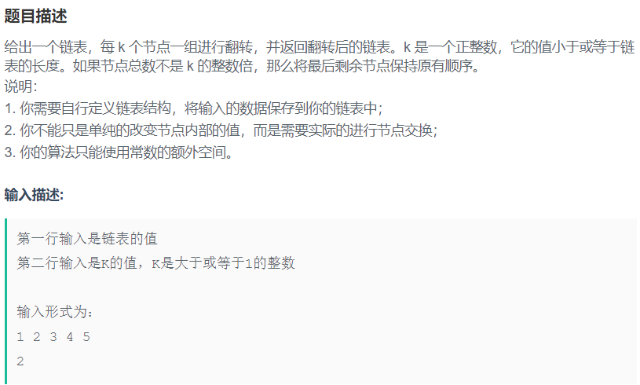
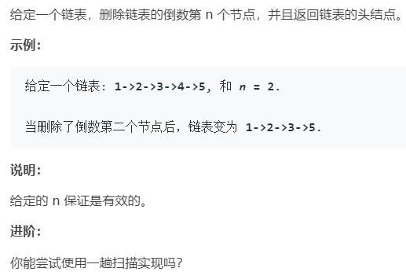
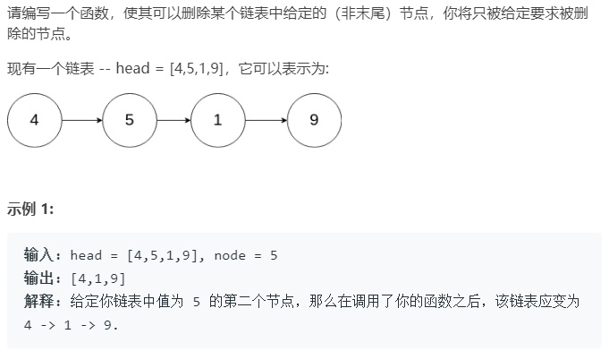

## 链表反转类

### 题一：206反转链表

题目描述如下：


按题目要求，用两种方法来实现。

**方法一：**
利用两个指针不断迭代实现，代码如下：

```cpp
class Solution {
public:
    ListNode* reverseList(ListNode* head) {
        ListNode * new_head=NULL;    //定义一个空指针
        while(head)
        {
            ListNode *temp = head->next;  //备份头节点的下一个节点
            head->next = new_head;        // 反转head指针，指向new_head
            new_head = head;              // 移动new_head指针
            head = temp;                  //移动head指针
        }
        return new_head;        
    }
};
```

**方法二：**
采用递归的方法，对于递归的方法不要陷入递归内部去，不然很容易出不来了，从宏观上来考虑。下面先给出代码：

```cpp
class Solution {
public:
    ListNode* reverseList(ListNode* head) {
        //先给出递归终止的条件
        if(head==NULL||head->next==NULL){
        return head;
        }
        ListNode*next = reverseList(head->next);  //递归调用，返回反转后链表的头节点
        head->next->next = head;
        head->next = NULL;
        return next;
    }
};
```

对于递归算法，首先要明确递归函数的意义或者说作用，上面代码的定义是：**输入一个节点 head，将「以 head 为起点」的链表反转，并返回反转之后的头结点。**

初始链表如下：


所以对于`ListNode*next = reverseList(head->next)`的意思如下图所示：


把后面看成一个整体，你只管执行后会得到什么结果，结果如下所示：


接下来就是最后两行代码，`head->next->next=head`,也就是将上图中的2指向1；最后将`经过head->next=NULL`就完成了全部操作。


所以在递归中，不要深究递归中在递归.....是怎么操作的，单步调试都能晕，硬想就更难受了。

### 题二：反转前n个节点

反转链表的前n个节点，n小于等于链表长度。例如：
输入：1->2->3->5->6->
输出：3->2->1->5->6->

**方法一：**
迭代法，和前一题类似，只是增加了反转节点计数。

```cpp
class Solution
{
public:
    ListNode *reverseN(ListNode *head,int n){
        ListNode *new_head = NULL;      
        ListNode *head_tmp = head;      //备份头节点
        while(head&&n--)                //反转前n个节点
        {
            ListNode *next = head->next;
            head->next = new_head;
            new_head = head;·
            head = next;
        }
        head_tmp->next = head;        //将反转后的节点和剩余节点相连。
        return new_head;
    }
};
```

初始状态如下图


将前三个节点进行反转后得到如下


然后代码`head_tmp->next = head` 将反转后的链表和剩余链表连接起来。
方法二
递归的方法，和前一个题的区别在于多出来一段没有反转的链表，所以再前面的基础上将没有反转的链表连接起来就行了。从宏观上来看就只有三个节点，反转前两个节点。以此来理解递归。
代码如下

```cpp
class Solution
{
public:
    ListNode *reverseN(ListNode *head,int n){
        if(n ==1)                   //n=1时反转一个元素，也就是它本身(也就是递归反转最后一个节点时)，这个时候要记录它后面的节点。
        {
            last = head->next;     //记录第n+1个节点
            return head;
        }
        ListNode *next = reverseN(head->next, n - 1);    // 反转以head->next为头节点的前n-1个元素
        head->next->next = head;
        head->next = last;
        return next;
    }
private:
    ListNode *last = NULL;
};
```

代码`ListNode *next = reverseN(head->next, n - 1);`图示如下


完成后结果为


然后通过`head->next->next = head;`完成局部反转，再将反转后的链表与未反转部分相连。结果如下


### [题三：每k个为一组反转链表](https://www.nowcoder.com/practice/a632ec91a4524773b8af8694a51109e7)



```cpp
#include <iostream>
#include <vector>
#include <algorithm>
using namespace std;
struct ListNode
{
    int val;
    ListNode *next;
    ListNode(int x) : val(x), next(NULL) {}
};
ListNode *reverseList(ListNode *pHead, int k)
    {
        ListNode *right = pHead;
        ListNode *left = pHead;
        ListNode *prev = pHead;
        for (int i = 0; i < k; i++)
        {
            if (right != nullptr)
                right = right->next;
            else
                return left;
        }
        ListNode *head = left;   //备份当前头节点，也是反转后的尾节点
        while (left != right)
        {
            ListNode *pNext = left->next;
            left->next = prev;
            prev = left;
            left = pNext;
        }
        //将此时的尾节点和后续反转的头节点相连
        head->next = reverseList(right, k);  
        return prev;
    }
int main()
{
    ListNode new_head(0);
    ListNode *pre = &new_head;
    vector<int> data;
    int num;
    while (cin >> num)
    {
        data.push_back(num);
    }
    for (int i = 0; i < data.size() - 1; i++)
    {
        ListNode *temp = new ListNode(data[i]);
        pre->next = temp;
        pre = pre->next;
    }
    int k = data[data.size() - 1];
    ListNode *head = new_head.next;
    head = reverseList(new_head.next, k);
    while (head)
    {
        cout << head->val << " ";
        head = head->next;
    }
    return 0;
}
```


### 题四：92 反转m至n位姿的节点


**方法一：**
迭代法，关键在于找到反转的起始节点，并记反转节点的前一个节点；再找到反转完成后的下一个节点；其他就和前一题类似了。
代码如下

```cpp
class Solution
{
public:
    ListNode *reverseBetween(ListNode *head, int m, int n)
    {
        int change_len = n - m + 1; //计算需要逆置的节点个数
        ListNode *pre_start= NULL;  //初始化开始逆转的节点的前驱
        ListNode *result = head;    //最终转换后的链表头节点
        while (head && --m)         //将head向前移动m-1个节点 (--m做判断时，是将m-1的结果作为判断值；m--,是用m值作判断，然后再进行m-1)
        {
            pre_start = head; //记录head的前驱
            head = head->next;
        }
        ListNode *modify_list_tail = head; //此时逆转后部分链表的尾节点（原链表需要逆转的起始节点）
        ListNode *new_head = NULL;
        //逆转节点
        while (head && change_len)
        {
            ListNode *next = head->next;
            head->next = new_head;
            new_head = head;
            head = next;
            change_len--;
        }
        modify_list_tail->next = head;
        if (pre_start)
        {
            pre_start->next = new_head;
        }
        else
        {
            result = new_head;
        }
        return result;
    }
};
```

找到起始反转节点时，状态如图所示，


## 链表专题

### [19. 删除链表的倒数第N个节点](https://leetcode-cn.com/problems/remove-nth-node-from-end-of-list/)



<strong style="color:red;">对于任何有可能删掉头节点的链表问题，都构建一个dummy虚拟节点，避免讨论删掉头节点。</strong>

采用双指针的方法，寻找倒数第n+1个节点（只有知道目标节点的前一个节点才能进行删除）

```cpp
class Solution {
public:
    ListNode* removeNthFromEnd(ListNode* head, int n) {
        ListNode*dummy = new ListNode(-1);
        dummy->next = head;
        ListNode*fast = dummy;
        ListNode*slow = dummy;
        while(n--) fast = fast->next;
        //fast指针指向最后一个节点时，fast->next = NULL;
        while(fast->next) 
        {
            fast = fast->next;
            slow = slow->next;
        }
        slow->next = slow->next->next;
        return dummy->next;
    }
};
```

### [237. 删除链表中的节点](https://leetcode-cn.com/problems/delete-node-in-a-linked-list/)



单链表给出一个需要删除的节点，由于不知道前一节点，实际上是不能删除的。

可以将node的下一个节点的值赋给node，然后删掉`node->next`节点实现。

```cpp
class Solution {
public:
    void deleteNode(ListNode* node) {
        node->val = node->next->val;
        node->next = node->next->next;
        //将node结构体中储存的值更改为node->next中储存的值，包括值和指针
        //*(node) = *(node->next)
    }
};
```

### [61. 旋转链表](https://leetcode-cn.com/problems/rotate-list/)

### [24. 两两交换链表中的节点](https://leetcode-cn.com/problems/swap-nodes-in-pairs/)