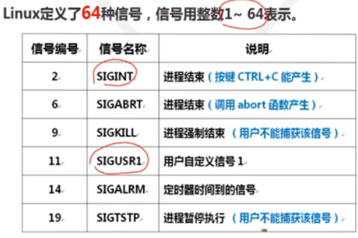
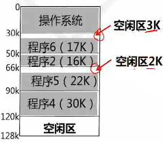
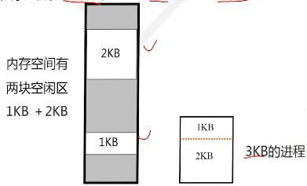
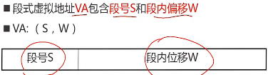
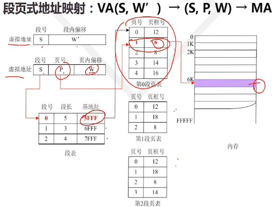
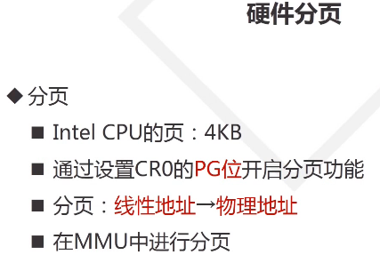

# 1、操作系统功能

## 功能一：进程管理（cpu管理）

**进程控制**：创建、暂停、唤醒、撤销；
**进程调度**：调度策略，优先级
**进程通信**：进程间通讯

## 功能二：内存管理

**内存分配**
**内存共享**
**内存保护**
**虚拟内存**

## 功能三：设备管理

**设备的分配和调度**
**实现设备无关性**
**实现设设备传输控制**
**实现设备驱动**

## 功能四：文件管理

**存储空间管理**
**文件操作**
**目录操作**
**文件和目录的存取权限管理**

**一个软件如果具备进程管理和内存管理功能就可以称为是操作系统。这也是与普通软件最大的区别**。

**操作系统定义：**

- 操作系统是一个大型系统程序。提供用户**接口**，方便用户控制计算机。
- 负责为应用程序**分配和调度软硬件资源**，并控制与协调应用程序并发活动，帮助用户存取和保护信息。

# 2、操作系统逻辑结构

## 操作系统逻辑结构

### 整体式结构

**以模块为基本单元构建**
**特点**

- 模块设计、编码和调试独立
- 模块调用自由
- 模块通讯多以全局变量形式完成
  **缺点**
  信息传递随意，维护和更新困难

### 层次式结构

典型层次结构软件：TCP/IP协议栈（应用层、传输层、网络层和链路层）
**分层结构的操作系统**

**分层原则**

- 硬件相关---最底层
- 外部特性---最外城
- 中间层---调用次序或消息传递顺序
- 共性的服务--- 较低层
- 活跃功能---较低层
  **优点**
- 结构清晰，避免循环调用
- 整体问题局部化，系统的正确性容易保证
- 有利于操作系统的维护、扩充和移值

### 微内核结构（客户/服务器结构）

**微内核操作系统=微内核+核外服务器**
**微内核**

- 足够小，提供操作系统最基本的核心功能和服务
- 实现与硬件密切相关的处理
- 实现一些叫基本的功能
- 负责客户和服务器之间的通讯
  **核外服务器**
- 完成操作系统大部分服务功能，等待应用次序提出请求（面向用户）
- 由若干服务器或进程共同构成，例如进程/线程服务器，虚存服务器，设备管理服务器等以进程形式运行在用户态

## CPU态

**支持操作系统的最基本硬件结构**

- CPU
- 内存
- 中断
- 时钟

#### CPU态

**CPU态**指cpu的工作状态，也是对资源和指令使用权限的一种描述。
**核态**

- 能够访问所有资源和执行所有指令（可以使用特权指令）
- 管理程序和内核都工作在核态上
  **用户态**
- 仅能访问部分资源
- 用户程序工作在用户态
  **管态**
- 介于核态核用户态之间

#### 用户态和核态之间的转换

**用户态向核态转换（面试）**

- 用户请求OS提供服务
- 发生中断
- 用户进程产生错误
- 用户态企图执行特权指令
  **核态向用户态转换**
- 一般是执行终端返回：IRET

#### 硬件和OS对CPU的观察

- 硬件按**态**来区分CPU状态
- OS按**进程**来区分CPU状态

## 存储器


## 中断机制

**中断定义**

- 终端机制是指CPU对突发的外部事件的反应过程或机制
- CPU收到**外部信号**（终端信号）后，停止当前工作，转去处理该** **，处理完毕后会到原来的**中断处**（断点），继续原来的工作  
  
  **引入中断的目的**
- 实现并发活动（cpu和外设并行工作，）
- 实现实时处理
- 故障自动处理
  **中断源和中断类型**
- 引起系统中断的事件称为中断源
- 中断类型
  *强迫性中断和自愿中断*
  1、强迫中断：程序没有预期：例如I/O、外部中断
  2、自愿中断：程序有预期。例如访管中断
  *外中断（中断）和内中断（俘获）*
  1、外中断：由CPU外部时间引起。例如：I/O，外部事件
  2、由CPU内部事件引起。例如：访管中断、程序中断
- 断点
  程序中断的地方，将要执行的下一条指令的地址.
  CS:IP
- 现场
  程序正确运行所以来的信息集合（发生终端前相关寄存器的内容）
- 现场的两个处理过程
  1、现场的保护：进入终端服务程序之间，现场数据保存在栈里面
  2、现场的恢复：退出终端服务程序之后，从栈中还原到寄存器
- 中断响应过程
  1、识别中断源
  2、保护断点和现场
  3、装入中断服务程序的入口地址（CP:IP）
  4、进入中断服务程序
  5、恢复现场和断点
  6、中断返回：（IRET）
- 中断响应的实质
  1、交换指令执行地址（由原来的主程序地址转换到中断服务程序入口地址）
  2、交换CPU态（中断响应是在核态完成的，主程序在服务态。有服务台与之间的核态转换）
  3、工作
   现场保护和恢复，参数传递（中断服务机制也许会传递一些参数给主程序）

## 面试题

### 用户态和内核态区别？

用户态和内核态是操作系统的两种运行级别，两者最大的区别就是特权级不同。用户态拥有最低的特权级，内核态拥有较高的特权级。运行在用户态的程序不能直接访问操作系统内核数据结构和程序。内核态和用户态之间的转换方式主要包括：系统调用，异常和中断。

### 操作系统为什么要分内核态和用户态？

为了安全性。在cpu的一些指令中，有的指令如果用错，将会导致整个系统崩溃。分了内核态和用户态后，当用户需要操作这些指令时候，内核为其提供了API，可以通过系统调用陷入内核，让内核去执行这些操作。
3、请你来说一说用户态到内核态的转化原理

# 3、操作系统用户界面

## 操作系统启动过程

### BIOS和主引导记录MBR

- 实模式
- 保护模式

### 操作系统启动过程

**启动过程**

- 从加电到用户工作环境准备好的过程

  1、初始化引导

   

  2、核心初始化

  

  3、系统初始化


**Windows初始化**


Linux的启动过程


## 操作系统的生成

### 操作系统的生成

满足特定硬件环境和用户需要，组装和构建操作系统过程

### 操作系统生成的主要步骤

- 根据硬件环境和用户要求配置功能和够构造参数
- 构建OS映像

### 操作系统生成的前提

- 操作系统由可拆装模块构成
- 有交互式配置工具
- 有映像构建工具

### Linux操作系统的生成

- 获取Linux内核的源代码

- 选择和启动内核配置工具i

  ```shell
  cd usr/src/linux-x.x
  make menuconfig
  ```

- 根据需要配置内核模块和参数

- 重新编译新的内核

- 编译和安装模块

- 启动新内核

## 用户界面

### 用户界面的定义


**shell** Linux终端上的操作指令


###  shell 脚本编程

**脚本(script)**：通过类似程序的方式指向具有一定逻辑顺序的命令序列完成较为复杂的功能和人机交互

- 脚本程序保存在文本文件中

- 脚本程序是Shell命令语句的集合

  

# 4、进程管理

## 进程管理的概念

**并发（concurrency）：**指宏观上看起来两个程序同时运行（例如单核CPU上的多任务）。但是从微观上看两个程序的指令是交织着运行的（你的指令之间穿插着我的指令，我的指令之间穿插着你的）在单个周期内只运行了一个指令。这种并发并不能提高计算机的性能，只能提高效率。

**并行（parallelism）：**指严格物理意义上的同时运行（比如多核CPU，两个程序分别运行在两个核上）两者之间互不影响，单个周期内每个程序都运行了自己的指令，也就是运行了两条指令。这样说来并行的确提高了计算机的效率。所以现在的cpu都是往多核方面发展。

### 进程的基本概念

**进程：**描述和管理程序的”运行过程“

- **进程是程序在某个数据集合上的一次运行活动。**
- 数据集合：软/硬件环境，多个进程共存/共享的环境。  

**进程的特点**

- 动态性：进程是**程序的一次执行过程**，动态产生/消亡
- 并发性：进程同其他进程一起向前推进
- 异步性：进程按各自速度向前推进
- 独立性：进程是系统分配资源和调度CPU的单位

**进程与程序的区别**

- 动态与静态
  - 进程是动态的：程序的一次执行过程
  - 程序是静态的：一组指令的有序集合

- 暂存与长存
  - 进程是暂存的：再内存中驻留
  - 程序是长存的：在介质中长期保存

- 程序和进程的对应
  - 一个程序可能有多个进程

**进程类型**


### 进程状态

**运行状态（Running）**

- 进程已经占用CPU，在CPU上运行

**就绪状态（Ready）**

- 具备运行条件由于无CPU，暂时不能运行。

**阻塞状态（Block）**

- 因为等待某项服务完成或信号不能运行的状态
- 如等待：系统调用，I/O操作，合作进程信号

**进程状态的变迁**


**Linux进程状态**


### 进程控制块

**进程控制块**（PCB）

- 描述进程状态、资源和相关进程关系的**数据结构**
- PCB是进程的标志
- 创建进程时创建PCB，进程撤销后PCB同时撤销

**进程 = 程序+PCB**


**PCB数据结构**


**Linux的进程块:task_struct**


## 进程的控制

### 进程控制的概念

**概念**

​		在进程生存全期间，对其全部行为的控制

**四个典型的控制行为**

- **进程的创建**

  **功能：**创建一个具备指定标识（ID）的进程。

  **参数：**进程标识、优先级、进程起始地址、CPU初始状态、资源清单等。

  **创建进程的过程：**

  - 创建一个空白PCB
  - 获得并赋予进程标识符ID
  - 为进程分配空间
  - 初始化PCB
  - 插入相应的进程队列 （新进程插入就绪队列）

- **进程撤销**

  **功能：**撤销一个指定的进程，收回进程所占有的资源，撤销该进程的PCB

  **进程撤销的时机/事件**

  - 正常结束
  - 异常撤销
  - 外界干预

  **进程撤销参数：**被撤销的进程名（ID）

  **进程撤销的实现**

  - 在PCB队列中检索出该PCB
  - 获取该进程状态
  - 若该进程处在运行态，立即终止该进程（递归加内存是否有子进程，先撤销子进程）
  - 释放进程占有的资源
  - 将进程从PCB队列中移除

- **进程阻塞**

  **功能：**停止进程的执行，变为阻塞。

  **阻塞的时机/事件**

  - 请求系统服务（由于某种原因，OS不能立即满足进程的要求）
  - 启动某种操作（进程启动某种操作，阻塞等待操作完成）
  - 新数据尚未到达（A进程要获得B进程的中间机构，A进程等待）
  - 无新工作可做（进程完成后，自我阻塞，等待新任务到达）

  **参数**

  - 阻塞原因
  - 不同原因构建有不同的阻塞队列

  **进程阻塞的实现**

  - 停止运行
  - 将PCB运行态改为阻塞态
  - 插入相应的阻塞队列
  - 转调度程序

- **进程唤醒**

  **功能：**唤醒处于阻塞队列中的某个进行

  **进程唤醒的实际/事件**

  - 系统服务由不满足到满足
  - I/O完成
  - 新数据到达
  - 进程提出新请求（服务）

  **参数：**被唤醒进程的标识

**进程控制原语**

**原语**

- 由若干指令构成的具有特定功能的函数
- 具有原子性，其操作不可分割

### Windows进程控制

 **CreatProcess()创建进程**


**结束进程**


### Linux进程控制

**创建进程——fork()**

```
pit_t fork(void);
例如 pid_t pid = fork();
```

- 新进程是当前进程的子进程
- 父进程和子进程
  - 父进程：fork()函数的调用者
  - 子进程：新建的进程
- **子进程是父进程的复制**（相同的数据、堆栈、程序，进程id不一样，与时间有关的数据不一样）

  - 父进程和子进程**并发运行**
- fork返回值pid
  - 在子进程中pid=0；
  - 在父进程中pid>0（子进程的ID号）
  - 出错：pid = -1
  - **子进程执行fork后的代码**（不然其不是无休止的创建进程？）

```cpp
int main(void)
{
    pid_t pid;
    pid = fork();
    //fork后的代码会在父进程执行一遍，然后在子进程执行一遍
    //输出时是父进程先输出还是子进程先输出并不确定（二则并发，前后不确定 ）
    if(pid==0)
    {
        printf("hello world\n");//子进程输出
    }
    else if(pid>0)
    {
       printf("how are you\n"); // 父进程输出
    }
}

//输出
hello world  //子进程输出
how are you  // 父进程输出
```

[**进程执行与父进程不同的功能**](https://www.cnblogs.com/blankqdb/archive/2012/08/23/2652386.html)

通过exec函数族（包含若干函数）

**功能：**装入一个指定的可执行程序运行，是子进程具有和父进程完全不同的功能

**步骤：**

- 根据文件名找到相应的可执行程序
- 将可执行程序的内容填入子进程的地址空间
- 进入新进程执行且不在返回

## 线程

### 线程的基本概念

#### **线程（Thread）**

- 线程是可有CPU直接运行的实体（当CPU有线程时，进程就不再是CPU调度和分配资源的基本单位）
- 一个进程内部可以创建多个线程 
- 多个线程共享CPU可以实现并发运行 


#### **单线程程序**

整个进程只有一个线程，Windows程序缺省只有一个线程（主线程，main线程）

#### **多线程**

整个进程至少有2个线程。主线程和至少1个用户线程

#### 面试

##### 线程和进程的区别？

进程和线程的主要差别在于它们是不同的操作系统资源管理方式。**进程有独立的地址空间，一个进程崩溃后，在保护模式下不会对其它进程产生影响**，而**线程只是一个进程中的不同执行路径**。线程有自己的堆栈和局部变量，但线程之间没有单独的地址空间，**一个线程死掉就等于整个进程死掉**，所以多进程的程序要比多线程的程序健壮，但在进程切换时，耗费资源较大，效率要差一些。但对于一些要求同时进行并且又要共享某些变量的并发操作，只能用线程，不能用进程。

1) 简而言之,一个程序至少有一个进程,一个进程至少有一个线程.

2) 线程的划分尺度小于进程，使得多线程程序的并发性高。

3) 另外，进程在执行过程中拥有独立的内存单元，而多个线程共享内存，从而极大地提高了程序的运行效率。

4) 线程在执行过程中与进程还是有区别的。每个独立的线程有一个程序运行的入口、顺序执行序列和程序的出口。但是线程不能够独立执行，必须依存在应用程序中，由应用程序提供多个线程执行控制。

5) 从逻辑角度来看，多线程的意义在于一个应用程序中，有多个执行部分可以同时执行。但操作系统并没有将多个线程看做多个独立的应用，来实现进程的调度和管理以及资源分配。这就是进程和线程的重要区别。

### 线程典型应用场景

#### 一个程序的多个功能需要并发运行

- 在线看电影软件时并发的功能（视频解码、音频解码、网络接收等），每一个功能都创建为一个线程，从而实现多功能的并发。

- 改善窗口交互度的时候（如下图场景，后台运算期间，窗口输入会出现未响应。由于操作系统缺省是单线程，解决该问题需要把后台计算函数创建为线程 ）

  

  Windows**文件拷贝程序**是多线程程序，后台的文件拷贝操作是独立的线程

#### 需要改善程序结构的地方

#### 多核CPU上的应用，拆分发挥多核性能

#### 补充说明


**使用线程的问题**

- 程序难以调试
- 并发过程难以控制
- 线程安全问题

## 临界区与锁

### 临界资源与临界区


如上图所示红色区域即为**临界区**，i即为**临界资源**

**临界资源(Critical Resource)**

- 一次只允许一个**进程**独占（使用）资源。

**临界区(Critical Section)**

- 进程中访问临界资源的**程序段**

**临界区临界资源的访问特点**

- 具有排他性 
- 并发进程不能同时进入临界区

**设计临界区访问机制的四个原则**

- **忙则等待：**当临界区忙的时候，其他进程必须在临界区外面等待
- **空闲让进：**当无进程处于临界区时，任何有权进程可进入临界区
- **有限等待：**进程进入临界区的请求应在有限时间得到满足
- **让权等待：**等待进程放弃CPU（让其他进程有机会得到CPU）

### 锁机制

**基本原理：**  

- 设置一个**标志**S，表明临界资源 **可用**还是*不可用* ？**1**：*0*
- 进入临界区之前检测标志是否可用？——**上锁操作**
  - 若不可用状态，进程在临界区之外进程等待
  - 若可用状态，访问临界资源，并且将标志需修改为不可用。
- 退开临界区时标志修改为可用状态。——**开锁操作**

 **上锁操作**

- 第一步：检测锁S的状态（0或1？）
- 第二步：如果S=0，返回第一步
- 第三步：如果S=1，则置其为0

```c++
Lock(S)//上锁操作
{
    test:if(S==0)
        goto test;  //测试锁标识
    else  // S==1
        S=0;// 上锁
}
```

**开锁操作**

**把锁S状态置1**

```cpp
UnLock(S) // 开锁操作
{
    S=1;开锁
}
```

**用锁机制访问临界区**

- 初始化状态S=1（可用）
- 进入临界区之前执行上锁Lock(S)操作
- 离开临界区之后执行开锁UnLock(S)操作


## 同步和P-V操作

### 同步和互斥的概念

**进程的互斥关系**

- 多个进程由于共享了**独占性资源**，必须协调各进程对资源的存取顺序，确保没有任何两个或以上进程同时进行**存取操作**
- **互斥和资源共享相关**
- 资源：**临界资源**
- 存取操作区域：**临界区**

**进程之间的同步关系**

- 若干合作进程为了完成一个共同的任务，需要相互协调运行步伐：一个进程开始某个操作之前必须要求另一个进程已经完成某个操作，否则前面的进程只能等待。如下一个例子

  

**进程的同步关系——另一种解释**

- 合作进程中某些操作之间需要满足某种**先后关系**或某个操作能否进行需要满足**某个前提**，否则只能 等待。

**互斥关系属于特殊的同步关系**

### P-V操作概念

**信号灯的概念**

- 信号灯是一种卓有成效的进程同步机制
- 进程在运行过程中受信号灯状态控制，并能改变信号灯状态。
  - 进程受控制：信号灯的状态可以阻塞或唤醒进程
  - 改变信号灯：信号灯状态可以被进程改变

**信号灯机制**

- 信号灯数据结构


- 信号灯的操作

  - P操作（函数或过程，P(S,q)）

    

  - V操作（函数或过程，V(S,q)） 

    ·

    

### P-V操作解决互斥问题

类似于锁机制对互斥问题的解决

- 实质是实现对临界区的互斥访问，允许最多**一个进程**处于临界区
- 应用过程（类似于锁机制）
  - 进入临界区之前限制性P操作（可能回阻塞当前进程）
  - 离开临界区之后在执行V操作（可能唤醒某个进程）
  - **S的初始设置合理**


### P-V操作解决同步问题

**同步机制实质**

- 运行条件不满足时，能让进程暂停。
- 运行条件满足时，能让进程立即继续

**P-V操作应用于进程同步的基本思路**

- 暂停当前进程：在**关键操作**之前执行P操作，可以必要时暂停当前进程

- 继续进程：在**关键操作**之后执行V操作，可以必要时唤醒合作进程

- 定义有意义的信号量S，并设置合适的初值。（信号量S能明确地标识运行条件）

  

  

### 经典同步问题

 **经典同步问题一：生产者和消费者问题**


  

**经典同步问题二：读者和编者问题**


**小结**

**信号灯机制P-V操作解决同步问题**

- 关键操作之前P操作
- 关键操作之后V操作
- 区分关键操作或运行条件或影响

生产者和消费者问题第一个同步和互斥混合的问题

读者和编者的同步和一步混合问题

## Windows和Linux同步机制

### Windows同步机制

- **临界区机制 (CRITICAL_SECTION)**
  - 在**进程内使用**，保证仅有一个线程可以申请到该对象
  - 临界区内是临界资源的访问

 

- **互斥量（Mutex）**
  - 保证只有一个线程或进程可以申请到该对象
  - 可以**跨进程使用**
  - 可以有名称
  - 互斥量比临界区要耗费更多资源，速度慢


- **信号量（Semaphore）**
  - 允许指定**数目的多个线程/进程访问临界区**
  - 一种资源计数器，用于限制并发线程的数量
  - 初始值可设为N，则表示运行N个进程/线程**并发访问资源**


**信号量**

- 信号量的值可以通过相应函数增或减。
  - WaitForSingleObject函数将信号量减1；
  - ReleaseSemaphore函数将信号量增1；
- 信号状态
  - 信号量的值大于0时，有信号状态
  - 信号量的值小于0时，为无信号状态 


**小结**


### Linux父子进程同步

**进程的阻塞wait( )**

进程调用**wait(int status)**阻塞自己

- 阻塞到有子进程结束？
  - 没有：继续阻塞 
  - 有（僵尸进程），wait搜集该子进程信息并彻底销毁它后返回
- statue 保存进程退出时的状态，若忽略退出信息，```pid = wait（NULL）```

**进程的终结exit( )**

调用**void exit(int status)**终结进程

进程终结时要释放资源并报告父进程

- 利用status传递进程结束时的状态
- 变为**僵尸状态**，保留部分PCB信息供wait收集
  - 正常结束还是异常结束
  - 占用总系统CPU事件
  - 缺页中断次数
- 调用schedule( )函数，选择新进程运行

**进程的休眠sleep( )**

**sleep(int nSecond)**

- 进程暂停执行nSecond秒
- 系统暂停调度进程
- 相当于Windows的suspend()， 挂起若干秒

```c++
int main()
{
    pid_t pid,pid_1,pid_2;
    pid = fork();
    if(pid==0)//子进程
        pid_1 = getpid( );
    	printf("pid_1 = %d\n",pid_1);
    	sleep(10);
    if(pid>0)  //父进程
        pid_2 = wait(NULL);
    	printf("pid_2 = %d\n",pid_2)
    exit(0);
}

输出时pid_1= pid_2
```

**父子进程共享普通变量**

对于普通变量，父子进程各自操作变量副本，互相不干扰。

```C++
int main(int argc,char *argv[])
{
    pid_t pid;
    int i=1;
    pid = fork();
    if(pid == 0)
    {
        i = 2;
        printf("in child i = %d\n",i);
        exit();
    }
    if(pid>0)
    {
        sleep(0);//10s休眠，让子进程限制性
        printf("in parent i = %d\n",i);
        exit(0);
    }
}
//输出
    in child i=2
    in parent i=1
```

**父子进程之间共享文件资源**

对于文件，父子进程共享统一文件和读写指针

```c++
int main(int argc,char *argv[])
{
    int file;
    char*chA = "A";
    char*chB = "B";
    char*chC = "C";
    file = open("text.txt");
    write(file,chA,strlen(chA));
    pid_t pid = fork();
    if(pid == 0)
    {
        write(file,chB,strlen(chB));
        exit();
    }
    else
    {
        sleep(10);
        write(file,chC,strlen(chC));
        exit();
    }
}
//输出
	ABC
```

### 面试

- 僵尸进程

  参考回答：

  **1）正常进程**

  正常情况下，子进程是通过父进程创建的，子进程再创建新的进程。子进程的结束和父进程的运行是一个异步过程，即父进程永远无法预测子进程到底什么时候结束。 当一个进程完成它的工作终止之后，它的父进程需要调用wait()或者waitpid()系统调用取得子进程的终止状态。

  unix提供了一种机制可以保证只要父进程想知道子进程结束时的状态信息， 就可以得到：在每个进程退出的时候，内核释放该进程所有的资源，包括打开的文件，占用的内存等。 但是仍然为其保留一定的信息，直到父进程通过wait / waitpid来取时才释放。保存信息包括：

  1进程号the process ID

  2退出状态the termination status of the process

  3运行时间the amount of CPU time taken by the process等

  **2）孤儿进程**

  一个父进程退出，而它的一个或多个子进程还在运行，那么那些子进程将成为孤儿进程。孤儿进程将被init进程(进程号为1)所收养，并由init进程对它们完成状态收集工作。

  **3）僵尸进程**

  一个进程使用fork创建子进程，如果子进程退出，而父进程并没有调用wait或waitpid获取子进程的状态信息，那么子进程的进程描述符仍然保存在系统中。这种进程称之为僵尸进程。

  僵尸进程是一个进程必然会经过的过程：这是每个子进程在结束时都要经过的阶段。

  如果子进程在exit()之后，父进程没有来得及处理，这时用ps命令就能看到子进程的状态是“Z”。如果父进程能及时 处理，可能用ps命令就来不及看到子进程的僵尸状态，但这并不等于子进程不经过僵尸状态。

  如果父进程在子进程结束之前退出，则子进程将由init接管。init将会以父进程的身份对僵尸状态的子进程进行处理。

  危害：

  如果进程不调用wait / waitpid的话， 那么保留的那段信息就不会释放，其进程号就会一直被占用，但是系统所能使用的进程号是有限的，如果大量的产生僵死进程，将因为没有可用的进程号而导致系统不能产生新的进程。

  外部消灭：

  通过kill发送SIGTERM或者SIGKILL信号消灭产生僵尸进程的进程，它产生的僵死进程就变成了孤儿进程，这些孤儿进程会被init进程接管，init进程会wait()这些孤儿进程，释放它们占用的系统进程表中的资源

  内部解决：

  1、子进程退出时向父进程发送SIGCHILD信号，父进程处理SIGCHILD信号。在信号处理函数中调用wait进行处理僵尸进程。

  2、fork两次，原理是将子进程成为孤儿进程，从而其的父进程变为init进程，通过init进程可以处理僵尸进程。

## 进程通讯

### **Windows匿名管道通讯**

**匿名管道通讯机制**

- **管道定义：**

  管道是进程间的一种通信机制 ，一个进程A可以通过管道把数据传输给另一个进程B。前者（A）向管道输入数据，后者（B）从管道读取数据

- **管道的工作原理** 

  

  **注意事项：匿名管道仅能用于父子或兄弟进程间通信**

  

  

  

  **实例**

  将算命大师dos程序的exe文件通过匿名管道通讯转化为了窗口程序 

  

  

  [ 参考](https://blog.csdn.net/qq_15029743/article/details/79492645)

管道工作原理


### **Linux信号通讯**

**信号的概念（signal）**

- 信号是Linux进程间一种重要的通信机制
- 信号是向进程发送的一个通知，通知某个事件已经发生
- 收到信号的进程可以立即执行指定的操作
- 信号的发出可以是进程，也可以是系统（含硬件 ）

**Linux信号的产生**

- 来源1：键盘执行特殊的组合键产生信号，例如Ctrl+C；
- 来源2：执行终端命令参数信号，例如kill系列命令
- 来源3：程序中调用函数参数信号，例如kill(),abort()
- 来源4：硬件异常或内核产生相应信号，例如内存访问错误



**信号机制编程**

- 示例1


​	**signal():注册信号处理函数的函数。**

```c++
void signal(
	int SigNo,    //信号编号 
	void(*Handle)int)  // 自定义的处理函数
```

 	**功能：**为指定信号注册信号处理函数。当进程收到SigNo信号时，立即自动调用Handle函数执行。一般在进程初始化时使用该函数注册信号处理函数。

```c++
#include<signal.h>
#include<stdio.h>
void int_handler(int signum)
{
    printf("\nBYE BYE!\n");
    exit(-1);
}
int main()
{
    signal(SIGINT,int_handler);
    printf("int_handler set for SIGINT\n");
    while(1)
    {
        printf("go to sleep\n");
        sleep(10);
    }
    return 0;
}
```

- 实例2

  


**kill()函数：发送信号函数**

```C++
//原型
void kill(
	int PID,  //接收信号的目标进程ID
    int SigNo // 待发送的信号
)
```

**功能：**向目标进程PID发送SigNo信号


# 5、死锁

## 死锁的概念

**死锁的定义：**两个或多个进程无限期地等待永远不会发生的条件的一种系统状态。（结果：每一个进程都永远阻塞）多个线程在运行过程中互相竞争资源发生的僵局，若无外力作用，它们都无法推进下去

**另一个定义:**在两个或多个进程中，每个进程都**持有某种资源**，但又**继续申请其他进程已持有的资源**。此时每个进程都拥有其运行所需的一部分资源，但是又都不够，从而每个进程都不能向前推进，现如阻塞状态。

如下图所示，线程A持有资源2，线程B持有资源1。他们同时都想申请对方的资源所以这两个线程就会互相等待对方释放持有资源而陷入死锁状态。


## 死锁的起因

**系统资源有限**

- 资源数目不足，进程对资源的竞争而产生死锁

 **并发进程的推进顺序不当**

- 进程请求资源和释放资源的顺序不当，导致死锁

**不正确的P-V操作可能会带来死锁**

**结论**

- 参与死锁的进程至少是2个
- 参与死锁的进程至少有两个已经占有资源
- 参与死锁的所用进程都在等待资源
- 参与死锁的进程是当前系统所有进程的子集
- 死锁会浪费大量系统资源，甚至导致系统崩溃

##  死锁预防策略

**死锁的必要条件（面试）**

- **互斥条件：**进程互斥使用资源，**资源具有独占性**

- **不剥夺条件：**进程在访问完资源前不能被其他进程强行剥夺。

- **部分分配条件（请求与保持条件）**

  - 一个进程因请求资源而阻塞时，对已经获得的资源保持不放
  - 进程便运行边申请资源，临时需要临时分配，区别于全部分配。

- **环路条件（循环等待条件）：**

  - 多个进程构成环路：环中每个进程已经占用的资源被前一进程申请，而自己所申请资源又被环中后一进程占用。

    

**解决死锁的策略**

- **预防死锁：**

  - 通过设置某些限制条件，破坏死锁四个必要条件中的一个或多个，来防止死锁。

  

  - 较易是西安，早期广泛使用
  - 缺点：由于限制太严格，导致资源利用率和吞吐量降低

- **避免死锁**

  -  不事先采取限制去破坏产生死锁的条件，而是在资源分配过程中，用某种方法去**评估若分配资源是否会让系统进入死锁**若是，则拒绝此次分配资源，从而避免死锁。
  -  银行家算法
  -  只需要较弱的限制条件，可获得较高的资源利用率和系统吞吐量。缺点：实现较难

- 检测和恢复死锁

  - 允许发生死锁，但可通过检测机制及时检测出死锁状态，并精确确定于死锁有关的进程和资源，然后采取适当措施，将系统已经发生的死锁清楚，将进程从死锁状态解脱出来。
  - 检测方法复杂，实现难度大
  - 恢复方法依靠人工 ，撤销一些进程，回收资源再分配。

- **预先静态分配法**

  - 目的：破坏部分分配条件
  - 策略：进程运行前将所需资源一次性全部分配给它，因此进程运行过程中不在提出资源请求，从而避免出现阻塞或死锁
  - 特点：
    - 执行可能被延迟：所需资源不能全部满足时
    - 应用开销大：云向前估算资源需求
    - 资源利用率低：资源被占而不用。

- **有序资源分配法**

  - 目的：**破坏环路条件**，使得环路无法构成

  - 策略：

    - 系统中的每个资源分配有一个唯一序列号

    - 进程每次申请资源时只能申请序号更大的资源（如果进程占用资源的序号最大为M，则下次之恶能申请序号大于M的资源，而不能申请序号小于M的资源）

  - 按有序资源分配法分配资源并发进程不会发生死锁 

  - 资源分配策略：分配资源时检查资源序号是否符合递增规定

    - 若不符合：则拒绝该申请，撤销该进程
    - 若符合：且资源可用，予以分配
    - 若符合：但资源不可用，不分配，陷入阻塞

**Windows Linux没有采用死锁解决方法，留给用户自己解决**

# 6、进程调度

## 进程调度基本概念

**进程调度**

在合适的时候以**一定策略**选择一个就绪进程运行

**进程调度目标**

- 响应速度尽可能快
- 进程处理时间尽可能短
- 系统吞吐量尽可能大
- 资源利用率尽可能高
- 对所有进程公平
- 避免进程饥饿
- 避免死锁

以上原则之间存在自相矛盾，很难兼顾

**衡量指标**

- 周转时间/平均周转时间
- 带权周转时间/平均带权周转时间

## 典型调度算法

### **先来先服务调度算法**


例如：超市排队结账，后面的人买了很少的商品，而前面却排了很多大量货物的人


### **短作业有限调度算法**


### **响应比高者优先调度算法**

**响应比定义**

- 作业响应时间和运行时间的比值

- 响应比= 响应时间/运行时间

  ​			=（等待时间+运行时间）/运行时间

  ​			= 1+等待时间/运行时间

**算法**

- 计算每个作业的响应时间，选择响应比最高的作业优先投入运行

### **优先数调度算法**


### 循环轮转调度算法


   

## Linux进程调度

### Linux进程类型

**普通进程**

- 采用动态优先级来调度
- 调度程序周期性修改优先级（避免饥饿）

**实时进程**

- 采用静态优先级来调度
- 由用户预先指定，以后不会改变

### Linux进程的优先级


### 调度策略

- **实时进程**


- **普通进程**


- **进程调度的依据**


**动态优先级 与counter**

 

- **子进程新建时的counter**
  - 新建子进程counter从父进程时间片counter中继承一半
  - 防止用户无限制地创建后代进程而长期占有CPU

### 调度时机


### **进程切换**


# 7、存储管理

## **内存管理功能**

### **存储器功能需求**

- 容量足够大
- 速度足够快
- 信息永久保存
- 多道程序并行

### **多道程序并行带来的问题**

- 共享
  - 代码和数据共享，节省内存
- 保护
  - 不允许内存中的程序相互间非法访问

### **实际存储器体系**

- 三级存储体系
- cache（快，小，贵）+内存（适中）+辅存（慢，大，廉）
- 基本原理：
  - 当内存太小不够用时，用辅存（硬盘）来支援内存
  - 暂时不允许的模块换出道辅存上，必要时在换入内存


### **存储管理功能：1）地址映射**

**定义：**把程序中的地址（虚拟地址/虚地址/逻辑地址）变换成内存的真是地址（实地址/物理地址）的过程

**方式：**

- **固定地址映射**：编程和编译时确定逻辑地址和物理地址映射关系

  **特点：**程序加载时必须放在指定内存区域，容易产生地址冲突造成运行失败

- **静态地址映射：**程序**装入时**（例如双击应用程序时）又操作系统完成逻辑地址到物理地址的映射

  

  **特点:**程序运行之前确定映射关系；程序装入后不能移动（如果移动必须放回原来的位置）；程序暂用连续的内存空间

- **动态地址映射：**在程序执行过程中把逻辑地址转换为物理地址

  

  

### **存储管理功能：2）虚拟存储**

**解决的问题：**1、程序过大或过多时，内存不够，不能运行；2、多个程序并发时地址冲突，不能运行

**虚拟内存的概念：虚拟内存是面向用户的虚拟封闭存储空间**（抽象的假的）

- 现许地址空间
- 容量4G = 232byte
- 封闭空间（进程空间）
- 和物理地址分离（地址无冲突）
- 程序员编程时使用线性虚拟地址

**虚拟内存管理的目标**


### 存储管理功能：3）内存分配

- 为程序运行分配足够的内存空间
- 需要解决的问题
  - 放置策略：程序调入内存时将其放置在哪个/哪些内存区
  - 调入策略：何时把要运行的代码和要访问的数据调入内存
  - 淘汰策略：内存空间不够时，迁出（淘汰）哪些代码或数据腾出内存

### 存储管理功能：4）存储保护功能


## 物理内存管理

###  分区内存管理

分区内存管理可以分为**单一区储存管理**和**分区储存管理**（固定分区，动态分区）

**单一区存储管理**

- 定义：用户区不分区，完全被一个程序占用（例如dos）
- 优点：简单，不需要复杂硬件支持，适合单用户单任务OS
- 缺点：程序运行占用整个内存，即时小程序也是如此。内存浪费，利用率低 

**分区存储管理**

**定义：**把用户区内存划分为若干大小不等的分区，供不同程序使用。适合单用户单任务系统

根据分区的时机可以分为：

- **固定分区**

  - 定义：把内存固定的划分为若干个大小不等的分区供各个程序使用，每个分区的大小和位置都固定，系统运行期间不在重新划分

  - 分区表：记录分区的位置、大小和使用标志  

  

  - 特点：
    - 在程序装入之前，内存已被分区，不在改变；
    - 每个分区大小不同，适应不同大小的程序；
    - 系统要维护一个分区表
  - 缺点：
    - 浪费内存，程序比所在分区小
    - 大程序可能无法运行：程序可能比最大分区大
  - 建议
    - 根据分区表安排程序装入顺序，是每一个程序都能找到合适的分区运行
    - 当程序的大小、个数装入顺序灯都固定时，内存使用效率很高

- **动态分区**

  - 定义：在程序装入时创建分区，使分区的大小刚好与程序的大小相等  

  - 分区动态创建 

    

    

  - 特点：

    - 分区的个数和大小均可变
    - **存在内存碎片**

  - 动态分区需要解决的问题（后续）

    - 分区的分配
    - 分区的选择
    - 分区的回收
    - 解决内存碎片的问题

### 分区放置策略

#### **分区的分配**

- 空闲区表：描述内存空闲区的位置和大小的数据结构

  

- 分区的分配过程（假定用户要求的空间大小为s）

  - 从空闲区表的第1个分区开始，寻找大于等于S的空闲区

  - 找到后从分区中分割出大小为S的部分给 用户使用 

  - 分割后剩余部分作为空闲区仍然等级在空闲区表中 

    **注意：**分割空闲区时一般从底部分割

#### **空闲区表如何排序——放置策略**


- **首次适应法**

  

  **前提：**空闲区表首址递增排序

  **特点：**

  - 尽可能先使用低地址空间
  - 当需要较大分区时，在高地址空间有较大的满足可能性。

- **最佳适应法**

  

  **前提**：空闲区表按大小递增排序

  特点：

  - 尽可能先使用较小的空闲区，保留大的空闲区
  - 当需要较大分区时有较大的满足可能性

- **最坏适应法**

  

  **前提：**空闲区表按大小递减排序

  **特点：**

  - 大空闲区分割后剩下部分还很大，还能装下较大的程序
  - 仅作一次查找就可找到所要的分区 

#### 分区的回收

**功能:**回收程序释放分区（释放区），登记到空闲区表中，以便再分配。

**回收算法：**要考虑释放区与现有空闲区是否相邻？

- 若释放区与现有空闲区不相邻，则直接插入空闲区表

- 若释放区与现有空闲区相邻，则空闲区合并后更新空闲区表

  

### 内存覆盖技术

- **目的：**在较小的内存空间中运行较大的程序

- **内存分区**

  - 常驻区：被某段程序单独且固定地占用，可划分多个

  - 覆盖区：能被多段程序共用（覆盖），可划分多个

    

     

- **缺点**

  - 编程复杂：程序员需要划分程序模块并确定覆盖关系
  - 程序执行时间长：从外存装入内存耗时

### 内存交换技术

- **原理：**内存不够时把进程写到磁盘（换出/swap out），当进程要运行时重新写回内存（换入/swap in）

  

- **优点**

  - 增加进程数
  - 不考虑程序结构（以进程为单位换入换出内存，相比于覆盖技术不需要考虑模块结构）

- 缺点

  - 换入和换出增加CPU开销
  - 交换单位太大（整个进程）

- 使用交换技术需要考虑问题

  - 减少交换传送的信息量（模块/段）
  - 外存交换空间的管理方法（硬盘上管理临时存放的进程的代码和数据）
  - 程序换入时的**地址重定位**

### 内存碎片

- **-定义**：过小的空闲区，难实际利用。内存碎片会降低内存有效利用率



- **动态分区的缺点：**
  - 由于内存反复分配和分割，容易产生内存碎片
  - 最佳适应法最容易残生碎片

- 解决碎片的方法

  - **规定门限值：**分割空闲区时，若剩余部分小于门限值，则空闲区不做分割，而是全部分配给用户。

  - **内存拼接技术：**将所有空闲区集中一起构成一个大的空闲区

    拼接的时机：

    - 释放区回收时（拼接频率过大，系统开销大）
    - 系统找不到足够大的空闲区时（空闲区管理复杂）
    - 定期（空闲区的管理复杂）

    拼接技术的缺点

    - 消耗系统资源
    - 离线拼接
    - 重新定义作业

  - **解决程序占用连续内存才能运行的限制**（页/段）

    - 把程序粉彩国歌部分装入不同分区，拆分利用碎片资源

      

      

## 虚拟内存管理 

### 页式虚拟内存管理概念

**物理内存（即实内存）管理**


#### **虚拟内存管理的目标**


#### **虚拟内存管理的实现思路**

在程序运行时，只把当前必要的一小部分代码和数据装入内存中。其余代码和数据需要时再装入。不再运行的代码和数据及时从内存中删除。

**原理：****程序运行的局部性**

-  程序在一个**有限的时间段**内访问的代码和数据往往集中在**有限的地址范围**内。
- 把程序的一小部分装入内存在较大概率上也足够让其运行一小段时间

**典型虚拟内存管理方式**

- 页式虚拟储存管理
- 段式虚拟储存管理
- 段页式虚拟存储管理

#### 页式虚拟存储管理

**概念：**把进程空间（虚拟）和内存空间划分成等大小的小片

- 小片的典型大小：1k，2k或4k
- 进程的小片——**页**（虚拟页或页面）
- 内存的小片——页框（物理页）


虚拟空间分割为多页，如下图所示


**进程装入和使用内存的原则**

- **内存以页框为单位分配使用**

- **进程以页为单位装入内存使用**

  - 只把程序部分页装入内存便可运行
  - 页在内存中占用的页框不必相邻
  - 需要新页时，按需从硬盘调入内存
  - 不在运行的页及时删除，腾出空间 

  

  如上图所示，页在进程中联系，调入到内存中可以不连续 

### 页表和页式地址映射

#### 页式系统中的地址


#### 页面映射表（页表）


#### 页式地址映射

**功能：**虚拟地址（页式地址）->物理地址

**过程：**


### 快表和页面共享技术

#### 快表机制（Cache）

**块表的概念**

- 慢表：页表放在内存中
- 快表：页表放在Cache中

**快表的特点：**

- 容量小，访问快，成本高
- 快表是慢表的部分内容的复制
- 死者映射时有限访问快表
  - 若在快表中找到所需数据，则称为命中
  - 没有命中时，需要访问慢表，同时更新快表
- 合理的页面调度策略能使快表具备较高的命中率

**快表机制下地址映射过程**


#### 页面的共享


**页面你共享的原理**

- 在不同 进程的页表中**填上相同的页框号**，多个进程能访问相同的内存空间，从而实现页面共享。

- **共享页面**在内存只有一份真是存储，节省内存


### 缺页中断

#### 分级存储体系


#### 页表扩充——带中断位的页表

**扩充有中断位和辅存地址的页表**


  **页表扩充——带访问位和修改位的页表**


**缺页中断**

- **定义：**在地址页映射过程中，当所要访问的目的页不在内存时，则相同产生异常中断——**缺页中断**
- 缺页中断处理程序
  - 中断处理程序把所缺的页从页表指出的**辅存地址调入内存的某个页框**中，并更新页表中该页对应的页框号以及修改**中断位**I为0


### 淘汰策略

**淘汰策略：**当发生缺页中断时，需要从辅存调入到内存的某个页框，如果内存中没有空闲页框，就需要淘汰掉一页，**选择淘汰那一页的规则称为淘汰策略**

**页面抖动**

- 页面在内存和辅存间频繁交换的现象
- 抖动会导致相同效率下降

**好的淘汰策略**

- 具有较低的缺页率（高命中率）
- 页面抖动较少

**常用的淘汰策略**

- **最佳算法（OPT算法，Optimal**）

  - 思想：淘汰以后**不再需要**或**最远的将来**才会用到的页面

     

  - 特点：理论上最佳，时间中该算法**无法实现**（因为不知道将来需要访问数目页面）

- **先进先出淘汰策略（FIFO）**

  - 思想：淘汰在内存中**停留时间最长**的页面

    

  - 优点：实现简单，页面按照进入内存的时间排序，淘汰对头页面。

  - 缺点

    - 进程只有按照顺序访问地址零件时命中率才理想
    - 异常现象：对于一些特定的访问序列，随分配的页框增多，缺页率反而增加

- **最久未使用淘汰算法（LRU Laest Recently Used）**

  - 思想：淘汰**最长时间未被使用**的页面

  

  - LRU的实现（硬件方法）

  

  - LRU近似算法

    

- **最不经常使用（LFU）算法**

  - 算法原则

    

### 缺页因素与页式系统缺点

**缺页的因素**

- 淘汰算法

- 分配给进程的页框数，页框越少，越容易缺页

- 页面本身的大小

  **页面的大小选择**

  - 页面太大，浪费内存，就像物理内存管理中的分区存储
  - 页面太小，页面增多，页表增加，浪费内存；换页频繁，系统效率低 
  - 页面创建大小为2的整数次幂：1kb，2kb，4kb（Windows中）

- 程序的编制方法

  - 局部性越好，越不容易缺页
  - 跳转或分支越多多容易缺页

**页式系统的不足**

- 页面划分无逻辑含义
- 页面的共享不灵活
- 页内碎片

### 段式存储管理

#### **进程分段**

- 把进程按照逻辑意义划分为多个段，每个段有段名，长度不一。进程有**多段组成**

  

#### **段式内存管理系统**

- 一段为单位装入，每段分配连续的内存
- 但是段和段不要求相邻

#### **段式系统的虚拟地址**



#### **段式地址的映射机制**

**段表（SMT，Segment Memory Table）**


**段式地址映射过程**

- 有逻辑分区地址VA分离出（S，W）

- 查询段表（检索段号S，查询该段基地址B和长度L）

- 物理地址MA = B+W

- L用来检测溢出

  

**段表的扩充**


**段的共享**

- 共享段在内存中只有一份存储
- 共享段被多个进程映射到各自段表
- 需要共享的模块都可以设置为单独的段

**段式系统的缺点**

- 段需要连续的进程空间
- 段的最大尺寸受到内存大小的限制
- 在辅存中管理可变尺寸的段比较困难

#### 段式系统 VS 页式系统

**地址空间的区别**

- 页式系统：一维地址空间
- 段式系统：二维地址空间（多段，段内一维）

**段与页的区别**


#### 段页式存储管理

在段式存储管理中结合页式存储管理技术，在段内划分页面


**段页式系统的地址构成：段号，页号，页内偏移**


**段页式地址的映射机构**




## Intel CPU与Linux内存管理

### Intel CPU 物理结构

 


**逻辑地址 线性地址和物理地址的转换关系**


### Intel CPU的段机制

#### 段与段描述符

**段：**一段连续内存

**段描述符**

- 描述段的属性（8字节）
- 

**描述符**


**描述符表**


**选择子**


### Linux页面机制




