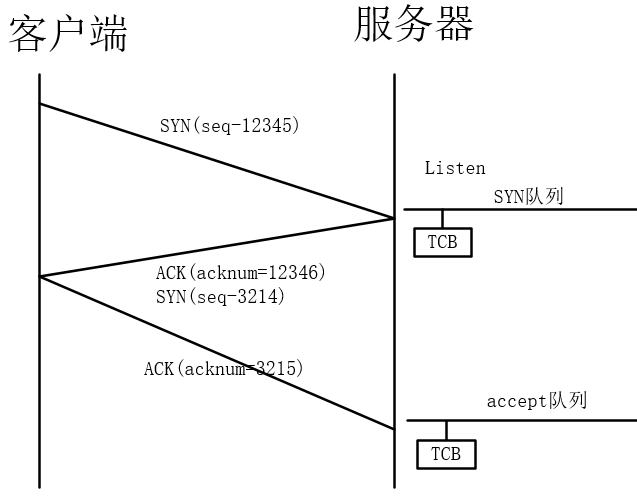
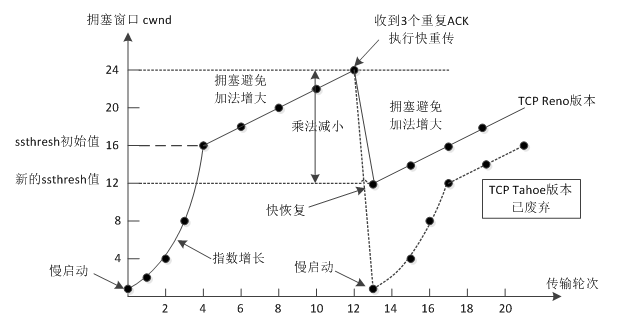
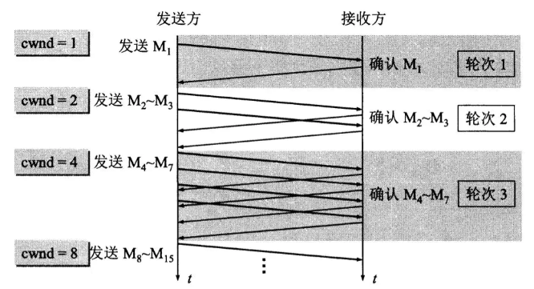
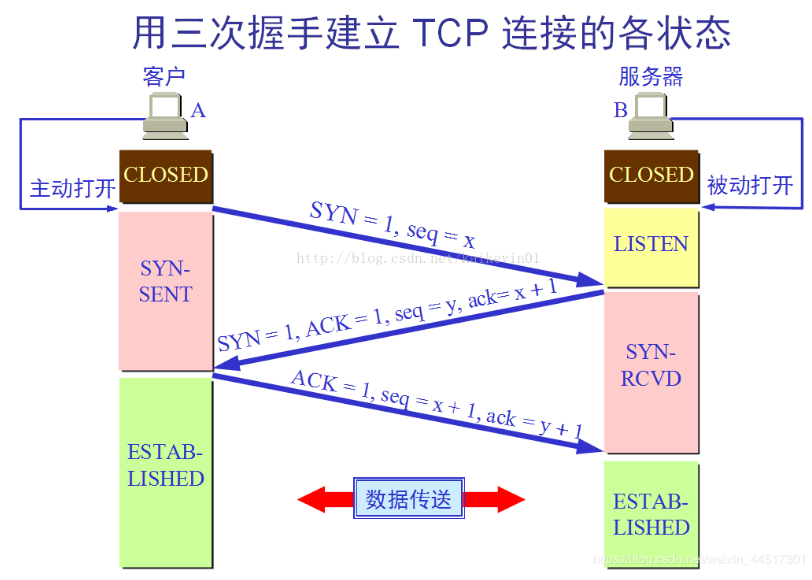

## TCP

备注：fd socket 网络IO在本文中都是一个意思（文件描述符）

### 1、fd(socket) 与tcp协议栈之间有什么关系?

如何通过

`sent(fd,buffer,length,0)`和`recv(fd,buffer,length,0)`进行通讯的？

**[三次握手](https://baijiahao.baidu.com/s?id=1654225744653405133&wfr=spider&for=pc)**

　**注：seq**:"sequance"序列号；**acknum**:"acknowledge"确认号；**SYN**:"synchronize"请求同步标志；**ACK**:"acknowledge"确认标志"

acknum = 12346表示，12345前的数据包都确认收到了，现在我需要序列号为12346开头的包

**服务器与客户端的两次交互过程**

- 当收到客户端发来的SYN（同步描述符）后，在服务器会中会形成一个节点（TCB：tcp的控制块）,伴随着整个tcp连接的周期。
- 第三次握手时，找寻该节点，放置到accept队列(从SYN队列移动过来)。通过五元组（源IP地址、目的IP地址、源端口、目的端口）找寻

调用accept()函数，从accept队列中取出一个节点并分配一个fd。`clientfd = accept()`实现fd->tcb的连接

调用`sent()函数`时，**通过fd找寻五元组**，从而找到相应的TCB。用户空间的buffer数据f放置到 tcb.sendBuffer里面

调用`recv()函数`时，将tcb.recvbuffer 中的数据拷贝到用户buffer

其中tcb的对应，通过fd和五元组的一对一关系确定。

### 2、tcp是如何保证包的顺序传输

主机每次发送数据时，TCP就给每个数据包分配一个序列号并且在一个特定的时间内等待接收主机对分配的这个序列号进行确认，如果发送主机在一个特定时间内没有收到接收主机的确认，则发送主机会重传此数据包。接收主机利用序列号对接收的数据进行确认，以便检测对方发送的数据是否有丢失或者乱序等，接收主机一旦收到已经顺序化的数据，它就将这些数据按正确的顺序重组成数据流并传递到高层进行处理。

具体步骤如下：

（1）为了保证数据包的可靠传递，发送方必须把已发送的数据包保留在缓冲区；

（2）并为每个已发送的数据包启动一个超时定时器；

（3）如在定时器超时之前收到了对方发来的应答信息（可能是对本包的应答，也可以是对本包后续包的应答），则释放该数据包占用的缓冲区;

（4）否则，重传该数据包，直到收到应答或重传次数超过规定的最大次数为止。

（5）接收方收到数据包后，先进行CRC循环冗余校验(Cyclic Redundancy Check, CRC)校验，如果正确则把数据交给上层协议，然后给发送方发送一个累计应答包，表明该数据已收到，如果接收方正好也有数据要发给发送方，应答包也可方在数据包中捎带过去。

### 拥塞控制

TCP的拥塞控制采用了四种算法，即 **慢开始 、 拥塞避免 、快重传 和 快恢复**。

- **慢开始**

  当主机开始发送数据时，如果立即把大量数据注入到网络，那么可能会出现网络阻塞，因为现在还不知道网络的情况。较好的方法是先试探一下，即由小到大逐渐增大发送窗口，也就是从小到达逐渐增大拥塞窗口(cwnd)的数值,cwnd初始值为1，没经过一个往返时间(RTT),cwnd加倍。

  

- **拥塞避免**

   拥塞避免算法的思路是让拥塞窗口cwnd缓慢增大，即每经过一个往返时间RTT就把发送放的cwnd加1 /cwnd  

- **快重传和快恢复**

  一条TCP连接有时会因等待重传计时器的超时而空闲较长的时间，慢开始和拥塞避免无法很好的解决这类问题，因此提出了快重传和快恢复的拥塞控制方法。

  快重传算法并非取消了重传机制，只是在某些情况下更早的重传丢失的报文段（如果当发送端接收到三个重复的确认ACK时，则断定分组丢失，立即重传丢失的报文段，而不必等待重传计时器超时）。

  例如：M1，M2，M3 -----> M1,M3,缺失M2，则接收方向发送方持续发送M2重复确认，当发送方收到M2的三次重复确认，则认为M2报文丢失，启动快重传机制，重传数据，其他数据发送数据放入队列，待快重传结束后再正常传输。

### TCP协议如何保证可靠传输

- 将应用数据分割成TCP认为最适合发送的数据块

- 超时重传：当tcp发出一个段后，它启动一个定时器，等待接收端确认收到这个报文段。如果当定时器溢出时还没有收到确认，它就会重传该数据。

- TCP给发送的每个包进行编号，接收方对数据包进行排序，把有序数据传送给应用层。

- 校验和：TCP将保持它首部和数据的检验和。这是一个端到端的检验和，目的是检测数据在传输过程中的任何变化。如果收到段的检验和有差错，TCP将丢弃这个报文段和不确认收到此报文段。

- TCP的接收端会丢弃重复的数据。

- 流量控制：TCP连接的每一方都有固定大小的缓冲空间，TCP的接收端只允许发送端发送接收端缓冲区能接纳的我数据。当接收方来不及处理发送方的数据，能提示发送方降低发送的速率，防止包丢失。TCP使用的流量控制协议是可变大小的滑动窗口协议。

- 拥塞控制：当网络拥塞时，减少数据的发送。

### 三场握手和四次挥手

#### 三次握手

**seq是数据包本身的序列号；**

**ack是期望对方继续发送的那个数据包的序列号，也表示确认之前序号的数据包发送成功。**

- **第一次握手**

  客户端向服务器 发送一段TCP报文其中

  - 报文的标记位为SYN，表示“请求建立连接”
  - 序号为`seq  = x` (x一般为1)
  - 随后客户端进入SYN-SENT阶段
  
- **第二次握手**

  服务器端接收到来自客户端的TCP报文之后，结束LISTEN阶段。并返回一段TCP报文

  - 报文的标志为为SYN ACK，表示确认客户端的包问seq序号有效，服务器能够正常接收客户端发送的数据，并同意建立新连接。
  - 序号`seq = y`,表示当前报文的序列号
  - 确认号为`ack = x+1`,表示收到了客户端的序号seq,并在该值的基础上加1，作为确认号ack的值。
  - 随后服务器端进入SYN-RCVD阶段

- **第三次握手**
  
  客户段接收来自服务器的确认收到数据的TCP报文之后，明确了从客户端到服务器的数据传输是正常的，结束SYN-SENT阶段，并返回最后一段报文
  
  - 标志位为ACK，表示“确认收到服务器端同意连接的信号”（即告诉服务器，我知道你收到我发的数据了）；
  - 序号为`seq = x+1`，表示收到了服务器端的确认号ack，并将其值作为自己的序号
  - 确认号`ack  = y+1`，表示都到服务器端序号seq为y的报文，并在该值的基础上加1，作为确认号ack的值。
  - 随后客户端进入ESTABLISHED阶段

#### 四次挥手

挥手之前主动释放连接的客户端结束ESTABLISHED阶段。随后开始四次挥手

- **第一次挥手**

  客户端想要释放连接，向服务器发送一段TCP报文

  - 标记位为FIN，表示请求释放连接。
  - 报文序号为`seq = u`,
  - 随后客户端进入FIN-WAIT-1阶段，即半关闭阶段。并且停止客户端到服务器方向发送数据，但是客户端仍然能够接收从服务器端传输过来的数据。

  注意：这里不发送的是正常连接时传输的数据(非确认报文)，而不是一切数据，所以**客户端仍然能发送ACK确认报文**。

- **第二次挥手**

  服务器端接收到从客户端发出的TCP报文之后，确认了客户端想要释放连接，随后服务器端接收ESTABLISHED状态，进入CLOSED-WAIT阶段（半关闭状态）并返回一段报文

  - 报文的标记位为ACK，表示接收到客户端发送的释放连接的请求
  - 序号为`seq=v`；
  - 确认号`ack = u+1`，表示在收到的客户端报文的基础上，将序号seq值加一作为本段报文的确认号ack值
  - 随后服务器开始准备释放服务器端到客户端方向的连接。

  客户端收到从服务器端发出的TCP报文之后，确认了服务器收到了客户端发出的释放连接请求，随后客户端结束FIN-WAIT-1阶段，进入FIN-WAIT-2阶段

- **第三次挥手**

  服务器端自从发出ACK确认报文之后，经过CLOSED-WAIT阶段，做好了释放服务器端到客户端方向上的连接准备，再次向客户端发出一段TCP报文

  - 标记位为FIN，ACK，表示“已经准备好释放连接了”。注意：这里的ACK并不是确认收到服务器端报文的确认报文。
  - 序号seq = w,
  - 确认号为ack = u+1；表示是在收到和客户端报文的基础上，将其序号seq值加1作为本段报文确认号ack的值。

  随后服务器端结束CLOSE-WAIT阶段，进入LAST-ACK阶段。并且停止在服务器端到客户端的方向上发送数据，但是服务器端仍然能够接收从客户端传输过来的数据。

- **第四次挥手**

  客户端收到从服务器端发出的TCP报文，确认了服务器端已做好释放连接的准备，结束FIN-WAIT-2阶段，进入TIME-WAIT阶段，并向服务器端发送一段报文。

  - 标记位为ACK，表示“接收到服务器准备好释放连接的信号”。
  - 序号为seq=u+1；表示是在收到了服务器端报文的基础上，将其确认号ack值作为本段报文序号的值。
  - 确认号为ack=w+1；表示是在收到了服务器端报文的基础上，将其序号seq值作为本段报文确认号的值。

  服务器端收到从客户端发出的TCP报文之后结束LAST-ACK阶段，进入CLOSED阶段。由此正式确认关闭服务器端到客户端方向上的连接。

  随后客户端开始在TIME-WAIT阶段等待2MSL,客户端等待完2MSL之后，结束TIME-WAIT阶段，进入CLOSED阶段，由此完成“四次挥手”。

### 三次握手的必要性：

- 假如只进行一次握手，客户端发送连接请求后，没有收到服务端的应答，是没法判断连接是否成功的。

- 假如只进行两次握手，客户端发送连接请求后，会等待服务器端的应答。但是会出现的问题是，假如客户端的SYN迟迟没有到达服务器端，此时客户端超时后，会重新发送一次连接，假如重发的这次服务器端收到了，且应答客户端了，连接建立了。但是建立后，第一个SYN也到达服务端了，这时服务端会认为这是一个新连接，会再给客户端发送一个ACK，这个ACK当然会被客户端丢弃。但是此时服务器端已经为这个连接分配资源了，而且服务器端会一直维持着这个资源，会造成浪费

- 三次握手，两次握手的问题在于服务器端不知道SYN的有效性，所以如果是三次握手，服务器端会等待客户端的第三次握手，如果第三次握手迟迟不来，服务器端就会释放相关资源。但是有人会问，假如第三次握手没有到达服务器端呢？但是这时客户端认为连接已经建立了。但是其实这种情况下，只要客户端向服务器端写数据，就会收到服务器端的RST应答，这时客户端就能知道出现问题了。

