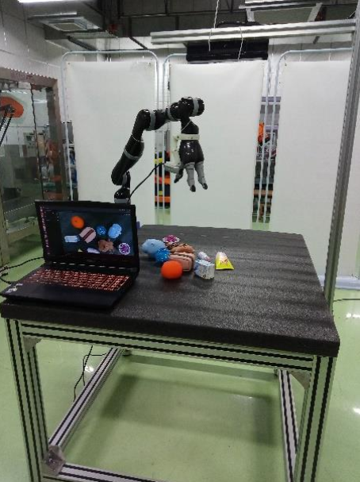
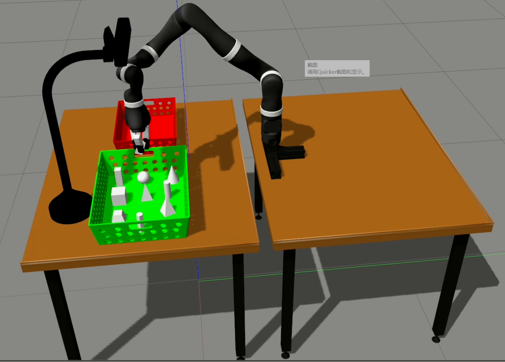

## 清华西门子抓取比赛项目总结

### 目的

比赛要求综合运用机器人运动控制、图
像视觉及机器学习等知识，解决科学技术难题和制造业中的工程问题。  解决机器人智能抓取和操作  ，抓取平台如下，

### 比赛的任务描述

环境基于 ROS 系统开发。 整个抓取是基于动态抓取  

**包括两个部分**

- 仿真抓取： 基于 Gazebo 物理引擎，从 10 个物理里面，指定抓取 5 个物体，
  每个物体放到对应指定的框格区域  
- 实物抓取： 从 10 个堆叠的物理里面，指定抓取 5 个物体，每个物体对应放到指定的框格区域。  

### **实现方案**

由于没有该机械臂进行提前测试，只能在仿真环境下进行对抓取算法进行测试，所以在前期准备的时候将仿真抓取和实物抓取采取完全相同的方法，在仿真环境下算法能够表现良好后在应用于实际机械臂上。搭建的仿真环境如下

### **算法流程**

设计算法将整个流程分为以下几个各部分，视觉标定，物体检测，抓取位姿计算，机器人抓取。

#### **视觉标定**

视觉标定主要分为kinect相机的标定和机器人手眼标定。Kinect相机可以通过其官方标定程序进行相机标定和深度图配准等。

手眼标定：基于opencv的手眼标定函数，其具体过程如下：

对于eye-to-hand情况，相机相对于机器人的基坐标是固定值，标定时将标定板固定在机器人的末端，移动机械臂，使相机能够拍摄到各个位姿下棋盘的标定板，记录次拍摄时机器人的位姿。然后就是求解$^{base}T_{camera}$

罗列处所有变量：

- 机器人末端相对于机器人base的变换矩阵是可以获得的，即$^{end}T_{base}$已知
- 相机标定过程中可以得到标定keyi板相对于相机的旋转矩阵

由于棋盘和机器人末端之间是固定的，所以$^{board}T_{end}$，是固定不变的，可以根据测量得到。

根据已知条件和固定可求的变量，可以得到如下等式

$$
{}^{end}T_{baseA} {}^{baseA}T_{cameraA} {}^{cameraA}T_{board} =  {}^{end}T_{baseB} {}^{baseB}T_{cameraB} {}^{cameraB}T_{board}
$$
具体

#### **YOLO目标检测**

该部分利用现有的目标检测算法，采用yolov3目标检测算法，对比赛给出了物体进行训练，获取到较好的模型后，实际运用时调用模型进行识别。

**yolo的核心思想**

- YOLO 的核心思想就是利用整张图作为网络的输入，直接在输出层回归 bounding box（边界框） 的位置及其所属的类别。
- faster-RCNN 中也直接用整张图作为输入，但是 faster-RCNN 整体还是采用了RCNN 那种 proposal+classifier 的思想，只不过是将提取 proposal 的步骤放在 CNN 中实现了，而 YOLO 则采用直接回归的思路。

#### **抓取位姿计算**

对目标物体进行分析，目标物体一般处于以下几种形状，即球形、柱形等比较规则的物体。所以可以通过寻找物体的主方向，然后通过坐标变换以及机器人手眼标定，求出物体主方向在机器人坐标系下的位姿。具体操作如下

- 结合深度图像，对目标检测框内的深度图进行点云转换，得到物体的点云数据，然后对点云中出现的离群点进行剔除，并通过条件滤波的方式，将桌面背景剔除。

  采用直通滤波的方式，设置可以通过的点云的Z向范围，从而直接剔除桌面点云和其他离群点（主要是Z轴上的）

- **PCA算法流程**

  - **输入**：$n$维样本集$X = (x_1,x_2,x_3...x_m)$，将到$n'$
  - **输出**：降维后的样本集
  - **步骤**
    - 1、对所有样本进行中心化$$x_{i}=x_{i}-\frac{1}{m} \sum_{j=1}^{m} x_{j}$$
    - 2、计算样本协方差矩阵$$C=\frac{1}{m} X X^{\top}$$
    - 3、求解协方差矩阵的特征值及特征向量
    - 4、将特征向量按对应特征值大小从上到下按行排列成矩阵，取前K行组成矩阵P
    - $Y = PX$即为将为到K维后的数据

  **PCA算法总结**

  PCA作为一个非监督学习的降维方法，他只需要特征值分解就可以对数据进行压缩，去噪。因此在实际场景中应用广泛，为了克服PCA的一些缺点，出现了很多PCA的变种，比如为解决非线性降维的KPCA，还有解决内存限制的增量PCA方法Incremental PCA，以及解决稀疏数据降维的PCA方法Sparse PCA等。

  **PCA算法的主要优点：**

  - 仅仅需要以方差衡量信息量，不受数据集以外的因素影响。　
  - 各主成分之间正交，可消除原始数据成分间的相互影响的因素。
  - 计算方法简单，主要运算是特征值分解，易于实现。

  **PCA算法的缺点**

  - 主成分各个特征维度的含义具有一定的模糊性，不如原始样本特征的解释性强。
  - 方差小的非主成分也可能含有对样本差异的重要信息，因降维丢弃可能对后续数据处理有影响。

  **PCA算法进行点云主方向计算**

  利用pcl库对点云数据进行计算.

  - 计算点云数据的中心$P_c(x_c,y_c,z_c)$，例如$x_c = (x_1,x_2,...,x_m)/m$
  - 计算协方差矩阵,`pcl::computeCovarianceMatrixNormalized(*cloud,Pc,covarianceMatrix)`
  - 对协方差矩阵进行特征值和特征向量的求解
  - 特征向量即为以$P_c$维原点的三个坐标方向(特征值由小到大,特征向量与之对应)
  - 选择特征值最大的特征向量为X轴方向,最小的为Y轴方向
  - 校正三个特征向量,使其相互垂直(采用叉乘)

项目遇到的最大问题 

- 初期出现通讯阻塞的问题，后来发现是因为目标检测和pca主方向求取时的速度较快，而机械臂抓取的速度较慢，后来通过更改了消息池的大小和发布频率解决了该问题

  **尤其需要注意合理控制消息池大小和ros::spinOnce()执行频率; 比如消息送达频率为10Hz, ros::spinOnce()的调用频率为5Hz，那么消息池的大小就一定要大于2，才能保证数据不丢失，无延迟**

- 准备初期，由于没有kinova gen3 原型机械臂 ，对于整个算法不能进行整体验证，方法无法实现闭环。

  

## 智能产线视觉抓取项目

精度0.1mm

目的是实现对减速器的各个工件进行识别、定位和抓取。

由于所需识别的工件数目小，且工件之间的特征明显，所以可以通过模板匹配的方法进行识别，手眼标定

**光源选择：LED光源，环形和条形光源**

- 环形光源：提供不同照射角度、不同颜色组合，更能突出物体的三维信息；高密度LED阵列，高亮度；多种紧凑设计，节省安装空间；解决对角照射阴影问题；可选配漫射板导光，光线均匀扩散。应用于：PCB基板检测，IC元件检测，显微镜照明，液晶校正，塑胶容器检测，集成电路印字检查。
- 条形光源：较大方形结构被测物的首选光源；颜色可根据需求搭配，自由组合；照射角度与安装随意可调。应用于：金属表面检查，图像扫描，表面裂缝检测，LCD面板检测等
- 背光源：用高密度LED阵列面提供高强度背光照明，能突出物体。的外形轮廓特征，尤其适合作为显微镜的载物台。红白两用背光源、红蓝多用背光源，能调配出不同颜色，满足不同被测物多色要求。应用于：机械零件尺寸的测量，电子元件、IC的外型检测，胶片污点检测，透明物体划痕检测等。

**相机标定和手眼**

​	由于是平面抓取，问们采用了9点发进行相机的手眼标定 

当利用RGB相机或者是机器人只进行平面抓取（也即固定姿态抓取，机器人六自由度位置和姿态简化为只考虑平移，姿态人为给定并且固定，这时机器人可以移动到目标点上方），这样问题就简化为平面RGB图像的目标像素点集$A(x,y)$与机器人在平面 $B(X,Y)$的点对关系。
$$
\left[\begin{array}{l}
X \\
Y
\end{array}\right]=R\left[\begin{array}{l}
x \\
y
\end{array}\right]+M
$$
由于只进行平面抓取，这里不考虑Z的情况所以根据仿射变换矩阵即客实现两个点集之间的变换，
$$
\left[\begin{array}{l}
X \\
Y \\
\end{array}\right]=
\left[\begin{array}{l}
a&&b&&c \\
d&&e&&f \\
\end{array}\right]
\left[\begin{array}{l}
x \\
y\\
1
\end{array}\right]
$$
所以可得两个等式
$$
X = ax+by+c\\
Y = dx+ey+f
$$
有6个未知数，所以至少需要三个点就可以计算出来

例如，机器人坐标$(X_{1},Y_{1}),(X_{2},Y_{2}),(X_{3},Y_{3})$，像素坐标$(x_1,y_1),(x_2,y_2),(x_3,y_3)$代入公式可得出仿射变换的矩阵。
$$
X_1 = ax_1+by_1+c\\
X_2 = ax_2+by_2+c\\
X_3 = ax_3+by_3+c\\
Y_1 = dx_1+ey_1+f\\
Y_2 = dx_2+ey_2+f\\
Y_3 = dx_3+ey_3+f\\
$$
如图所示标定板，通过相机拍摄该图像，通过opencv，可以找到图像中各个圆的圆心像素坐标，然后移动机械臂，使其末端到达标定板上各个圆的中心，记录此时机械手的坐标。完成后会得到两个点集，一个为图像中9个圆的圆心坐标（points_camera），一个为9个圆心对应的机械手坐标（point_robot）。

