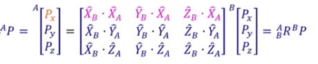
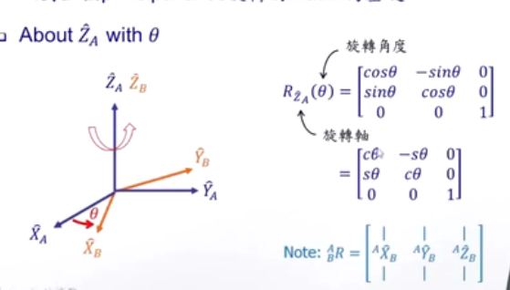
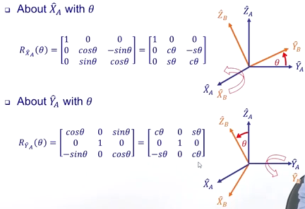
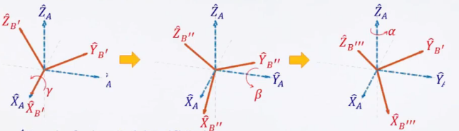
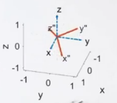
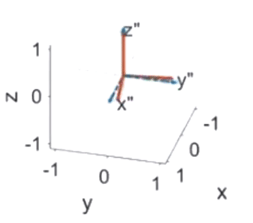
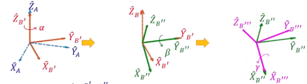
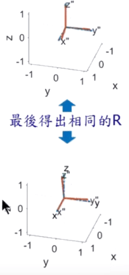

## 旋转矩阵

$^AP$表示点P在A坐标系中的位置向量。$^A_B{R}$表示B相对于A的旋转矩阵。$^BP$表示点P在B坐标系中的位置向量

$X_B·X_A$表示$X_B$向量在$X_A$上的投影，根据这个原理可以计算出旋转矩阵

###  绕单一轴旋转

旋转矩阵${R_{{Z_A}}}(\theta )$为绕$Z_A$轴旋转$\theta$角度的旋转矩阵，分析过程如图所示，将旋转后的坐标系投影到原坐标系中。
$$
{R_{{Z_A}}}(\theta ) = \left[ {\begin{array}{*{20}{c}}
{\cos \theta }&{ - \sin \theta }&0\\
{\sin \theta }&{\cos \theta }&0\\
0&0&1
\end{array}} \right]
$$

类似的绕$X_A$、$Y_A$轴旋转过程如下。
$$
{R_{{X_A}}}(\theta ) = \left[ {\begin{array}{*{20}{c}}
{1 }&{ 0 }&0\\
{0}&{\cos \theta }&{-\sin \theta}\\
{0}&{\sin \theta }&{\cos \theta}
\end{array}} \right]
 
{R_{{Y_A}}}(\theta ) = \left[ {\begin{array}{*{20}{c}}
{\cos \theta }&{0}&{\sin \theta}\\
{0}&{1}&0\\
{-\sin \theta}&0&{\cos \theta}
\end{array}} \right]
$$

### 绕X-Y-Z固定轴旋转一定角度

如图所示，首先X轴旋转<strong style="color:red;">$\gamma$</strong>，然后绕Y轴旋转<strong style="color:red;">$\beta$</strong>，最后绕Z轴旋转<strong style="color:red;">$\alpha$</strong>

旋转后如下图所示

旋转矩阵为，**注意每经过一个旋转，是在原来的基础上<strong style="color:red;">左乘</strong>一个相应的旋转矩阵。**
$$
^A_B{R}_{XYZ} {(\gamma,\beta,\alpha)} = R_Z(\alpha)R_Y(\beta)R_X(\gamma)\\
$$
然后将$R_{Z}(\alpha)$、$R_Y(\beta)$、$R_X(\gamma)$带入计算会得到如下公式
$$
^A_B{R}_{XYZ} {(\gamma,\beta,\alpha)}={\left[ {\begin{array}{*{20}{c}}
{\cos \alpha }&{ - \sin \alpha }&0\\
{\sin \alpha }&{\cos \alpha }&0\\
0&0&1
\end{array}} \right]

\left[ {\begin{array}{*{20}{c}}
{\cos \beta }&{0}&{\sin \beta}\\
{0}&{1}&0\\
{-\sin \beta}&0&{\cos \beta}
\end{array}} \right]

\left[ {\begin{array}{*{20}{c}}
{1 }&{ 0 }&0\\
{0}&{\cos \gamma }&{-\sin \gamma}\\
{0}&{\sin \gamma }&{\cos \gamma}
\end{array}} \right]}\\

=\left[ {\begin{array}{*{20}{c}}
{\cos \alpha \cos \beta }&{\cos \alpha \sin \beta \sin \gamma  - \sin \alpha \cos \gamma }&{\cos \alpha \sin \beta \cos \gamma  + \sin \alpha \sin \gamma }\\
{\sin \alpha \cos \beta }&{\sin \alpha \sin \beta \sin \gamma  + \cos \alpha \cos \gamma }&{\cos \alpha \sin \beta \cos \gamma  - \cos \alpha \sin \gamma }\\
{ - \sin \beta }&{\cos \beta \sin \gamma }&{\cos \beta \cos \gamma }
\end{array}} \right]\
$$

## **Z-X-Y欧拉角**

***欧拉角***就是物体绕坐标系三个坐标轴(x,y,z轴)的旋转角度。其旋转过程与前面绕固定坐标系不同，旋转轴是动态变化的。

分解开为，首先Z轴旋转<strong style="color:red;">$\alpha$</strong>，然后绕Y轴旋转<strong style="color:red;">$\beta$</strong>，最后绕X轴旋转<strong style="color:red;">$\gamma$</strong>

公式如下面所示，注意每经过一个旋转，是在原来的基础上<strong style="color:red;">右乘</strong>一个相应的旋转矩阵
$$
^A_B{R}_{Z'Y'X'} {(\alpha,\beta,\gamma)} = {R}_{Z'}(\alpha)R_{Y'}(\beta)R_{X'}(\gamma)\\
$$
然后将$R_{Z'}(\alpha)$、$R_{Y'}(\beta)$、$R_{X'}(\gamma)$带入计算会得到如下公式
$$
^A_B{R}_{XYZ} {(\gamma,\beta,\alpha)}={\left[ {\begin{array}{*{20}{c}}
{\cos \alpha }&{ - \sin \alpha }&0\\
{\sin \alpha }&{\cos \alpha }&0\\
0&0&1
\end{array}} \right]

\left[ {\begin{array}{*{20}{c}}
{\cos \beta }&{0}&{\sin \beta}\\
{0}&{1}&0\\
{-\sin \beta}&0&{\cos \beta}
\end{array}} \right]

\left[ {\begin{array}{*{20}{c}}
{1 }&{ 0 }&0\\
{0}&{\cos \gamma }&{-\sin \gamma}\\
{0}&{\sin \gamma }&{\cos \gamma}
\end{array}} \right]}\\

=\left[ {\begin{array}{*{20}{c}}
{\cos \alpha \cos \beta }&{\cos \alpha \sin \beta \sin \gamma  - \sin \alpha \cos \gamma }&{\cos \alpha \sin \beta \cos \gamma  + \sin \alpha \sin \gamma }\\
{\sin \alpha \cos \beta }&{\sin \alpha \sin \beta \sin \gamma  + \cos \alpha \cos \gamma }&{\cos \alpha \sin \beta \cos \gamma  - \cos \alpha \sin \gamma }\\
{ - \sin \beta }&{\cos \beta \sin \gamma }&{\cos \beta \cos \gamma }
\end{array}} \right]\
$$

由上面的推到可知，绕**X-Y-Z固定坐标系旋转和绕Z-Y-X欧拉旋转得到的结果相同。**

<strong style="color:red;">注意：固定坐标系的旋转顺序与欧拉坐标系的旋转顺序相反时可以得到相同的姿态</strong>

其旋转过程下动图所示

