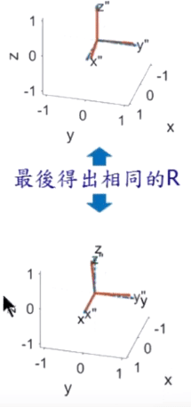

# 相机标定和手眼标定

## 相机标定

​			相机用作视觉传感器时，它是机器人，监视，太空探索，社交媒体，工业自动化甚至娱乐行业等多个领域的组成部分。
对于许多应用程序，必须了解相机的参数，才能有效地将其用作视觉传感器。

​         在图像测量过程以及机器视觉应用中，为了确定空间物体的的三维几何位置与其在图像中对应点的相互关系，必须建立相机成相的集合模型，这些几何模型就是相机的参数。这些参数有些相机提供方会在出厂前进行标定，并给出相机参数，如果厂商没有提供就只能自己进行相机参数的标定。求解这些相机参数的过程就叫**相机标定**。

​         无论是在图像测量或者机器视觉应用中，相机参数的标定都是非常关键的环节，其标定结果的精度及算法的稳定性直接影响相机工作产生结果的准确性。因此，做好相机标定是做好后续工作的前提，提高标定精度是科研工作的重点所在。

**相机标定主要为了解决两个问题**

- 确定世界坐标系下三维空间点与平面像素点之间的转换关系(内参和外参)，
- 确定相机成像过程中的畸变系数，用于图像校正。

### 相机畸变

​         为了获得好的成像效果，我们在相机的前方加了透镜。透镜的加入对成像过程中光线的传播会产生新的影响：

一是透镜自身的形状对光线传播的影响（径向畸变），

二是在机械组装过程中，透镜和成像平面不可能完全平行，这也会使得光线穿过透镜投影到成像面时的位置发生变化（切向畸变）。

- **径向畸变**

​        有透镜形状引起的几百年称之为**径向畸变**，在针孔墨香中，一条 直线投影到像素平面上还是一条直线，但是，当在实际拍摄图像时，摄像机的透镜往往使得真实环境中的一条执行案在图片中变成了曲线，越靠近图像边缘，这种现象就越明显。由于实际加工制作的透镜往往是中心对称的，所以这使得不规则的畸变通常经向对称。


径向畸变可以通过如下公式进行纠正：
$$
\begin{array}{l}
{x_{correct}} = x(1 + {k_1}{r^2} + {k_2}{r^4} + {k_3}{r^6})\\
{y_{correct}} = y(1 + {k_1}{r^2} + {k_2}{r^4} + {k_3}{r^6})
\end{array}
$$

k 


- **切向畸变**

  切向畸变一般是由于成像平面和透镜不能完全平行而导致的。如下图所示

  

径向畸变可以通过如下公式进行纠正：
$$
\begin{array}{l}
x_{\text {corrected}}=x+2 p_{1} x y+p_{2}\left(r^{2}+2 x^{2}\right) \\
y_{\text {corrected}}=y+p_{1}\left(r^{2}+2 y^{2}\right)+2 p_{2} x y
\end{array}
$$
结合径向畸变和切向畸变可以对坐标进行如下纠正。
$$
\begin{array}{l}
{x_{correct}} = x(1 + {k_1}{r^2} + {k_2}{r^4} + {k_3}{r^6})+x+2 p_{1} x y+p_{2}\left(r^{2}+2 x^{2}\right)\\
{y_{correct}} = y(1 + {k_1}{r^2} + {k_2}{r^4} + {k_3}{r^6})+y+p_{1}\left(r^{2}+2 y^{2}\right)+2 p_{2} x y
\end{array}
$$

### 针孔相机模型

相机将三维世界中的坐标点（单位：米）映射到二维图像平面（单位：像素）的过程能够用一个几何模型来描述，其中最简单的称为**针孔相机模型 (pinhole camera model)**


相机模型中涉及到了四大 坐标系，分别为

**像素坐标系$(u,v)$：**为了描述物体成像后的像点在数字图像上（相片）的坐标而引入，像素坐标的原点在图像的左上角，如上图所示。单位为**pixel**,

**成像坐标系$(x,y)$：**为了描述成像过程中物体从相机坐标系到图像坐标系的投影透射关系而引入，方便进一步得到像素坐标系下的坐标。原点在图像中心，单位为**mm;**

**相机坐标系$(x_c,y_c,Z_c)$：**在相机上建立坐标系，为了从相机的角度描述物体的位置，原点在相机的光心，单位为**m**

**世界坐标系$(x_w,y_w,z_w)$：**用户定义的三维世界的坐标系，为了描述目标物在真实世界里的位置而被引入。单位为**m**。

### 世界坐标系到相机坐标系变换

从世界坐标系到相机坐标系， 这是一个刚体变换，只需对世界坐标系的三维点作用一个旋转`R`和平移`t`（R，t即为相机的外参）
$$
\left[\begin{array}{l}
X_{c} \\
Y_{c} \\
Z_{c} \\
1
\end{array}\right]=R\left[\begin{array}{c}
X_{w} \\
Y_{w} \\
Z_{w} \\
\end{array}\right]+t=\left[\begin{array}{ll}
R & t\\
0 & 1
\end{array}\right]
\left[\begin{array}{c}
X_{w} \\
Y_{w} \\
Z_{w} \\
1
\end{array}\right]
$$

### 相机坐标系到成像平面坐标系

该过程进行了三维坐标到二维坐标的转换，即将一个三维的点投影到一个平面上，成像过程如下图所示：

针孔面即为相机平面，图像平面即为图像坐标系所在平面，物点平面即为棋盘平面或者实际物体所在坐标系。


为了方面数学描述，将针孔相机模型中的图像平面移动到与物点平面同一侧（没有实际物理意义，只是为了方便 描述）描述如下。


根据象是相似三角形的原则可得到相机坐标系下M点的坐标和其在成像平面上投影点P之间的关系
$$
\frac{{{Z_M}}}{f} = \frac{X_{M}}{x_{p}} =  \frac{Y_{M}}{y_{p}}
$$
$f$  即为焦距。所以可以得到相机坐标系$(X_c,Y_c,Z_c)$到成像平面坐标系$(x,y)$之间的变换
$$
\left\{ {\begin{array}{*{20}{c}}
{x = f\frac{{{X_c}}}{{{Z_c}}}}\\
{y = f\frac{{{Y_c}}}{{{Z_c}}}}
\end{array}} \right.
$$

改写成矩阵形式
$$
\left[\begin{array}{l}
x \\
y \\
1
\end{array}\right]=\left[\begin{array}{ccccc}
f / Z_{c} & 0 & 0 & 0 \\
0 & f / Z_{c} & 0 & 0 \\
0 & 0 & 1 / Z_{c} & 0
\end{array}\right]\left[\begin{array}{c}
X_{c} \\
Y_{c} \\
Z_{c} \\
1
\end{array}\right]
$$

### 成像平面坐标系到像素坐标系


如上图所示，成像平面坐标系`x-y`和像素坐标系`u-v`之间有一个偏移，即
$$
\left\{ {\begin{array}{*{20}{c}}
u =  \alpha\cdot{x}+c_x\\
v =  \beta\cdot{y}+c_y
\end{array}} \right.
$$
结合前面得到的相机坐标系到成像平面坐标系之间变换，可以的得到
$$
\left\{ {\begin{array}{*{20}{c}}
{u = f_x\frac{{{X_c}}}{{{Z_c}}}}+c_x\\
{v = f_y\frac{{{Y_c}}}{{{Z_c}}}}+c_y
\end{array}} \right.
\\
反求像素点在相对于相机的位置
\\
\left\{ {\begin{array}{*{20}{c}}
X_c = (u-c_x)*Z_c/f_x\\
Y_c = (v-c_y)*Z_c/f_y
\end{array}} \right.
$$
其中$f_x = \alpha f$      $f_y = \beta f$；

$\alpha 和\beta$的单位为像素/米;

$f_x$  $f_y$为x 和y方向的焦距，单位为像素

$（c_x,c_y）$为图像的中心，单位为像素。

将上式改写为矩阵形式，如下所示，即为<strong style="color:red;">图像处理中读出的像素点在相机坐标系下的位置</strong>
$$
Z_{c}\left[\begin{array}{l}
u \\
v \\
1
\end{array}\right]=\left[\begin{array}{ccc}
f_{x} & 0 & c_{x} & 0\\
0 & f_{y} & c_{y} & 0\\
0 & 0 & 1 & 0
\end{array}\right]\left[\begin{array}{l}
X_{c} \\
Y_{c} \\
Z_{c} \\
1
\end{array}\right]
$$
### 总结：像素坐标到世界坐标的变换

结合相机坐标系到世界坐标系的变换可得
$$
Z_{c}\left[\begin{array}{l}
u \\
v \\
1
\end{array}\right]=\left[\begin{array}{cccc}
f_{x} & 0 & c_{x} & 0 \\
0 & f_{y} & c_{y} & 0 \\
0 & 0 & 1 & 0
\end{array}\right]\left[\begin{array}{cc}
R & T \\
0 & 1
\end{array}\right]\left[\begin{array}{c}
X_{w} \\
Y_{w} \\
Z_{w} \\
1
\end{array}\right]\\
k = \left[\begin{array}{cccc}
f_{x} & 0 & c_{x} & 0 \\
0 & f_{y} & c_{y} & 0 \\
0 & 0 & 1 & 0
\end{array}\right]
$$
$\left[\begin{array}{ccc}
f_{x} & 0 & c_{x} & 0\\
0 & f_{y} & c_{y} & 0\\
0 & 0 & 1 & 0
\end{array}\right]$ 即为相机的内参，$\left[\begin{array}{l}
R&T\\
0&1
\end{array}\right]$即为外参。


### [立体视觉](https://mp.weixin.qq.com/s/FGH9bYfMccJvJ8EAVITGUw)

对于多目相机系统或者RGBD 相机除了要对别对每个相机进行以上标定以外，还需要求传感器之间的变换T，以使同一时刻获取的数据能够“对齐”，以双目为例，左右两个相机的坐标系如下图：


计算出两个摄像机之间的旋转矩阵R和平移向量t，方法是分别计算出两个摄像机的R和T，再由以下公式计算

$R = R_r\cdot R_l$

$t = t_r-R \cdot t_l$

### 相机标定代码

基于opencv3.2的标定代码如下

```cpp
/*
opencv 中的张正友标定法进行相机标定
参考连接：https://www.learnopencv.com/camera-calibration-using-opencv/
*/
#include <iostream>
#include <vector>
#include <opencv2/opencv.hpp>
using namespace std;
using namespace cv;

int Checkboard[2]{5, 7};
void cameraCalibration()
{
    //储存每一张图像标定板角点坐标对应的世界坐标
    vector<vector<Point3f>> objpoints;
    // 储存每一张图像标定板上角点坐标
    vector<vector<Point2f>> imagepoints;
    vector<Point3f> objp;
    //标定板横9纵6，对于图像而言x向下。
    for (int i = 0; i < Checkboard[1]; i++)
    {
        for (int j = 0; j < Checkboard[0]; j++)
        {
            objp.push_back(Point3f(j, i, 0));
        }
    }
    // Extracting path of individual image stored in a given directory
    //cv格式的字符串
    vector<cv::String> images;
    // Path of the folder containing checkerboard images
    string path;
    cout << "input the path of image file" << endl;
    cin >> path;
    // path = path + "/*.png";
    //获取所有图像地址。
    glob(path, images);
    Mat frame, gray;
    //储存角点坐标
    vector<Point2f> corner_pts;
    bool success;
    for (int i = 0; i < images.size(); i++)
    {
        frame = imread(images[i]);
        cvtColor(frame, gray, COLOR_BGR2GRAY);
        //查找标定板角点坐标
        //如果能找到返回true，
        success = findChessboardCorners(gray, cv::Size(Checkboard[0], Checkboard[1]), corner_pts, 3);
        if (success)
        {
            //迭代算法精度，活迭代终止条件
            cv::TermCriteria criteria(CV_TERMCRIT_EPS | CV_TERMCRIT_ITER, 30, 0.001);
            //细化识别的角点坐标
            cv::cornerSubPix(gray, corner_pts, cv::Size(11, 11), cv::Size(-1, -1), criteria);
            cv::drawChessboardCorners(gray, cv::Size(Checkboard[0], Checkboard[1]), corner_pts, success);
            objpoints.push_back(objp);
            imagepoints.push_back(corner_pts);
        }
        cv::imshow("Image", gray);
        //暂停0.5秒
        cv::waitKey(500);  
    }
    cv::destroyAllWindows();
    cv::Mat cameraMatrix, distCoeffs;
    //每个棋盘相对于相机的位姿
    vector<Mat> R,T;
    double reProjection=cv::calibrateCamera(objpoints, imagepoints, cv::Size(gray.rows, gray.cols), cameraMatrix, distCoeffs, R, T);
    //相机内参
    std::cout << "cameraMatrix : " << cameraMatrix << std::endl;
    //畸变参数
    std::cout << "distCoeffs : " << distCoeffs << std::endl;
    // //旋转矩阵
    // std::cout << "Rotation vector : " << R << std::endl;
    // // 移动矩阵
    // std::cout << "Translation vector : " << T << std::endl;
    std::cout<<"re-Projection:"<<reProjection<<std::endl;
}
int main()
{
    cameraCalibration();
    return 0;
};
```


## **手眼标定**

手眼标定一般分为两种情况，分别是**眼在手上**(eye-in-hand)和**眼在手外**(eye-to-hand)，标定后我们可以得到图像中拍摄的物体在机器人坐标系下的位置，即图像上一点<strong style="color:red;">${}^{camera}P$</strong>变换到<strong style="color:red;">${}^{base}P$</strong>，从而使得机械臂能够成功抓取到物体。

### **标定基础**

手眼标定其实就是两个坐标系之间转换关系的标定，加入两个坐标系$robot$和$camera$，并且我们已知对应的空间点$P$，在这两个坐标系的坐标为${}^{robot}P$和${}^{camera}P$（这两个坐标均为补1后的齐次坐标$[x,y,z,1]^{T}$）根据坐标变换可以得到
$$
{}^{robot}P = {}^{robot}T_{camera} {}^{camera}P
$$
上式中${}^{robot}T_{camera}$为相机相对于机器人的变换矩阵。

### **eye-in-hand**


在这种关系下，标定板是位置不变，机器人底座和标定板之间的位置关系不变。

**求解量：**相机相对于机器人末端的变换矩阵<strong style="color:red;">${}^{end}T_{camera}$</strong>

在该情况下可得变量如下：

- 机器人末端end相对于机器人底座base的变换矩阵${}^{base}T_{end}$

  该值可以通过读取机器人示教器(ros中tf)可以得到，示教器中的6点（[X Y Z U V W可以转换成变换矩阵](https://www.freesion.com/article/5946937157/)）

- 标定板board相对于相机坐标系camera的变换矩阵${}^{camera}T_{board}$

  该值在进行相机标定是可以得到，opencv中`cv::calibrateCamera()`函数可以得到每个标定板相对于相机的变换矩阵。

- 标定板board相对于机器人底座base是固定不变的，即${}^{base}T_{board}$是恒定的。

综上,基于${}^{base}T_{board}$不变，可以得到对于A B两个位置可得到如下等式
$$
{}^{base}T_{endA} {}^{endA}T_{cameraA} {}^{cameraA}T_{board}={}^{base}T_{endB} {}^{endB}T_{cameraB} {}^{cameraB}T_{board}
$$
对上式进行变换可得
$$
{}^{base}T_{endB}^{-1}{}^{base}T_{endA} {}^{endA}T_{cameraA} ={}^{endB}T_{cameraB} {}^{cameraB}T_{board}{}^{cameraA}T_{board}^{-1}
$$
令${}^{base}T_{endB}^{-1}{}^{base}T_{endA}=A$；${}^{cameraB}T_{board}{}^{cameraA}T_{board}^{-1}=B$；${}^{endA}T_{cameraA} ={}^{endB}T_{cameraB}=X$

就变成手眼标定中常说的$AX=XB$问题。X即为该情况下手眼标定所要求解的变换矩阵。

当求解出<strong style="color:red;">${}^{end}T_{camera}$</strong>，就可以得到物体在机器人坐标系下的位置。
$$
{}^{base}P = {}^{base}T_{end}{}^{end}T_{camera}{}^{camera}P
$$

### **eye-to-hand**


相机放置在固定位置，与机械臂分开，标定板固定在机械臂的末端，机械臂末端和标定版的位姿关系始终不变。（标定板固定在机械臂末端的方式很多，可以通过测量得到标定板原点到机械臂末端的变换矩阵）

**求解量**：找到相机相对于机器人base的变换矩阵<strong style="color:red;">${}^{base}{T_{camera}}$</strong>，这里的$base$和$camera$都是固定的，所以该矩阵即为固定不变的参数。

该情况下可得到的变量如下：

- 机器人 底座base相对于末端end的变换矩阵${}^{end}T_{base}$，${}^{base}T_{end}$取逆就可以了。
- 标定板board相对于相机camera的变换矩阵${}^{camera}T_{board}$
- 机器人末端end和标定板board固定不动（固定在一起），其变换矩阵为${}^{end}T_{board}$，该值可以通过设计一个固定尺寸的棋盘格得到。当棋盘格尺寸以及安装固定后，我们可以设棋盘格的左上角点为原点，然后测量或者根据设计尺寸得到棋盘格原点到机器人末端坐标原点的平移坐标。另外棋盘格平面一般与机器人末端平面平行，所以可以得到棋盘和机器人末端的变换矩阵。

综上，基于${}^{end}T_{board}$不变，可以得到对于A B两个位置可得到如下等式可得如下等式：
$$
{}^{end}T_{baseA} {}^{baseA}T_{cameraA} {}^{cameraA}T_{board} =  {}^{end}T_{baseB} {}^{baseB}T_{cameraB} {}^{cameraB}T_{board}
$$
对上式进行变换可得
$$
{}^{end}T_{baseB}^{-1} {}^{end}T_{baseA} {}^{baseA}T_{cameraA}  =  {}^{baseB}T_{cameraB} {}^{cameraB}T_{board}{}^{cameraA}T_{board}^{-1}
$$
令${}^{end}T_{baseB}^{-1} {}^{end}T_{baseA}=A$；${}^{cameraB}T_{board}{}^{cameraA}T_{board}^{-1}=B$；$ {}^{baseA}T_{cameraA}  =  {}^{baseB}T_{cameraB}=X$

就变成手眼标定中常说的$AX=XB$问题。X即为该情况下手眼标定所要求解的变换矩阵。

当求解出${}^{base}T_{camera}$，就可以得到物体在机器人坐标系下的位置。
$$
{}^{base}P = {}^{base}T_{camera} {}^{camera}P
$$

### 具体实施

对于手眼标定中$AX=XB$的求解，在opencv4.1后的版本中提供了手眼标定函数

```cpp
cv::calibrateHandEye(
	InputArrayOfArrays R_gripper2base,
	InputArrayOfArrays t_gripper2base,
	InputArrayOfArrays R_target2cam,
	InputArrayOfArrays t_target2cam,
	OutputArray R_cam2gripper,
	OutputArray t_cam2gripper,
	HandEyeCalibrationMethod method = CALIB_HAND_EYE_TSAI  //计算AX=XB的方法
);
```

在opencv的实例中给的是eye-in-hand的情况。

- **对于eye-in-hand**

  `calibrateHandEye()`函数的参数基本和前面推到的相同，输入的参数为

  - 多组机器人末端相对于机器人基座的变换矩阵，在进行相机标定时记录每次移动机器人时的末端相对于基座的变换矩阵（或 ＸＹＺＵＶＷ进行转换），分解为旋转矩阵R和平移矩阵T

    注意：末端end并不等同于gripper，之间的转换关系需要根据夹爪设计自己测量计算（kinova机械臂在ros中可以读到gripper相对于base的旋转矩阵）

  - 多组物体相对于相机的变换矩阵。
  
    在进行相机标定时会得到一组标定板相对于相机的旋转矩阵R和平移向量T。
  
  - 输出即为相机相对与末端（或者gripper）的旋转矩阵R,平移矩阵T。
  
  对于gripper的情况，
  $$
  {}^{base}P = {}^{base}T_{end} {}^{end}T_{gripper} {}^{gripper}T_{camera} {}^{camera}P
  $$
  
- 对于**eye-to-hand**

  虽然`calibrateHandEye()`代码看似不能用于eye-to-hand的情况，实际上，只需要将输入的参数进行调整即可，该函数的本质是求$AX=XB$问题的，输入参数为：

  - 多组机器人基坐标base相对于机器人末端（或者grippper的旋转矩阵）一般为end相对于base的逆。
  - 多种物体相对于相机的旋转矩阵，和eye-in-hand相同。
  - 输出为相机相对于基坐标的旋转矩阵R和平移矩阵T。
  
  通过以上标定后，根据前面你的推到公式就可以得到 每一点在机器人base的位置。这样就可以控制机器人取抓取
  
  <strong style="color:red;">注意：需要找到夹爪和机器人末端，或者夹爪和机器人base的变换矩阵，因为大多工业机器人本身是没有夹爪到base的正逆解解算</strong>

### 平面9点标定法

当利用RGB相机或者是机器人只进行平面抓取（也即固定姿态抓取，机器人六自由度位置和姿态简化为只考虑平移，姿态人为给定并且固定，这时机器人可以移动到目标点上方），这样问题就简化为平面RGB图像的目标像素点集$A(x,y)$与机器人在平面 $B(X,Y)$的点对关系。
$$
\left[\begin{array}{l}
X \\
Y
\end{array}\right]=R\left[\begin{array}{l}
x \\
y
\end{array}\right]+M
$$
由于只进行平面抓取，这里不考虑Z的情况所以根据仿射变换矩阵即客实现两个点集之间的变换，
$$
\left[\begin{array}{l}
X \\
Y \\
\end{array}\right]=
\left[\begin{array}{l}
a&&b&&c \\
d&&e&&f \\
\end{array}\right]
\left[\begin{array}{l}
x \\
y\\
1
\end{array}\right]
$$
所以可得两个等式
$$
X = ax+by+c\\
Y = dx+ey+f
$$
有6个未知数，所以至少需要三个点就可以计算出来

例如，机器人坐标$(X_{1},Y_{1}),(X_{2},Y_{2}),(X_{3},Y_{3})$，像素坐标$(x_1,y_1),(x_2,y_2),(x_3,y_3)$代入公式可得出仿射变换的矩阵。
$$
X_1 = ax_1+by_1+c\\
X_2 = ax_2+by_2+c\\
X_3 = ax_3+by_3+c\\
Y_1 = dx_1+ey_1+f\\
Y_2 = dx_2+ey_2+f\\
Y_3 = dx_3+ey_3+f\\
$$
如图所示标定板，通过相机拍摄该图像，通过opencv，可以找到图像中各个圆的圆心像素坐标，然后移动机械臂，使其末端到达标定板上各个圆的中心，记录此时机械手的坐标。完成后会得到两个点集，一个为图像中9个圆的圆心坐标（points_camera），一个为9个圆心对应的机械手坐标（point_robot）。


仿射矩阵的求解可以使用opencv中的`estimateRigidTransform()`函数进行求解。

```cpp
	Mat warpMat;
	vector<Point2f>points_camera;
	vector<Point2f>points_robot;`
	warpMat =estimateRigidTransform(points_camera, points_robot, true);
	 A = warpMat.ptr<double>(0)[0];
	 B = warpMat.ptr<double>(0)[1];
	 C = warpMat.ptr<double>(0)[2];
	 D = warpMat.ptr<double>(1)[0];
	 E = warpMat.ptr<double>(1)[1];
	 F = warpMat.ptr<double>(1)[2];
```

然后就可以根据如下公式像素位置在机器人base坐标系下的位置（X,Y），这样就可以驱动机器人到目标的正上位置，由于这种标定方法只能进行平面抓取，所有需要设置固定的抓取姿势，并且抓取的高度也需要自己设置。该方法可以满足工业上的基本使用。

$$
X = Ax+By+C\\
Y = Dx+Ey+F
$$

## 坐标变换

在进行相机标定和手眼标定是难免会遇到很多的坐标转换，例如欧拉角、旋转矩阵、四元数之间的变换。本节对这些坐标变换进行简要分析和代码展示。


### 欧拉角->旋转矩阵

如下图所示，上面为欧拉角旋转，下面为绕定轴旋转。



#### 绕定轴 X-Y-Z旋转

在工业机器人中，对于机器人位姿的表示通常为 `x y z u v w`，这里的`x y z `即为机器人末端相对于机器人`base`坐标的空间位姿。`u v w` 分别表示绕机器人`base`坐标系的`x y z `轴旋转的角度（有一些机器人有可能不是，需要和机器人厂商确认），机器人的`base`为固定坐标系，所以这里的旋转的定轴转动。

所以如果绕X轴旋转<strong style="color:red;">$\gamma$</strong>，然后绕Y轴旋转<strong style="color:red;">$\beta$</strong>，最后绕Z轴旋转<strong style="color:red;">$\alpha$</strong>

旋转矩阵为，**注意每经过一个旋转，是在原来的基础上<strong style="color:red;">左乘</strong>一个相应的旋转矩阵。**
$$
^A_B{R}_{XYZ} {(\gamma,\beta,\alpha)} = R_Z(\alpha)R_Y(\beta)R_X(\gamma)\\
$$

带入数据可得：
$$
^A_B{R}_{XYZ} {(\gamma,\beta,\alpha)}={\left[ {\begin{array}{*{20}{c}}
{\cos \alpha }&{ - \sin \alpha }&0\\
{\sin \alpha }&{\cos \alpha }&0\\
0&0&1
\end{array}} \right]

\left[ {\begin{array}{*{20}{c}}
{\cos \beta }&{0}&{\sin \beta}\\
{0}&{1}&0\\
{-\sin \beta}&0&{\cos \beta}
\end{array}} \right]

\left[ {\begin{array}{*{20}{c}}
{1 }&{ 0 }&0\\
{0}&{\cos \gamma }&{-\sin \gamma}\\
{0}&{\sin \gamma }&{\cos \gamma}
\end{array}} \right]}\\

=\left[ {\begin{array}{*{20}{c}}
{\cos \alpha \cos \beta }&{\cos \alpha \sin \beta \sin \gamma  - \sin \alpha \cos \gamma }&{\cos \alpha \sin \beta \cos \gamma  + \sin \alpha \sin \gamma }\\
{\sin \alpha \cos \beta }&{\sin \alpha \sin \beta \sin \gamma  + \cos \alpha \cos \gamma }&{\cos \alpha \sin \beta \cos \gamma  - \cos \alpha \sin \gamma }\\
{ - \sin \beta }&{\cos \beta \sin \gamma }&{\cos \beta \cos \gamma }
\end{array}} \right]\
$$

#### 绕动轴旋转Z-Y-X旋转（Euler角）

首先Z轴旋转<strong style="color:red;">$\alpha$</strong>，然后绕Y轴旋转<strong style="color:red;">$\beta$</strong>，最后绕X轴旋转<strong style="color:red;">$\gamma$</strong>


$$
^A_B{R}_{ZYX} {(\alpha,\beta,\gamma)} = {R}_{Z}(\alpha)R_{Y}(\beta)R_{X}(\gamma)\\
$$
然后将$R_{Z'}(\alpha)$、$R_{Y'}(\beta)$、$R_{X'}(\gamma)$带入计算会得到如下公式


$$
  ^A_B{R}_{XYZ} {(\gamma,\beta,\alpha)}={\left[ {\begin{array}{*{20}{c}}
  {\cos \alpha }&{ - \sin \alpha }&0\\
  {\sin \alpha }&{\cos \alpha }&0\\
  0&0&1
  \end{array}} \right]

  \left[ {\begin{array}{*{20}{c}}
  {\cos \beta }&{0}&{\sin \beta}\\
  {0}&{1}&0\\
  {-\sin \beta}&0&{\cos \beta}
  \end{array}} \right]

  \left[ {\begin{array}{*{20}{c}}
  {1 }&{ 0 }&0\\
  {0}&{\cos \gamma }&{-\sin \gamma}\\
  {0}&{\sin \gamma }&{\cos \gamma}
  \end{array}} \right]}\\

  =\left[ {\begin{array}{*{20}{c}}
  {\cos \alpha \cos \beta }&{\cos \alpha \sin \beta \sin \gamma  - \sin \alpha \cos \gamma }&{\cos \alpha \sin \beta \cos \gamma  + \sin \alpha \sin \gamma }\\
  {\sin \alpha \cos \beta }&{\sin \alpha \sin \beta \sin \gamma  + \cos \alpha \cos \gamma }&{\cos \alpha \sin \beta \cos \gamma  - \cos \alpha \sin \gamma }\\
  { - \sin \beta }&{\cos \beta \sin \gamma }&{\cos \beta \cos \gamma }
  \end{array}} \right]\
$$


由上面的推到可知，绕**X-Y-Z固定坐标系旋转和绕Z-Y-X欧拉旋转得到的结果相同。**

- 所以在进行机器人末端角度得到旋转矩阵转换时，需要弄清楚两个问题

  - 是绕定轴旋转还是绕动轴旋转
  - 旋转顺序

  在进行转换是可以和厂家进行确认。

基于opencv的转换代码如下：

```cpp
/**************************************************
* @brief	检查是否是旋转矩阵
* @note
* @param    Mat & R 输入矩阵
* @return  true : 是旋转矩阵， false : 不是旋转矩阵
**************************************************/
bool isRotatedMatrix(Mat &R) //旋转矩阵的转置矩阵是它的逆矩阵，逆矩阵 * 矩阵 = 单位矩阵
{
    Mat temp33 = R({0, 0, 3, 3}); //无论输入是几阶矩阵，均提取它的三阶矩阵（提取T中的R）
    Mat Rt;
    transpose(temp33, Rt);              //转置矩阵
    Mat shouldBeIdentity = Rt * temp33; //是旋转矩阵则乘积为单位矩阵
    Mat I = Mat::eye(3, 3, shouldBeIdentity.type());
    //求两个矩阵的L2范数，计算两个矩阵之间的差异
    return cv::norm(I, shouldBeIdentity) < 1e-6;
}
/**************************************************
* @brief   欧拉角转换为旋转矩阵
* @note
* @param    const std::string& seq  指定欧拉角的排列顺序；（机械臂的位姿类型有xyz,zyx,zyz几种，需要区分）
* @param    const Mat& eulerAngle   欧拉角（1*3矩阵）, 角度值
* @param    bool isEuler            判断是绕定轴旋转合适绕动轴旋转（euler）
* @return   返回3*3旋转矩阵
**************************************************/
Mat AngleToRortateMatrix(const Mat &Angle, const std::string &seq, bool isEuler)
{
    //检测输入角度是否正确
    CV_Assert(Angle.rows == 1 && Angle.cols == 3);
    //将Angle中的角度转换为弧度
    Angle /= (180 / CV_PI);
    //double类型大小为（1，3）的矩阵
    Matx13d m(Angle);
    //X轴旋转gamma,绕Y轴旋转beta，最后绕Z轴alpha
    auto gamma = m(0, 0);
    auto beta = m(0, 1);
    auto alpha = m(0, 1);
    auto sg = sin(gamma), cg = cos(gamma);
    auto sb = sin(beta), cb = cos(beta);
    auto sa = sin(alpha), ca = cos(alpha);
    //绕X轴的旋转矩阵
    Mat RotX = (Mat_<double>(3, 3) << 1, 0, 0,
                0, cg, -sg,
                0, sg, cg);
    Mat RotY = (Mat_<double>(3, 3) << cb, 0, sb,
                0, 1, 0,
                -sb, 0, cb);
    Mat RotZ = (Mat_<double>(3, 3) << ca, -sa, 0,
                sa, ca, 0,
                0, 0, 1);

    //合成后的旋转矩阵
    Mat rotMat;
    //如果是动轴旋转，即欧拉角
    if (isEuler)
    {
        if (seq == "xyz")
            rotMat = RotX * RotY * RotZ;
        else if (seq == "xzy")
            rotMat = RotX * RotZ * RotY;
        else if (seq == "yxz")
            rotMat = RotY * RotX * RotZ;
        else if (seq == "zxy")
            rotMat = RotZ * RotX * RotY;
        else if (seq == "zyx")
            rotMat = RotZ * RotY * RotX;
        else if (seq == "yzx")
            rotMat = RotY * RotZ * RotX;
    }
    //定轴转动
    else
    {
        //判断旋转序列
        if (seq == "zyx")
            rotMat = RotX * RotY * RotZ;
        else if (seq == "yzx")
            rotMat = RotX * RotZ * RotY;
        else if (seq == "zxy")
            rotMat = RotY * RotX * RotZ;
        else if (seq == "yxz")
            rotMat = RotZ * RotX * RotY;
        else if (seq == "xyz")
            rotMat = RotZ * RotY * RotX;
        else if (seq == "xzy")
            rotMat = RotY * RotZ * RotX;
    }
    //判断旋转矩阵是否正确
    //欧拉角特殊情况下会出现死锁
    if(!isRotatedMatrix(rotMat))
    {
        cout << "Angle convert to RotatedMatrix failed..." << endl;
        exit(-1); //结束程序
    }
    return rotMat;
}
```


### 旋转矩阵->欧拉角

对于旋转矩阵到欧拉角的转换，工业上一般前面提到的绕动轴Z-X-Y转角系统，即首先Z轴旋转<strong style="color:red;">$\alpha$</strong>，然后绕Y轴旋转<strong style="color:red;">$\beta$</strong>，最后绕X轴旋转<strong style="color:red;">$\gamma$</strong>，如下所示为该情况的旋转矩阵：

$$^A_B{R}_{XYZ} {(\gamma,\beta,\alpha)}=
\left[\begin{array}{lll}
r_{11} & r_{12} & r_{13} \\
r_{21} & r_{22} & r_{23} \\
r_{31} & r_{32} & r_{33}
\end{array}\right]$$
$$
则，欧拉角为
$$
$$
\begin{array}{c}
\theta_{x}=\operatorname{atan} 2\left(r_{32}, r_{33}\right) \\
\theta_{y}=\operatorname{atan} 2\left(-r_{31}, \sqrt{r_{32}^{2}+r_{33}^{2}}\right) \\
\theta_{z}=\operatorname{atan} 2\left(r_{21}, r_{11}\right)
\end{array}
$$

代码如下：

```cpp
bool isRotatedMatrix(Mat &R) //旋转矩阵的转置矩阵是它的逆矩阵，逆矩阵 * 矩阵 = 单位矩阵
{
    Mat temp33 = R({0, 0, 3, 3}); //无论输入是几阶矩阵，均提取它的三阶矩阵（提取T中的R）
    Mat Rt;
    transpose(temp33, Rt);              //转置矩阵
    Mat shouldBeIdentity = Rt * temp33; //是旋转矩阵则乘积为单位矩阵
    Mat I = Mat::eye(3, 3, shouldBeIdentity.type());
    //求两个矩阵的L2范数，计算两个矩阵之间的差异
    return cv::norm(I, shouldBeIdentity) < 1e-6;
}
Vec3f rotationMatrixToEulerAngles(Mat &R)
{
    assert(isRotatedMatrix(R));
    float sy = sqrt(R.at<double>(0,0) * R.at<double>(0,0) +  R.at<double>(1,0) * R.at<double>(1,0) );
 
    bool singular = sy < 1e-6; // If
    float thetax, thetay, thetaz;
    if (!singular)
    {
        thetax = atan2(R.at<double>(2,1) , R.at<double>(2,2));
        thetay = atan2(-R.at<double>(2,0), sy);
        thetaz = atan2(R.at<double>(1,0), R.at<double>(0,0));
    }
    else
    {
        thetax = atan2(-R.at<double>(1,2), R.at<double>(1,1));
        thetay = atan2(-R.at<double>(2,0), sy);
        thetaz = 0;
    }
    return Vec3f(thetax, thetay, thetaz);
}
```


### 旋转矩阵->四元数

ros中可以直接转换，先放置待测试。

https://www.cnblogs.com/flyinggod/p/8144100.html

代码如下

```cpp
void getQuaternion(Mat R, double Q[])
{
    double trace = R.at<double>(0,0) + R.at<double>(1,1) + R.at<double>(2,2);
 
    if (trace > 0.0) 
    {
        double s = sqrt(trace + 1.0);
        Q[3] = (s * 0.5);
        s = 0.5 / s;
        Q[0] = ((R.at<double>(2,1) - R.at<double>(1,2)) * s);
        Q[1] = ((R.at<double>(0,2) - R.at<double>(2,0)) * s);
        Q[2] = ((R.at<double>(1,0) - R.at<double>(0,1)) * s);
    } 
    else 
    {
        int i = R.at<double>(0,0) < R.at<double>(1,1) ? (R.at<double>(1,1) < R.at<double>(2,2) ? 2 : 1) : (R.at<double>(0,0) < R.at<double>(2,2) ? 2 : 0); 
        int j = (i + 1) % 3;  
        int k = (i + 2) % 3;

        double s = sqrt(R.at<double>(i, i) - R.at<double>(j,j) - R.at<double>(k,k) + 1.0);
        Q[i] = s * 0.5;
        s = 0.5 / s;

        Q[3] = (R.at<double>(k,j) - R.at<double>(j,k)) * s;
        Q[j] = (R.at<double>(j,i) + R.at<double>(i,j)) * s;
        Q[k] = (R.at<double>(k,i) + R.at<double>(i,k)) * s;
    }
}
```


参考：

https://zhuanlan.zhihu.com/p/76578691

https://www.freesion.com/article/32641009035/

https://www.freesion.com/article/5946937157/

https://blog.csdn.net/weixin_44789544/article/details/103692629?utm_medium=distribute.pc_relevant.none-task-blog-baidulandingword-3&spm=1001.2101.3001.4242

https://www.freesion.com/article/2275406489/

