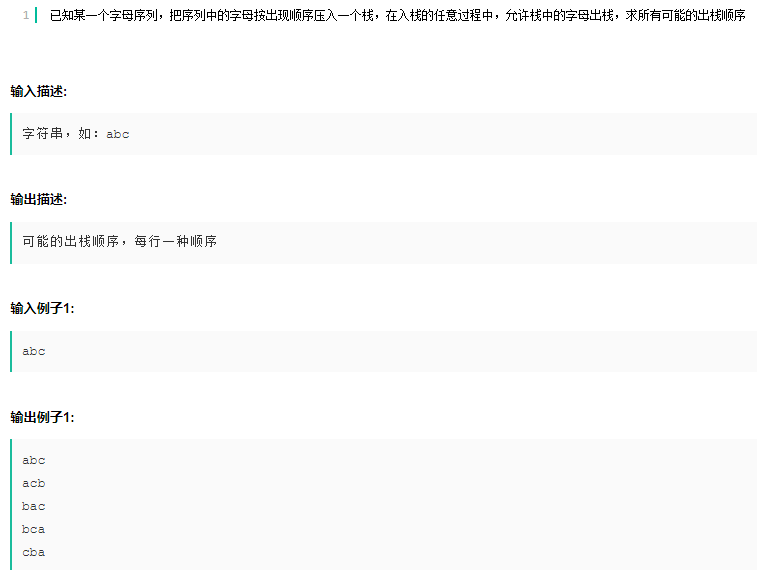

### 二进制反序


注意两点

- 位操作，左移 ，右移，&，|；
- 位填充的两种方式
  - `printf("%08x\n",num);`
  - `cout<<setw(8)<<setfill('0')<<hex<<num<<endl;`

```cpp
#include <iostream>
#include <iomanip>
using namespace std;
unsigned int reverse(unsigned int num)
{
    int res = 0;
    for (int i = 0; i < 32; i++)
    {
        //num&1 取num的最后一位
        res = res << 1 | num & 1;
        num >>= 1;
    }
    return res;
}

int main(int argc, char *argv[])
{
    unsigned int num = 0;
    unsigned int ret = 0;
    while (cin >> hex >> num)
    {
        ret = reverse(num);
        // printf("%08x\n", ret);
        cout << setw(8) <<setfill('0')<< hex << ret << endl;
    }
    return 0;
}
```

### 堆排序

降序进行堆排序，题目类型填空。

```cpp
// 调整为小顶堆
// cur位当前索引，cnt位数组长度
static void heap_arrange(int arr[], int cur, int cnt)  //调整为小顶堆 
{
    int heaptop_val = arr[cur]; //堆顶的值
    while (cur < cnt) {
        int left = 2 * cur + 1;
        int right = 2 * cur + 2;
        int min = -1;
        int min_val = heaptop_val;
        if (left < cnt && arr[left] < min_val) { //检查是否比左节点大
            min = left;
            min_val = arr[left];
        }
        if (right < cnt && arr[right] < min_val) {//检查是否比右节点大
            min = right;
        }
        if (min == -1)
            break;
        arr[cur] = arr[min];
        cur = min;
    } 
    arr[cur] = heaptop_val;
}
```


### 单链表冒泡排序

```cpp
struct node {
    int val;
    struct node *next;
};

static void list_sort(struct node *head)
{
	while(true)
    {
        bool mark = true;
        node *cur = head;
        while(cur&&cur->next)
        {
            if(cur->val>cur->next->val)
            {
                //swap(cur->val,cur->next->val);
                int temp = cur->next->val;
                cur->next->val = cur->val;
                cur->val = temp;
                mark = false;
            }
            cur = cur->next;
        }
        if(mark)
        {
            break;
        }
    }
}
```

### 出栈顺序



```cpp
#include<iostream>
#include<set>
#include<algorithm>
using namespace std;
void dfs(string str, int i, string st, string temp,set<string> &res)
{
    int len = str.length();
    if(i==len)
    {
        reverse(st.begin(), st.end());
        res.insert(temp.append(st));
        return;
    }
    st += str[i];
    dfs(str, i + 1, st, temp, res);
    while(!st.empty())
    {
        temp += st.back();
        st.pop_back();
        dfs(str, i + 1, st, temp, res);
    }
}
int main()
{
    string str;
    while(cin>>str)
    {
        set<string> res;
        dfs(str, 0, "", "", res);
        for(auto i:res)
        {
            cout << i << endl;
        }
    }
    return 0;
}
```

### 最长重复子串


```cpp
#include <iostream>
#include <cstring>
#include <utility>
#include <string>
#include <vector>
using namespace std;
 
vector<pair<int, string>> fun(const string& str)
{
	vector<string> subs;
	vector<pair<int, string>> res;
	int len = str.size();
    //构建后缀字串
	for (int i = 0; i < len; i++)
	{
		subs.push_back(str.substr(i));
	}
 
	int length;
	string sub;
 
	//i为子串的长度
    //比较后缀字串的前i个字符是否相等
	for (int i = 1; i <= len/2; i++)
	{
		for (int j = 0; 2*i + j <= len; j++)
		{
 
			if (subs[j + i].substr(0, i) == subs[j].substr(0, i))
			{
				length = 2 * i;
				sub = subs[j].substr(0, i) + subs[j].substr(0, i);
				res.clear();
				res.push_back(make_pair(length, sub));
			}		
			//res.push_back(make_pair(length, sub));
		}
	}
 
	return res;
}
int main()
{
	string str;
	vector<pair<int, string>> res;
	while (cin >> str)
	{
		res = fun(str);
		for (auto it = res.begin(); it != res.end(); it++)
		{
			cout << it->second << ":" << it->first << endl;
		}
	}
 
	return 0;
}
 
```

### 层次构建二叉树


```cpp
#include <iostream>
#include <queue>
using namespace std;
struct TreeNode
{
    int val;
    TreeNode *left;
    TreeNode *right;
    TreeNode(int x) : val(x), left(NULL), right(NULL) {}
};
TreeNode* buildtree(vector<TreeNode*>s_vec)
{
    int q = 0;
    int p = 1;
    while(q<s_vec.size())
    {
        if(s_vec[q]==NULL)
        {
            q++;
        }
        else{
            if(p<s_vec.size())
            {
                s_vec[q]->left = s_vec[p];
            }
            if(p+1<s_vec.size())
            {
                s_vec[q]->right = s_vec[p + 1];
            }
            q++;
            p += 2;
        }
    }
    return s_vec[0];
}
void PreTree(TreeNode *root)//先序排列
{
	if (root == NULL)
	{
		cout << "#" << " ";
		return;
	}
	cout << root->val << " ";
	PreTree(root->left);
	PreTree(root->right);
}
vector<TreeNode*> write(string str)
{
    int len = str.length();
    vector<TreeNode *> tmp;
    int i = 0;
    while(i<len)
    {
        if (str[i] == ' ')
			i++;
		else
		if (str[i] == '#')
		{
			tmp.push_back(NULL);
			i++;
		}
		else
		{
			int x = 0;
			while (str[i] != ' '&&i<str.length())
			{
				x = x * 10 + str[i] - '0';
				i++;
			}
			TreeNode *node = new TreeNode(x);
			tmp.push_back(node);
		}
    }
    return tmp;
}
int main()
{
    vector<TreeNode *> s_vec;
    string s;
    while (cin >> s)
    {
        if (s == "#")
        {
            s_vec.push_back(NULL);
        }
        else
        {
            int temp = stoi(s, 0, 10);
            TreeNode *t = new TreeNode(temp);
            s_vec.push_back(t);
        }
    }
    TreeNode *root = buildtree(s_vec);
    PreTree(root);
    return 0;
}
```

### 遍历集合


```cpp
#include<iostream>
#include<algorithm>
#include<string.h>
#include<string>
#include<vector>
#include<stack>
#include<numeric>
using namespace std;
struct node
{
    int num;
    vector< vector<int> > v;//两个容器嵌套，记录取球方案
};
int main()
{
    int n, k;
    cin >> k >> n;
    vector<node> ball(k);
    for (int i = 0; i < k; i++)
    {
        int t;
        cin >> t;
        ball[i].num = t;
    }
    if (k == 1)//只有一种方案
        cout << n << endl;
    else
    {
        vector<int>temp;
        for (int i = 0; i <= ball[0].num; i++)//初始化，第一种球的取法
        {
            temp.push_back(i);
            ball[0].v.push_back(temp);
            temp.clear();
        }
        for (int i = 1; i < k; i++)//取那种球
        {
            for (int j = 0; j < ball[i - 1].v.size(); j++)//取第i种球之前有几种方案
            {
                for (int x = 0; x <= ball[i].num; x++)//第i种球可以取多少个
                {
                    temp = ball[i - 1].v[j];//取第i-1种球的第j种方案
                    temp.push_back(x);//第i种球取x个
                    if (i == k - 1)//取完K种球并且球的总数为N（k-1是因为第一种球初始化处理了）
                    {
                        if (accumulate(temp.begin(), temp.end(),0) == n)//输出方案
                        {
                            for (int y = 0; y < temp.size(); y++)
                                cout << temp[y];
                            cout << endl;
                        }
                    }
                    else
                        if (accumulate(temp.begin(), temp.end(),0) <= n)
                            ball[i].v.push_back(temp);//取完第i种球之后的取球方案
                    temp.clear();
                }
            }
        }
    }
    return 0;
}
```


```cpp
#include<iostream>
#include<algorithm>
#include<vector>
using namespace std;
int n;
vector<int>shape(3,0);
int res = 0;
void solve(int h)
{
    if(h==n)
    {
        res++;
        return;
    }
    if(h>n)
    {
        return;
    }
    for (int i = 0; i < 3;i++)
    {
        solve(h + shape[i]);
    }
}
int main()
{
    cin >> n;
    cin >> shape[0] >> shape[1] >> shape[2];
    sort(shape.begin(), shape.end());
    solve(0);
    cout << res << endl; 
}
```

