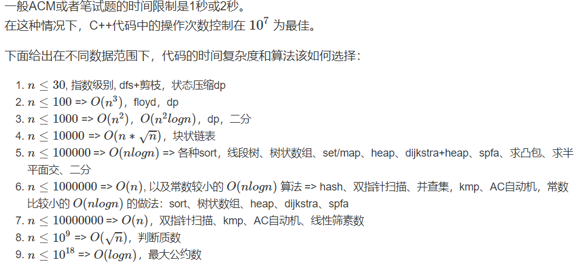
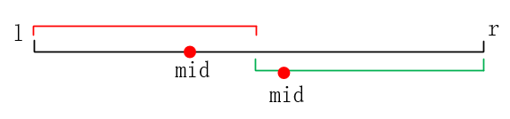
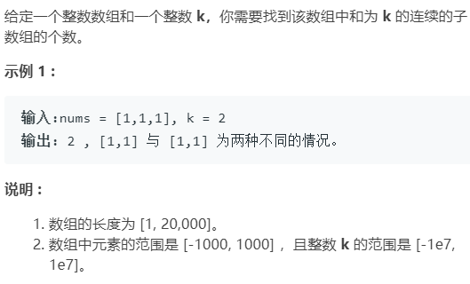
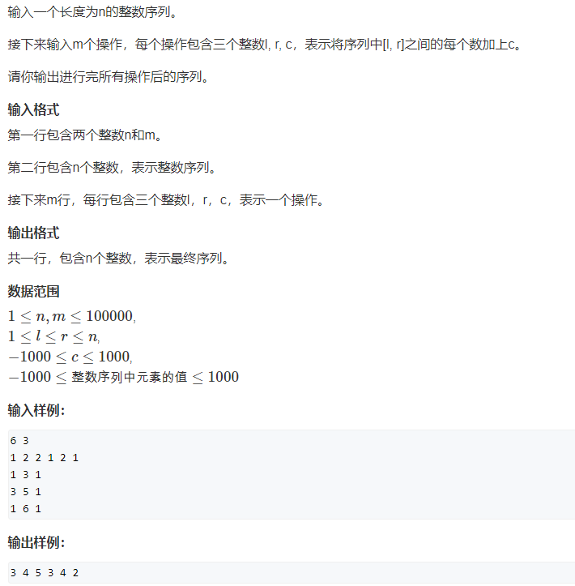
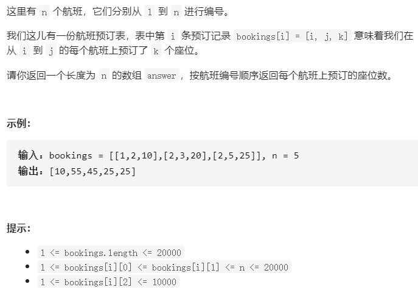
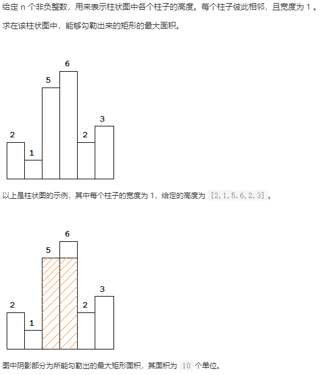
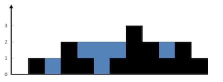
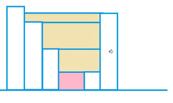
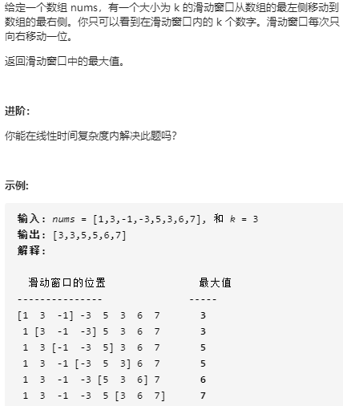
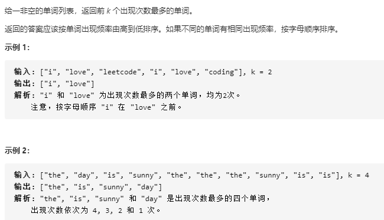

###  快速排序模板

```cpp
void quick_sort(int nums[],int l,int r)
{
    if(l>=r) return;
    //找中间数
    int p = nums[(l+r)>>1];
    int i = l-1;
    int j = r+1;
    while(i<j)
    {
        //找到左边第一个大于p的数和右边第一个小于p的数
        while(nums[++i]<p);
        while(nums[--j]>p);
        if(i<j) swap(nums[i],nums[j]);
    }
    quick_sort(nums,l,j);
    quick_sort(nums,j+1,r);
}
```

#### [快速排序](https://www.acwing.com/problem/content/787/)

### 归并排序模板

```cpp
void merge(int nums[],int l,int mid,int r)
{
    int temp[r-l+1];
    int i = l;
    int j = mid+1;
    int k=0;
    while(i<=mid&&j<=r)
    {
        if(nums[i]<nums[j]) 
            temp[k++] = nums[i++];
        else 
            temp[k++] = nums[j++];
    }
    while(i<=mid)
    {
        temp[k++] = nums[i++];
    }
    while(j<=r)
    {
        temp[k++] = nums[j++];
    }
    for (int i = l, j = 0; j < k; i++, j++)
    {
        nums[i] = temp[j];
    }
}
void merge_sort(int nums[],int l,int r)
{
    if(l>=r) return;
    int mid = (r+l)/2;
    merge_sort(nums,l,mid);
    merge_sort(nums,mid+1,r);
    merge(nums,l,mid,r);
}
```

#### [归并排序](https://www.acwing.com/problem/content/description/789/)

### 整数二分模板

对具备单调性或者存在两段性的性质的查找问题，一般都可以用二分法来进行。



**模板一：**

- 如果`nums[mid]`属于绿色区域，则`target` 在$[l,mid]$，

- 如果`nums[mid]`属于红色区域，则`target`在$[mid+1,r]$
- 得到绿色区域的**左边界**

**模板二：**

- 如果`nums[mid]`属于红色区域，则`target`在$[mid,r]$;
- 如果`nums[mid]`属于绿色区域，则`target`在$[l,mid-1]$
  - 这里的`mid = (l+r+1)/2`  因为考虑边界情况，当`l = r-1`时，`mid = (l+1+1)/2 = l`,此时如果`nums[mid]`在红色区域则在更新区间时就会出现一直都是`[l,r]`的无线循环。
- 得到红色区域的**右边界**。

二分法的本质在于对边界的处理，当边界满足某种条件时，会将数据分成两个部分。对两个部分对应下面两个模板。

```cpp
bool check(int x) {/* ... */} // 检查x是否满足某种性质
//模板一
// 区间[l, r]被划分成[l, mid]和[mid + 1, r]时使用：
//实际是找左边界
int bsearch_1(int l, int r)
{
    while (l < r)
    {
        int mid = l + r >> 1;
        if (check(mid)) r = mid;    // check()判断mid是否满足性质
        else l = mid + 1;
    }
    return l;
}
//模板二
// 区间[l, r]被划分成[l, mid - 1]和[mid, r]时使用：
//实际是找右边界
int bsearch_2(int l, int r)
{
    while (l < r)
    {
        int mid = l + r + 1 >> 1;
        if (check(mid)) l = mid;
        else r = mid - 1;
    }
    return l;
}
```

#### [二分查找](https://leetcode-cn.com/problems/binary-search/)

数组无重复 

```cpp
class Solution {
public:
    int search(vector<int>& nums, int target) {
        if(nums.size()==0) return -1;
        int l = 0;
        int r = nums.size()-1;
        while(l<r)
        {
            int mid = (r+l)/2;
            if(nums[mid]>=target) r = mid;
            else l = mid+1;
        }
        if(nums[l]!=target) return -1;
        return l;
    }
}; 
```

#### [查找数的范围](https://leetcode-cn.com/problems/find-first-and-last-position-of-element-in-sorted-array/)

数组`[-1,0,3,3,3,5,9,12]`

```cpp
class Solution {
public:
    vector<int> searchRange(vector<int>& nums, int target) {
        vector<int> res{-1,-1};
        if(nums.size()==0) return res;
        int l =0;
        int r = nums.size()-1;
        while(l<r)
        {
            int mid = (r+l)/2;
            //如果nums[mid]>=target,说明左边界必定在[l,mid],
            //例如[-1,0,3,3,3,5,9,12]，nums[mid] =nums[3] = 3, 
            if(nums[mid]>=target) r = mid;
            else l = mid+1; 
        }
        if(nums[l]!=target) return res;
        else{
            res[0] = l;
            int l = 0;
            int r = nums.size()-1;
            while(l<r)
            {
                int mid = (r+l+1)/2;
                //如果nums[mid]<=targrt,说明右边界在[mid,r]
                if(nums[mid]<=target) l = mid;
                else r = mid-1;
            }
            res[1]=l;
        }
        return res;
    }
};
```

### 浮点数二分模板

```cpp
double bsearch_3(double l, double r)
{
    const double eps = 1e-6;   // eps 表示精度，取决于题目对精度的要求
    while (r - l > eps)
    {
        double mid = (l + r) / 2;
        if (check(mid)) r = mid;
        else l = mid;
    }
    return l;
}
```

#### 例如求$\sqrt{x}$

```cpp
#include <iostream>
#include <algorithm>
#include <vector>
using namespace std;
double mysqrt(double x)
{
    double l = 0;
    double r = x;
    while(r-l>1e-8)
    {
        double mid = (r+l)/2;
        if(mid*mid>=x) r = mid;
        else l = mid;
    }
    return l;
}
int main()
{
    double x = 4;
    printf("%lf", mysqrt(x));
}

```

如果取$\sqrt{x}$取整数部分。可以采用整数二分法中的第二个模板，也可以使用如下代码

```cpp
//按照整数二分的第二个模板
int mysqrt(int x)
{
    if(x==0||x==1)
        return 1;
    int l = 0;
    int r = x;
    while(l<r)
    {
        int mid = (r + l+1) / 2;
        if(mid*mid<=x) l = mid;
        else r = mid - 1;
    }
    return l;
}
//自己写的
int mySqrt(int x) {
    if(x==0||x==1)
    {
        return x;
    }
    int begin = 0;
    int end = x / 2;
    //注意条件为<=
    while(begin<=end)
    {
        long long mid = (begin + end) / 2;
        long long res = mid * mid;
        if(res==x)
        {
            return mid;
        }
        else if(res<x)
        {
            begin = mid + 1;
        }
        else if(res>x)
        {
            end = mid - 1;
        }
    }
    return end;
}
```

### 高精度加法

```cpp
//C = A+B;
//例如 128+29
//A{8,2,1}+B{9,2}={7,5,1}
vector<int> add(vector<int> &A, vector<int> &B)
{
    if (A.size() < B.size()) return add(B, A);

    vector<int> C;
    int t = 0;
    for (int i = 0; i < A.size(); i ++ )
    {
        t += A[i];
        if (i < B.size()) t += B[i];
        C.push_back(t % 10);
        t /= 10;
    }

    if (t) C.push_back(t);
    return C;
}
```

#### 高精度加法例题

输入数字字符串a b,输出数字字符串的相加结果

例如

输入

`128 29`

输出

`157`

```cpp
#include<iostream>
#include<vector>
using namespace std;
vector<int> add(vector<int>&A,vector<int>&B)
{
    vector<int> C;
    //高位数在前
    if(A.size()<B.size()) return add(B,A);
    int t = 0;
    for(int i=0;i<A.size();i++)
    {
        t+=A[i];
        if(i<B.size()) t+=B[i];
        C.push_back(t%10);
        t/=10;
    }
    if(t) C.push_back(t);
    return C;
}
int main()
{
    string a,b;
    cin>>a>>b;
    vector<int> A;
    vector<int> B;
    //倒序存入数组
    for(int i=a.length()-1;i>=0;i--) A.push_back(a[i]-'0');
    for(int i=b.length()-1;i>=0;i--) B.push_back(b[i]-'0');
    vector<int> C = add(A,B);
    for (int i = C.size() - 1; i >= 0;i--)
    {
        cout << C[i];
    }
    cout << endl;
}
```

### 高精度减法

```cpp
vector<int> sub(vector<int> &A, vector<int> &B)
{
    vector<int> C;
    int t=0;//借位
    for (int i = 0; i < A.size(); i ++ )
    {
        t = A[i] - t;
        if (i < B.size()) t -= B[i];
        C.push_back((t + 10) % 10);   //t+10 相当于先借1;
        if (t < 0) t = 1;
        else t = 0;
    }
    //高位由于减法将位后变为0需要去掉
    while (C.size() > 1 && C.back() == 0) C.pop_back();
    return C;
}
```

### 高精度加法例题

输入数字字符串a b,输出数字字符串的相加结果

例如

输入

`128 39`

输出

`89`

```cpp
#include<iostream>
#include<vector>
using namespace std;
vector<int> sub(vector<int> &A, vector<int> &B)
{
    vector<int> C;
    int t = 0;
    for (int i = 0; i < A.size(); i ++ )
    {
        t = A[i] - t;
        if (i < B.size()) t -= B[i];
        C.push_back((t + 10) % 10);
        if (t < 0) t = 1;
        else t = 0;
    }
    //高位由于减法将位后变为0需要去掉
    while (C.size() > 1 && C.back() == 0) C.pop_back();
    return C;
}
int main()
{
    string a,b;
    cin>>a>>b;
    vector<int> A;
    vector<int> B;
    //倒序存入数组
    for(int i=a.length()-1;i>=0;i--) A.push_back(a[i]-'0');
    for(int i=b.length()-1;i>=0;i--) B.push_back(b[i]-'0');
    vector<int> C = sub(A,B);
    for (int i = C.size() - 1; i >= 0;i--)
    {
        cout << C[i];
    }
    cout << endl;
}
```

### 高精度幂$a^{b}c$

[参考快速幂算法](https://blog.csdn.net/qq_19782019/article/details/85621386)

```cpp
const int N = 1e9+7;
long long fastPower(long long base, long long power) {
    long long result = 1;
    while (power > 0) {
        if (power & 1) {//此处等价于if(power%2==1)
            result = result * base % N;
        }
        power >>= 1;//此处等价于power=power/2
        base = (base * base) % N;
    }
    return result;
}
```


### 一维前缀和

**一般结合哈希表**

前i项和

$s[i]=\sum\limits_{j = 0}^i {a[j]} $

$a[i] = s[i]-s[i-1]$

```cpp
S[i] = a[1] + a[2] + ... a[i]
a[l] + ... + a[r] = S[r] - S[l - 1]
```

注意前缀和包含了`s[0]`

####   [560. 和为K的子数组](https://leetcode-cn.com/problems/subarray-sum-equals-k/)

																				

**暴力前缀和**

开辟一个前n项和的数组，计算前`i`项和，然后双重循环遍历该数组。时间复杂度$O(n^2)$; 空间复杂度$O(n)$

```cpp
int subarraySum(vector<int>& nums, int k) {
        int res = 0;
        vector<int>pre_sum(nums.size()+1,0);
        pre_sum[0] = 0;
        for(int i=0;i<nums.size();i++)
        {
            //注意下标的变化，最好举例看看
            pre_sum[i+1] = pre_sum[i]+nums[i];
        }
        for(int i=1;i<pre_sum.size();i++)
        {
            for(int j=0;j<i;j++)
            {
                if(pre_sum[i]-pre_sum[j]==k)
                {
                    res++;
                }
            }
        }
        return res;
    }
```

**前缀和+哈希表**

 `pre_sum[i]-k==pre_sum[j]`可以改写为`pre_sum[i]-pre_sum[j]==k`,即存在一个子串和为k，`nums[j+1]+...nums[i] = k`

```       python
1 2 3 3 6
map:
    (0,1) (1,1) (3,1) (6,1) (9,1) (15,1) 
                 +1    +1     +1
```

```cpp
int subarraySum(vector<int> &nums, int k)
{ 
    int res = 0;
    unordered_map<int,int> temp_map;
    int sum = 0;
    temp_map[0] = 1;
    for (int i = 0; i < nums.size(); i++)
    {
        sum += nums[i];
        if(temp_map.find(sum-k)!=temp_map.end())
            res += temp_map[sum - k];
        temp_map[sum]++;
    }
    return res;
}
```

#### 数组子区间数字和满足一定条件


`(s[i]-s[j])%m=x` 可以得到`(s[i]-x)%m==s[j]`  本题更改为输出所有的可能区间。两个相同preSum_m之间肯定是一个满足条件的结果	

```cpp
#include <iostream>
#include <vector>
#include<unordered_map>
#include<algorithm>
using namespace std;
void subarraySum(vector<int> &nums, int m, int x)
{
    int len = nums.size();
    vector<int> preSum_m(nums.size()+1,0);
    vector<int> index[len + 1];
    index[0].push_back(0);
    for (int i = 0; i < nums.size();i++)
    {
        preSum_m[i+1] = (preSum_m[i] + nums[i]) % m;
        int temp = (preSum_m[i+1] - x) % m;
        if(temp<0)
            temp += m;
        if(!index[temp].empty())
        {
            for(auto preindex:index[temp])
            {
                cout << preindex + 1 <<":"<< i+1 << endl;
            }
        }
        index[preSum_m[i+1]].push_back(i+1); 
    }
}
int main()
{
    vector<int> nums{1,2,3,3,6,7};
    subarraySum(nums, 3, 1);
    return 0;
}
```


#### [ 路径总和 III](https://leetcode-cn.com/problems/path-sum-iii/)


### 二维前缀和

```cpp
S[i][j] = nums[i][j]+sum[i-1][j]+sum[i][j-1]-sum[i-1][j-1];
S[i, j] = 第i行j列格子左上部分所有元素的和
以(x1, y1)为左上角，(x2, y2)为右下角的子矩阵的和为：
S[x2, y2] - S[x1 - 1, y2] - S[x2, y1 - 1] + S[x1 - 1, y1 - 1]
```

**二维前缀和的计算**

```cpp
int n,m;
const int N = 1010;
int nums[N][N];
int sum[N][N];
int main()
{
    cin>>n>>m;
    //从1开始，避免边界问题
    for(int i=1;i<=n;i++)
    {
        cin>>nums[i][j];
        for(int j=1;j<=m;j++)
        {
            sum[i][j] = nums[i][j]+sum[i-1][j]+sum[i][j-1]-sum[i-1][j-1];
        }
    }
}
```

#### 求子矩阵的和

输入一个n行m列的矩阵，在输入q个询问，每个询问包含四个整数x1 y1 x2 y2,表示一个子矩阵的左上角和右下角坐标，对每一个询问输出子矩阵所有数的和。

**输入格式**

 第一行包含三个整数n,m,q.

接下来n行，每行包含m个整数，表示整数矩阵。

 接下来q行，每行包含四个整数x1,y1,x2,y2,表示一组询问。

**输出格式**

共q行，每行输出一个询可的结果。

**数据范围**

1≤n,m≤1000,

1≤q≤200000

1≤x1≤x2≤m,1≤y1≤y2≤m,

1000≤矩阵内元素的值≤1000

```cpp
#include<iostream>
#include<vector>
using namespace std;
int n,m,q;
const int N = 1010;
int nums[N][N];
int sum[N][N];
int main()
{
    cin>>n>>m>>q;
    for(int i=1;i<n;i++)
    {
        for(int j=1;j<m;j++)
        {
            cin>>nums[i][j];
            sum[i][j] = nums[i][j]+sum[i-1][j]+sum[i][j-1]-sum[i-1][j-1];
        }
    }
    int x1,y1,x2,y2;
 	for(int i=0;i<q;i++)
    {
        cin>>x1>>y1>>x2>>y2;
        int res = sum[x2][y2]-sum[x1-1][y2]-sum[x2][y1-1]+sum[x1-1][y1-1];
        cout<<res<<endl;
    }
}
```


### 一维差分

```cpp
求差分数组：B[i] = nums[i]-nums[i-1]; 
给区间[l, r]中的每个数加c：B[l] += c, B[r + 1] -= c    
还原数组：nums[i] = B[i]+nums[i-1];
```

其原理在于，区间`[l,r]`内的加上数后，其内部的差分数组还是不变的，即 `b-a = 1;(b+c)-(a+c) = 1`改变之处在区间的开头和结尾。<strong style="color:red;">差分的方法适合在队数组某一区间进行多次的增减操作</strong>

例如：

```
数组：nums={1,2,3,4,5,6}
差分数组{1,1,1,1,1,1}   
区间：[2,4],加1；
数组：{1,3,4,5,5,6};
差分数组{1,2,1,1,0,1};
```

#### 例题



```cpp
#include<iostream>
using namespace std;
const int N = 100010;
int n ,m;
int nums[N];
int B[N];
int main()
{
    cin>>n>>m;
    for(int i=1;i<=n;i++)  cin>>nums[i];
    //构建差分数组，边界问题，B[0]=0,在定义的时候就确定了
    for(int i=1;i<=n;i++)  B[i] = nums[i]-nums[i-1];
    int l,r,c;
    //多次差分操作,遍历区间
    for(int i=0;i<m;i++)
    {
        cin>>l>>r>>c;
        B[l]+=c;
        B[r+1]-=c;
    }
    // 还原数组，加回去
    for(int i=1;i<=n;i++)
    {
        nums[i] = B[i]+nums[i-1];
        cout<<nums[i]<<" ";
    }
    return 0;
}
```

#### [1109. 航班预订统计](https://leetcode-cn.com/problems/corporate-flight-bookings/)



```cpp
class Solution {
public:
    vector<int> corpFlightBookings(vector<vector<int>>& bookings, int n) {
        //开始所有我为0，就不用构建差分数组了，原数组为0，差分自然全为0
        vector<int> diff(n,0);
        for(int i =0;i<bookings.size();i++)
        {
            diff[bookings[i][0]-1]+=bookings[i][2];
            if(bookings[i][1]<n)
            {
                diff[bookings[i][1]]-=bookings[i][2];
            }
        }
        for(int i = 1;i<n;i++)
        {
            diff[i] += diff[i-1];
        }
        return diff;
    }
};
```


### 二维差分

### 位运算

```cpp
求n的第k位数字: n >> k & 1
返回n的最后一位1：lowbit(n) = n & -n
```


#### [面试题15. 二进制中1的个数](https://leetcode-cn.com/problems/er-jin-zhi-zhong-1de-ge-shu-lcof/)

```cpp
int hammingWeight(uint32_t n) {
        int count = 0;
        while(n)
        {
            n = (n-1)&n;
            count++;
        }
        return count;
    }
```

### 并查集

```cpp
class UnionFind
{
public:
    vector<int> father;
    UnionFind(int num)
    {
        for(int i=0;i<num;i++)
        {
            father.push_back(i);  //初始状态
        }
    }
    int Find(int n)
    {
        if(father[n]==n)
            return n;
        father[n] = Find(father[n]);
        return father[n];
    }
    void Union(int a,int b)
    {
        int fa = Find(a);
        int fb = Find(b);
        father[fb] = fa;
    }  
};
```

#### 	[547. 朋友圈	](https://leetcode-cn.com/problems/friend-circles/)

#### [200. 岛屿数量](https://leetcode-cn.com/problems/number-of-islands/)

### 单调栈

<strong style="color:red;">查找每个数左（右）侧第一个比它小（大）的数。</strong>

单调栈分为递增栈和递减栈

**递增栈**：栈中数据**出栈**的序列为单调递增序列

- 当栈为空，或者新元素小于等于栈顶元素时，入栈。
- 当新元素大于栈顶元素时，出栈

**递减栈**：栈中数据**出栈**的序列为单调递减序列

- 当栈为空，或者新元素大于等于栈顶元素时入栈。
- 当**新元素**小于栈顶元素时，出栈

```cpp
//递增栈模板
stack<int> s;
for(int i =0;i<nums.size();i++)
{
    while(!s.empty()&&nums[i]>=nums[s.top()])
    {
        s.pop();
        ....;
    }
        s.push(i);
} 
//递减栈
stack<int> s;
for(int i =0;i<nums.size();i++)
{
    while(!s.empty()&&nums[i]<=nums[s.top()])
    {
        s.pop();
        ....;
    }
     s.push(i);
}
```

#### [739. 每日温度](https://leetcode-cn.com/problems/daily-temperatures/)

#### [84. 柱状图中最大的矩形](https://leetcode-cn.com/problems/largest-rectangle-in-histogram/)



维持一个单调栈，确保栈中元素为递增序列。

当新添加的元素小于栈顶元素时，弹出栈顶元素，更新需计算的矩形区间。循环此操作。

测试数组[2,2,5,6,2,3]

```cpp
class Solution {
public:
    int largestRectangleArea(vector<int>& heights) {
        int res = 0;
        stack<int>s;
        //为了避免边界情况的讨论，添加哨兵
        heights.insert(heights.begin(),0);
        heights.push_back(0);
        for(int i =0;i<heights.size();i++)
        {
            //就是一个在当前值下往回找比height[i]小的过程。
            while(!s.empty()&&heights[i]<heights[s.top()])
            {
                int cur = s.top();
                s.pop();
                //考虑到一头一尾
                int left = s.top()+1;
                int right = i-1;
                int area = (right-left+1)*heights[cur];
                res  = max(res,area);
            }
            s.push(i);
        }
        return res;
    }
};
```


#### [42. 接雨水](https://leetcode-cn.com/problems/trapping-rain-water/)



维持一个单调栈，确保栈中元素为递减序列。



```cpp
int trap(vector<int>&height)
{
    int res = 0;
    stack<int>s;
    for(int i =0;i<height.size();i++)
    { n
        //当前层的底部
        int last = 0;
        //往回找栈中元素比height[i]大的过程。从而保证先添加进来的元素依然能狗保证栈的单调性。
        while(!s.empty()&&height[i]>=height[s.top()])
        {
            int cur = s.top();
            s.pop();
            int left = cur;
            int right = i;
            int area = (right-left-1)*(height[cur]-last);
            res += area;
            last = height[cur];
        }
        //如果栈中存在比height[i]还要大的数时。
        if(s.size())
        {
            res += (i-s.top()-1)*(height[i]-last);            
        }
        s.push(i);
    }
    return res;
}
```

### 单调队列

<strong style="color:red;">查找滑动窗口中的最值。</strong>

#### [239. 滑动窗口最大值](https://leetcode-cn.com/problems/sliding-window-maximum/)



```cpp
vector<int> maxSlidingWindows(vector<int>&nums,int k)
{    
    vector<int> res;
    deque<int>q;
    for(int i=0;i<nums.size();i++)
    {
        //如果对头元素超出了当前窗口，弹出队头元素。
        if(!q.empty()&&i-k+1>q.front()) q.pop_front();
        //如果新加元素大于队尾元素，弹出队尾元素，
        //维持队列中元素从队头到队尾的单调递减。即对头元素最大。
        while(!q.empty()&&nums[i]>=nums[q.back()])
        {
            q.pop_back();
        }
        q.push_back(i);
        if(i>=k-1)
        {
            res.push_back(nums[q.front()]);
        }
    }
    return res;
} 
```

同理，寻找窗口元素的最小值，只需要确保队中元素有队头到队尾单调递增。

```cpp
vector<int> maxSlidingWindows(vector<int>&nums,int k)
{    
    vector<int> res;
    deque<int>q;
    for(int i=0;i<nums.size();i++)
    {
        //如果队头元素超出了当前窗口，弹出队头元素。
        if(!q.empty()&&i-k+1>q.front()) q.pop_front();
        //如果新加元素大于队尾元素，弹出队尾元素，
        //维持队列中元素从队头到队尾的单调递增。即对头元素最大。
        while(!q.empty()&&nums[i]<=nums[q.back()])
        {
            q.pop_back();
        }
        q.push_back(i);
        if(i>=k-1)
        {
            res.push_back(nums[q.front()]);
        }
    }
    return res;
} 
```

### 自定义优先队列

优先队列可以应用于<strong style="color:red;">**前K个...类型的题**</strong>，也可用于排序，即堆排序。其基本用法如下：

```
priority_queue<int>q;
q.empty()——队列是否为空，空为true，否则为false
q.pop()——删除队顶元素
q.push()——压入一个元素
q.size()——返回优先队列中的元素个数
q.top()——返回q的第一个元素
//构建大顶堆，即从大到小出队
priority_queue<int> q;//优先队列自带排序，元素从大到小的顺序排序出队
//greater<int>，按照元素从小到大的顺序排序出队，即最上面的元素“最小”
priority_queue<int,vector<int>, greater<int> > q;
//less<int>,按照元素从大到小的顺序排序出队，即最上面元素最大，
priority_queue<int,vector<int>,less<int> > a;//less排序从大到小

```

如下题，采用自定义的优先队列，可以很简单清晰的解决该题



```cpp
#include <iostream>
#include <vector>
#include <map>
#include <queue>
#include <algorithm>
using namespace std;

struct cmp
{
    bool operator()(pair<string, int> &l, pair<string, int> &r)
    {
        if (l.second == r.second)
        {
            for (int i = 0; i < min(l.first.size(), r.first.size()); ++i)
            {
                if (l.first[i] == r.first[i])
                    continue;
                return l.first[i] > r.first[i];
            }
        }
        return l.second < r.second;
    }
};
class Solution
{
public:
    vector<string> topKFrequent(vector<string> &words, int k)
    {
        std::map<string, int> hash;
        for (size_t i = 0; i < words.size(); ++i)  hash[words[i]]++;
        priority_queue<pair<string, int>, vector<pair<string, int>>, cmp> pqueue;
        // priority_queue<pair<int, string>, vector<pair<int, string>>, cmp> pqueue;
        for (auto item : hash)
        {
            pqueue.push(make_pair(item.first, item.second));
        }
        vector<string> res;
        while (k--)
        {
            res.push_back(pqueue.top().first);
            pqueue.pop();
        }
        return res;
    }
};
int main()
{
    Solution solve;
    vector<string> words{"the", "day", "is", "sunny", "the", "the", "the", "sunny", "is", "is"};
    vector<string> res = solve.topKFrequent(words, 4);
    for (auto i : res)
    {
        cout << i << " ";
    }
    cout << endl;
    return 0;
}
```


### 哈希表与哈希函数

当数据经过哈希函数处理后，有可能会出现哈希冲突（即用同一个key值对应多个数据），为了避免哈希冲突一般采用**拉链法**和**开放寻址法**来处理。

- **拉链法**

  拉链发示意图如下

  

  同一key值下的数据以链表的形式进行储存。查找时，通过哈希函数计算出数据对应的key值，然后在该key值对应的链表中进行查找。

  **基于链表的拉链法代码如下：**

  ```cpp
  #include <iostream>
  #include <vector>
  using namespace std;
  // 定义哈希表的长度
  const int TABLE_LEN = 10;
  //定义链表
  struct ListNode
  {
      int val;
      ListNode *next;
      ListNode(int x) : val(x), next(NULL) {}
  };
  //定义哈希表,初始化链表每个key值对应的头节点位空
  ListNode *hash_table[TABEL_LEN] = {0};
  //将数据用链表结构来表示
  vector<ListNode *> node_data;
  int hash_func(int x)
  {
      return (x % TABLE_LEN + TABLE_LEN) % TABLE_LEN;
  }
  void inset(ListNode *node)
  {
      int hash_key = hash_func(node->val);
      //头插法，这里链表的头节点位哈希表中对应key值的链表头节点，于图中的next节点有所差异
      node->next = hash_table[hash_key];
      hash_table[hash_key] = node;
  }
  bool find(int x)
  {
      int hash_key = hash_func(x);
      ListNode *head = hash_table[hash_key];
      while (head)
      {
          if (head->val == x)
              return true;
          head = head->next;
      }
      return false;
  }
  int main()
  {
      vector<int> test{1, 1, 4, 9, 20, 30, 150, 500};
      for (int i = 0; i < test.size(); i++)
      {
          node_data.push_back(new ListNode(test[i]));
      }
      for (int i = 0; i < node_data.size(); i++)
      {
          inset(node_data[i]);
      }
      cout << "hash table" << endl;
      for (int i = 0; i < TABLE_LEN;i++)
      {
          cout << '[' << i << ']';
          ListNode *head = hash_table[i];
          while (head)
          {
              cout << "->" << head->val;
              head = head->next;
          }
          cout << endl;
      }
      cout << "search result" << endl;
      for (int i = 0; i < 10; i++)
      {
          if(find(i))  cout << i << " is in the hash table" << endl;
          else cout << i << " is not in the hash table" << endl;
      }
      return 0;
  }
  ```

  ACWing上的模板方法采用数组来进行，理解起来更为困难，其思想也是采用拉链法。

  ```cpp
  #include<iostream>
  #include<vector>
  using namespace std;
  
  const int N = 1010;                  //数据量
  const int TABLE_LEN = 10;            //哈希表大小
  vector<int> hash_table(TABLE_LEN,0); //储存头节点地址
  vector<int> nums(N,0);               // 储存数据
  vector<int> nextindex(N,0);          // 储存出现哈希冲突后的下一个数据在nums数组的位置
  int index = 0;
  int hash_func(int x)                 //哈希函数
  {
      return (x % TABLE_LEN + TABLE_LEN) % TABLE_LEN;
  }
  void insert(int x )
  {
      int hash_key = hash_func(x);
   	nums[index] = x;                          //将数据储存到nums中
      nextindex[index] = hash_table[hash_key];  //如果发生哈希冲突时储存该key值下的已有数据索引
      hash_table[hash_key] = index++;           //储存号原来数据索引后，将当前数据索引记录下来 
  }
  bool find(int x)
  {
      int hash_key = hash_func(x);
      for(int i = hash_table[hash_key];i!=-1;i=nextindex[i])
      {
          if(nums[i]==x) return true;
      }
      return false;
  }
  int main()
  {
      vector<int> test = {1, 4, 9, 20, 30, 150, 500};
      for (int i = 0; i < test.size(); i++) insert(test[i]);
      cout << "hash+table" << endl;
      for (int i = 0; i < TABLE_LEN; i++)
      {
          cout << "[" << i << "]";
          for (int j = hash_table[i]; j != 0;j = nextindex[j])
          {
              cout << "->" << nums[j];
          }
          cout << endl;
      }
      return 0;
  }
  ```

- **开放寻址法**

  主要思路就是如果数据取模后的位置未被占用，那么就直接将该数据存储着该位置，如果已被占用，则往后寻找直至找到一个未被占用的位置。

  ```cpp
  #include<iostream>
  #include<vector>
  const int N = 1010;
  const int TABLE_LEN = 10;
  const int inf = 0x3f3f3f3f;
  vector<int> hash_table(N, inf);
  int hash_func(int x)                 //哈希函数
  {
      return (x % TABLE_LEN + TABLE_LEN) % TABLE_LEN;
  }
  
  int insert(int x)
  {
      int hash_key = hash_func(x);
      //如果该哈希值对应位置已经被使用，且该位置对应的数据不是x,
      //则通过累加的方式寻找其他没有被占用的位置
      while (hash_table[hash_key] != inf&&hash_table[hash_key]!=x)
      {
          hash_key++;
          if(hash_key==N)
              hash_key = 0;
      }
      return hash_key;
  }
  bool find(int x)
  {
      int hash_key = hash_func(x);
      //如果该哈希值对应位置已经被使用，且该位置对应的数据不是x,
      //则通过累加的方式寻找其他没有被占用的位置
      while (hash_table[hash_key] != inf&&hash_table[hash_key]!=x)
      {
          hash_key++;
          if(hash_key==N)
              hash_key = 0;
      }
      return hash_table[hash_key]==x;
  }
  int main()
  {
      vector<int> test{1, 1, 4, 9, 2, 30, 150, 500};
      for (int i = 0; i < test.size();i++)
      {
          hash_table[insert(test[i])] = test[i];
      }
      cout << "search result" << endl;
      for (int i = 0; i < 10; i++)
      {
          if(find(i))  cout << i << " is in the hash table" << endl;
          else cout << i << " is not in the hash table" << endl;
      }
  }
  ```


### [约瑟夫环](https://www.nowcoder.com/questionTerminal/f78a359491e64a50bce2d89cff857eb6)

N个人，从第一个人开始报数，报到M后出列，剩下的人继续报数。

```cpp
#include <iostream>
#include <vector>
using namespace std;

void solution(int N, int M)
{
    if (N <1||M<1)return;
    vector<int> v(N);
    for (int i = 0; i<N; i++)v[i] = i + 1;
    int i = 0;
    while (v.size()>0) {
        i += M-1;
        if (i>=v.size())i = i%v.size();
        cout << v[i] << " ";
        v.erase(i + v.begin());
    }
    cout << endl;
}
int main()
{
   vector<int>res =  solution(8, 5);
   for(auto i:res)
   {
       cout << i << " ";
   }
   cout << endl;
   return 0;
}

```

### 遍历连续字符串

在字符串处理中经常需要对字符串分割，或者对特定要求的一段字符串进行处理。

例如 提取192.168.8.9中的数字

```cpp
int i = 0;
vecotr<int>nums;
while(i<s.length())
{
    int k = i;
    while(k<s.length()&&s[k]!='.') k++;
    nums.push_back(to_string(s.substr(i,k-i)));
    i = k;
}
```

#### [151. 翻转字符串里的单词](https://leetcode-cn.com/problems/reverse-words-in-a-string/)

#### [38. 外观数列](https://leetcode-cn.com/problems/count-and-say/)

## 数论

### [有效的完全平方数](https://leetcode-cn.com/problems/valid-perfect-square/)


$n^2 = 1+3+5+7+...+(2n-1)$

奇数的前n项和：$n*1+\frac{nd(n-1)}{2}=n^2$

所以只需要判断num是否为一个奇数数列的前n项和即可。

```cpp
bool isPerfectSquare(int num) {
    for(int i=1;num>0;i+=2)
    {
        num-=i;
    }
    return num==0;
}
```

### 质数

#### 短除法判定质数

**质数**是指在**大于1**的自然数中，除了1和它本身以外不再有其他因数的自然数

```cpp
bool is_prime(int x)
{
    if (x < 2) return false;
    for (int i = 2; i <= x / i; i ++ )
        if (x % i == 0)
            return false;
    return true;
}
```

#### [短除法分解质因数](https://www.nowcoder.com/practice/196534628ca6490ebce2e336b47b3607?tpId=37&tqId=21229&tPage=1&rp=&ru=/ta/huawei&qru=/ta/huawei/question-ranking)

每个合数都可以写成几个[质数](https://baike.baidu.com/item/质数/263515)相乘的形式，其中每个质数都是这个[合数](https://baike.baidu.com/item/合数/49186)的因数，把一个合数用质因数[相乘](https://baike.baidu.com/item/相乘/10779094)的形式表示出来，叫做分解质因数。如30=2×3×5 。分解质因数只针对合数。

```cpp
#include <iostream>
#include <vector>
using namespace std;
vector<int> divide(int x)
{
    vector<int> num;
    for (int i = 2; i <= x / i; i++)
        if (x % i == 0)
        {
            while (x % i == 0)
                x /= i, num.push_back(i);
        }
    if (x > 1)
        num.push_back(x);
    return num;
}
int main() 
{
    int n;
    while (cin >> n)
    {
        vector<int> num = divide(n);
        for(auto i:num)
        {
            cout << i << "*";
        }
        cout << endl;
    }
    return 0;
}
//输入18
//输出2*3*3
```

##### [只有两个键的键盘](https://leetcode-cn.com/problems/2-keys-keyboard/)

求质因数和的题目。

### 约数

#### 试除法求所有约数

```cpp
vector<int> get_divisors(int x)
{
    vector<int> res;
    for (int i = 1; i <= x / i; i ++ )
        if (x % i == 0)
        {
            res.push_back(i);
            if (i != x / i) res.push_back(x / i);
        }
    sort(res.begin(), res.end());
    return res;
}
```

##### [灯泡开关](https://leetcode-cn.com/problems/bulb-switcher/)

一个数有奇数个约数，等价于它是平方数。

1-n中有多少个完全平方数？ $\sqrt{n}$ 下取整。$i^2<=n,i\in[1,n]$ 

#### 求最大公约数

- **辗转相除法(欧几里得算法)**

  1997 / 615 = 3 (余 152)

  615 / 152 = 4(余7)

  152 / 7 = 21(余5)

  7 / 5 = 1 (余2)

  5 / 2 = 2 (余1)

  2 / **1** = 2 (余0)

  余数为1；

  计算公式`gcd(a,b) = gcd(b,a mod b)`

  ```cpp
  int gcd(int a, int b)
  {
      return b==0 ? a:gcd(b, a % b);
  }
  int gcd(int a, int b) // greatest common divisor
  {
      while(a%b){
          int tmp = a;
          a = b;
          b = tmp%b;
      }
      return b; 
  }
  
  ```
  
  ### 最大小公倍数
  
  `a`和`b`的最大公倍数等于`a*b/gcd(a,b)`。即<strong style="color:red;">最小公倍数 = 两数之积除以最大公约数</strong>
  
  ```cpp
  //求最大公约数
  int gcd(int a,int b)
  {
      return b==0?a:gcd(b,a%b);
  }
  //求最大共约数
  
  ```
  
  

### [数位之积](https://www.nowcoder.com/questionTerminal/f9b86bcd95a643138f9593966a5495b8?orderByHotValue=1&page=1&onlyReference=false)


从个位开始，从大到小遍历小于10的公约数。

```cpp
int solve(int n)
{
    if(n<10) return 10+n;
    int a=1; //个位
    int b = 0;
    while(n>10)   
    {
       	int i=9;
        for(;i>1;i--)
        {
            if(n%i==0)
            {
                b = a*i+b;
                n/=i;   
                a = a*10;// 增位
                break;
            }
            if(i==1)
            {
                return -1;
            }
        } 
    }
    return a*n+b;
}
```


### 整数分块

求$\frac a 1+\frac a 2 + \frac a 3+\frac a 4+...+\frac a b$其中$1\le a\le10^9$

即求 
$$
\sum\limits_i^n {\frac{n}{i}}   （1\le n\le10^9）
$$
例如 `a = 20,b = 20`
$$
\underbrace{20}_{1} \quad\underbrace{10}_{1} \quad\underbrace{6}_{1} \quad\underbrace{5}_{1}\quad \underbrace{4}_{1}\quad \underbrace{3}_{1} \quad\underbrace{2\quad2\quad2\quad2}_{4} \quad\underbrace{1\quad1\quad1\quad1\quad1\quad1\quad1\quad1\quad1\quad1}_{10} 
$$
设$D_i$段的左端下标为$l_i$，则
$$
r_i=\frac n {\frac n l_i}
$$
所以每一块的和为$(r-l+1)*\frac n l $

```cpp
#include <iostream>
using namespace std;
int main()
{
    int a, b;
    cin >> a >> b;
    int res = 0;
    int left = 1;
    int right = 1;
    while(left<=b)
    {
        right = a / (a / left);
        if (right <= b)
        {
            res += a / left * (right - left + 1);
        }
        else
        {
            res += a / left * (b - left + 1);
            break;
        }
        left = right+1;
    }
    cout << res << endl;
}
```

